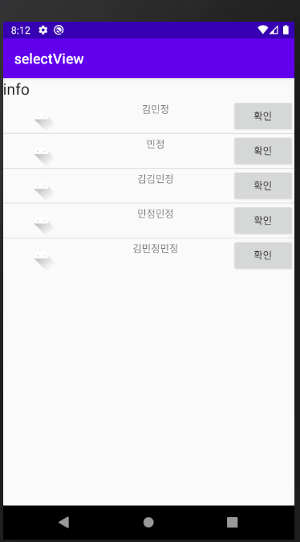

# ListView

* Adatper 객체
  * TextView( 텍스트뷰 안에 리스트뷰가 있어야함 (ex.문자목록)) 
  * data(서버에서 받아온 데이터일 수도 있고) 
  * 디자인(row하나에 대한 디자인. 리스트뷰에는 row List가 있는데 (ex. 문자 목록) 그 row를 어떻게 보여줄 것인가에 대한 디자인)

이 3개를 묶어서 보여주는게 Adapter 객체. data를 연결해주면 Adapter가 묶어서 설정한 Custom대로 ListView로 보여준다.

이 Adapter를 커스터마이징을 한다.


# 실습


## ListViewTestActivity

* (미리보기)전체코드

  * list_view_test.xml

  ```xml
  <?xml version="1.0" encoding="utf-8"?>
  <LinearLayout xmlns:android="http://schemas.android.com/apk/res/android"
      xmlns:app="http://schemas.android.com/apk/res-auto"
      xmlns:tools="http://schemas.android.com/tools"
      android:layout_width="match_parent"
      android:layout_height="match_parent"
      tools:context=".ListViewTestActivity"
      android:orientation="vertical">
  
      <TextView
          android:id="@+id/listTxt"
          android:layout_width="match_parent"
          android:layout_height="wrap_content"
          android:text="info"
          android:textAppearance="@style/TextAppearance.AppCompat.Large"
          />
  
      <ListView
          android:id="@+id/listview1"
          android:layout_width="match_parent"
          android:layout_height="wrap_content"
          />
  
  </LinearLayout>
  ```

  

  * ListViewTestActivity.java

  ```java
  package exam.day03.view.selectview;
  
  import androidx.appcompat.app.AppCompatActivity;
  
  import android.os.Bundle;
  import android.view.View;
  import android.widget.AdapterView;
  import android.widget.ArrayAdapter;
  import android.widget.ListView;
  import android.widget.TextView;
  
  public class ListViewTestActivity extends AppCompatActivity {
  
      //1.ListView에 출력할 데이터
      ListView listview;
      TextView txt;
      String[] datalist = {"java","oracle","Html5","CSS","javascript","servlet","jsp","spring",
              "hadoop","flume","sqoop","hive","R","android"};
      @Override
      protected void onCreate(Bundle savedInstanceState) {
          super.onCreate(savedInstanceState);
          setContentView(R.layout.list_view_test);
          listview = findViewById(R.id.listview1);
          txt = findViewById(R.id.listTxt);
          /*
          리스트뷰에 출력할 데이터?
          어떤 디자인으로 출력?
           */
  
          //2. Adaptor 객체를 선택해서 생성
          ArrayAdapter myadapter = new ArrayAdapter(this,
                  android.R.layout.simple_list_item_1,datalist);
  
          //3.ListView에서 어댑터가 작업할 수 있도록 ListView에 어댑터 셋팅
          listview.setAdapter(myadapter);
  
          //이벤트 연결
          MyListener listener = new MyListener();
          listview.setOnItemClickListener(listener);
      }
  
      class MyListener implements AdapterView.OnItemClickListener{
          @Override
          public void onItemClick(AdapterView<?> parent, View view, int position, long id) {
              txt.setText(datalist[position]);
          }
      }
  }
  
  ```

  


* xml
* 


* java


* Ctrl+Q하면 매개변수 등 정보를 볼 수 있다.

  배열 오브젝트로 만들었기 때문에, 3번째 것을 사용한다. 


* 내가만든 리소스는 `R.id. `이런식으,로 접근하지만,
  android에서 제공하는 리소스를 접근할 때에는` android.R.` 이런식으로 접근한다. 

* android에서 제공하는 `simple_list_item_1` 이라는 템플릿을 사용할 예정이다.

  


* 클릭하면 위에 TextView로 클릭한 요소 텍스트를 보여준다. 


---

## Resouce_data_list

* 이번엔 데이터(mydata.xml) 리소스 파일을 직접 만들어서 해당 파일 내용이 출력될 수 있도록 해본다.

  


* (미리보기)전체코드

  * list_view_text.xml (위에서 진행한 ListViewActivity의 xml파일을 그대로 쓴다.)

    ```xml
    <?xml version="1.0" encoding="utf-8"?>
    <LinearLayout xmlns:android="http://schemas.android.com/apk/res/android"
        xmlns:app="http://schemas.android.com/apk/res-auto"
        xmlns:tools="http://schemas.android.com/tools"
        android:layout_width="match_parent"
        android:layout_height="match_parent"
        tools:context=".ListViewTestActivity"
        android:orientation="vertical">
    
        <TextView
            android:id="@+id/listTxt"
            android:layout_width="match_parent"
            android:layout_height="wrap_content"
            android:text="info"
            android:textAppearance="@style/TextAppearance.AppCompat.Large"
            />
    
        <ListView
            android:id="@+id/listview1"
            android:layout_width="match_parent"
            android:layout_height="wrap_content"
            />
    
    </LinearLayout>
    ```

    

  * ResourceDataListActivity.java

    ```java
    package exam.day03.view.selectview;
    
    import androidx.appcompat.app.AppCompatActivity;
    
    import android.os.Bundle;
    import android.view.View;
    import android.widget.AdapterView;
    import android.widget.ArrayAdapter;
    import android.widget.ListView;
    import android.widget.TextView;
    
    public class ResourceDataListActivity extends AppCompatActivity {
    
        ListView listview;
        TextView txt;
    
        @Override
        protected void onCreate(Bundle savedInstanceState) {
            super.onCreate(savedInstanceState);
            setContentView(R.layout.list_view_test);
            listview = findViewById(R.id.listview1);
            txt = findViewById(R.id.listTxt);
    
            //리소스로 저장되어 있는 데이터를 ListView에 출력
            ArrayAdapter adapter =
                    ArrayAdapter.createFromResource(this,
                            R.array.mylist_data,
                            android.R.layout.simple_list_item_1);
    
            listview.setAdapter(adapter);
            listview.setOnItemClickListener(new AdapterView.OnItemClickListener() {
                @Override
                public void onItemClick(AdapterView<?> parent, View view, int position, long id) {
                    //View view매개변수는, 목록을 구성하는 하나의 데이터가 출력되는 Row를 구성하는 View
                    TextView listTxt = (TextView)view;
                    txt.setText(listTxt.getText());//listTxt.getText():목록에있는 Row데이터 하나뽑아온거
    
                }
            });
        }
    }
    
    ```

    

  


## SimpleAdapterTestActivity

* 이번엔 Adapter를 더 간편하게 사용한다.

* 화면 전체가 list기 때문에, View를 연결해 줄 필요가 없다.
  항상 적던 setContentView(R.layout.activity_simple_adapter_test);를 적지 않는다. 


* (미리보기) 전체코드

  * SimpleAdapterTestActivity.java

    ```java
    package exam.day03.view.selectview;
    
    import androidx.appcompat.app.AppCompatActivity;
    
    import android.app.ListActivity;
    import android.os.Bundle;
    import android.widget.SimpleAdapter;
    
    import java.util.ArrayList;
    import java.util.HashMap;
    
    public class SimpleAdapterTestActivity extends ListActivity {
        //전체 하나의 뷰를 사용하도록 ListActivty를 상속
        //두 줄 텍스트로 리스트뷰를 구성하기
    
        //HashMap으로 Key와 Value가 같이 들어가야 한다.
        //이런 형태가 여러 개 와야 하기때문에, ArrayList에 저장한다.
        ArrayList<HashMap<String,String>> listdata = new ArrayList<HashMap<String,String>>();
        @Override
        protected void onCreate(Bundle savedInstanceState) {
            super.onCreate(savedInstanceState);
            //리스트를 구성할 샘플 데이터 준비
            HashMap<String,String> item = new HashMap<String,String>();
            item.put("name","김민정"); //key, value를 넣어준다.
            item.put("telNum","010-1234-5678");
            listdata.add(item);
    
            item = new HashMap<String,String>();
            item.put("name","김김김"); //key, value를 넣어준다.
            item.put("telNum","010-1111-2222");
            listdata.add(item);
    
            item = new HashMap<String,String>();
            item.put("name","민민민"); //key, value를 넣어준다.
            item.put("telNum","010-3333-4444");
            listdata.add(item);
    
            item = new HashMap<String,String>();
            item.put("name","정정정"); //key, value를 넣어준다.
            item.put("telNum","010-5555-6666");
            listdata.add(item);
    
            item = new HashMap<String,String>();
            item.put("name","민정"); //key, value를 넣어준다.
            item.put("telNum","010-7777-8888");
            listdata.add(item);
    
            //데이터를 주면 adapter가 받아서 알아서 listView를 짜주는 것.
            SimpleAdapter mysimpleadapter = new SimpleAdapter(this,
                    listdata, //HashMap으로 구성된 데이터가 저장된 리스트
                    android.R.layout.simple_list_item_2, //row의 디자인
                    //item이 2개니까 simple_list_item_2사용
    
                    new String[]{"name","telNum"}, //HashMap에 저장된 키 리스트
                    //위에서 정의한 맵 데이터를 어떤 view에 출력할 것인지
    
                    new int[]{android.R.id.text1,android.R.id.text2}  );
                    //키의 순서와 동일한 리소스 아이디 순서
    
            setListAdapter(mysimpleadapter);
    
        }
    }
    ```


* 화면 연결 대신 하나의 뷰를 화면으로 사용하기 위해 ListActivity를 상속한다. 
* 결과 화면은 두 줄의 텍스트가 나오도록 할 예정이다.


* 두 줄의 텍스트 즉 2개의 값을 넣기 위해서는 Key, value를 활용할 수 있는 HashMap을 사용한다.
* HashMap의 형태가 여러 row가 들어가야 하므로 또 ArrayList로 선언한다.


* 리스트를 구성할 샘플 데이터를 put 하고 list에 add해주면서 추가한다. 


* SimpleAdapter 객체를 생성한다. 


* key, value 두 개의 요소를 출력할 것이기에 item을 2개 나타낼 수 있는 `simple_list_item_2 ` 를 사용한다.

* 내가 템플릿으로 사용할 것에 대해 정보를 확인한다. `simple_list_item_2 ` 에 마우스를 대고`Ctrl+좌클릭` 을 하면 xml내용을 볼 수 있다.


* 템플릿 xml을 확인한 결과, TextView가 2개가 있고, 각 아이디에 Key, Value를 연결해 주면 됨을 알 수 있다.

* 따라서 SimpleAdapter 객체를 생성해 줄 때 매개변수에 키의 순서와 동일하게 text1, text2로 작성해 준다.

  

  


* 출력 결과

  


---

## CustomRowTestActivity

* 그 동안 android에서 제공하는 템플릿을 사용했지만, 이번엔 직접 템플릿 xml파일을 만들어서 적용해 본다.

* 따라서 템플릿으로 사용할 xml파일이 만들어져 있어야 한다. (선생님 블로그에서 다운받았다.)

* CustomRow의 단점 : 개별 이벤트가 붙지 않는다.

  

  > custrow.xml 을 템플릿으로 사용할 예정이다.


* ListViewTestActivity 를 save as 해서 CustomRowTestActiviy.java를 만들어준다.


* (미리보기)전체코드

  * custrow.xml

    ```xml
    <?xml version="1.0" encoding="utf-8"?>
    <LinearLayout xmlns:android="http://schemas.android.com/apk/res/android"
        android:layout_width="match_parent"
        android:layout_height="match_parent"
        android:orientation="horizontal" >
        <ImageView
            android:layout_width="wrap_content"
            android:layout_height="match_parent"
            android:src="@drawable/ic_launcher_foreground" />
    	<LinearLayout 
    	     android:layout_width="wrap_content"
        	android:layout_height="match_parent"
        	android:orientation="vertical"
        	android:gravity="center"
        	android:layout_weight="1"
    	    >
    	    <TextView 
    	        android:id="@+id/txtcust1"
    	        android:layout_width="wrap_content"
        		android:layout_height="wrap_content"
    	        />
    	    <TextView 
    	        android:id="@+id/txtcust2"
    	        android:layout_width="wrap_content"
        		android:layout_height="wrap_content"
    	        />
    	</LinearLayout>
    	<Button
    		android:id="@+id/btncust"
    	     android:layout_width="wrap_content"
        	 android:layout_height="wrap_content"
        	 android:text="확인"   />
    </LinearLayout>
    ```

    

  * list_view_test.xml (이전에  ListViewActivity.java 사용한 xml화면이다. )

    ```xml
    <?xml version="1.0" encoding="utf-8"?>
    <LinearLayout xmlns:android="http://schemas.android.com/apk/res/android"
        xmlns:app="http://schemas.android.com/apk/res-auto"
        xmlns:tools="http://schemas.android.com/tools"
        android:layout_width="match_parent"
        android:layout_height="match_parent"
        tools:context=".ListViewTestActivity"
        android:orientation="vertical">
    
        <TextView
            android:id="@+id/listTxt"
            android:layout_width="match_parent"
            android:layout_height="wrap_content"
            android:text="info"
            android:textAppearance="@style/TextAppearance.AppCompat.Large"
            />
    
        <ListView
            android:id="@+id/listview1"
            android:layout_width="match_parent"
            android:layout_height="wrap_content"
            />
    
    </LinearLayout>
    ```

    

  * CustomRowTestActivity.java

    ```java
    package exam.day03.view.selectview;
    
    import android.os.Bundle;
    import android.view.View;
    import android.widget.AdapterView;
    import android.widget.ArrayAdapter;
    import android.widget.ListView;
    import android.widget.TextView;
    
    import androidx.appcompat.app.AppCompatActivity;
    
    import java.lang.reflect.Array;
    import java.util.ArrayList;
    
    public class CustomRowTestActivity extends AppCompatActivity {
        //1.ListView에 출력할 데이터 - 커스텀Row로 리스트뷰를 구성하는 경우
        //                              데이터를 ArrayList로 정의한다.
        ArrayList<String> datalist = new ArrayList<String>();
        ListView listview;
        TextView txt;
        @Override
        protected void onCreate(Bundle savedInstanceState) {
            super.onCreate(savedInstanceState);
            setContentView(R.layout.list_view_test);
            listview = findViewById(R.id.listview1);
            txt = findViewById(R.id.listTxt);
            datalist.add("김민정");
            datalist.add("민정");
            datalist.add("김김민정");
            datalist.add("민정민정");
            datalist.add("김민정민정");
    
            //2. Adaptor 객체를 선택해서 생성
            //커스텀디자인을 row로 사용할 것이므로 어떤 뷰에 데이터를 연결할 것인지 설정
            ArrayAdapter myadapter = new ArrayAdapter(this,
                    R.layout.custrow,R.id.txtcust1,datalist);
    
            //3.ListView에서 어댑터가 작업할 수 있도록 ListView에 어댑터 셋팅
            listview.setAdapter(myadapter);
    
            //이벤트 연결
            MyListener listener = new MyListener();
            listview.setOnItemClickListener(listener);
        }
    
        class MyListener implements AdapterView.OnItemClickListener{
            @Override
            public void onItemClick(AdapterView<?> parent, View view, int position, long id) {
                txt.setText(datalist.get(position));
                //get(position) :위치에 있는 데이터 가져온다.
            }
        }
    }
    
    ```

    


* 커스텀한 Row로 리스트뷰를 구성하는 경우, 데이터를 ArrayList로 정의한다. 

  


* 데이터를 넣어준다.

  

  

* 템플릿 대신에 커스텀한 디자인을 넣기 위해 custrow를 적어준다. (내가 만든 custrow.xml이름)


* datalist에서 get(position)을 사용해 데이터를 가져온 뒤, TextView에 set해준다.




