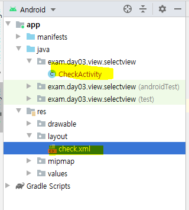
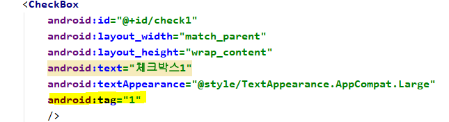
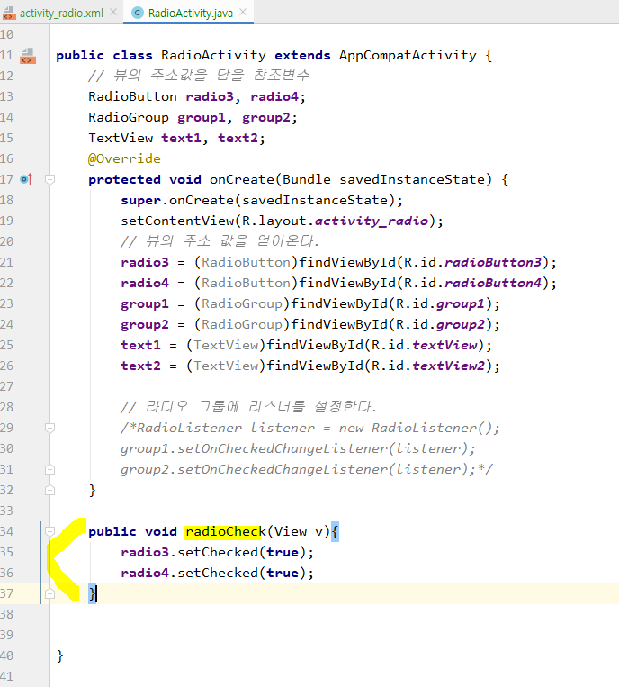
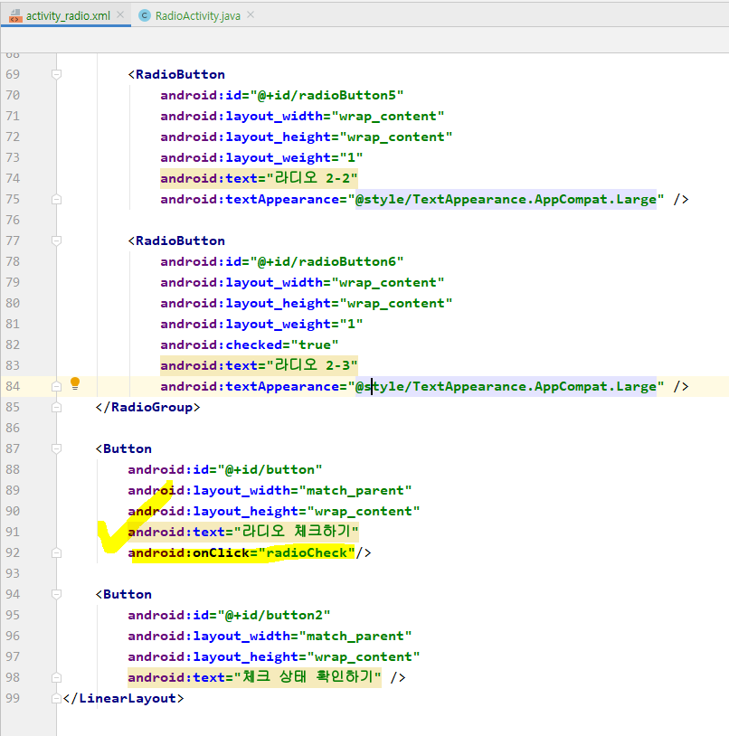
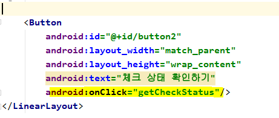
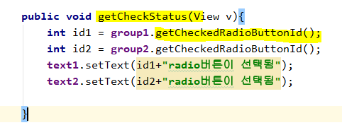
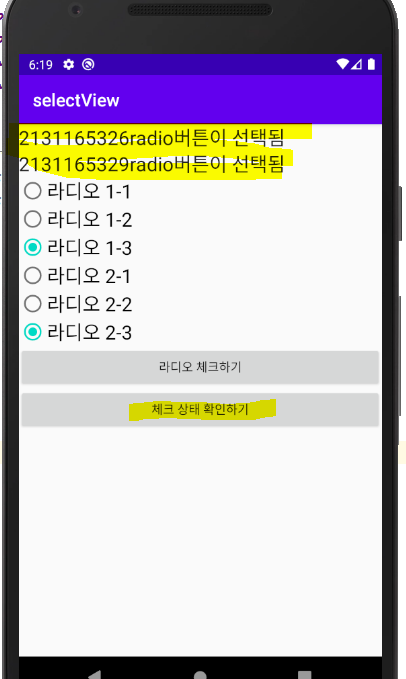
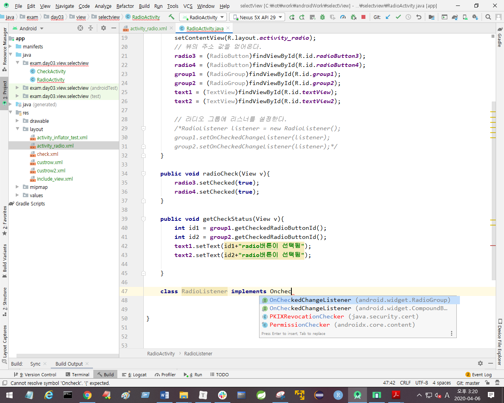

* 이름 변경 : MainActivity -> CheckRadioActivity




```xml
  <TextView
        android:id="@+id/checkTxt"
        android:layout_width="match_parent"
        android:layout_height="wrap_content"
        android:text="Hello World!"
        android:textAppearance="@style/TextAppearance.AppCompat.Large" />
    <Switch
        android:id="@+id/switch1"
        android:layout_width="match_parent"
        android:layout_height="wrap_content"
        />
    <CheckBox
        android:id="@+id/check1"
        android:layout_width="match_parent"
        android:layout_height="wrap_content"
        android:text="체크박스1"
        android:textAppearance="@style/TextAppearance.AppCompat.Large"
        />
    <CheckBox
        android:id="@+id/check2"
        android:layout_width="match_parent"
        android:layout_height="wrap_content"
        android:text="체크박스2"
        android:textAppearance="@style/TextAppearance.AppCompat.Large"
        />
    <CheckBox
        android:id="@+id/check3"
        android:layout_width="match_parent"
        android:layout_height="wrap_content"
        android:text="체크박스3"
        android:textAppearance="@style/TextAppearance.AppCompat.Large"
        />

    <Button
        android:id="@+id/btnCheck1"
        android:layout_width="match_parent"
        android:layout_height="wrap_content"
        android:text="체크상태설정"
        />
    <Button
        android:id="@+id/btnCheck2"
        android:layout_width="match_parent"
        android:layout_height="wrap_content"
        android:text="체크상태확인"
        />
    <Button
        android:id="@+id/btnCheck3"
        android:layout_width="match_parent"
        android:layout_height="wrap_content"
        android:text="체크상태해제"
        />
```


배열로 관리할 수 있다. 

체크랑 라디오랑 비슷한데 체크는 배열로 관리하고 라디오는 그냥 변수로 할 예정


선생님 블로그에서 selectView 파일 다운받아 압축풀어서 java, layout에 넣기

https://blog.naver.com/PostList.nhn?blogId=heaves1&from=postList&categoryNo=189&parentCategoryNo=189


```xml

```



* `tag` 로 태그를 달 수 있다. 출력은 안되지만, 이런식으로 메모 등 정보를 추가할 수 있다. (index를 적어놓을 때 유용하다!)


* xml전문

  ```xml
  <?xml version="1.0" encoding="utf-8"?>
  <LinearLayout xmlns:android="http://schemas.android.com/apk/res/android"
      xmlns:app="http://schemas.android.com/apk/res-auto"
      xmlns:tools="http://schemas.android.com/tools"
      android:layout_width="match_parent"
      android:layout_height="match_parent"
      tools:context=".CheckActivity"
      android:orientation="vertical">
  
      <TextView
          android:id="@+id/checkTxt"
          android:layout_width="match_parent"
          android:layout_height="wrap_content"
          android:text="Hello World!"
          android:textAppearance="@style/TextAppearance.AppCompat.Large" />
      <Switch
          android:id="@+id/switch1"
          android:layout_width="match_parent"
          android:layout_height="wrap_content"
          />
      <CheckBox
          android:id="@+id/check1"
          android:layout_width="match_parent"
          android:layout_height="wrap_content"
          android:text="체크박스1"
          android:textAppearance="@style/TextAppearance.AppCompat.Large"
          android:tag="1"
          />
      <CheckBox
          android:id="@+id/check2"
          android:layout_width="match_parent"
          android:layout_height="wrap_content"
          android:text="체크박스2"
          android:textAppearance="@style/TextAppearance.AppCompat.Large"
          android:tag="2"
          />
      <CheckBox
          android:id="@+id/check3"
          android:layout_width="match_parent"
          android:layout_height="wrap_content"
          android:text="체크박스3"
          android:textAppearance="@style/TextAppearance.AppCompat.Large"
          android:tag="3"
          />
  
      <Button
          android:id="@+id/btnCheck1"
          android:layout_width="match_parent"
          android:layout_height="wrap_content"
          android:text="체크상태설정"
          />
      <Button
          android:id="@+id/btnCheck2"
          android:layout_width="match_parent"
          android:layout_height="wrap_content"
          android:text="체크상태확인"
          />
      <Button
          android:id="@+id/btnCheck3"
          android:layout_width="match_parent"
          android:layout_height="wrap_content"
          android:text="체크상태해제"
          />
  
      <Button
          android:id="@+id/btnCheck4"
          android:layout_width="match_parent"
          android:layout_height="wrap_content"
          android:text="체크상태변경"
          />
  
  </LinearLayout>
  ```

  


* java 전문

```java
package exam.day03.view.selectview;

import android.os.Bundle;
import android.util.Log;
import android.view.View;
import android.widget.Button;
import android.widget.CheckBox;
import android.widget.CompoundButton;
import android.widget.Switch;
import android.widget.TextView;
import android.widget.Toast;

import androidx.appcompat.app.AppCompatActivity;

public class CheckActivity extends AppCompatActivity {
    // 뷰의 주소값을 담을 참조변수
    TextView text1;
    CheckBox[] checkArr = new CheckBox[3];
    Switch myswitch ;
    Button showStatus;
    Button setCheckBtn;
    Button clearCheckBtn;
    Button reverseCheckStats;

    @Override
    protected void onCreate(Bundle savedInstanceState) {
        super.onCreate(savedInstanceState);
        setContentView(R.layout.check);
        // 뷰의 주소 값을 가지고 온다. - 26버전부터는 캐스팅 클래스를 정의하지 않아도 된다.
        text1 = findViewById(R.id.checkTxt);
        checkArr[0] = findViewById(R.id.check1);
        checkArr[1] = findViewById(R.id.check2);
        checkArr[2] = findViewById(R.id.check3);
        showStatus = findViewById(R.id.btnCheck1);
        setCheckBtn = findViewById(R.id.btnCheck2);
        clearCheckBtn = findViewById(R.id.btnCheck3);
        reverseCheckStats = findViewById(R.id.btnCheck4);

        myswitch = findViewById(R.id.switch1);
        CheckBoxListner listener = new CheckBoxListner();

        // 체크박스에 리스너를 설정한다.
        for(int i=0;i<checkArr.length;i++){
            checkArr[i].setOnCheckedChangeListener(listener);
        }
       
        myswitch.setOnCheckedChangeListener(listener);
        showStatus.setOnClickListener(listener);
        setCheckBtn.setOnClickListener(listener);
        clearCheckBtn.setOnClickListener(listener);
        reverseCheckStats.setOnClickListener(listener);
    }


    class CheckBoxListner implements
            CompoundButton.OnCheckedChangeListener, View.OnClickListener {

        //이벤트에따라 처리하는 작업을 리스너가 한다.
        public void getCheckStatus(){
            text1.setText("");
            for(int i=0; i<checkArr.length;i++){
                if(checkArr[i].isChecked()){
                    //isChecked()는 체크박스가 선택되어 있으면 true 리턴
                    String tag = (String)checkArr[i].getTag();
                    text1.append(tag+"번 체크박스가 체크가 설정됨 \n");
                }
            }
        }
        //모든 체크박스의 상태를 체크 상태로 설정 - 매개변수를 이용해서 설정 및 해제
        public void setCheckVal(boolean chkVal){
            for(int i=0; i<checkArr.length;i++){
                checkArr[i].setChecked(chkVal);
            }
        }

        //체크박스가 선택되어 있으면 해제, 해제되어 있으면 선택
        public void toggle(){
            for(int i=0; i<checkArr.length;i++){
                checkArr[i].toggle();
            }

        }

        @Override
        public void onClick(View v) {
            switch (v.getId()){
                case R.id.btnCheck1:
                    setCheckVal(true);
                    break;
                case R.id.btnCheck2:
                    getCheckStatus();
                    break;
                case R.id.btnCheck3:
                    setCheckVal(false);
                    break;
                case R.id.btnCheck4:
                    toggle();
                    break;
            }

        }
        //체크박스의 상태가 변경될 때 호출되는 메소드
        //체크박스와 스위치가 선택되면 Toast로 "xxx체크박스 선택",
        //해제되면 "xxx체크박스해제"
        //스위치도 체크 해제에 따라 토스트 출력

        public void display(int index, TextView txtview, boolean checkstate){
            //public void display(체크박스순서,텍스트뷰,체크상태)
            if(checkstate){
                txtview.setText(index+"번째 체크박스가 선택");//setText(체크박스순서+출력문구);

            }else{
                txtview.setText(index+"번째 체크박스가 해제");

            }

        }
        @Override
        public void onCheckedChanged(CompoundButton buttonView, boolean isChecked) {


           /*if(isChecked) {
               //Log.d("onCheckedChanged",buttonView.toString()+"::::"+isChecked);
               Toast.makeText(getApplicationContext(), buttonView.getText()+" 선택", Toast.LENGTH_SHORT).show();
           }else{
               Toast.makeText(getApplicationContext(), buttonView.getText()+" 해제", Toast.LENGTH_SHORT).show();
           }*/

           if(buttonView instanceof CheckBox){//체크되면 TextView에 체크 메시지가 출력

               display(Integer.parseInt(buttonView.getTag()+""),text1,isChecked);

           }else{
               if(buttonView.getId()==R.id.switch1){
                   String msg = "";
                   if(buttonView.isChecked()){
                       msg="활성";
                   }else{
                       msg= "비활성";
                   }
                   Toast.makeText(CheckActivity.this,msg,Toast.LENGTH_SHORT).show();
               }
           }
        }

    }
  

}
```


---

## RadioCheck













이렇게 int형으로 저장된 변수명이 출력되므로 다시 수정해준다. 


---


* RadioListener 클래스 생성




* Compound는 checkBox꺼다. Radio를 선택해준다. 