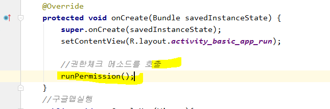

# 인텐트 Intent : 다른 Activity로 전환

p.246

여러 화면 만들고 화면 간 전환하기 : 다른 클래스 전환

[안드로이드 앱의 구성요소]

1. 액티비티

2. 서비스

3. 브로드캐스트 수신자 : 메세지를 전달했을 때 반응하게 하는 것 

   ex. 특정 앱 사용 시 배터리 15퍼센트 이상이어야 함 => 계속 배터리 체크를 해야하는데, 어렵다.
   일정하지 않은 단말기의 상황을 잡을 때 사용하는 것 : 브로드캐스트 리시버

4. 내용제공자

   ex. 촬영기능 선택 시 필터를 통해 사용 가능한 앱 리스트를 보여주고, 선택하게끔 한다. 그 앱들은 데이터를 공유하게 된다.  


## 실습


* 첫 번째 액티비티에서 버튼을 누르면, 두 번째(다른) 액티비티로 전환되는 기능을 구현해 본다.

  


* `Intent` : 화면 전환 의뢰하는 것!
  1. 인텐트 객체를 생성하고, 실행할 액티비티의 정보와 데이터를 세팅
  2. 안드로이드OS에 인텐트객체를 넘기며 의뢰
     `startActivity` : 액티비티를 실행
  3. 인텐트에 설정되어 있는 액티비티 호출
  4. 호출된 액티비티 에서는 안드로이드OS가 넘겨준 인텐트를 가져오기
  5. 인텐트에 셋팅된 데이터를 꺼내서 활용 


* secondActivity 코드 작성

  

  

* 실행하면 오류가 뜬다. 이유는, manifest에 SecondActivity가 추가되어 있지 않기때문이다.

  따라서 사용하는 모든 Activity는 매니페스트 에 추가되어있어야 한다. 

  추가하고 다시 실행해본다.


* 실행 화면


버튼 누르면


이렇게 SecondActivity연결된 xml으로 전환된다.


* 이번엔 intent에 공유할 데이터를 저장하는 기능을 구현한다. `putExtra()` 

  `intent.putExtra `를 보면, 값을 넘길 때 Key와 Value로 넘김을 확인할 수 있다. 

  

  


* 인텐트객체에서 공유된 값을 꺼내주는 기능도 구현해야 한다.

  String과 num value를 가져올 것이므로 `getStringExtra` ,`getIntExtra` 를 활용한다.


* 실행 화면

  


---

### ReturnDataFirstActivity


`startActivityForResult(인텐트객체,request code)` : 결과값을 가지고 되돌아온다.

* 인텐트 객체와 함께 사용자가 정의한 임의의 int형 request code를 넘긴다.
  보통은 메소드 밖에 정의한 상수 로 넘긴다.


### ReturnDataSecondActivity

* 이너클래스에서 밖에 선언된 변수를 쓰려면 선언된 변수에 `final` 을 붙여줘야 한다.
* 이전 액티비티에 값을 넘기기 위해서 `putExtra` 메소드로 값을 세팅해준다. 
* 값을 가지고 되돌아가기 위해서 `setResult(RESULT_OK,intent객체명)` 을 사용한다.


* 다시 ReturnDataFirstActivity로 돌아온다. 되돌아와서 마무리해야 하므로 추가로 코드를 작성한다.

* 인텐트를 통해서 액티비티를 호출하고 되돌아오는 경우 메소드를 추가해서 작업한다.

  

* `onActivityResult` 메소드를 오버라이딩해서 처리할 작업을 구현 (`ctrl` + `o`) (되돌아와서 마무리해야 하므로)

  * `requestCode` - 요청을 했던 뷰를 구분하기 위한 코드
  * `resultCode` - 결과 코드
  * `data` - intent객체

  ```java
  protected void onActivityResult(int requestCode, int resultCode, Intent data) {
      super.onActivityResult(requestCode, resultCode, data);
  }
  ```


* 실행결과

  


---


## Parcelable타입

* 안드로이드에서 인텐트에 객체를 공유하고 싶은 경우
* DTO와 같은 클래스를 하나 생성 후
  * `Parcelable`을 implements하고 메소드를 적절하게 오버라이딩
  * Parcelable 객체를 만드는 것 


**아직 오류나는 이유?**


빨간 줄 누르면 객체참조변수가 생성된다.


액티비티 두 개 사이에서.

액티비티1에서 객체를 parcelable에 담을 때, writeToParcle 메소드가 호출된다.

담겨진 객체를 꺼낼 때는 Creator타입의 CREATOR변수 의 createFromPArcel메소드가 실행됨

그래서 protected User(Parcelin){ name = in.readString(); .... } 가 실행된다.


# manifests.xml - intent-filter

intent-filter

이런 식으로 조건을 줄 수 있다. action, category...


* action : 어떤 기능을 하는 지 정의

* category : 런처에 의해 실행되는 범위


## 서로 다른 앱에서 작업하기

* selectview를 intent앱에서 확인한다

  ```
  intent(액션명)
  ```

  


* 이렇게 같은 action명을 해놓으면, 


action에 해당되는 기능의 모든 앱이 뜬다. 


---

## BasicAppRun


* xml에서 onClick도 걸어준다. 


* 전화걸기 같은 몇 기능은  권한을 줘야한다.

  먼저 manifest에 코드를 작성한다. 

  


* 이제는  java 에서 작성한다.

  승인받을 권한의 목록을 멤버로 작성해주고, 

  권한을 체크(승인)하는 메소드를 작성한다. 


그리고 메인메소드에 방금 작성한 메소드를 호출한다.




전화를걸려면 폰이 2개가 필요하므로, avd를 하나 추가해준다. 


* 실행 화면

  


