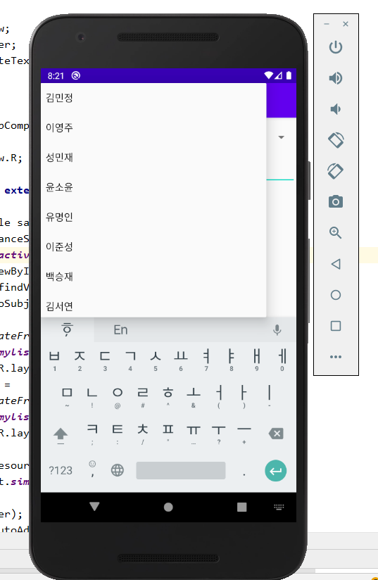
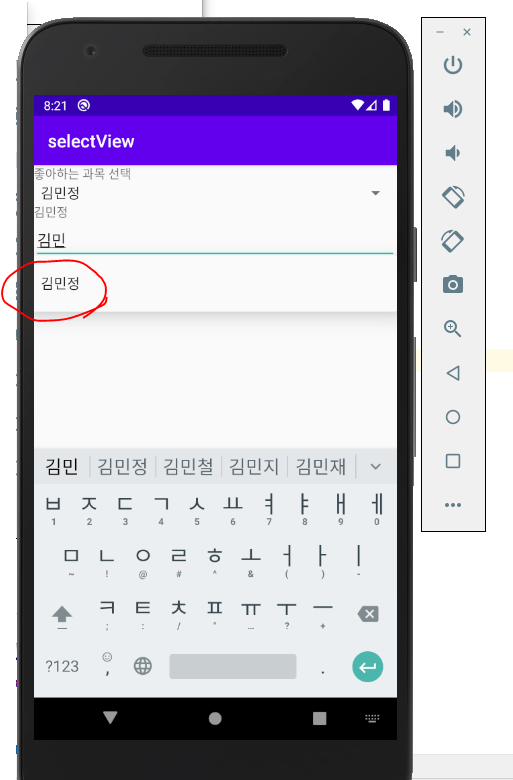

필요파일

https://blog.naver.com/PostView.nhn?blogId=heaves1&logNo=221893127837&parentCategoryNo=189&categoryNo=&viewDate=&isShowPopularPosts=false&from=postList

* SpinnerTestActivity.java

  ```java
  package exam.day03.view.selectview.view.activity;
  import android.os.Bundle;
  import android.view.View;
  import android.widget.AdapterView;
  import android.widget.ArrayAdapter;
  import android.widget.AutoCompleteTextView;
  import android.widget.Spinner;
  import android.widget.TextView;
  
  import androidx.appcompat.app.AppCompatActivity;
  
  import exam.day03.view.selectview.R;
  
  public class SpinnerTestActivity extends AppCompatActivity {
      @Override
      protected void onCreate(Bundle savedInstanceState) {
          super.onCreate(savedInstanceState);
          setContentView(R.layout.activity_spinner_test);
          Spinner spinner=  findViewById(R.id.spinner01);
          final TextView result = findViewById(R.id.result);
          AutoCompleteTextView autoSubject = findViewById(R.id.subjectlist);
          ArrayAdapter adapter =
                  ArrayAdapter.createFromResource(this,
                          R.array.mylist_data,
                          android.R.layout.simple_spinner_item);
          ArrayAdapter autoAdapter =
                  ArrayAdapter.createFromResource(this,
                          R.array.mylist_data,
                          android.R.layout.simple_dropdown_item_1line);
  
          adapter.setDropDownViewResource
                  (android.R.layout.simple_spinner_dropdown_item);
  
          spinner.setAdapter(adapter);
          autoSubject.setAdapter(autoAdapter);
          spinner.setOnItemSelectedListener(new AdapterView.OnItemSelectedListener() {
              @Override
              public void onItemSelected(AdapterView<?> parent,
                                         View view, int position, long id) {
                  TextView resultTxt = view.findViewById(android.R.id.text1);
                  result.setText(resultTxt.getText());
              }
  
              @Override
              public void onNothingSelected(AdapterView<?> parent) {
                  result.setText("선택된 가수가 없습니다.");
              }
          });
      }
  }
  
  ```

  

* activity_spinner_test.xml

```xml
<?xml version="1.0" encoding="utf-8"?>
<LinearLayout xmlns:android="http://schemas.android.com/apk/res/android"
    xmlns:app="http://schemas.android.com/apk/res-auto"
    xmlns:tools="http://schemas.android.com/tools"
    android:layout_width="match_parent"
    android:layout_height="match_parent"
    tools:context=".SpinnerTestActivity"
    android:orientation="vertical">
    <TextView
        android:layout_width="match_parent"
        android:layout_height="wrap_content"
        android:text="좋아하는 과목 선택"/>
    <Spinner
        android:id="@+id/spinner01"
        android:layout_width="match_parent"
        android:layout_height="wrap_content"
        />
    <TextView
        android:id="@+id/result"
        android:layout_width="match_parent"
        android:layout_height="wrap_content"/>
    <AutoCompleteTextView
        android:id="@+id/subjectlist"
        android:layout_width="match_parent"
        android:layout_height="wrap_content"/>
</LinearLayout>
```





자동완성