# 권한

권한에는 (1)일반권한, (2)위험권한, (3)사용자정의권한 이 있다.

* 프로젝트 2개를 만든다. 

  1) DataManagementPro


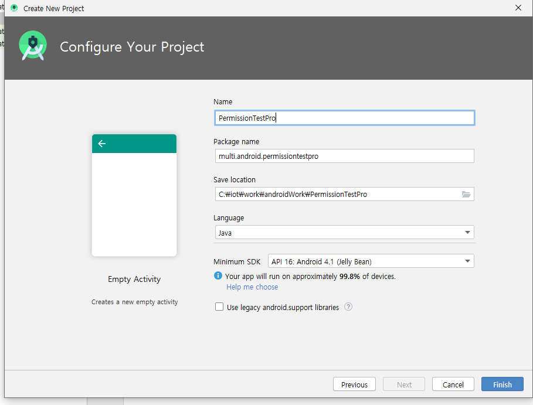


## PermissionTestPro

* 선생님 블로그에서 다운로드 받은 폴더의 파일들을 붙여넣는다.

  https://blog.naver.com/PostList.nhn?blogId=heaves1&from=postList&categoryNo=209

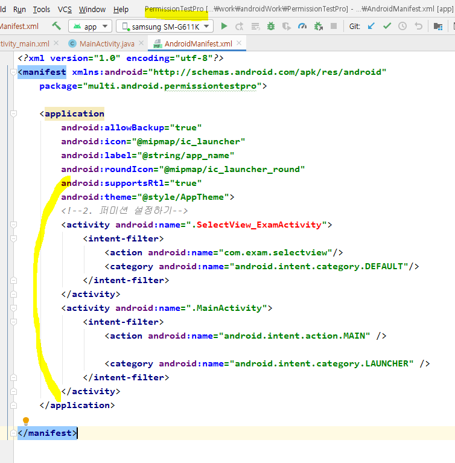


* java 랑 layout, drawable 등등 다 넣는다.

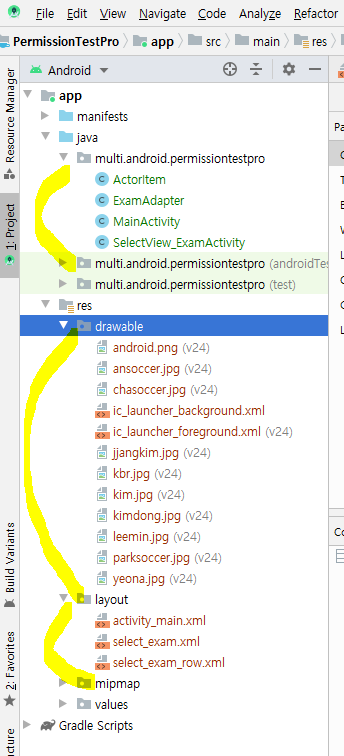


# 사용자 정의 권한 만들기

```xml
<permission android:name="com.exam.persmission"
        android:label="JAVA_PERMISSION"
        android:description="@string/per_msg"
        android:protectionLevel="normal"
        />
```

* 사용하는 쪽에서도 이러한 정보가 있어야 사용할 수 있습니다 라고 권한을 걸어놓는 코드이다.

* `<permission~>` 태그 : 나 이런 퍼미션 쓸꺼야 하고 미리 알려주는 것

  * name 속성 : 내가 임의로 이름을 정해준다.

  * label 속성 : 퍼미션에 대한 안내

  * description : 퍼미션 설치할 때 뭐에 대한 퍼미션인지 설명
    -> values폴더의 string.xml에서 설명을 적어 연결해주고, 관리할 수 있도록 한다.

    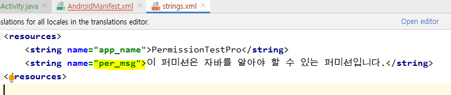

  * protectionLevel 속성 : 보안 수준 레벨을 설정한다. 일반권한은 `normal` 로 설정해 주면 된다. **설치할 때** 권한을 체크한다. 설치할까요? 이런식으로 안내해 주는 수준
    위험권한은 앱을 **실행하는 시점**에 권한에 대해 다시 한 번 권한을 체크하게끔 하는 권한들


* 일단 주석처리

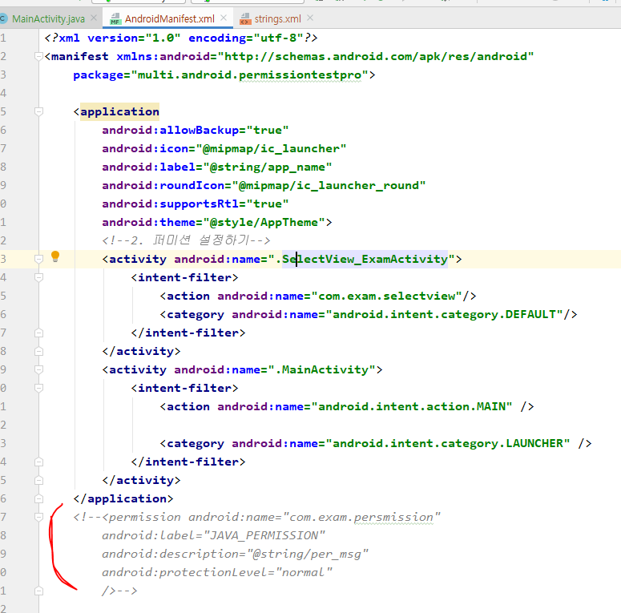


### DataManagementPro 프로젝트로 전환

* 아래와 같은 구조로 만든다. 

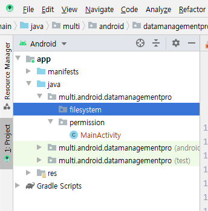

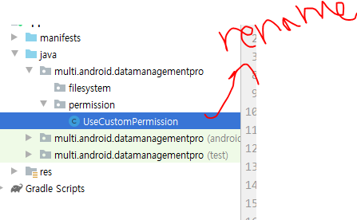


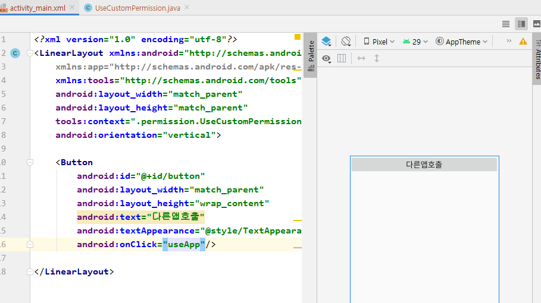

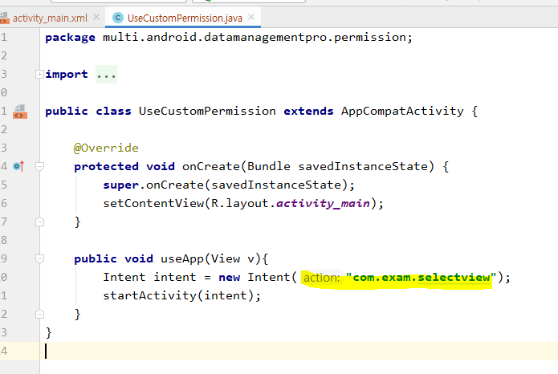

* 매니페스트의 intent-filter에 작성해 놓은 액션명에 해당하는 것들이 호출된다.

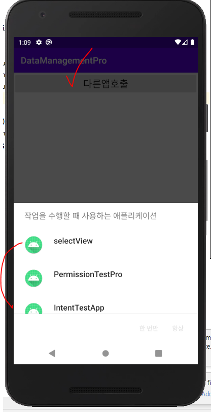


### PermissionTestPro 로 전환

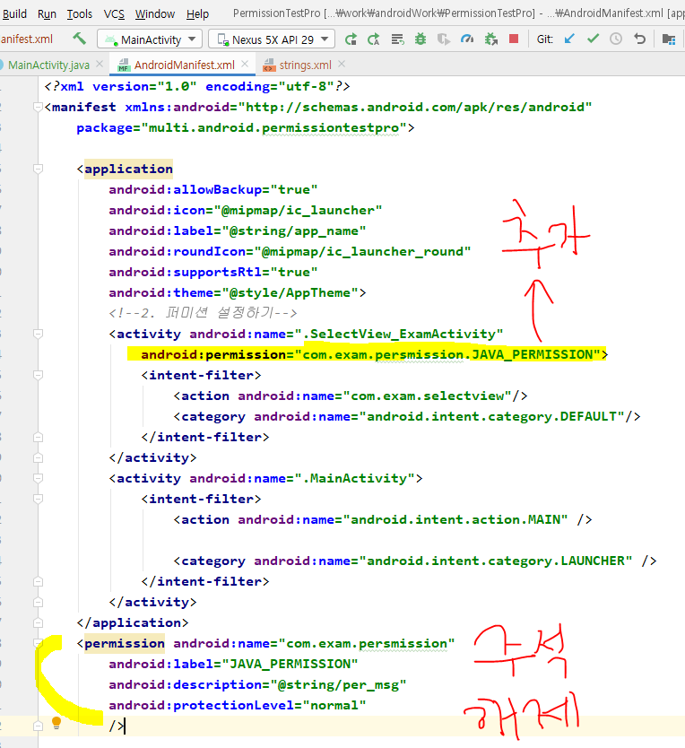


* 설정파일이 바뀌었기 때문에 재배포가 필요하다. main에서 다시 실행해준다.


### DataManagementPro 로 다시 전환

* 실행하고, 다른 앱 호출 누르기

  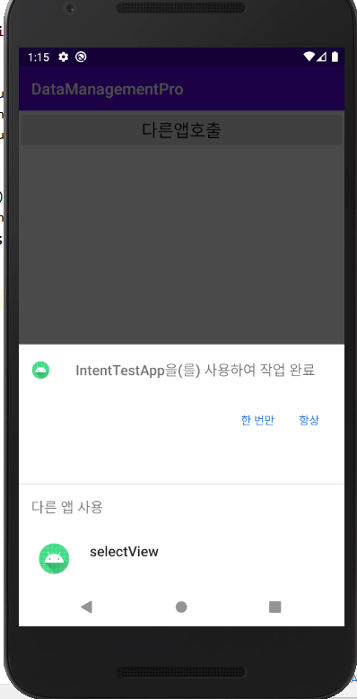

* PermissionPro 가 없어졌다!

  내가 사용자정의로 아무때나 쓸 수 없도록 권한을 걸어놨기 때문에 뜨지 않는다.
  
  내가 PermissionTestPro 매니페스트에 작성한 permission 태그 에 상응하는 코드를 Datamanagement 매니페스트에 작성해야 사용할 수 있다.


* 같은 권한을 사용하겠다는 코드를 DataManagement 매니페스트에 작성한다. 

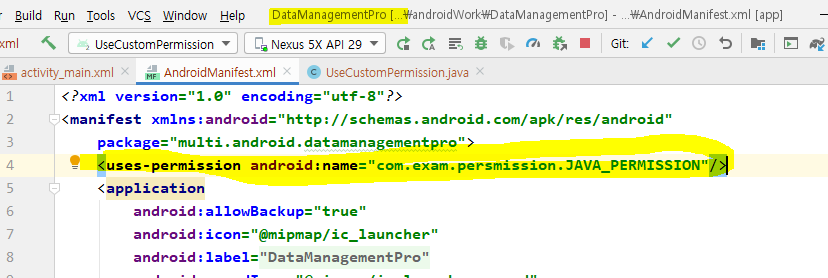


* 실행하면 다시 나옴을 확인할 수 있다.

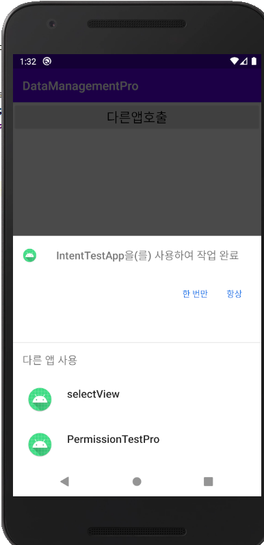


# 시스템 권한

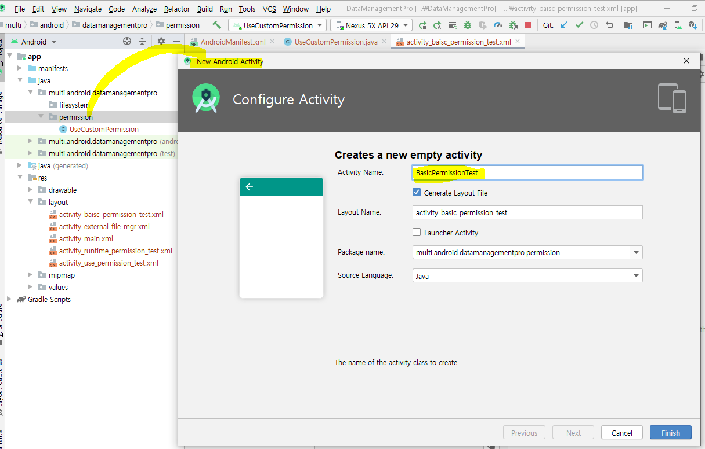


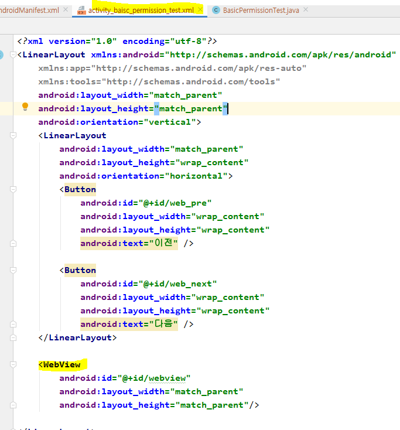


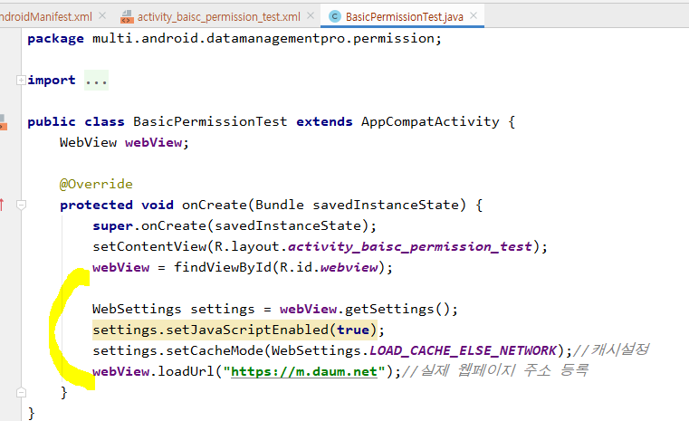

* 실행결과
* 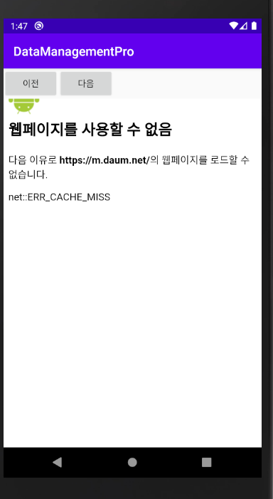
* 권한이 없어서 안나온다.
* 권한을 설정해주자!

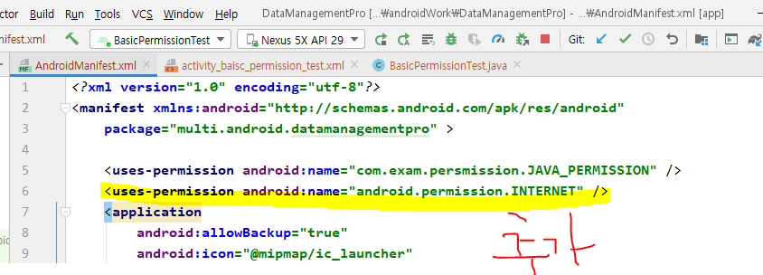

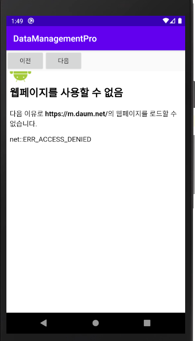


* https(secure)통신에 때문에 다음과 같은 코드를 추가해준다. 

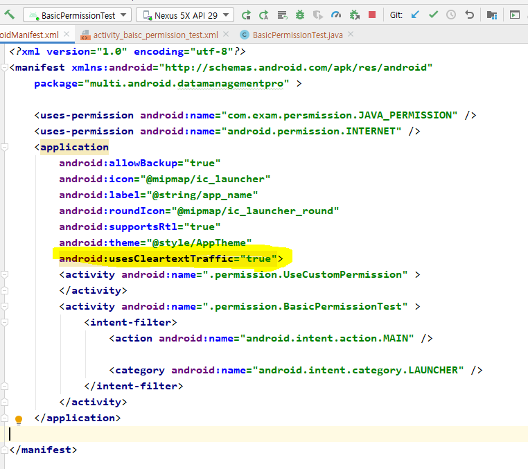


## 위험권한

-> 실행 될 때 여부를 묻기 때문에, 런타임 퍼미션이라고도 한다. 

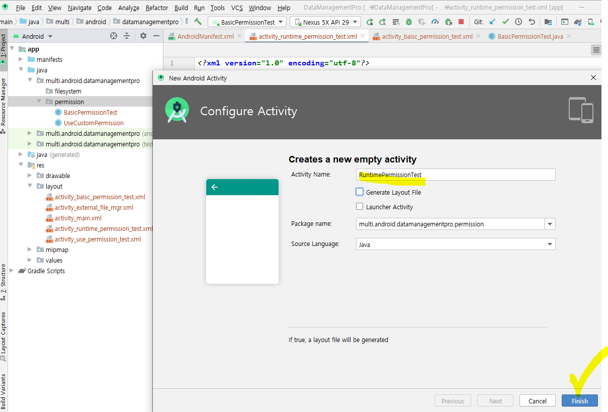


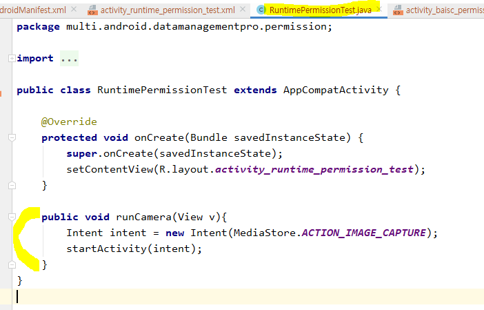


실행 후 버튼을 누르면 카메라 뷰가 나온다.


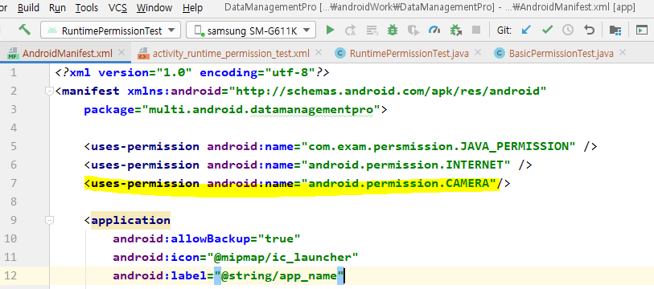

이 문장을 추가하면, 위험권한을 추가하는 것이다. 하지만 권한에 대한 자세한 처리를 하지 않아서 그대로 실행하면 앱에서 튕긴다. 


p.379 퍼미션에 대한 등록

1. 내가 사용할 권한을 일단 매니페스트에 등록해야 한다. 
2. checkpermission을 통해 권한이 있는지 없는지 확인한다.
   * checkpermission
   * requestpermssion 메소드를 이용해 권한이 없을 경우, 권한을 체크하라고 유저한테 팝업을 띄워준다. (허용하겠습니까? 예, 아니오)
     예 -> 권한이 생긴 것이므로 다음 단계 실행
     아니오 -> 나름대로 설계 

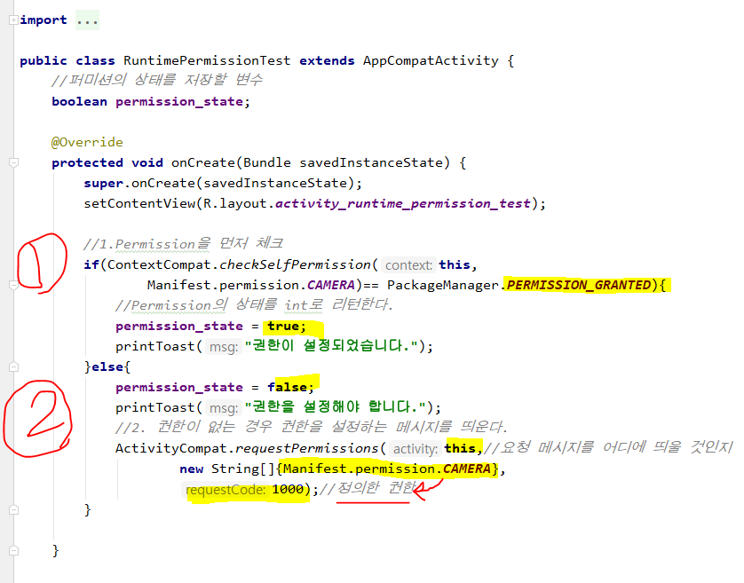

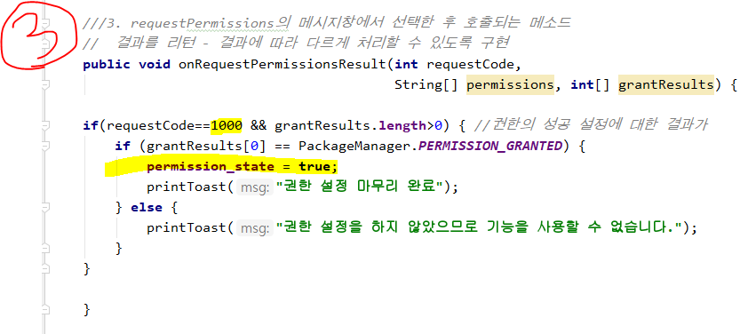


p.380

권한이 여러개 일 경우 : 권한설정 안되어있는 것만 ArrayList에 집어넣고 잇따.

그리고 한꺼번에 RequestPermission을 던진다.

