# ViewPager

옆으로 화면을 넘기면 view가 바뀐다.


* 새로운 Activity 생성 : ViewPagerTest.java

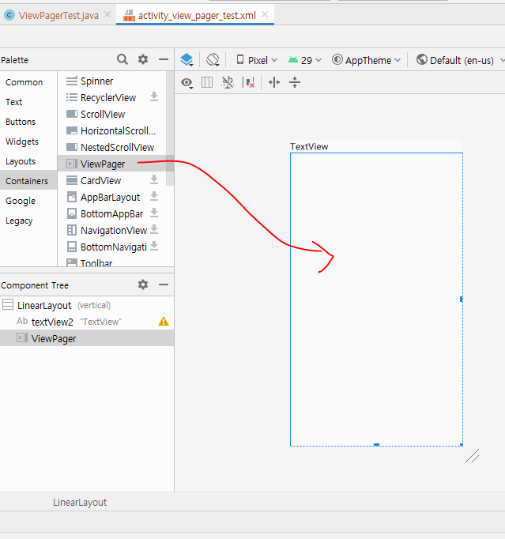

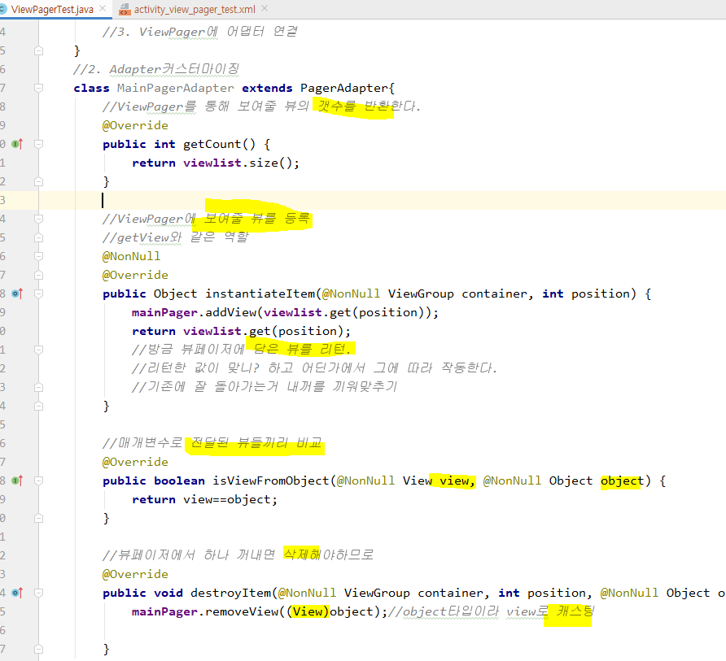

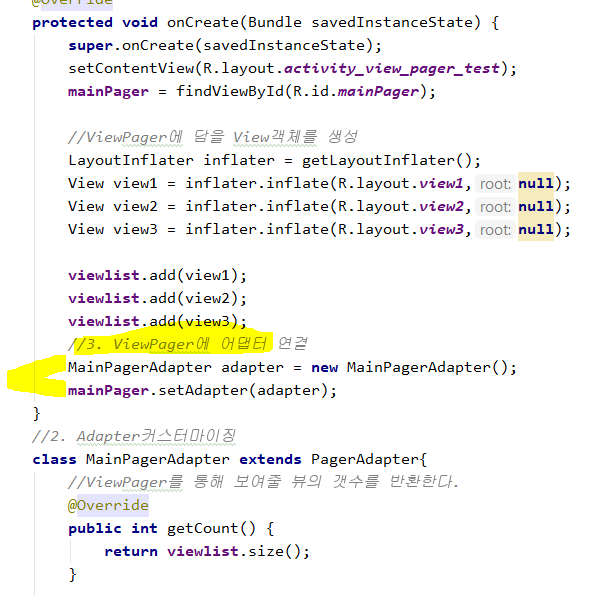


* 실행결과

  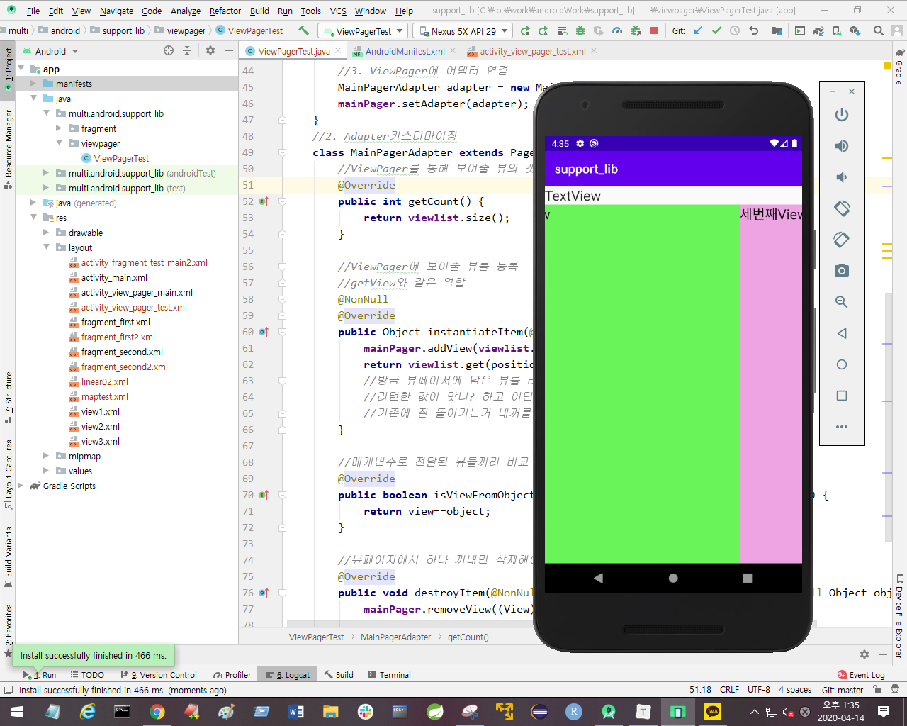

옆으로 화면을 넘기면 view가 바뀐다.


fragment를 반환하는 메소드는?

fragment는 inflate안하고 객ㅇ체가지고한다. 

ViewPager에 담아놔야 한다. 


## 실습 : Fragment와 ViewPager를 동시에

**페이스북처럼 양옆으로 밀어서 화면을 전환시킬 수 있으며, 위 세가지 버튼을 눌러도 화면전환이 될 수 있도록 설계한다.**

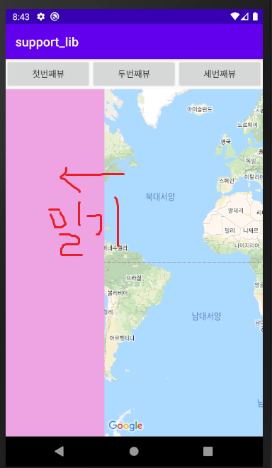

Fragment로 작업한 예제를 View pager에 추가해서 동작하도록 작성
- fragment를 한 개 추가
- 지도가 출력되는 MainActivity도 추가
- 4개의 Fragment가 Viewpager로 실행될 수 있도록


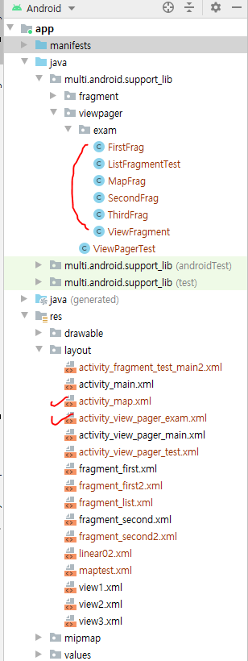


* 미리보기 (전체코드)

  ```java
  package multi.android.support_lib.viewpager.exam;
  
  import android.os.Bundle;
  import android.view.LayoutInflater;
  import android.view.View;
  import android.view.ViewGroup;
  import android.widget.Toast;
  
  import androidx.annotation.NonNull;
  import androidx.appcompat.app.AppCompatActivity;
  import androidx.fragment.app.Fragment;
  import androidx.fragment.app.FragmentManager;
  import androidx.fragment.app.FragmentPagerAdapter;
  import androidx.fragment.app.FragmentStatePagerAdapter;
  import androidx.fragment.app.FragmentTransaction;
  import androidx.viewpager.widget.ViewPager;
  
  import java.util.ArrayList;
  
  import multi.android.support_lib.R;
  
  public class ViewFragment extends AppCompatActivity {
      //Fragment들
      FirstFrag viewFragment1 = new FirstFrag();
      //SecondFrag viewFragment2 = new SecondFrag();
      ListFragmentTest viewFragment2 = new ListFragmentTest();
      ThirdFrag viewFragment3 = new ThirdFrag();
      MapFrag viewFragment4 = new MapFrag();
  
  
      ViewPager fragment_viewPager;
      ArrayList<Fragment> fragArrayList = new ArrayList<Fragment>();
  
      @Override
      protected void onCreate(Bundle savedInstanceState) {
          super.onCreate(savedInstanceState);
          setContentView(R.layout.activity_view_pager_exam);
          fragment_viewPager = findViewById(R.id.fragment_viewPager);
  
          fragArrayList.add(viewFragment1);
          fragArrayList.add(viewFragment2);
          fragArrayList.add(viewFragment3);
          fragArrayList.add(viewFragment4);
  
          FragAdapter myadapter = new FragAdapter(getSupportFragmentManager(),
                  fragArrayList.size());
          fragment_viewPager.setAdapter(myadapter);
          fragment_viewPager.addOnPageChangeListener(new PageListener());
      }
  
  
  
      class FragAdapter extends FragmentStatePagerAdapter {
          public FragAdapter(@NonNull FragmentManager fm, int behavior) {
              super(fm, behavior);
          }
  
          @NonNull
          @Override
          public Fragment getItem(int position) {
              return fragArrayList.get(position);
          }
  
          @Override
          public int getCount() {
              return fragArrayList.size();
          }
      }
  
      public void btn_click(View v){
          fragment_viewPager.setCurrentItem(Integer.parseInt(v.getTag().toString()));
      }
  
      class PageListener implements ViewPager.OnPageChangeListener{
  
          @Override
          public void onPageScrolled(int position, float positionOffset, int positionOffsetPixels) {
  
          }
  
          @Override
          public void onPageSelected(int position) {
              //페이지가 변경되었을때
              Toast.makeText(ViewFragment.this, "페이지가 전환", Toast.LENGTH_SHORT).show();
          }
          @Override
          public void onPageScrollStateChanged(int state) {
  
          }
      }
  
  
  }
  
  ```

  

```java
package multi.android.support_lib.viewpager.exam;

import android.os.Bundle;

import androidx.annotation.NonNull;
import androidx.annotation.Nullable;
import androidx.fragment.app.Fragment;
import androidx.fragment.app.ListFragment;

import android.view.LayoutInflater;
import android.view.View;
import android.view.ViewGroup;
import android.widget.ArrayAdapter;

import multi.android.support_lib.R;

/**
 * A simple {@link Fragment} subclass.
 */
public class ListFragmentTest extends ListFragment {

    public ListFragmentTest() {
        // Required empty public constructor
    }

    @Override
    public void onViewCreated(@NonNull View view, @Nullable Bundle savedInstanceState) {
        super.onViewCreated(view, savedInstanceState);
        String[] data = {"이민호","공유","소지섭","이동욱","박서준","정우성"};
        ArrayAdapter aradapter = new ArrayAdapter(getActivity(),
                android.R.layout.simple_list_item_1,android.R.id.text1,data);
        setListAdapter(aradapter);

    }

}
```


```java
package multi.android.support_lib.viewpager.exam;

import androidx.appcompat.app.AppCompatActivity;
import androidx.fragment.app.Fragment;

import android.os.Bundle;
import android.view.LayoutInflater;
import android.view.View;
import android.view.ViewGroup;

import multi.android.support_lib.R;

public class MapFrag extends Fragment {

    public MapFrag() {
        // Required empty public constructor
    }


    @Override
    public View onCreateView(LayoutInflater inflater, ViewGroup container,
                             Bundle savedInstanceState) {
        // Inflate the layout for this fragment
        return inflater.inflate(R.layout.activity_map, container, false);
    }
}
```


```xml
<?xml version="1.0" encoding="utf-8"?>
<LinearLayout xmlns:android="http://schemas.android.com/apk/res/android"
    xmlns:app="http://schemas.android.com/apk/res-auto"
    xmlns:tools="http://schemas.android.com/tools"
    android:layout_width="match_parent"
    android:layout_height="match_parent"
    android:orientation="vertical">

    <LinearLayout
        android:layout_width="match_parent"
        android:layout_height="wrap_content"
        android:orientation="horizontal">

        <Button
            android:id="@+id/button"
            android:layout_width="wrap_content"
            android:layout_height="wrap_content"
            android:layout_weight="1"
            android:onClick="btn_click"
            android:tag="0"
            android:text="첫번째뷰" />

        <Button
            android:id="@+id/button2"
            android:layout_width="wrap_content"
            android:layout_height="wrap_content"
            android:layout_weight="1"
            android:onClick="btn_click"
            android:tag="1"
            android:text="두번째뷰" />

        <Button
            android:id="@+id/button3"
            android:layout_width="wrap_content"
            android:layout_height="wrap_content"
            android:layout_weight="1"
            android:onClick="btn_click"
            android:tag="2"
            android:text="세번째뷰" />

    </LinearLayout>

    <!--ViewPager로 변경-->

    <androidx.viewpager.widget.ViewPager
        android:id="@+id/fragment_viewPager"
        android:layout_width="match_parent"
        android:layout_height="match_parent">
    <LinearLayout
            android:orientation="vertical"
            android:layout_width="match_parent"
            android:layout_height="match_parent"
            android:id="@+id/container">
        <!--xml에 fragment를 추가하면 동적(코드)으로 제어가 어렵다. -->
        <fragment
            android:id="@+id/fragment"
            android:layout_width="match_parent"
            android:layout_height="match_parent"
            android:name="multi.android.support_lib.fragment.exam.FirstFrag"
            />

    </LinearLayout>
    </androidx.viewpager.widget.ViewPager>

</LinearLayout>
```

---


1. 각 Fragment들을 선언해준다.

   ViewPager 객체를 만들고, Fragment 목록들을 담을 ArrayList 객체 fragArrayList를 만든다.

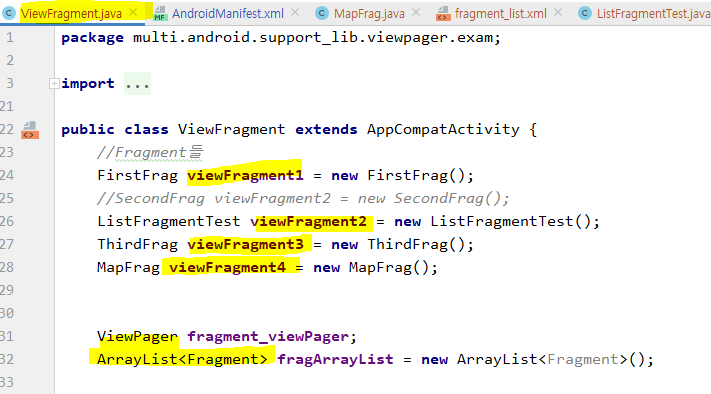


2. ViewPager객체 fragment_viewPager를 연결한다. 이때 찾는 id는 viewPager요소여야 한다. xml에서 어느 부분을 fragment로 설정하면 좋을 지 정하는 것.

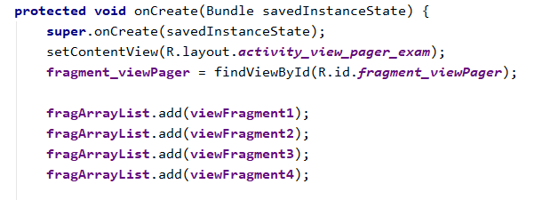

연결된 xml을 보면, ViewPager요소의 id fragment_viewPager이다.

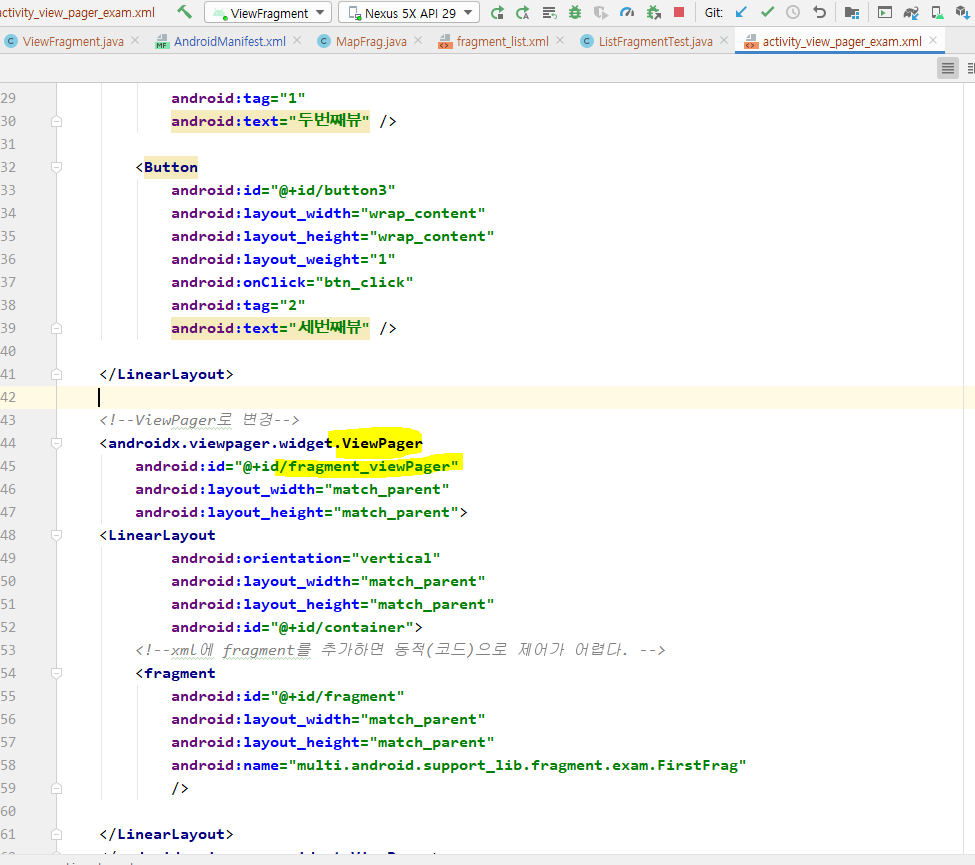


3. 이번엔 Fragment와 viewPager기능을 동시에 처리할 수 있도록 하는 클래스와 객체 `FragmentStatePagerAdapter`를 만든다. (상속하는 방식으로 만듬)

   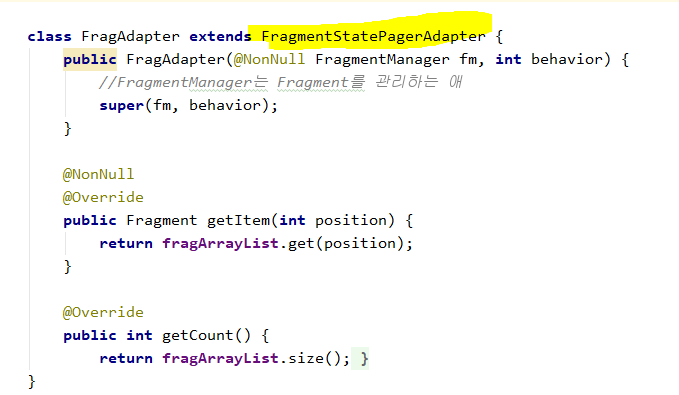

* `FragmentStatePagerAdapter` 를 사용하기 위해 필수 메소드를 오버라이딩한다.


4. onClick 메소드를 정의한다. viewPager가 갖고있는 `setCurrentItem`을 이용하는데, 태그 값을 가져와서 차례대로 한다.

   다행히 태그를 0부터 적어놔서 그대로 사용하면 된다.
   setCurrentItem 은 0부터 카운팅된다.


5. 만들어놓은 `FragmentStatePagerAdapter` 클래스 객체 myadapter를 만든다. 만들 때, 2개의 변수가 필요하다 : `getSupportFragmentManager()`와 fragment 리스트의 사이즈

   그리고 나서 Adapter형식으로 세팅해준다.

   페이지 전환 시 이벤트를 보기 위해 Listener를 달아주었다.

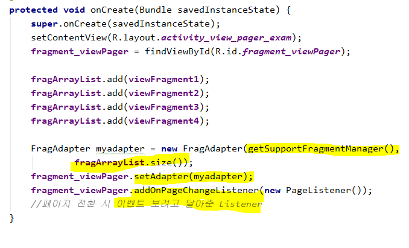


6. 페이지가 전환될 때 적용되는 이벤트 리스너를 `ViewPager.OnPageChangeListener` 기능을 통해 정의해 준다.

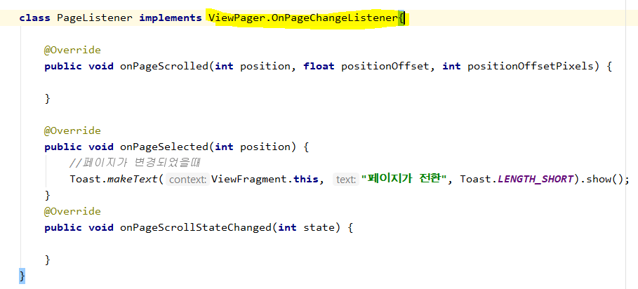


7. 구글 Map 기능을 이용하기 위해 매니페스트에 권한과 키를 추가한다.

   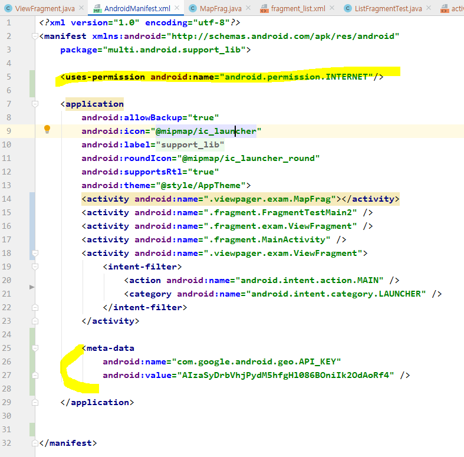


8. gradle 에도 추가해줘야 한다.

   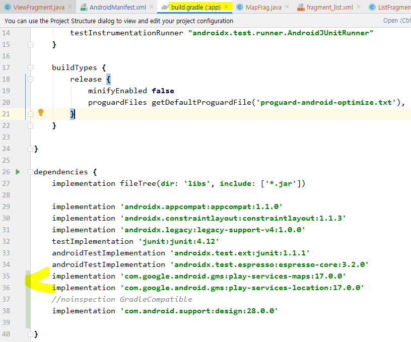


9. ListFragment.java 파일에 ArrayAdapter 를 작성한다.

   ArrayAdapter는 안드로이드스튜디오에서 제공하는 템플릿을 사용한다.


* 사용할 템플릿을 작성하고, 템플릿(ctrl + 클릭 하면 볼 수 있다.)에서 어느 위치에 data를 넣을것인지 작성하고, 넣을 데이터를 작성한다. 


* 결과 화면

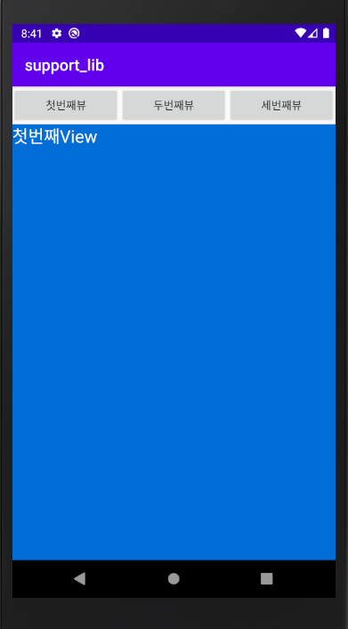


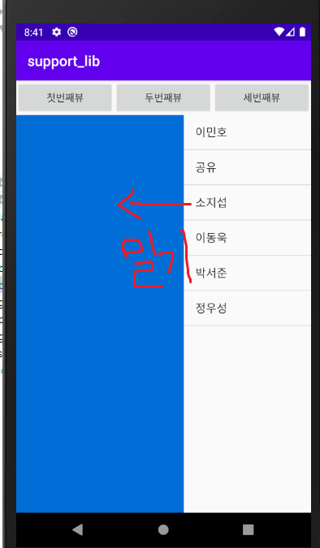


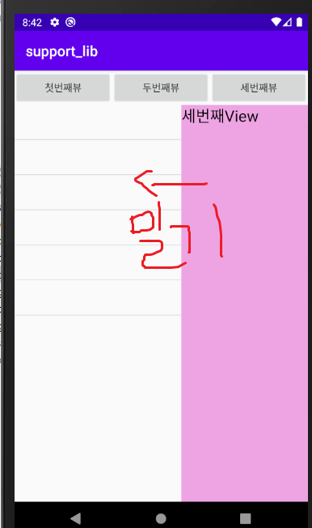


양옆으로 밀어서 화면을 전환시킬 수 있으며, 위 세가지 버튼을 눌러도 화면전환이 된다.


----


## 메뉴 만들기


* file > Project Structure

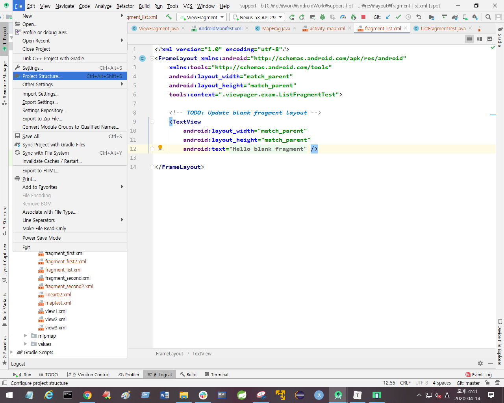

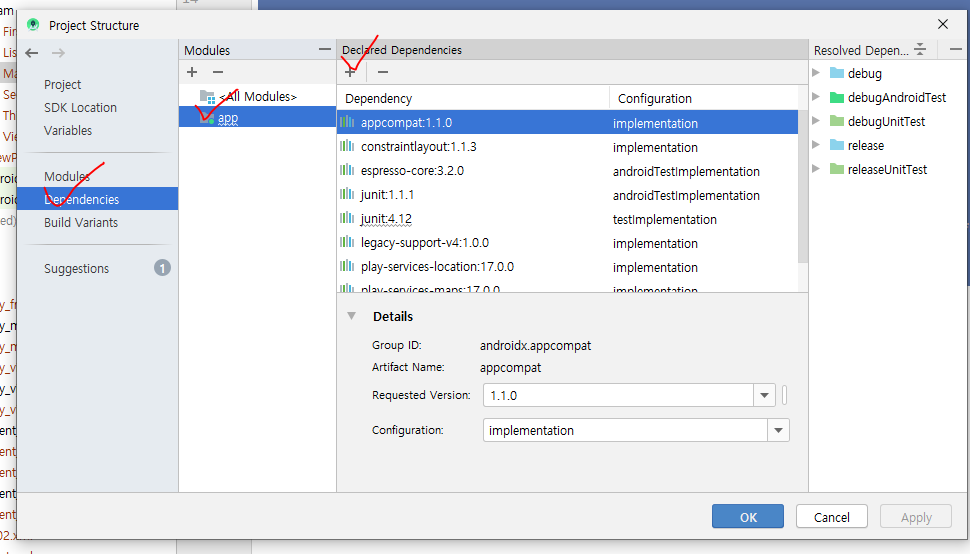

file > Project Structure> dependencies > app > `+`누르면 Library dependencies 선택 > design입력 후 검색

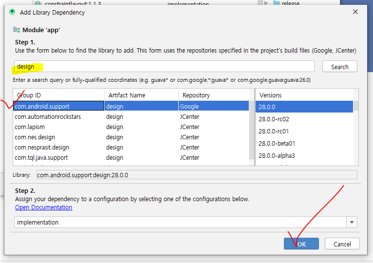

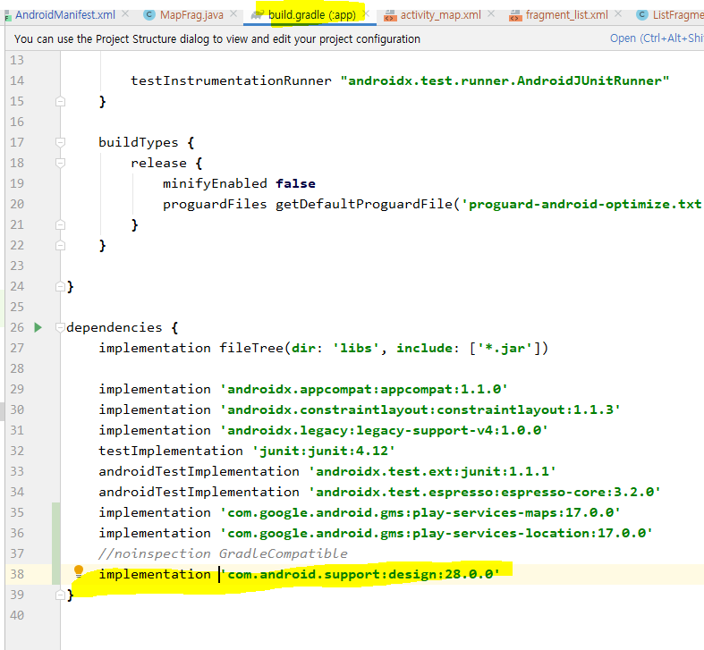

생겼음을 확인하고, 빨간 줄 있는데 add 누른 뒤 화면 상단 sync now눌러서 설치

