* 모두가 match_parent인 상태에서, 빨강에 weight = 1을 주면 빨강이 아예 출력되지 않는다.
* weight속성은 여백이 있는 곳을 담당하는데, match인 경우 여백이 아예 없으므로 해당부분은 출력되지 않고 다른 부분이 출력된다. 

프래그먼트는 액티비티에 종속적으로 작동하기 때문에 바로 작업할 수 있다.

프래그먼트 back stack으로 보내는 것처럼 작업하고 싶다면?

* FragmentTranscation에 `addToBackStrack` 이라는 메소드를이용한다.

  

* 버튼을 누른뒤, 뒤로가기 버튼을 누르면 앱이 종료되지 않고 이전 화면으로 돌아간다.

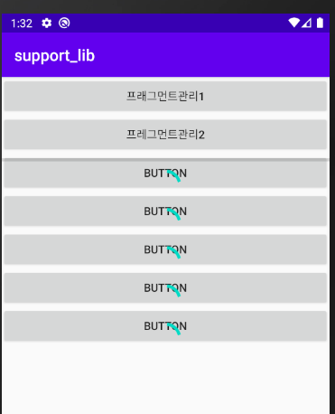

뒤로가기누르면

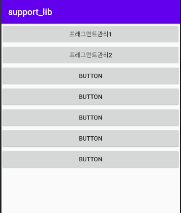

앱이 종료되지 않고 이전 작업단계로 돌아감. 마치 stack과 같다. 

* 원래 프래그먼트는 종속적이지만, 이렇게 액티비티 처럼작동하게 할 수 있다.

## FirstFragment에서

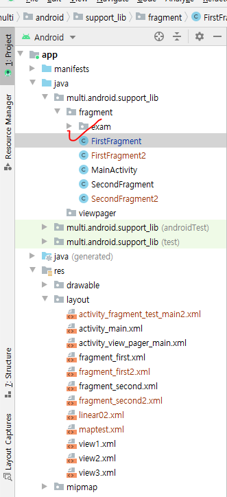

추가해야 할 LifeCycle에 관련된 메소드 11개 오버라이딩

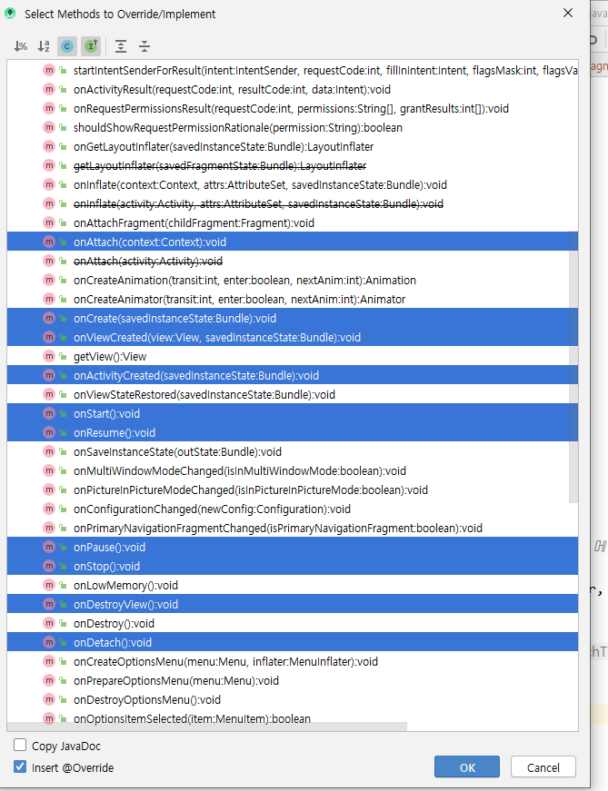

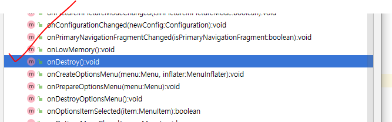

### FragmentTestMain2 와서 오버라이딩

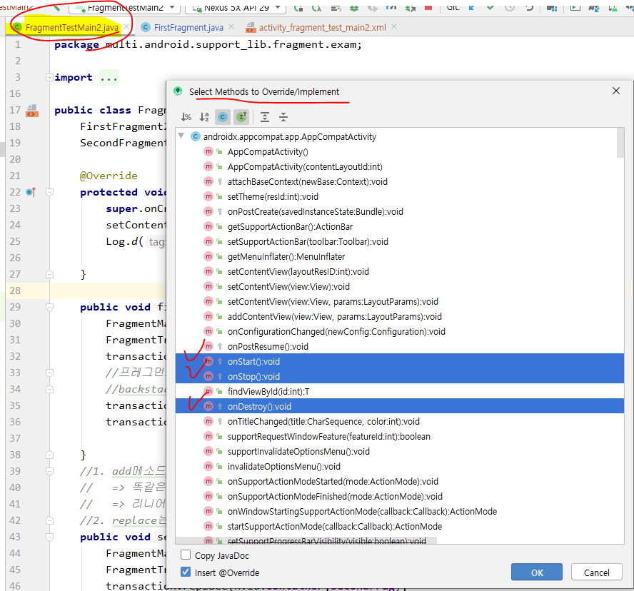

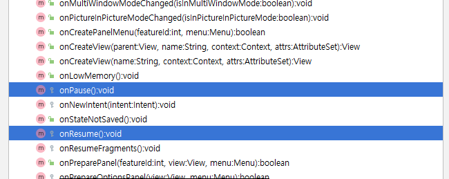

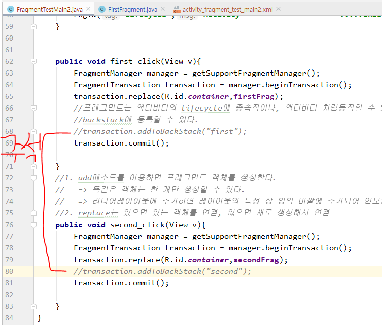

* 실행

  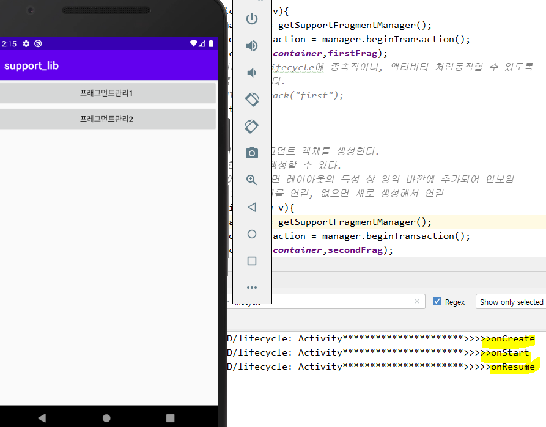

* 프래그먼트관리1 누르면?

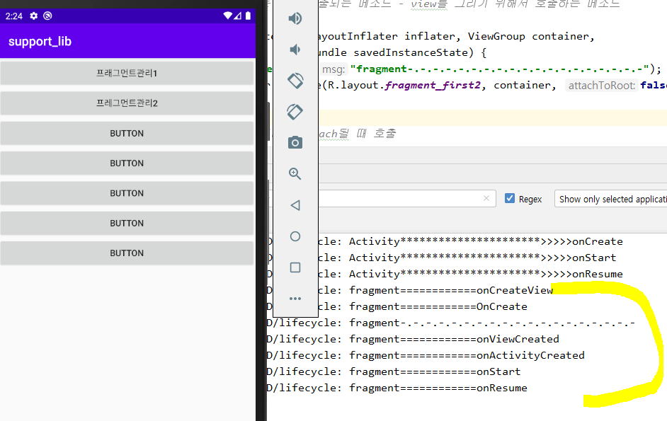

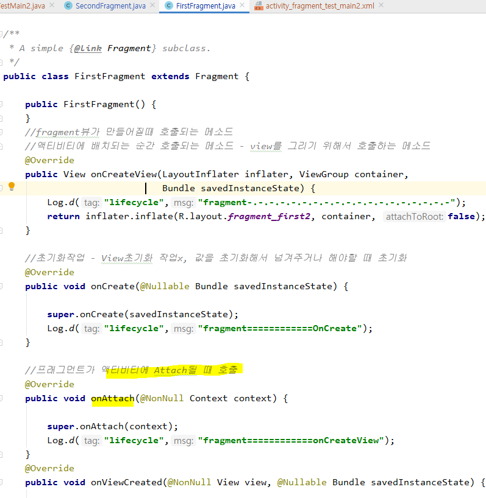

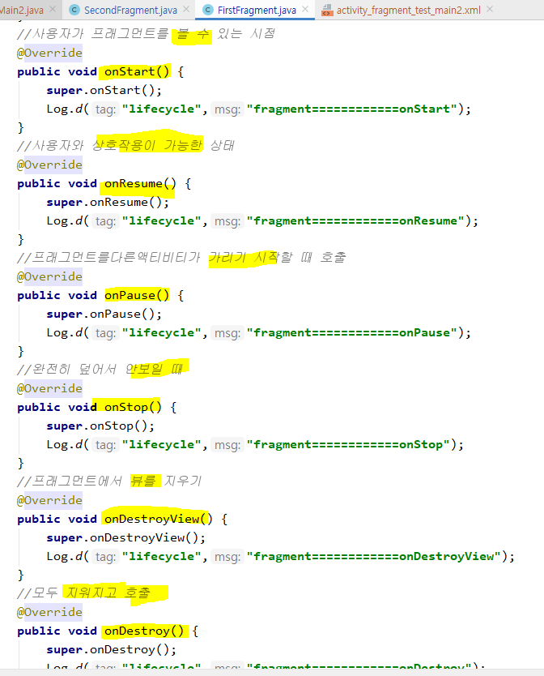

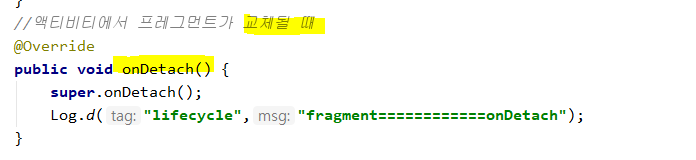

* 동작이 수행될 때 호출되는 메소드가 다르다. 따라서, 때에 따라 구현하고 싶은 기능을 onXXXX() 메소드 안에 작성해주면 된다.

* 앱을 킨 상태로 전원을 껐다가 켰을 때

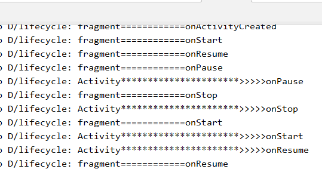

초기화면 관리할 때 한 페이지 안에서 많은 뷰들에 대한 정보를 뵤여주고 싶을 때는 Activity만 가지고 관리할 수 없으므로, fragment와 tab을 사용한다.

