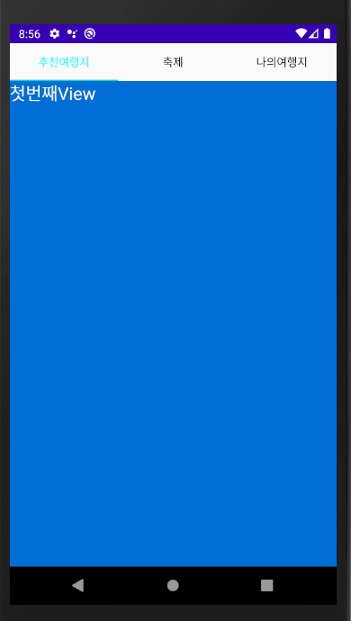

FragmentExam01(==ViewFragment)에 TabLayout이 추가되어 실행되도록 작업

* 버튼과 연결되어 있는 프래그먼트를 탭과 연결되도록 수정하기
* 구조를 변경하지 말고 버튼 대신 TabLayout을 추가하고
  * layout xml파일을 변경
  * 버튼을 지우고 Tab 추가
* TabTest2를 참고해서 코드로 ViewPager와 TabLayout이 연결되도록 수정

```java
package multi.android.material_design_pro.exam;

import android.graphics.Color;
import android.os.Bundle;
import android.view.View;
import android.widget.Toast;

import androidx.annotation.NonNull;
import androidx.appcompat.app.AppCompatActivity;
import androidx.fragment.app.Fragment;
import androidx.fragment.app.FragmentManager;
import androidx.fragment.app.FragmentStatePagerAdapter;
import androidx.viewpager.widget.PagerAdapter;
import androidx.viewpager.widget.ViewPager;

import com.google.android.material.tabs.TabLayout;

import java.util.ArrayList;

import multi.android.material_design_pro.R;
import multi.android.material_design_pro.tab.ChildFragment;


public class ViewFragment extends AppCompatActivity {

    TabLayout tabLayout;
    ViewPager pager;
    String[] tab_txt = {"추천여행지","축제","나의여행지"};
    //프레그먼트를 담을 ArrayList
    ArrayList<Fragment> fragmentArrayList = new ArrayList<Fragment>();

    //Fragment들
    FirstFrag viewFragment1 = new FirstFrag();
    ListFragmentTest viewFragment2 = new ListFragmentTest();
    ThirdFrag viewFragment3 = new ThirdFrag();

    @Override
    protected void onCreate(Bundle savedInstanceState) {
        super.onCreate(savedInstanceState);
        setContentView(R.layout.activity_view_pager_exam);

        tabLayout = findViewById(R.id.tabs);
        pager = findViewById(R.id.fragment_viewPager);

        fragmentArrayList.add(viewFragment1);
        fragmentArrayList.add(viewFragment2);
        fragmentArrayList.add(viewFragment3);

        tabLayout.setTabTextColors(Color.BLACK,Color.WHITE);

        FragAdapter adapter = new FragAdapter(getSupportFragmentManager(),
                fragmentArrayList.size());
        pager.setAdapter(adapter);
        pager.addOnPageChangeListener(new PageListener());
        tabLayout.setupWithViewPager(pager);
    }


    class FragAdapter extends FragmentStatePagerAdapter {
        public FragAdapter(@NonNull FragmentManager fm, int behavior) {
            //FragmentManager는 Fragment를 관리하는 애
            super(fm, behavior);
        }
        @NonNull
        @Override
        public Fragment getItem(int position) {
            return fragmentArrayList.get(position);
        }

        @Override
        public int getCount() {
            return fragmentArrayList.size();
        }

        public CharSequence getPageTitle(int position) {
            return tab_txt[position];
        }

    }


    class PageListener implements ViewPager.OnPageChangeListener{

        @Override
        public void onPageScrolled(int position, float positionOffset, int positionOffsetPixels) {

        }

        @Override
        public void onPageSelected(int position) {
            //페이지가 변경되었을때
            Toast.makeText(ViewFragment.this, "페이지가 전환", Toast.LENGTH_SHORT).show();
        }
        @Override
        public void onPageScrollStateChanged(int state) {

        }
    }


}
```

```xml
<?xml version="1.0" encoding="utf-8"?>
<LinearLayout xmlns:android="http://schemas.android.com/apk/res/android"
    xmlns:app="http://schemas.android.com/apk/res-auto"
    xmlns:tools="http://schemas.android.com/tools"
    android:layout_width="match_parent"
    android:layout_height="match_parent"
    android:orientation="vertical">

    <!--ViewPager로 변경-->
    <com.google.android.material.tabs.TabLayout
        android:id="@+id/tabs"
        android:layout_width="match_parent"
        android:layout_height="wrap_content"
        app:tabGravity="fill"/>

    <androidx.viewpager.widget.ViewPager
        android:id="@+id/fragment_viewPager"
        android:layout_width="match_parent"
        android:layout_height="match_parent">

    </androidx.viewpager.widget.ViewPager>

    <androidx.core.widget.NestedScrollView
        android:layout_width="match_parent"
        android:layout_height="match_parent"
        android:fillViewport="true">

        <LinearLayout
            android:layout_width="match_parent"
            android:layout_height="wrap_content"
            android:orientation="vertical">

            <androidx.viewpager.widget.ViewPager
                android:id="@+id/pager"
                android:layout_width="match_parent"
                android:layout_height="match_parent" />
        </LinearLayout>
    </androidx.core.widget.NestedScrollView>


</LinearLayout>
```

