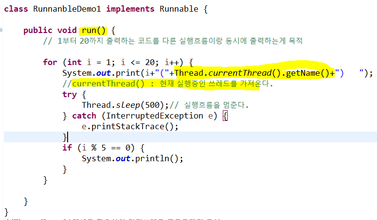
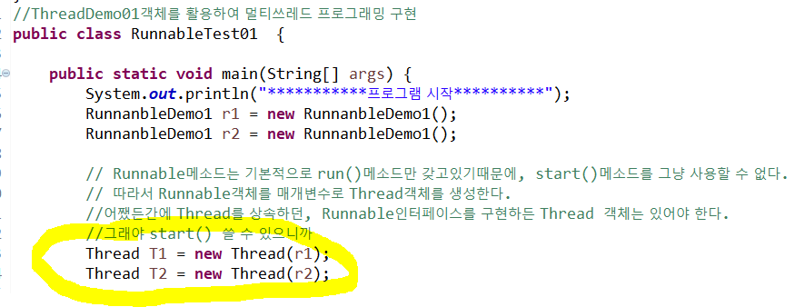
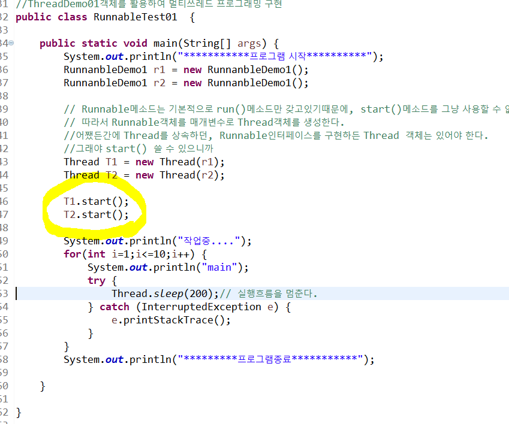

## Runnable인터페이스 구현

웹은 내가 신경 안써도 자동으로 서버에서 멀티 쓰레드 프로그래밍을 해준다.

안드로이드는 해당 기능이 없기 때문에, 직접 내가 설계해줘야한다.

평소에는 쓰레드클래스를 상속해서 쓰지만, 쓰레드클래스를 상속하기 어려운 케이스가 있다. 그럴 때는 Runnable인터페이스를 구현한다.

1.Runnable인터페이스를 구현하는 클래스를 생성

2.Runnable인터페이스가 갖고있는 추상메소드인 run메소드를 오버라이딩
   => 동시 작업하고 싶은 내용을 정의

​	

* Runnable은 기본적으로 run()메소드만 갖고있기 때문에, start()메소드는 사용할 수 없다. 따라서 Thread객체를 생성하여 start()를 구현한다.

3.작성한 Runnable객체를 이용해서 Thread객체를 생성
	=> Thread객체를 생성하면서 매개변수로 Runnable객체를 전달

4.생성한 Thread객체의 start호출

