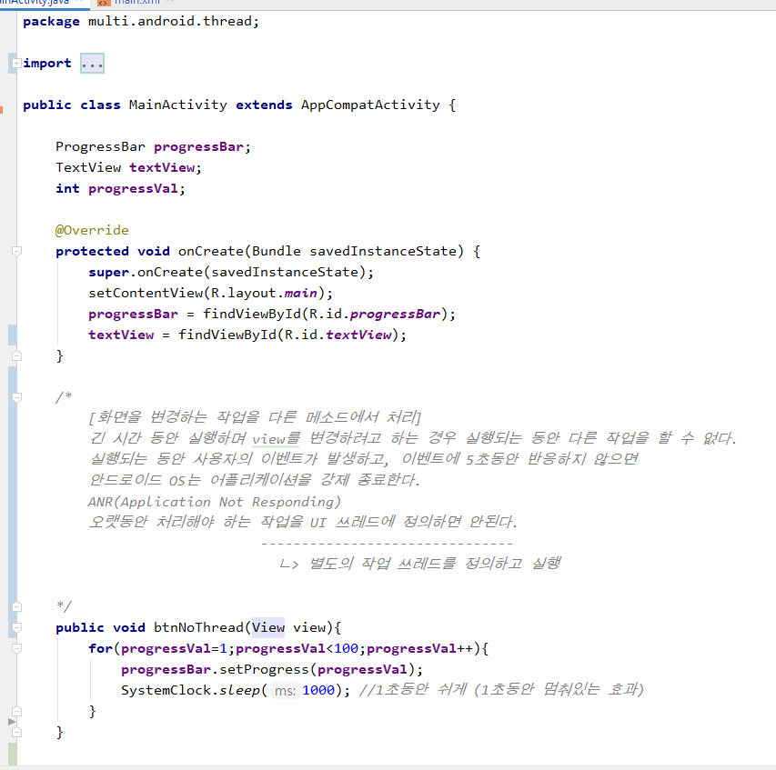

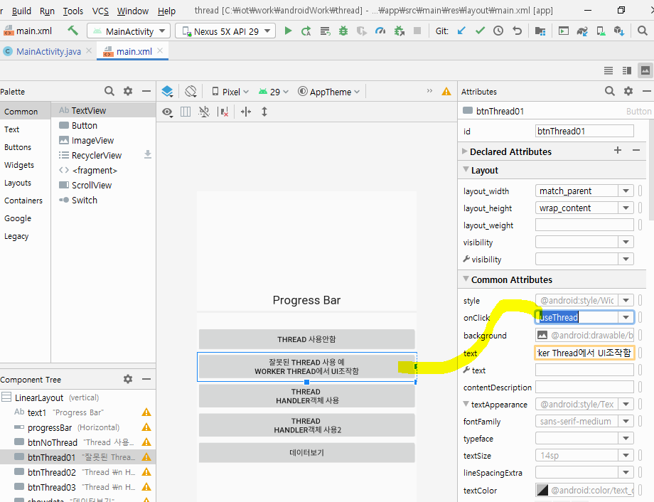


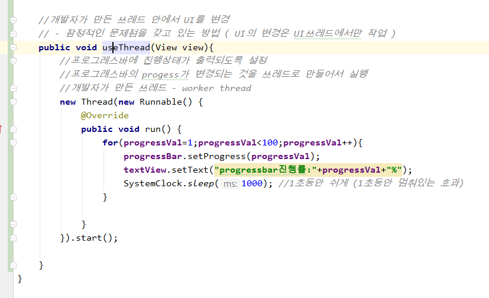

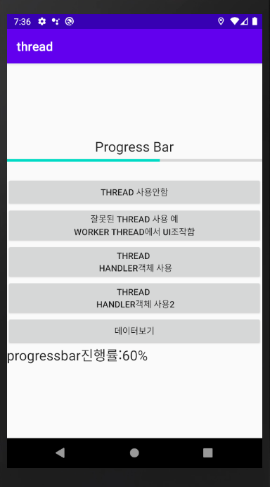

10버전에서는 잘 나오는데, 이전 버전에서는 앱이 중단되어 버린다.

쓰레드안에서 UI를 바꾸지 말고, UI는 UI쓰레드에서바꿔줘야 한다.


메인쓰레드에서 관리하는 UI객체는 내가 직접 만든 쓰레드 객체에서 접근할 수 없다. 접근하기 위해서는, '핸들러' 를 사용한다.


핸들러가 요청을 받아서 HadleMEssage보내 UI변경 

중간에서 쓰레드가 핸들러한테 계속 의뢰한다.0

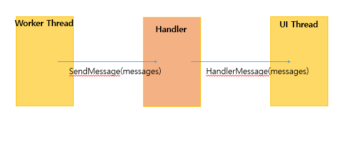


## 안드로이드에서 쓰레드 처리하기

```
1. Handler를 이용
    1) 동시 실행흐름을 처리할 내용을 쓰레드 객체로 구현
    2) UI쓰레드에서 Handler객체를 생성
            onCreate메소드 내부에서 Handler객체를 생성
    3) worker thread에서 Handler객체에게 작업을 의뢰
    4) Handler객체에서worker thread로부터 의뢰받은 내용을 view에 적용
   		 - handleMessage메소드를 이용해서 처리(오버라이딩해서 구현)
        - work thread한테 전달받은 값으로 view를 변경
        - 쓰레드로부터 요청이 올때마다 handleMessage메소드가 호출된다.
```


### `useHandler` 메소드를 구현해보자!

* ```
  작업쓰레드가 핸들러에게 View에 대한 변경을 요청한다.
  핸들러는 작업쓰레드로부터 받은 요청정보를 꺼내서 뷰를 변경한다.
  ```

  일단 worker Thread의 요청을 처리할 Handler를 정의한다. 

  Handler의 하위객체를익명으로 정의하고, 생성한다.

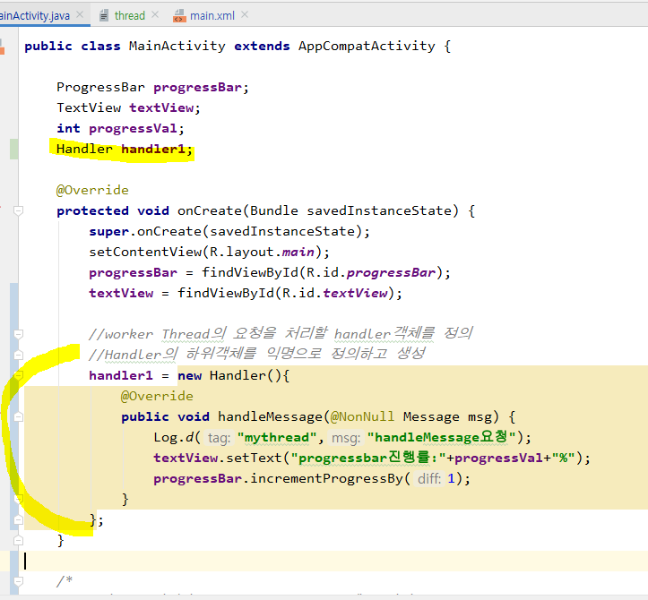

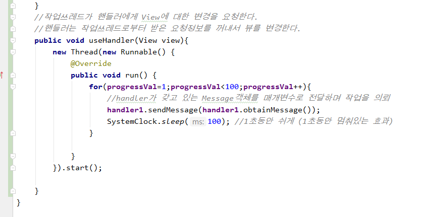

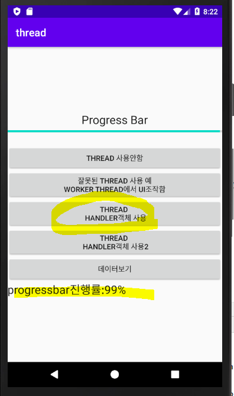

이제 7버전에서도 잘 돌아가게 되었다.


### `useMessageHandle`r 메소드를 구현해보자!


```
핸들러를 이용해서 UI변경을 요청
작업쓰레드에서 값을 핸들러에게 넘긴다.
핸들러에게 작업을 의뢰할 때 Message객체를 생성해서 전달
```

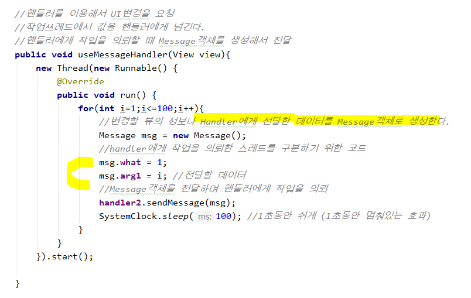

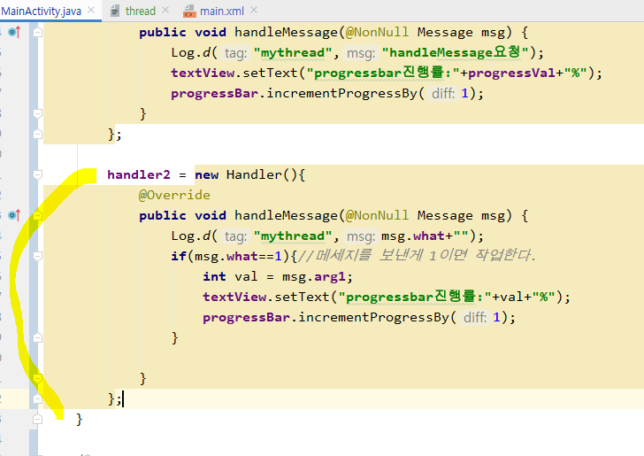

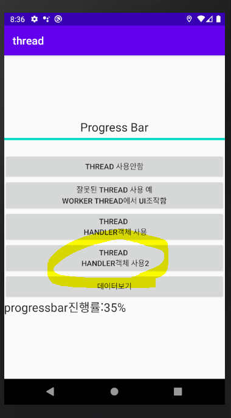


