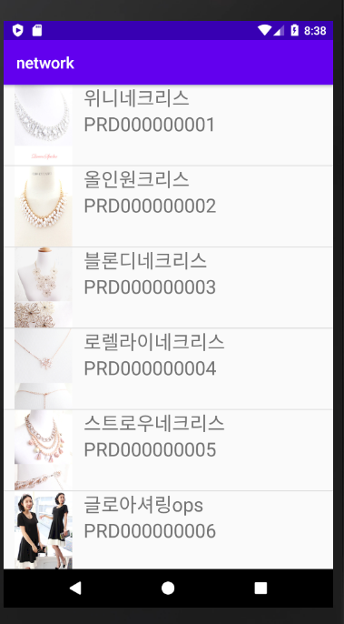

서버구축 시 뷰는 안만들고 컨트롤러랑 디비만 만들면 된다.

웹서버 서블릿으로해도된다. 


json으로 해야하는데

온클릭 메인에 하면 안되고, asynctask로 이용 해야한다.


```xml
<!-- json변환기 -->
		<dependency>
			<groupId>com.fasterxml.jackson.core</groupId>
			<artifactId>jackson-core</artifactId>
			<version>2.4.6</version>
		</dependency>
		<dependency>
			<groupId>com.fasterxml.jackson.core</groupId>
			<artifactId>jackson-databind</artifactId>
			<version>2.4.6</version>
		</dependency>
```


**[출처]** [http통신을 위해 필요한 작업](https://blog.naver.com/heaves1/221932062406)|**작성자** [heaves1](https://blog.naver.com/heaves1)

를 pom.xml에 추가한다.


```java
//일반 메소드 리턴하는 것처럼 List<BoardDTO>를 리턴하면서
		//@ResponseBody로 설정하면 jackson라이브러리가 자동으로 json객체로 변환
		@RequestMapping(value = "/product/show_json",
				method=RequestMethod.GET,
				produces="application/json;charset=utf-8")
		public @ResponseBody List<ProductDTO> categoryboardlist(
														String category) {
			String result = "";
			List<ProductDTO> prdlist = service.productlist(category);
			System.out.println("ajax통신"+prdlist);
			return prdlist;
		}

```

컨트롤러에 추가한다.


http://localhost:8088/bigdataShop/product/show_json


위 링크로 들어가면 이렇게 json형태로 나옴을 알 수 있다.

이렇게 되어야 안드로이드에서 db통산 가능


---

JsonArray 사용


이미지는 


모든 작업은백단에서 사용가능한 어싱크 태스크에서 구현할 것이다.


xml에서

```
android:usesCleartextTraffic="true"
```

http통신으로 들어온 데이터 를 변환


