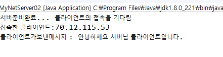
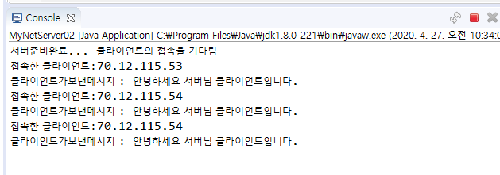

## TCP

통신 : 내보내는거 받는거 연결하는거 이 3가지를 쓰레드로 표현해야 한다.

한 쪽이 서버역할, 클라이언트 역할

* 서버의 역할
  * port를 열어놓고 클라이언트를 받아들이기 위한 대기를 해야한다.
  * 서버 소켓객체를 하나 만든다. 소켓은 통신을 위해 양 끝단에 있는 것
  * 클라이언트역할은 일단 ip를 알아야 하고, 열어놓은 port가 무엇인지 알아야 한다. 

* 서버 먼저 실행

  

  

  * 클라 실행

  

서버는 무한루프로계속 돌려야한다. 각각의 클라이언트의 접속을 독립적으로 유지하고 실행해 줄 수 있어야 한다. accept 할 때 마다 클라이언트 별도의 작업을 쓰레드로 돌려줘야 한다. 

여기 터미널 창 골라서 계속 서버가 실행되고 있는지 확인한다.

---

만약 서버가 데이터를 output시키면, 클라이언트는 데이터를 input해야 하고
클라가 ouput시키면 서버는 input해야 한다.

데이터를 주고받을 수 있는 객체 : 스트림

* server 에서 input, output stream들을 정의한다.
* client도 똑같이 해줘야 한다.

* 다른 클라이언트들도 내 서버에 접근할 수 있다.

---

# Echo

클라이언트가 서버로 보내는 메세지를 다시 클라이언트에게 보낸다.

* 서버

* 클라이언트 코드 

* 클라이언트 실행화면

---

# Echo 2 

: 클라이언트가 특정 문장을 보내면 서버가 정해진 대답을 한다.

* 서버

  

* 클라이언트

----

# 채팅하기

* 서버 

* 클라이언트

  

  

----

## 서버와 클라이언트가 1대1로 채팅을 할 수 있도록 구현하기

* ConsoleChatServer.java : 서버
* ConsoleChatClient.java : 클라이언트

클라이언트와 서버의 input/output을 쓰레드로 구현

ClientSenderThread

ClientReciveThread

ServerSemderThread

ServerReceiveThread