# 멀티채팅

* 클라이언트들이 서버 연결해서 대화 하는 것 구현한다.


요청한 클라이언트의 수 만큼, 서버는 쓰레드를 돌린다.


Server는 클라이언트들끼리 채팅을 가능하게 해야 하는데,

그래서 클라이언트의 정보를 갖고있어야 한다.


서비스가 있으면 (사용자들 여러명)

서비스를 사용하는 모든 클라이언트에게 뭔가를 보낸다.

ex. 카톡 단톡방에 여러명이 있고, 누가 카톡방에 초대 돼 : 모든사람들에게 XXX님이 접속했습니다.

=> 서버는 클라이언트가 입장하는 것도 대기해야 하고, 메세지 대화를 나에게 전달할 수 있으니까 그거에 대한 쓰레드도 있어야 한다. 벌써 쓰레드 2개

클라이언트 대화 중 누가 들어올 수 있음에 대한 대기 => 쓰레드 1

클라이언트들끼리 대화할 때, 서버를 거쳐서 대화가 되므로 그거에 대해 클라이언트가 서버에게 보내는 request 관련 쓰레드(서ㅕ버가 계속 리스닝하면서 누가 대화하나 대기해야 한다. 데이터가 언제 들어올지 모르니, 계속 쓰레드가 돌아야 한다.) => 쓰레드2

누가 뭐를 입력하면 뿌려주는 것에 대한 것 => 쓰레드3


안드로이드는 대화 보내는거 받는거 연결하는거 전부 쓰레드이다.


---

Swing 사용

=> java fx(css, javascript)


## 수행흐름 :

### chat.step01 -> chat.step02 -. chat...... 으로 가면서 문제점을 파악하고 수정해나갈 것이다.

---


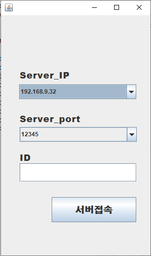

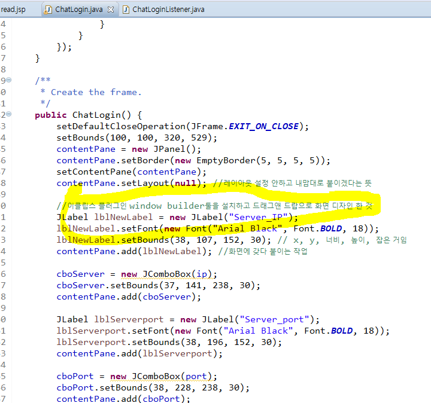

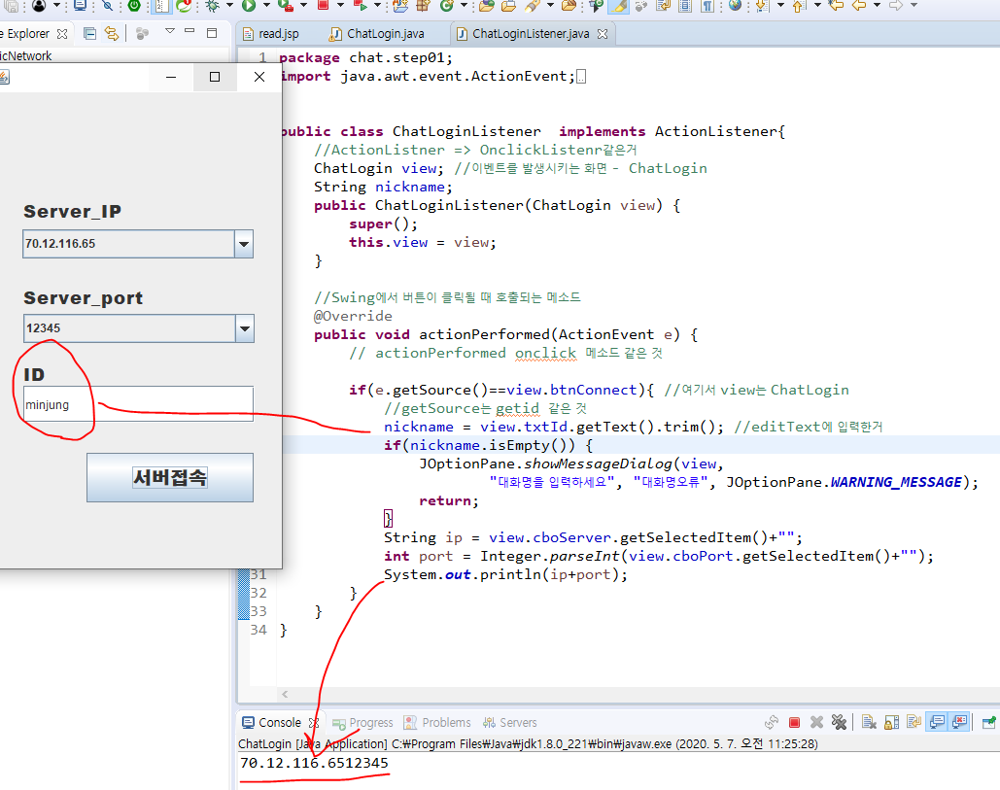


# 수행흐름

## chat.chap01

#### 1. 서버를 실행한다.

   `ChatServerView (ChatServierListener)`
   ----------------------~~> 서버가 여러 가지 상태를 확인할 수 있는 화면 

   * 서버가 먼저 실행되고 리스닝 하고 있어야, 클라이언트가 뭔가를 할 수 있다. 

   * 항상 순서는 서버 먼저 실행

     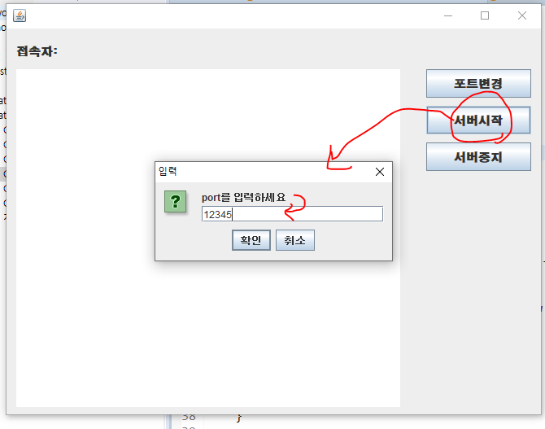

     

#### 2. 클라이언트 접속

   1) ChatLogin (ChatLoginListener) 을 먼저 실행해서 로그인 (ip, port, 채팅nickname)

   2) ClientChatView가 실행
       -------------------~~> 클라이언트가 채팅하는 화면


-----

## chat.step02

* 서버준비 및 문제점을 파악

```
실행하면 프로그램이 멈춘 것처럼 보인다.
버튼이나 GUI가 이벤트처리를 하지 못한다.
accept때문에 계속 대기 상태
	=> 클라이언트의 요청을 받는 부분은 쓰레드 처리를 해야한다. 
```


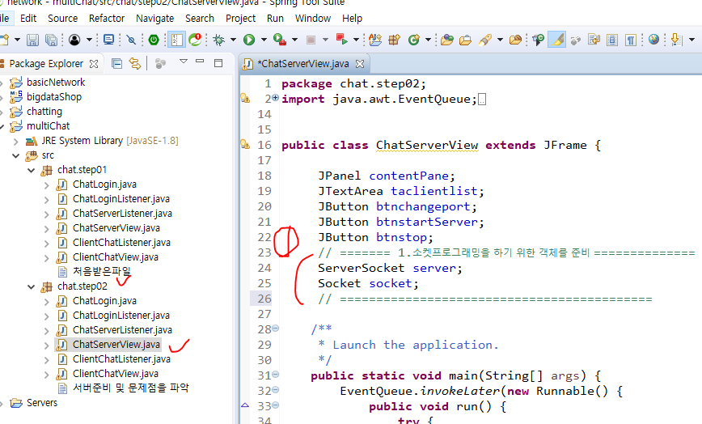


2. 

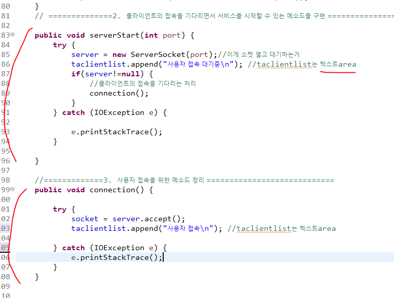

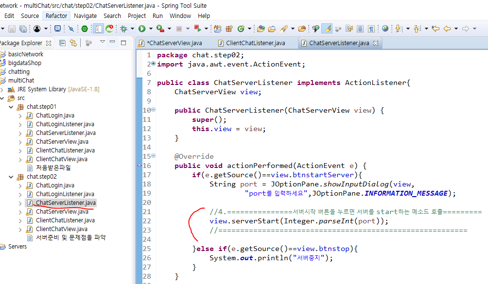


서버시작에서 포트누르고 start했는데 뭔가 이상하다. (멈춤)

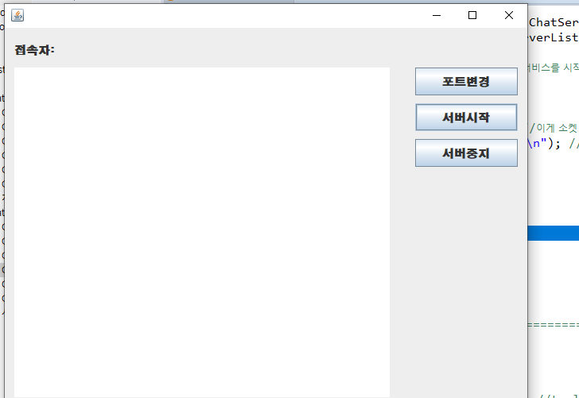

실행하면 프로그램이 멈춘 것처럼 보인다.
버튼이나 GUI가 이벤트처리를 하지 못한다.
accept때문에 계속 대기 상태
	=> 클라이언트의 요청을 받는 부분은 쓰레드 처리를 해야한다. 


이제 chat.step03으로 넘어간다.


## chat.step03

* server의 accept을 Thread로 처리한다.

  

작업 화면은 이벤트가 발생했을 때 이벤트를 처리하기 위해 리스닝 하는 작업 -> 메인쓰레드

accept 하는 작업 => 쓰레드 2번째


4. accept 하는 부분을 thread로 만든다.

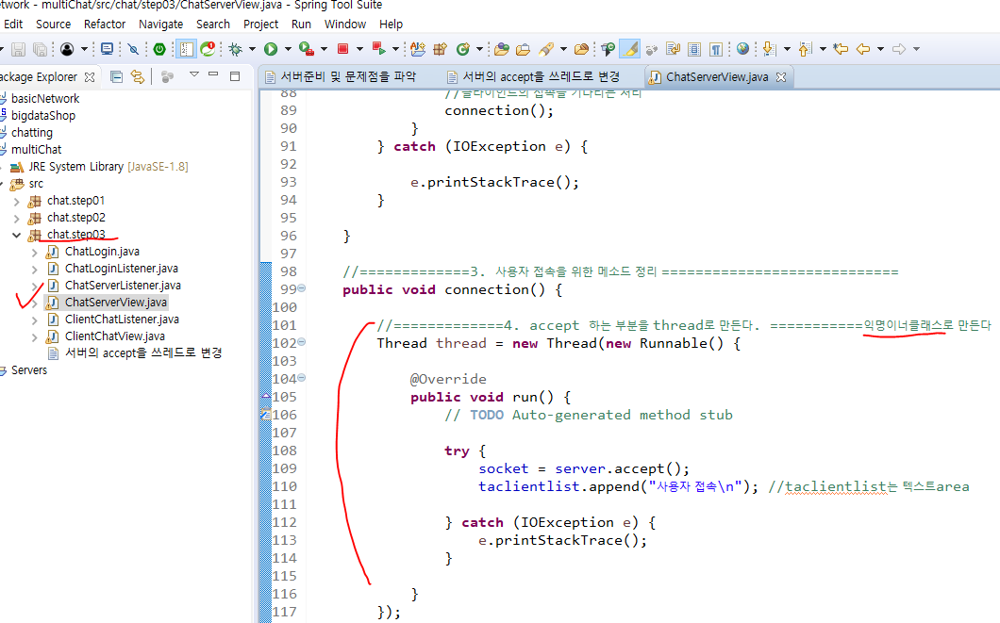

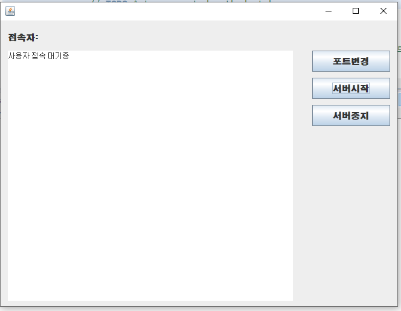

이제 포트번호 입력하고 실행하면, 멈춤현상이 발생하지 않는다. 


chap04 :클라이언트의 접속 처리하기

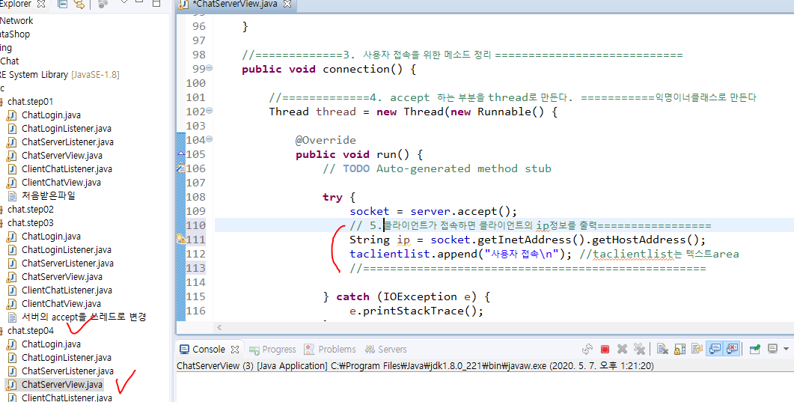

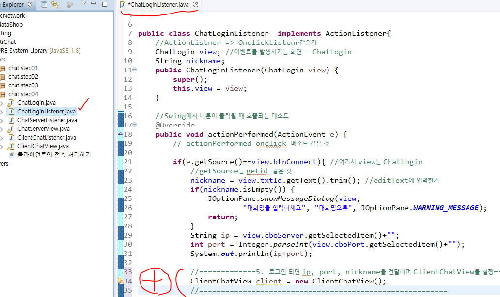


먼저 serverview켜고 ChatLogin 켜보자

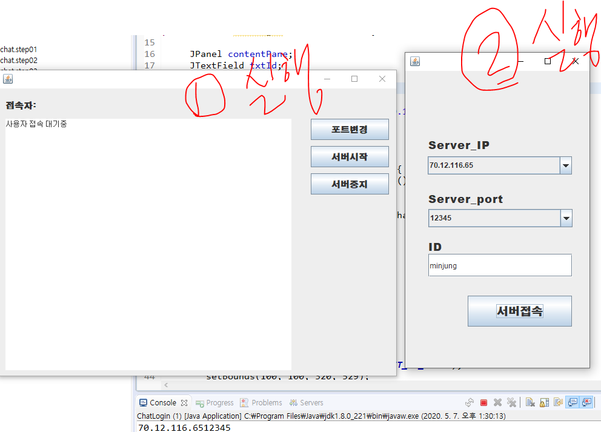

[서버접속] 누르면 반응이 없다. 


## chat.step04

* 클라이언트의 접속을 처리하는 작업

1. 서버접속
2. 클라이언트 접속
	=> 클라이언트 한 개만 접속가능
	=> 클라이언트가 접속하면 서버 창에 클라이언트의 IP를 출력

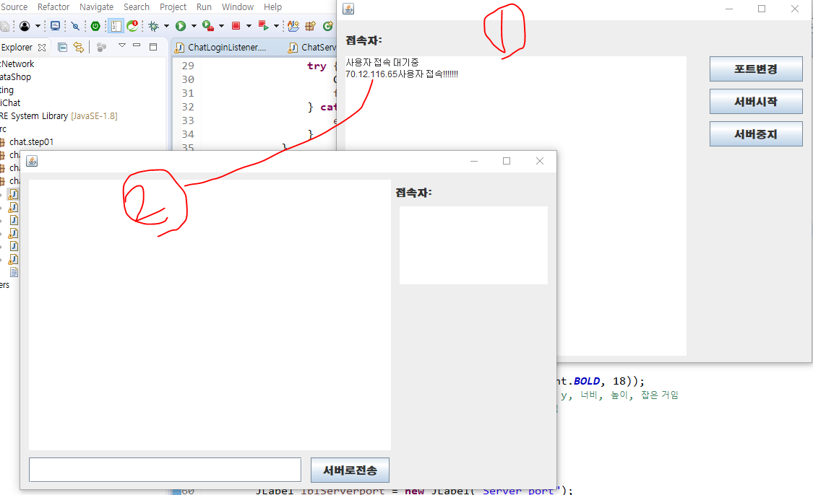


## chat.step05

* 클라이언트가 접속하면 input, output 하는 작업

```
1. 서버접속
2. 클라이언트가 서버에 접속하기
	=> 서버창에는 클라이언트의 ip가 출력
3. 서버와 클라이언트가 메시지를 주고 받을 수 있도록 input/ouput처리
	=> nickname이 출력
	=> 클라이언트창에 서버가 보내는 환영메세지를 출력 
```


* 실행결과

  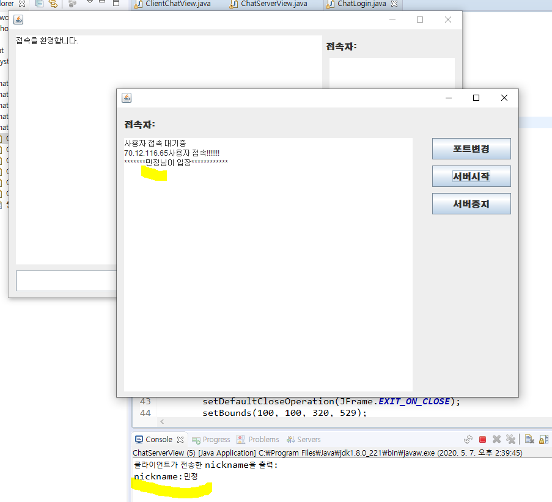


## chat.step06


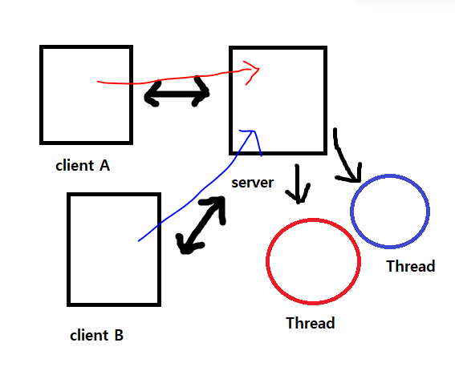

클라이언트가 접속해서 연결을 끊고 나가기 전까지는 계속 실행된다.

http는 내가 접속해서 "안녕"보내면, (서비스를 실행하고나면) 다시 나한테 response되면서 연결이 끝난다.

그래서push 

쓰레드가 계속 돈다는 것 => 계속 클라이언트가 연결되어있다는 뜻 (정보와 실행흐름이 남아있음)

그래서 메세지를 보내면, 다 받을 수 잇는 것이다.

http는 한번 붙어서 실행하면 떨어져 나간다.

TCP는 연결 지향적이기 때문에 한번 연결하면(new socket => 서버소켓과 클라이언트소켓 연결) 내가 끊을 때까지 연결되어 있는 것. 

서버입장에서 봤을 때 클라이언트가 10명이 붙는다면, 서버의 프로세스 안에서 10개의 쓰레드가 만들어진다는 것이다. 각 쓰레드는 독립적인 실행흐름을 갖고 있기 때문에, A가 메세지를 서버로 날렸을 때, A가 보냈다는 것을 구분하고 계속 인지할 수 있다. 


## chat.step08

1. 클라이언트가 이미 접속되어 있는 상태에서 다른 클라이언트가 접속을 하면 기존 사용자에게 알려주는 작업을 처리
   => 먼저 기존의 클라이언트들에게 새로운 클라이언트 접속을 안내하고
   => 새로운 클라이언트에게 기존 클라이언트를 소개
2. 채팅목록에 nickname을 추가 
   

 <<프로토콜>>
 서버와 클라이언트가 통신하기 위해서 메시지를 주고 받아야 한다.
 새로운 입장, 채팅, nickname, 파일전송 
1. 사용자추가 - new/
	new 라는 키워드를 같이 붙여주고, /로 구분할 것이다.