C:\iot\work\bigdatawork\.metadata\.plugins\org.eclipse.wst.server.core\tmp0\logs

경로로 가면


내가 방문한 로그 기록이 남아있다.

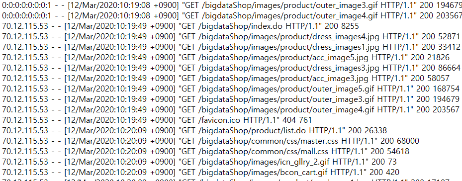

---

### Flume : 데이터 수집을 위한 프로그램

http://flume.apache.org/

웹 서버에서 발생하는데이터를 뽑아서, hdfs에 적재하기 위해서 사용한다.

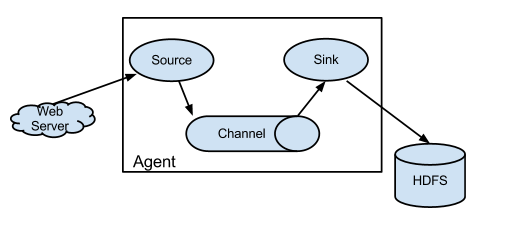

#### source 

* Source객체 : 내가뽑아보고 싶은 데이터의 유형이 여러개 일 수 있는데, 그에따라 다양한 타입이있다.

* Source객체 -> Channel -> Sink 

* 플룸객체인 소스를 채널링해서 싱크에 넣고, 싱크에서 hdfs로 저장됨

#### Sink 

* 결과물을 보관하고 있는객체

* ElasticSearchSink : 기업에서 많이쓴다.

#### channel

* 소스가 수집해온 데이터를 보관하고있다가, sink로내보내기 위한 것


----

### Flume설치 및 설정

### Flume

* 데이터를 추출하기 위해 사용되는 프로그램
* 시스템로그. 웹 서버의 로그, 클릭로그, 보안로그.. 비정형데이터를 HDFS에 적재하기 위해 사용하는프로그램
* 대규모의 로그데이터가 발생하면 효율적으로 수집하고 저장하기 위해 관리
* flume, chukwa, scribe, fluentd, splunk
* 자바로 만들어짐(나중에 설정파일 관련해서 java로 설정)

### [설정 순서]

1. 하둡 1번 머신에서 다운로드(압축풀기)
2. `.bashrc` 에 설정 정보 등록

3. flume-env.sh rename하고 정보등록
   * jdk홈디렉토리
   * hadoop홈디렉토리
4. flume설정파일에 등록
   * flume-conf.properties.tepmlate을 rename해서 XXXX.properties
   * flume agent의 source, channel, sink에 대한 정보를 등록


1. 하둡 1번머신

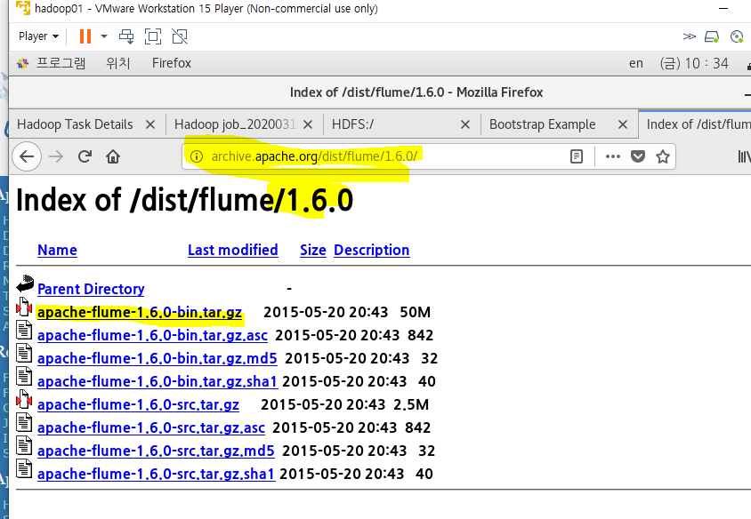


오른쪽버튼 눌러서 링크주소 복사한 뒤 터미널에서 `wget`  명령어로 설치


압축풀기


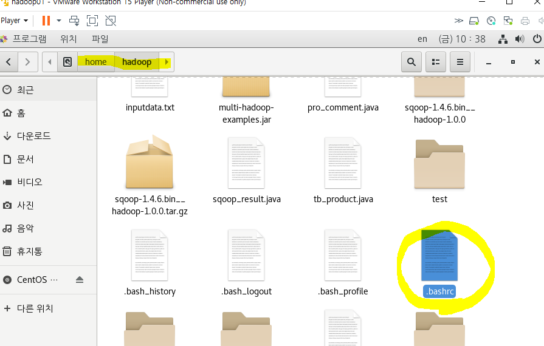


.bashrc 들어가서 플럼의 path추가해준다. export , bin 설정정보 명시


bashrc 가 잘 되어있는지확인


아무런 메세지 나오지않으면 잘 된 것


----

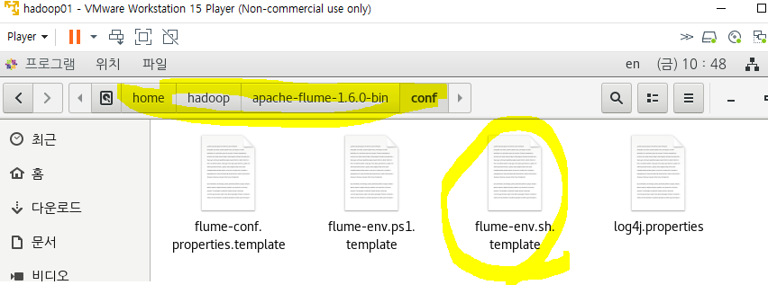

이름뒤에 template가 붙어있으면 설정파일로 인식 못한다.


(참고)cp : 로컬에서 복사할 때

(참고)scp : remote복사할 때


cp해서 새로 같은 파일을 만들고, 이름은 template가 빠진 상태로 만든다. 

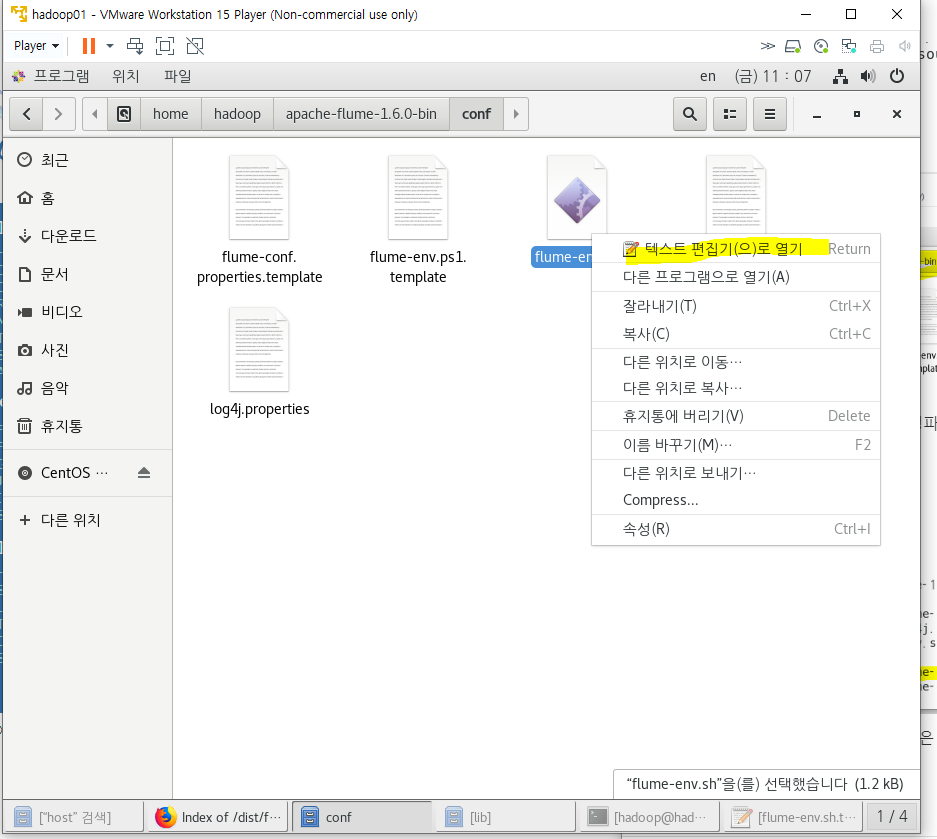


usr : program files 같은 것 

flume_env.sh 에 usr > java > jdk1.8.0_231-amd64 로 export를 적어준다.

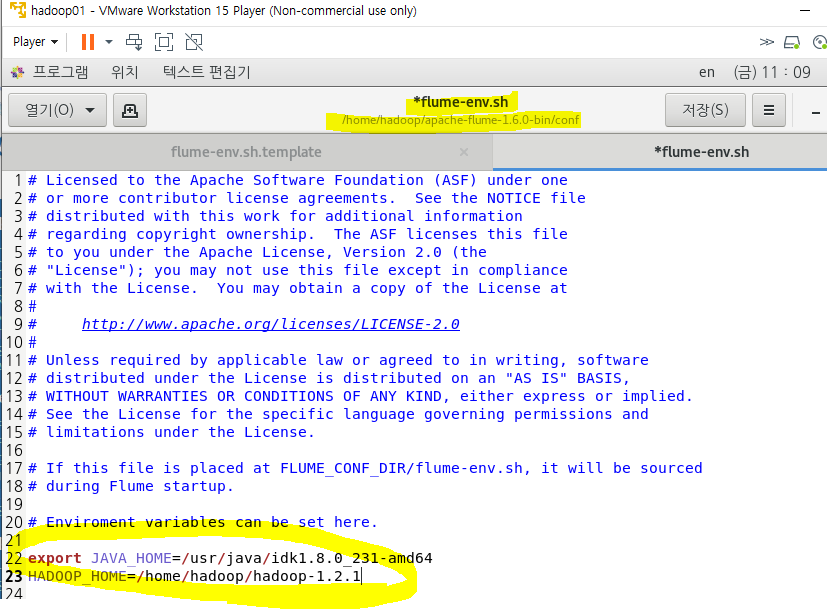


이번엔 flume-conf.properties파일을 rename해서 생성


---

### Flume의 구성요소

agent이름은 마음대로 설정 가능하다. 

flume의 실행중인 프로세스를 agent라 부르며, source, channel, sink로 구성

1. source
   
   * 데이터가 유입되는 방식 지정 (어떤 방식으로 데이터가 유입되는지 type으로 명시)
   
     ```
     agent명.sources.source명.type=값
     ```
   
     1) type
   
     * `netcat` : telnet을 통해서 터미널로 들어오는 입력데이터
                         (bind : 접속IP, port:접속할 port)
     * `spoolDir` : 특정폴더에 저장된 파일
                            (spoolDir:폴더명)
2. channel
   
   * 데이터를 보관하는 곳(source와 sink사이의 Queue)
3. sink
   
   * 데이터를 내보내는 곳(어떤방식으로 내보낼지 정의)
   
     1) type
   
     * `logger` : flume서버 콘솔에 출력이 전달
       flume을 실행할 때 -Dflume.root.logger=INFO,console을 추가
     * `file_roll` : file을 읽어서 가져오는 경우
       (directory:읽어온 파일을 저장할 output폴더를 명시)


### Flume의 실행


```
./bin/flume-ng agent --conf conf --conf-file./conf/console.properties --name myConsole -Dflume.root.logger=INFO,console
		  ~~~~~~~~~~~~~~~~~~~~~~~~~~~~~~~~

```


./bin/flume-ng agent --conf conf --conf-file./conf/console.properties --name myConsole -Dflume.root.logger=INFO,console


새로 만든 console.properties파일의 내용을 전부 지우고 다시 작성한다.

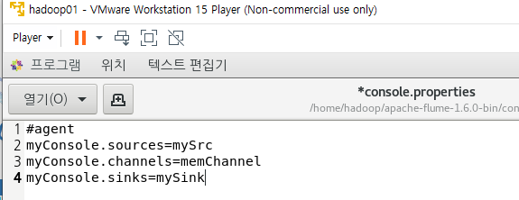


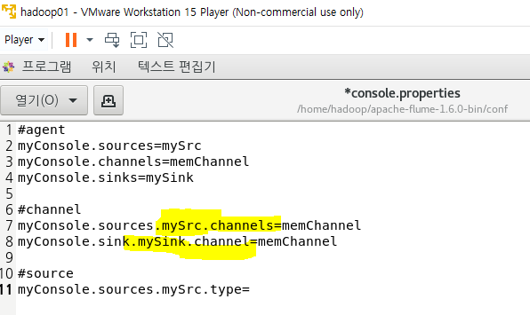

source에대한채널은 s를붙인다. 여러개의 소스들이 들어가기때문에

하지만, sink에 대한 채널은 s를 붙이지 않는다. channel을 통해 하나로 나오기 때문이다.

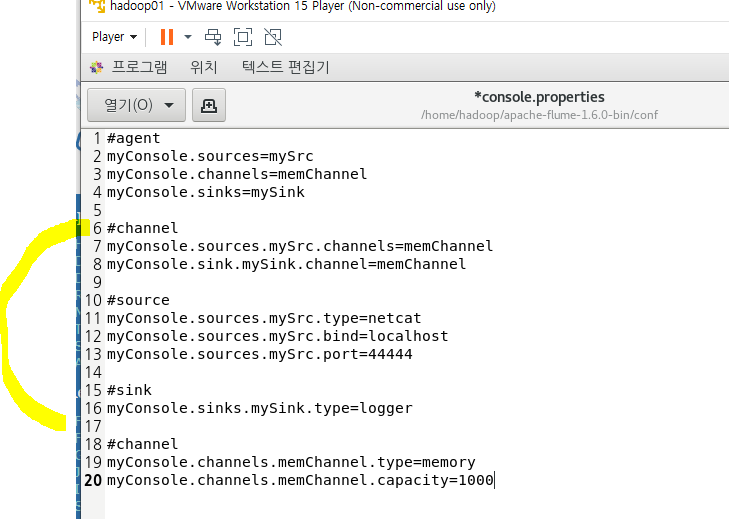

`netcat` : 콘솔로 입력하는것을 받아주는 타입

`bind` : IP

`logger` : 콘솔에 찍을 때 사용 


## Flume의 실행

실행명령어 : `./bin/flume-ng agent`

옵션

* `--conf` : 설정파일이 저장된 폴더명(-c)
* `--conf-file` : 설정파일명(-f)
* `--name` : agent의 이름(-n)
* `-Dflume.root.logger=INFO,console ` : flume의 로그창에 기록


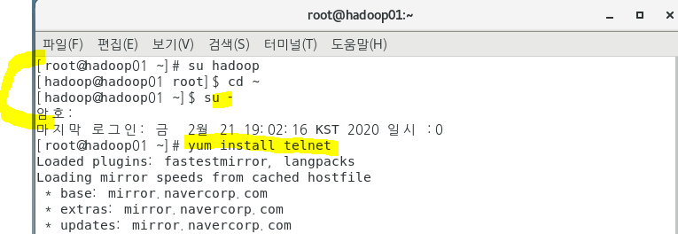

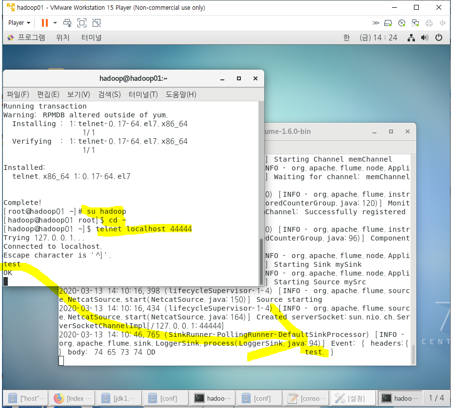


나오고 싶으면,

컨트롤 + 대괄호 키 누른 뒤 , `quit` 입력

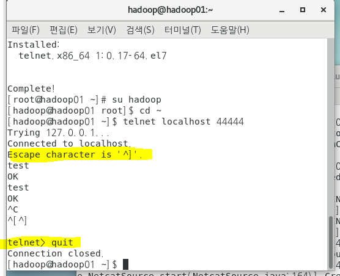

quit으로 빠져나온다. 

---

폴더에서 폴더 (파일에서 파일로) 이동하는 작업


properties파일과 input, output폴더를 만든다.


input이 source

output이 sink

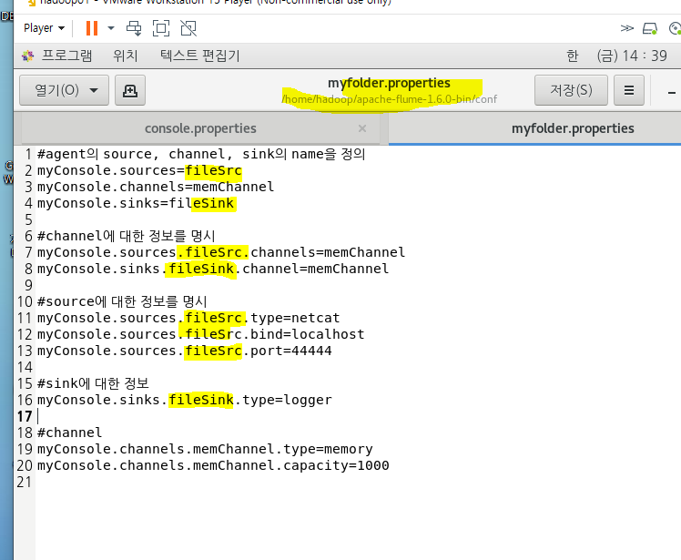


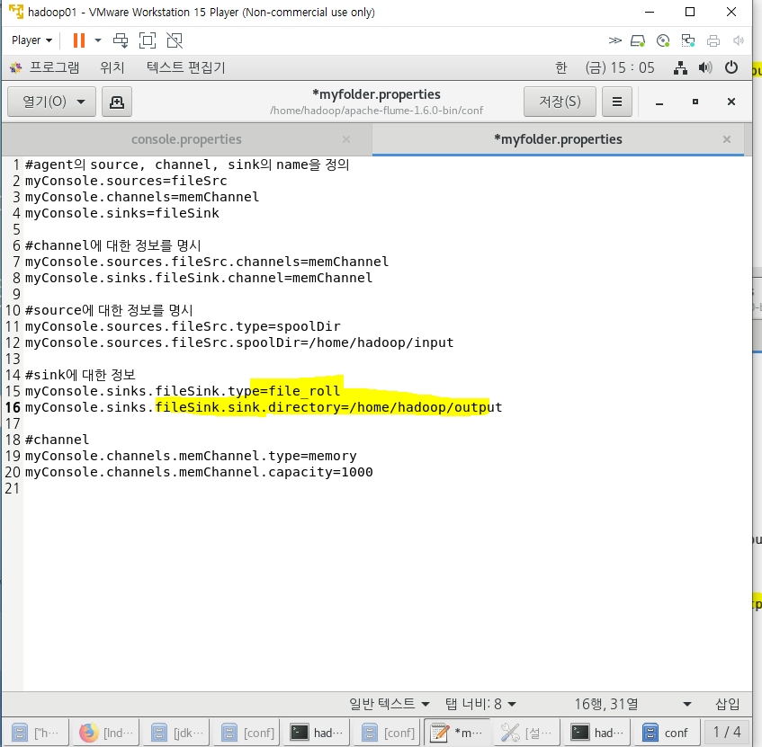


서버가 실행되면서, 만약 input폴더에 임의의 파일을 넣으면 output 경로에 계속 파일이 생긴다. (로그같은거)

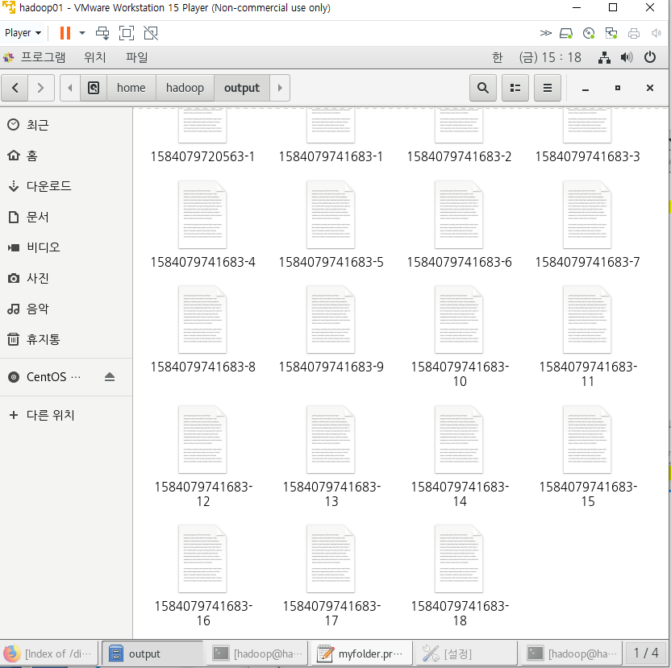


이번엔 설정파일에서 rollInterval 추가

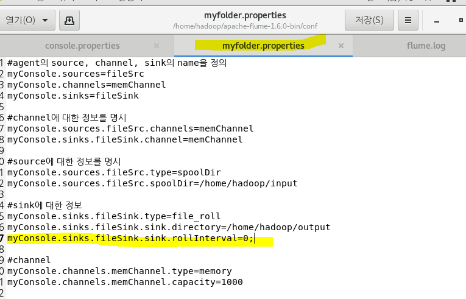


설정파일이 바뀌었기 때문에 컨트롤 c 해서 기존에 실행되고 있던 서버에서 나온다.

home>hadoop > input, output에 있는 모든 파일들을 지우고 다시 실행한다.


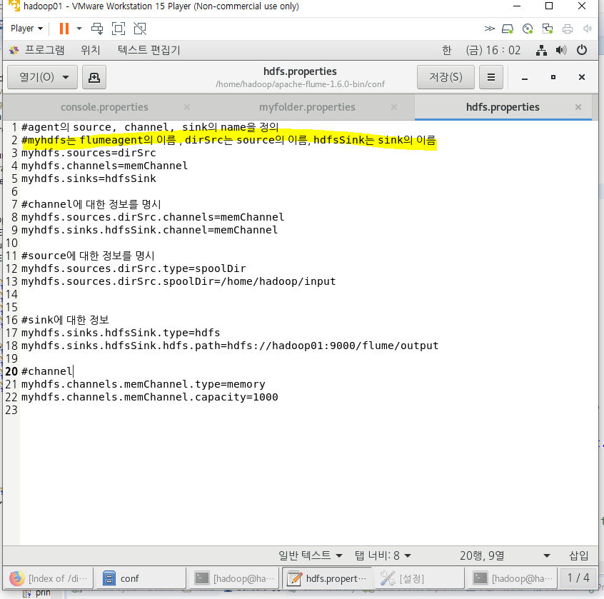


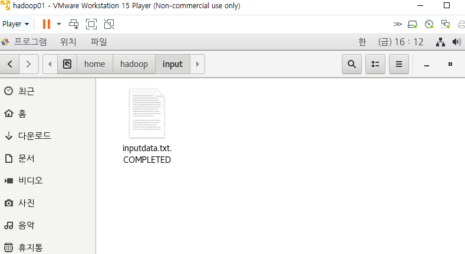

inputdata 복붙해서 넣어준뒤 firefox 

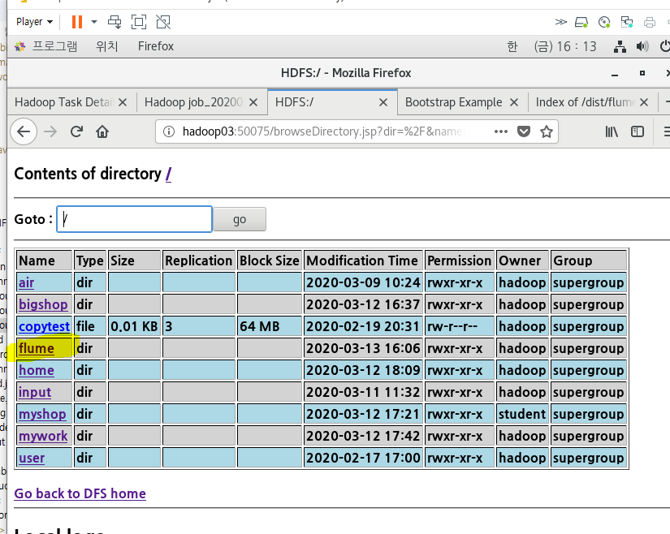

flume 폴더 생김을 확인할 수 있다.

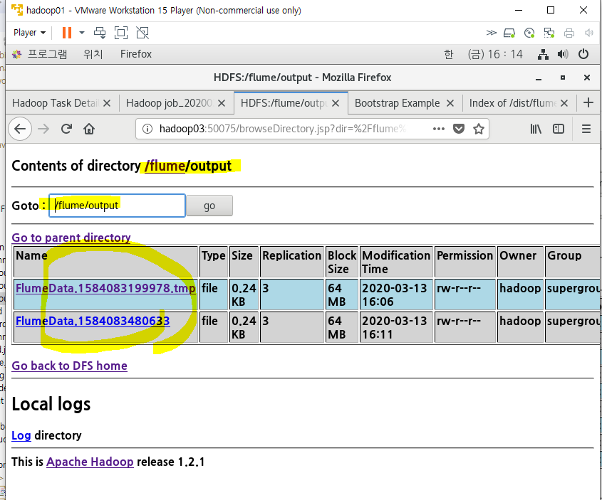


이렇게 파일을 hdfs로 옮길 수 있다.

