하둡

* 빅데이터를 저장, 처리하는 목적

* 저장 : HDFS 사용 (하둡이 갖고있는 분산 파일 시스템.)

hadoop fs -mkdir /input이런 식으로 명령어를 내리면, 직접적으로 들어가서 확인할 수 없다.
hadoop01:50070을 통해 작업을 확인할 수 있다.

namenode = 마스터PC(마스터서버)

* 요청받은 파일을 64mb단위로 쪼갠 뒤, 해당 파일의 복제본을 만들어서 전체 데이터 단위에 블럭단위로 저장시킨다.어느 블럭이 어느 머신, 어느 위치에 있는지 알아야 한다. 
* 따라서 namenode는 어느 블럭에 대한 위치정보, 머신위치 등을 알고 있다.
* 블럭들이 namenode한테 hearbeat : 1분에 한번씩 bit를 보낸다.  그래서 namenode는 블럭이 잘 있음을 체크할 수 있다. 만약 heartbeat가 오지 않으면, 문제가 생긴 블럭과 node를 파악해서 복구시킬 수 있다. (namenode가 해당 블럭에 대한 정보를 갖고 있으니, 다른 복제본으로부터 복제해서 복구할 수 있다.)
* 왜 64mb단위로 블럭을 만드는가? 64mb는 default고 128mb로 많이 한다. 이렇게 크게 작업하는 이유는, 블럭 사이즈가 크면 클수록 metadata의 용량이 작아지기 때문.
* 블럭들을 조합해서 파일로 만들어주는 작업을 해야하는데, namenode(마스터PC)에 문제가 생기면 안되기 때문에 secondary namenode를 만들어놓는다. 이때 secondary namenode는 다른 서버에 존재해야한다. secondary namenode는 주기적으로 namenode(마스터PC)한테 checkpoint를 요청하고, namenode(마스터)는 작업이 끝날때마다 secondary namenode에게 전달해준다. 
* 빅데이터를 처리하기 위한  대부분의 프로그램은 hadoop과 연계할 수 있다.


---

## 실습


가상머신이 있는경로에서 hadoop04를 복사해서 붙여넣어 복사본을 만든다.
(이 때 반드시 hdfs가 모두 stop된 상태여야 하며, hadoop04의 power가 off된 상태어야 한다.)

```xml
/home/hadoop/hadoop-1.2.1/bin/stop-all.sh
```


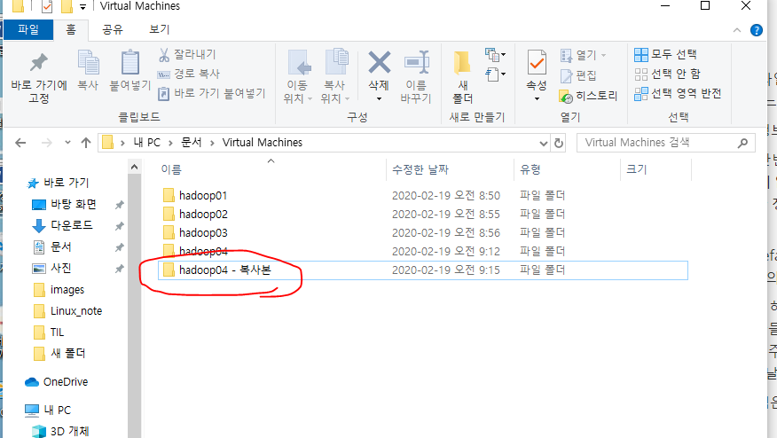

복사한 폴더 이름을 exam으로 변경한다. 

프로그램> 시스템도구 > 설정 > 전원 > 빈화면 > 안함

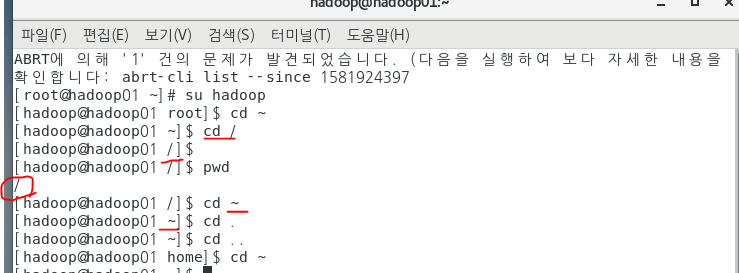

관리자계정은 `#` 이 붙고, 일반 계정에는 `$` 가 붙는다.

* `cd ~ ` : 홈디렉토리로 이동
  * (홈디렉토리 : 모든 계정이 사용하는 기본 폴더. 로그인하고 보여지는 폴더. 이 안에 각각의 유저들마다 사용할 수 있는 설정파일들이 숨김처리 되어있다.) 
* `cd / ` : 루트디렉토리로 이동한다. 
* `pwd` : 현재 작업중인 폴더를 알려주는 명령어 (print working directory)
* `cd .` : 현재디렉토리로 이동
* `cd ..` : 상위 디렉토리로 이동

명령어를 실행하려면, 그 명령어가 있는 경로를 명시해주거나 그 경로에서 실행해야 한다.  

su hadoop으로 하지만, 루트의 권한으로 실행한다.

명령어는  bin 폴더에 있다. => 전부 쉘 스크립트 파일 
즉. 명령어를 실행할 때 bin폴더에 있는 쉘스크립트 파일을 통해 명령어를 실행해 주는 것!

프롬프트 상태 = 쉘

---

하둡이 설치된 폴더로 들어감
pwd를 통해 현재 작업 폴더를 확인


파일 목록들을 확인

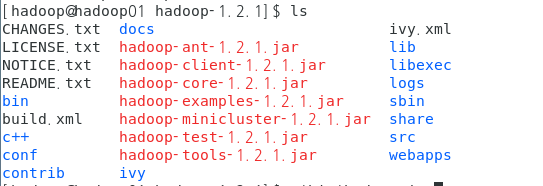


현재 디렉토리 밑에있는 bin폴더의 하둡 스크립트쉘의 jar명령어 사용
(tab을 통해서 자동완성이 잘 되면, 잘 들어가고 있는 것!)

```xml
[hadoop@hadoop01 hadoop-1.2.1]$ ./bin/hadoop jar hadoop-example-1.2.1 jar 
```


jar파일에 있는 클래스명까지 적어준다.(여기서 클래스명은 패키지를 포함하고 있는 클래스명) 명령행 매개변수가 필요하다면 띄어쓰기해서 적어준다. 

wordcount 의 경우, input경로 , output 경로를 적어줘야 한다.

클래스 마다 스펙이 다르므로 명령행 매개변수가 없을 때는 적지 말아야 한다.

(잠깐)파이어폭스 > hadoop01:50070을 통해 admin페이지로 경로 확인해보기
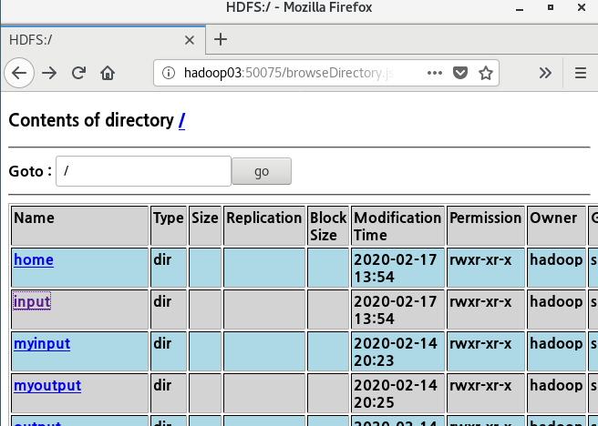

여기 있는 input폴더의 README.txt를 이용할 것이므로


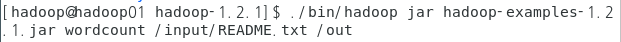

처럼 적어준다.

```xml
[hadoop@hadoop01 hadoop-1.2.1]$ ./bin/hadoop jar hadoop-example-1.2.1 jar wordcount /input/README.txt /out

//여기서 ./bin/hadoop 은 bin폴더 아래의 hadoop 쉘 스크립트 파일
// jar 는 명령어
// hadoop-example-1.2.1.jar에 들어있는 wordcount클래스 실행
// 명령행매개변수 1 :   /input/README.txt 
// 명령행매개변수 2 :   /out
```


실행 시 map, reduce퍼센트를 보면서 작업이 완료되고있음을 확인한다.

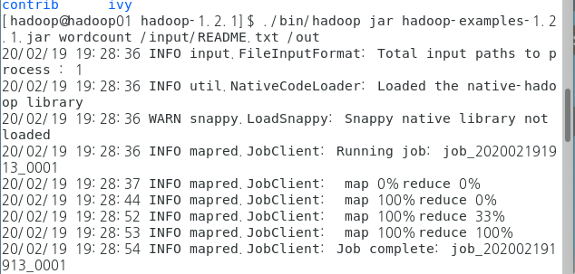


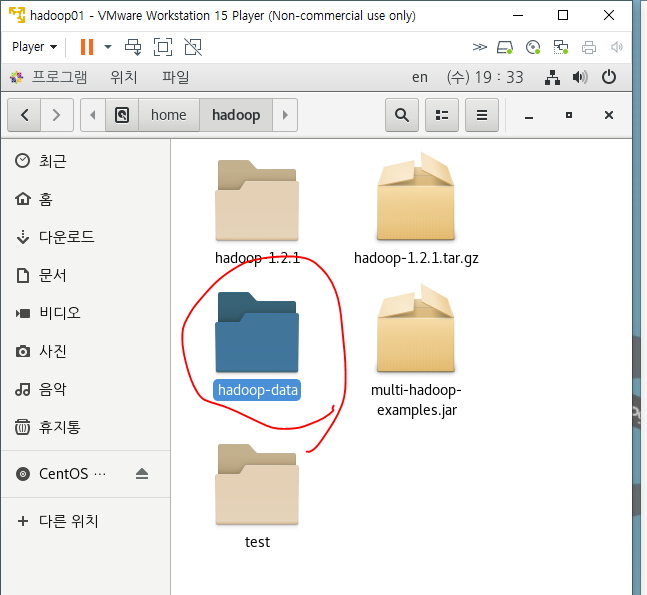

여기에 저장되도록 전에 설정해놓았다. 

dfs폴더 > name 폴더 > image : hdfs라는 파일시스템에서 사용하고 있는 이미지를 저장하기 위한 폴더

---

2번머신 > 내폴더 > 다른위치 > 컴퓨터 > home > hadoop > hadoop-data > 여기도 dfs, mapred있고 dfs > data

data : 데이터노드에서 저장하고있는 데이터블럭들의 정보

namesecondary > current, image있는데 두 폴더 전부 머신1에서 봤던 것처럼 똑같은 데이터파일이 있다. 체크포인트를 통해서 머신1의 정보들이 기록된다. 

data > current 가보면 블럭이 메타데이터와 함께 저장되어 있다.

mapred 는 map, reduce 처리하면서 발생하는 파일들을 저장하는 경로

===> hadoop-data 는 hdfs에서 관리, 저장되는 데이터들이 있는 곳이다.

---

잘 실행이 안될 때 :

1)hadoop-data 의 tmp 디렉토리를 머신4대 전부 날린다. (hdfs를 클리어. 디스크 포맷과 같다.)
2) namenode 초기화 

---

sts


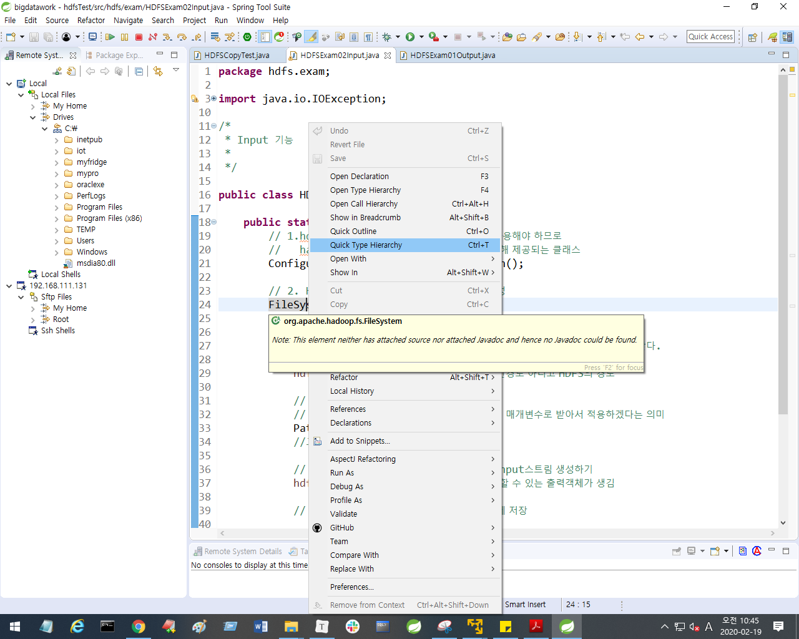

FileSystem 텍스트 눌러서 오른쪽버튼 > Quick Type Hierachy 하면

클래스의계층구조를 볼 수 있다.


Filesystem

* hdfs랑 연결해서 작업해주는 클래스
* outputstream, inputstream 기능을 사용할 때 hdfs의 정보를 넘겨줘야 하기 때문에 new해서 새로운 객체를 만들지 않고, create해서 기존에있던 내가 작업할 곳의 정보를 넘겨주고 있다.

---

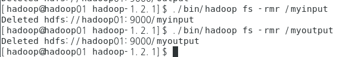

```xml
hadoop fs -rmr /지울경로 
```

명령어를 통해 폴더나 파일을 지울 수 있다. 

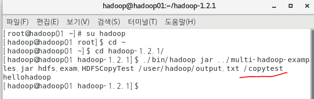

/copytest로 해서 폴더(디렉토리)로 만들어 질 것 같지만 실제로는 파일로 만들어진다. 

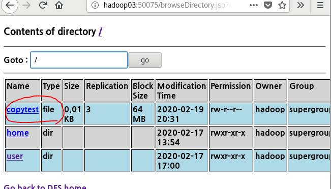


---


