서버에서 모듈을 다운받아 사용하는 방식


패키지 설치

설치는 한 번만 하면 된다.

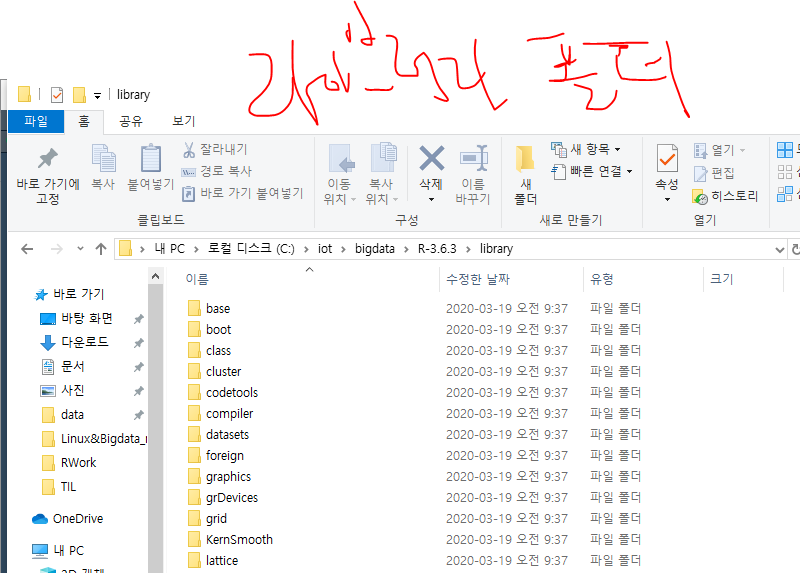

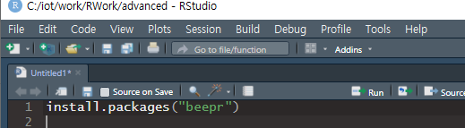

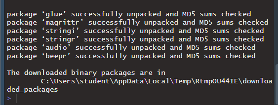

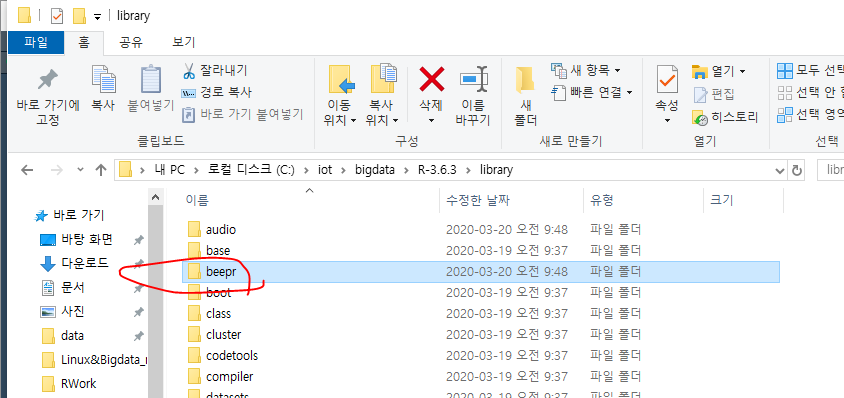

라이브러리 설치 후 import 해줘야한다.


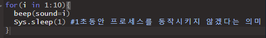

실행해서 라이브러리 동작을 확인해 보았다.

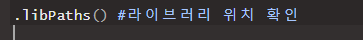

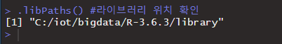


---

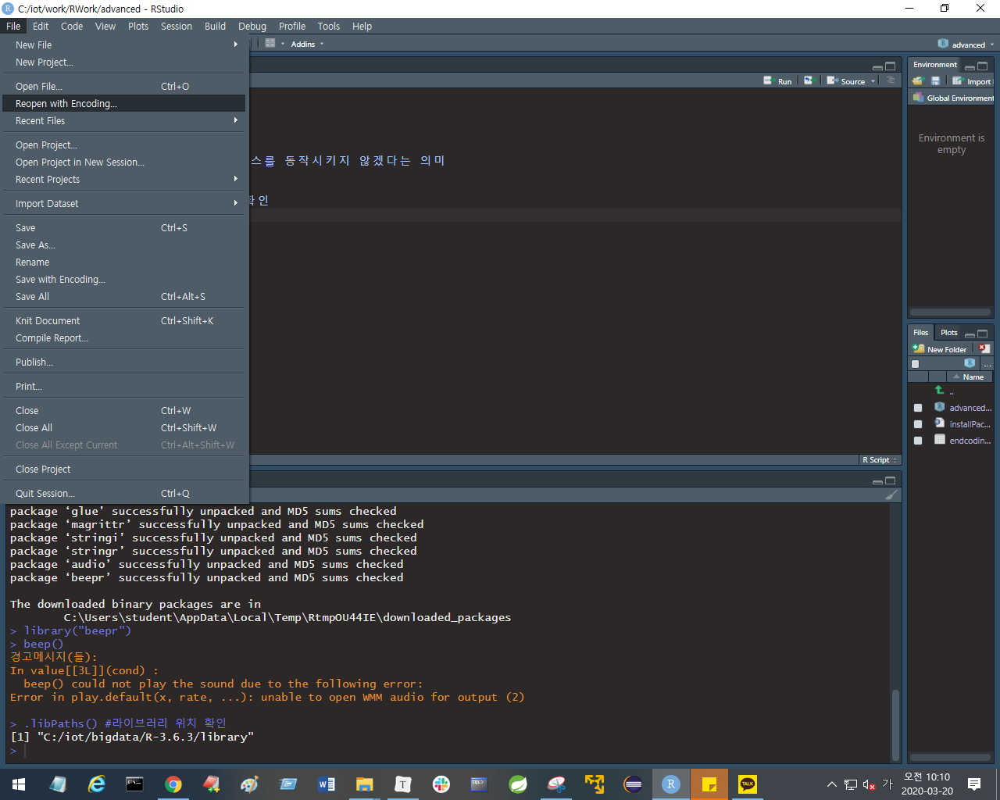

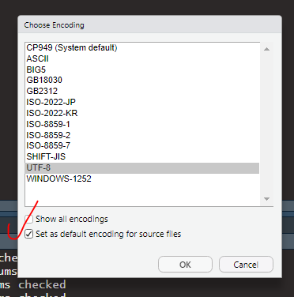


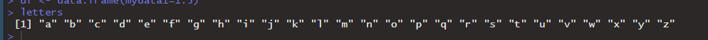


### 책갈피

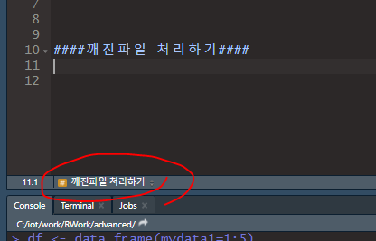

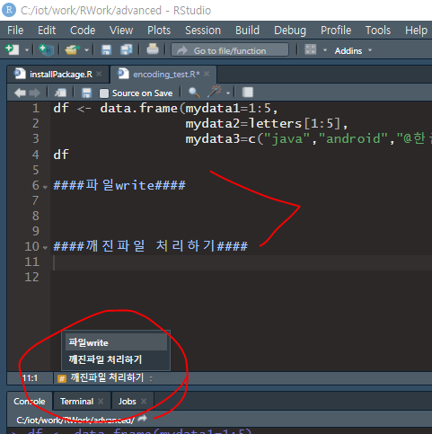


작업별로 주석을 달아놓으면, 책갈피 기능을사용할 수 있다.


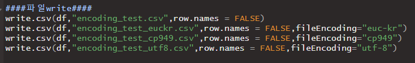


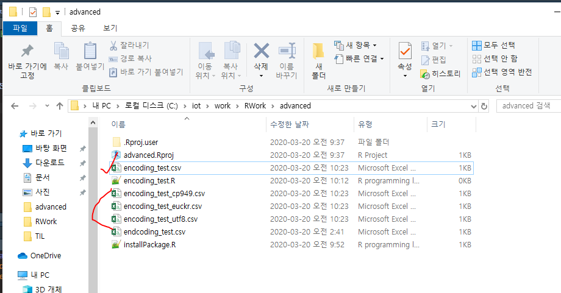


utf-8에서 한글이 깨져서 들어온다.


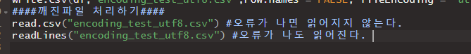

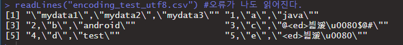


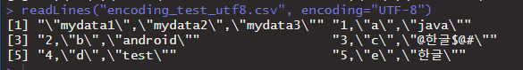


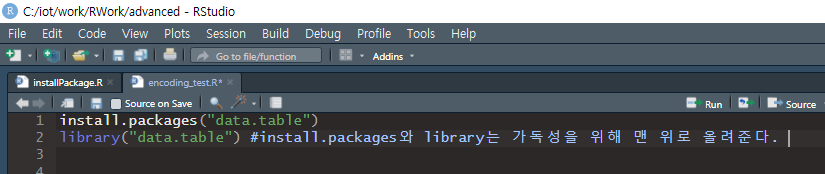

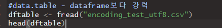

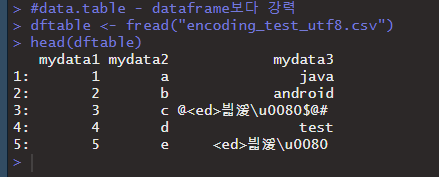


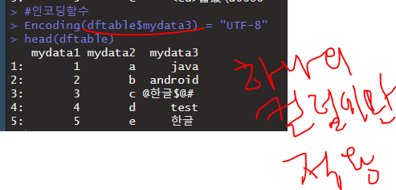


fread는 datatable에서 지원되는 function


## ggplot2

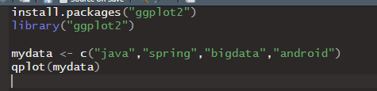

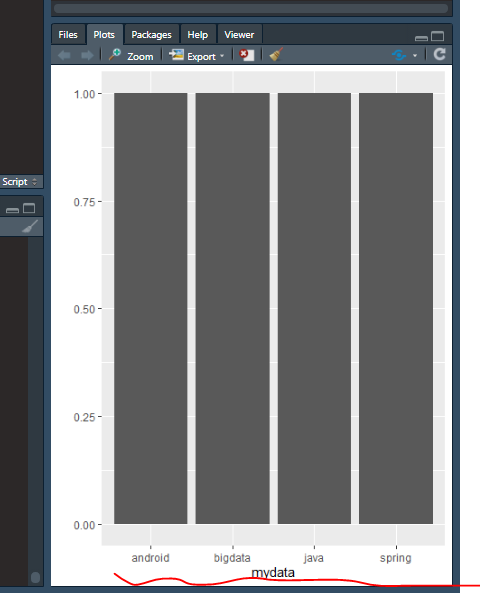

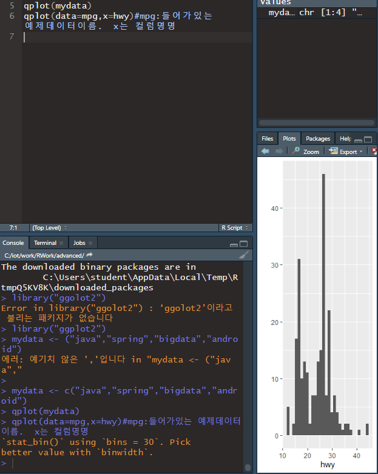


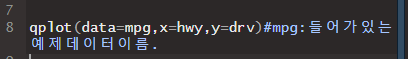

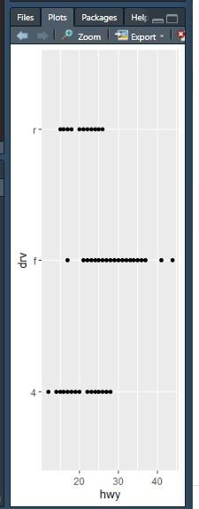


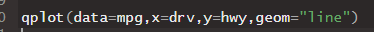

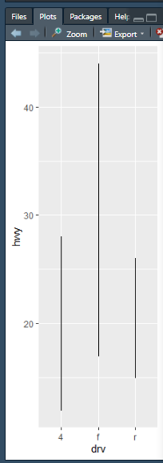


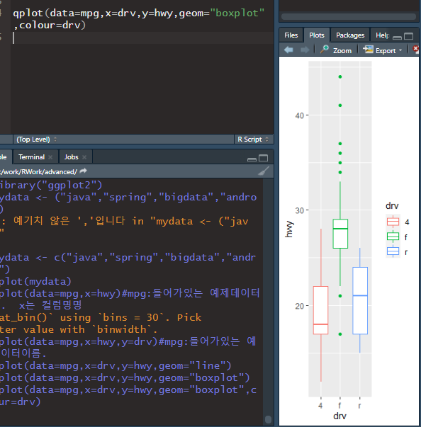


## 파일 읽ㄱ

* `readLines(파일명,조건)`

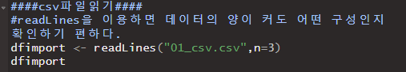


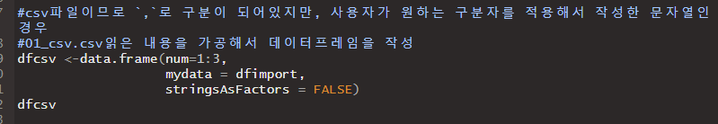

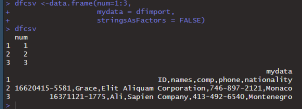

mydata는 위에서 세 줄 읽은것(dfimport)을 데이터 프레임을 만들면서 하나의 컬럼(mydata)에 넣은 것

csv파일이 한 컬럼에 컴마로 들어가있는 상황 (데이터 정제하기),=>`, ` 구분하여쪼개서

 `,`로 분리는 되지만, list도 결과가 리턴되어 불편 => `splitstackshape`로 해결

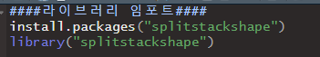

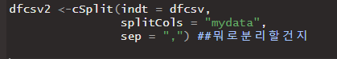

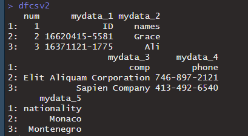

* `splitstackshape` 의 `cSplit` 기능을 이용한다. 

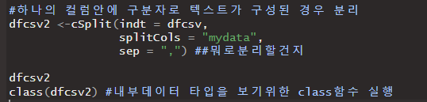

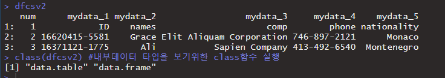

cSplit 한 결과가 출력됨.

But, 데이터 타입이 data.table, data,frame 두 개로 되어있으므로 하나로 만들어줘야 한다. 

* as

  ```
  as.목표데이터타입(변수명)
  ```

  

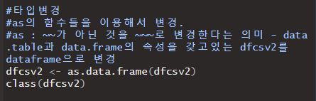

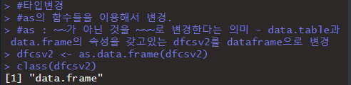

class()로 확인 시, data.frame 타입만 출력됨을 확인할 수 있다.


---

이번엔 dfcsv2 컬럼의 타입을 확인해보자.

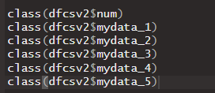

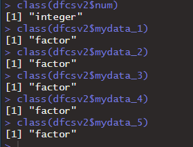

전부 factor 라는 타입으로 나온다. 문자열이면 chracter가 나와야 하는데, factor라고 뜨고있다.


* Factor타입 : 순서와 명목형

  * 순서 : 1,2,3,....의 값이 어떤 순서를 의미하는 경우: 컬럼의 데이터가 순서형
  * class컬럼 1,2,3,4...의 경우 : 순서를 의미하지 않고, 구분하기 위한 것. 의미가 있는 값이 아님.

  따라서 순서가 적용되도록 정의된 Factor타입을 일반 char로 변경해주는 작업을 진행

  * `ncol` : 컬럼의 갯수를 세어주는 기능. for문에서 유용


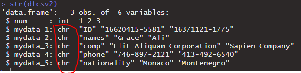

변경됨을 확인했다.


----


## tsv 파일읽기 : tab으로 구분된 파일

* `read.delim` : stringtokenizer와 유사

head로 보는 것은 기본이 6줄이다. 6줄 출력된 것을 확인

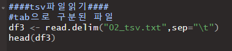

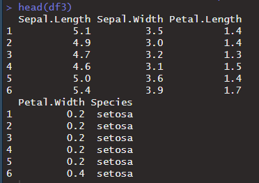


## xml파일 읽기 : 패키지가 있어야 한다. 

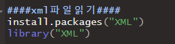

* `xmlTreeParse()`

````R
xmlTreeParse("파일명")
````


xml 태그 말고도 그 뒤에 2번과 같이 정보가 나온다. 이 것을 없애기 위해서는,

루트엘리먼트로 받아오는 것을 제일먼저 해야한다. 

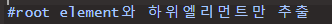

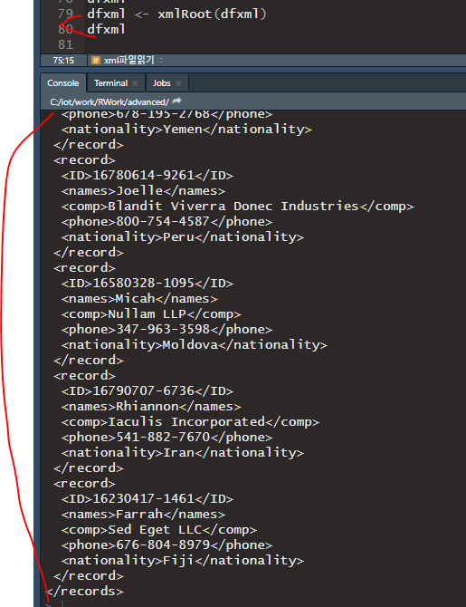

이제 깔끔하게 나온다. 

다음은, xml에 있는 모든 <태그> 의 name과 value를 추출한다.
( xml :  <태그name> value </태그name> 형식)

* R은 `for`와 `if`를 대신할 수 있는 함수들이 있다.
* `Apply`는 for를 대신할 수 있는 기능

```
dfxml <- xmlSApply(dfxml,function(x){
		xmlSApply(x,xmlValue)
})
```

dfxml에 있는 변수가 하나씩 꺼내져서 fuctnion에 들어감.

지정한 모든 데이터에 대해 반복 작업을 진행함.

실행결과 :

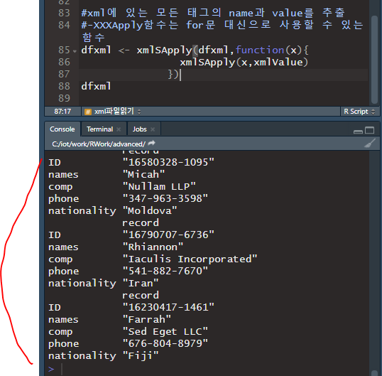


행과 열 방향을 바꿔서 data frame으로 만들기

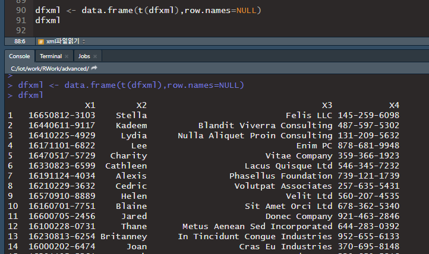


## xlsx 엑셀파일 읽기

라이브러리 설치 후 로딩 ("readxl")

`read_xlsx()` 함수로 파일 읽기

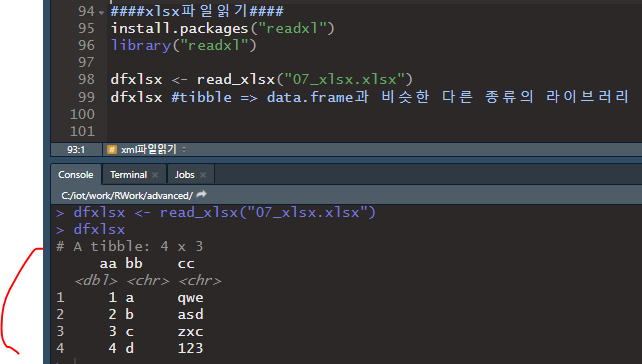


---

## 데이터분석

1. 데이터 가져오기

   * 외부 파일
   * 크롤링
   * DB(오라클, mongodb, hadoop,....)

   R에서 사용할 수 있는 여러 형태의 데이터로 변환.
   변환된 데이터를 액세스

2. 데이터의 정보를 확인 

   * 컬럼갯수, row갯수, 타입, 유형, 실제 저장된 데이터....

3. 

---

* 정의한 갯수만큼 맨 위, 맨 아래부터 가져오기


* 실제 뷰어로 보기


* 행, 열 갯수


* 타입 및 구조 확인


* 컬럼명 변경 : dplyr 라이브러리 사용 - rename(data,새컬럼명==기존컬럼명)


---

## 패키지 삭제


이부분 누르면 패키지 삭제할 수 있다. 


이거누르면 변수 다 삭제할수있따.


## 실습


---

## 랜덤

* `sample()` : 랜덤 값을 만들 때 사용한다.

```R
저장할 변수 <- sample(범위, 속성)
```


```R
a <- sample(1:10, size=3)
```

=> 1부터 10까지 랜덤으로 3개 숫자 저장


```R
b <- sample(1:10, size=5, replace=FALSE)
```

=>  replace = FALSE: 중복된 값을 만들어내지 않는다. 


```R
c <- sample(1:10, size=5, replace=TRUE)
```

=>  replace = TURE : 중복된 데이터를 만들어 낼 수 있다.


하지만 랜덤문장을 실행할 때마다, 값이 변경된다. 

이전에 만든 랜덤 수를 찾아가기 위한 함수는 `seed` 이다.


## 조건문 : ifelse()


### for 


하지만 이 방식을 채택하면, 데이터가 많을 경우 속도가 느려지고 성능이 저하될 수 있다.

따라서 함수를 이용해본다.

```R
ifelse(test=조건, yes=참일때실행할결과, no=거짓일때실행할결과)
```


* 조건이 여러 개 일 경우

```R
ifelse(test=조건, yes=참일때실행할결과, no=ifelse중첩)
```


