## 개요

MongoDB도 빅데이터 분산 처리 및 저장을 할 수 있지만, 효율성으로는 Hadoop의 맵리듀스가 더 우수하다. 

MongoDB에서의 aggregation과 mapreduce 사용


기본 spring core는 Mongodb를 지원하지 않으므로, 별도의 설치가 필요하다.


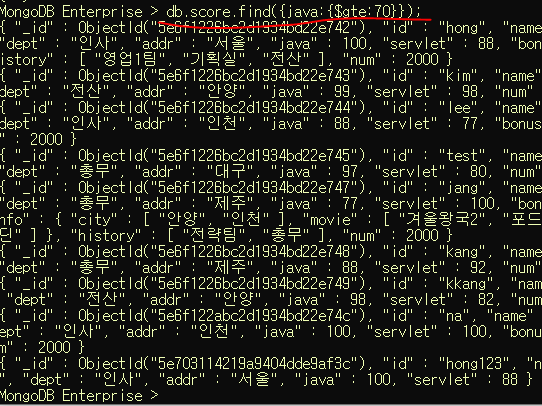

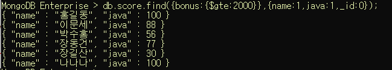

4.

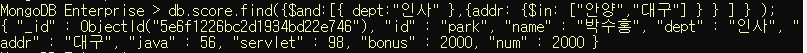


5.


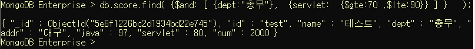


6.

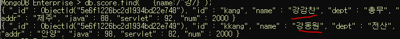


7.

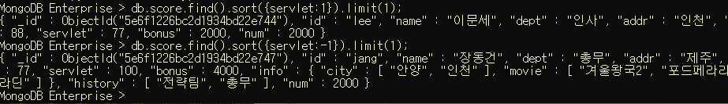


8.

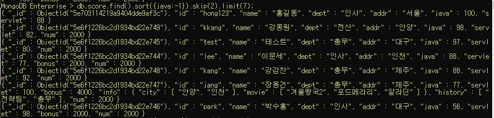


9.

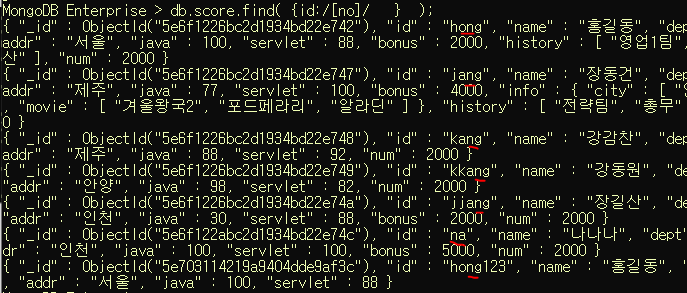


---

## 7. Aggregation

#### 0) 특징

* group by와 동일개념
* 간단한 집계를 구하는 경우, mapreduce를 적용하는 것 보다 간단하게 작업.
* Pipeline을 내부에서 구현.
  한 연산의 결과가 또 다른 연산의 input데이터로 활용
  (그림참고 : http://docs.mongodb.com/v3.6/_images/aggregation-pipeline.bakedsvg.svg )


#### 1) 명령어(RDBMS와 비교)

* `$match` : where절, having절

* `$group` : group by
* `$sort` : order by
* `$avg` : avg그룹함수
* `$sum` : sum그룹함수
* `$max` : max그룹함수


[ 형식 ]

```sql
db.컬렉션명.aggregate(aggregate명령어를 정의)
                    ---------------------
                      ㄴ>여러 가지를 적용해야 하는 경우
                         배열
```


#### [ `$group` 의 형식 ]

```sql
$group:{_id:그룹으로 표시할 필드명, 연산결과를 저장할 필드명:{연산함수:값}}
                                                             ---
 															숫자나 필드참조
```

#### [ `$match` 의 형식 ]

```sql
$match:{필드명:{연산자:조건값}}
              -------------
              비교연산 or 조건이 여러개
```


* ex) addr별 인원수

  ```sql
  db.exam.aggregate( [
      					{$group:{_id:"$addr",
      							 num:{$sum:1}}
  						}
  					] )
  ```

  _id는 반드시 묶어주어야 한다.  그냥"addr"로 하면 문자열 그대로의 addr로 설정되기 때문에
  addr필드의 각 다큐먼트 고유값을 적용하기 위해서는 $를 붙여준다. 
  num은 계산필드// $sum:1 ---> 계속 하나씩 더해진다.)

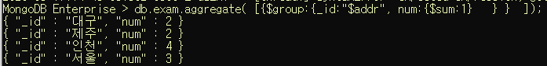


* ex) dept별 인원수

  ```sql
  db.exam.aggregate( [{$group:{_id:"$dept"
                      		, num:{$sum:1} }
                      }])
  ```

  

* ex) dept별 java점수 평균

  ```sql
  db.exam.aggregate( [{$group:{_id:"$dept"
                      		, 평균:{$avg:"$java"} }
                      }])
  ```

* ex)  addr

  ```sql
  db.exam.aggregate( [{$group:{_id:"$addr"
                      		, 서블릿합계:{$sum:"$servlet"} }
                      }])
  ```

* ex) dept별 java점수의 평균. 단, addr이 인천인 데이터만 작업
  match를 추가

  ```sql
  db.exam.aggregate([
      				{$match:{addr:"인천"}},
      				{$group:{_id:"$dept"
      							,평균:{$avg:"$java"} }}
  					])
  ```

  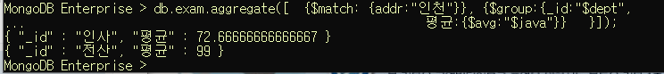


---

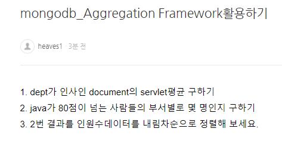

\1. db.exam.aggregate([

{$match:{dept:"인사"}},

{$group:{_id:"$dept" , 평균:{$avg:"$servlet"} }} ])


\2. db.exam.aggregate([

{$match:{java:{$gte:80}}},

{$group:{_id:"$dept" , 인원수:{$sum:1} } } ])

 

\3. db.exam.aggregate([

{$match:{java:{$gte:80}}},

{$group:{_id:"$dept" , 인원수:{$sum:1} } },

{$sort:{인원수:-1}} ])

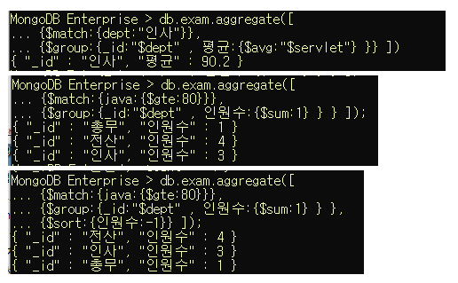

