## MongoDB

[ 개요 ]

* NoSQL(Not Only SQL)

* 데이터를 처리할 때 JSON형태로 처리


[ 사용 목적 ]

* 비정형 데이터 저장 목적
  * schema(규칙)가 없다. 기존에 했던 컬럼에 타입을 정해주는 방식 같은것이 없다.
  * 설문조사 할 때 질문을 등록하는데, 회사마다 질문 갯수가 다르다. 이 개수가 정해져 있지 않아서, MongoDB가 없을 땐 최대의 질문 갯수를 컬럼으로 등록한다. 그래서 회사마다 비어있는 컬럼이 생길 수 있다. 또한 최대의 질문 갯수를 특정지을수도 없다. 이런 부분을 MongoDB는 해결할 수 있다.
  * 파이선, Spring 등 여러 프로그램과 연동하여 output을 저장하는 목적

[ 특징 ]

* Join 을 할 수 없다.
  * 문서기반. 하나의 문서 안에 모든 데이터가 전부 들어가는 형태
* 대소문자를 구분한다.


## 실행

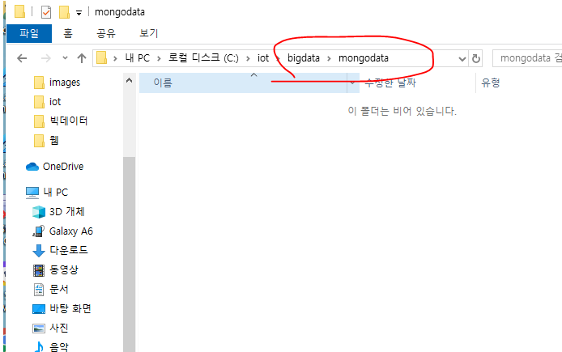


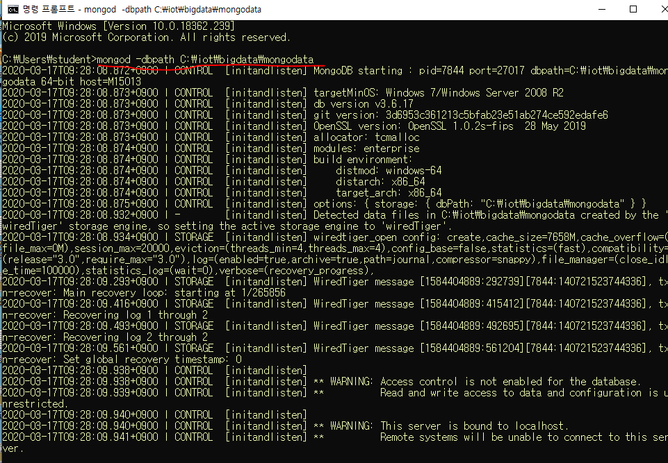


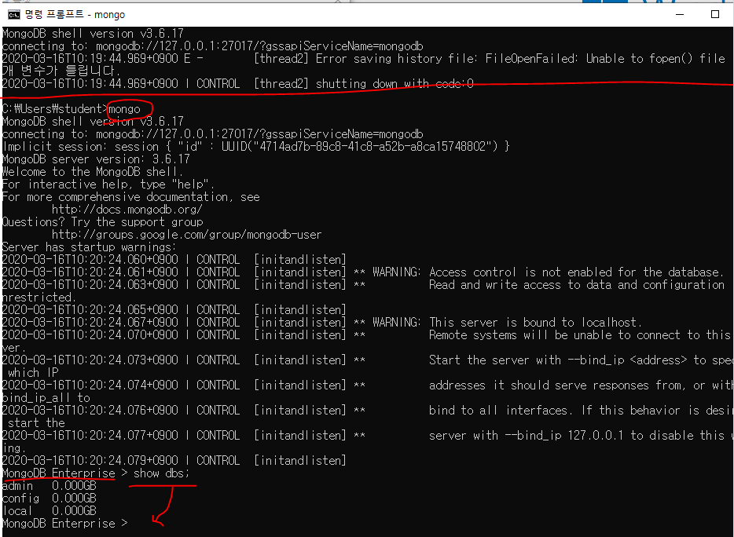


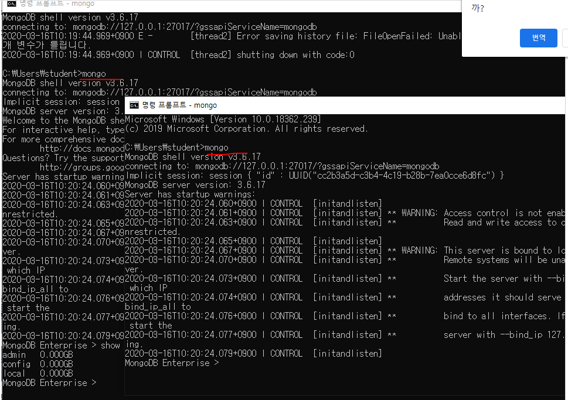

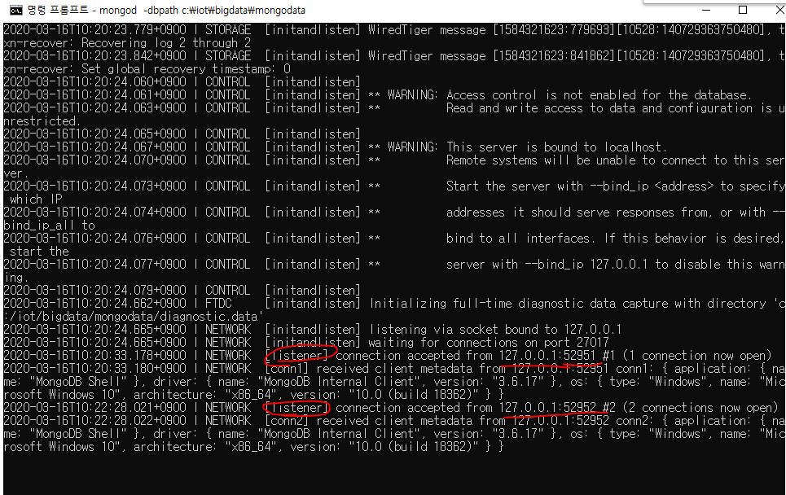

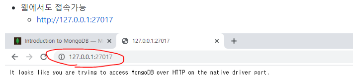


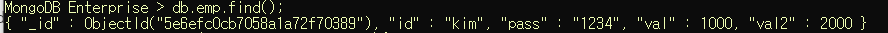

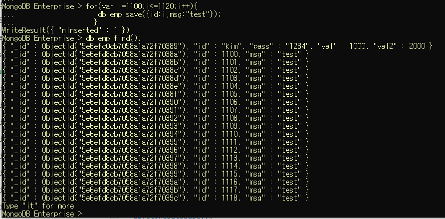


여러개를 한꺼번에 배열로 insert 할 수 있다.


_id는 primary key역할을 한다. 


한글이 포함되면 깨지고 잘 안들어가는 경우가 있다.


## MongoDB 사용하기

[ 기본 용어 ]

* `collection` == 테이블
* `document` == record
* `field` == column
* `_id` == 기본키


[ 사용하기 ]

* `use mydb` : mydb를 사용하겠다. (mydb는 내가 임의로 정해준 이름. database를 쓰겠다는 의미)
  *  oracle에서 계정 접속한 것과 동일하다.(= conn scott/tiger)
* `show dbs;` : 아직 collection이 없어서 admin, config, local이 전부 0GB임
* `db.stats()` : db의 상태 확인하기
* `db.logout()` : 나가는 것. `ok 1 ` 이 출력되면 잘 작동된 것.


### collection 생성

* `validate`를 사용헤 컬렉션의 정보를 볼 수 있다.
* 정보가 출력되어 나오는 것도 Json 형태이다. 

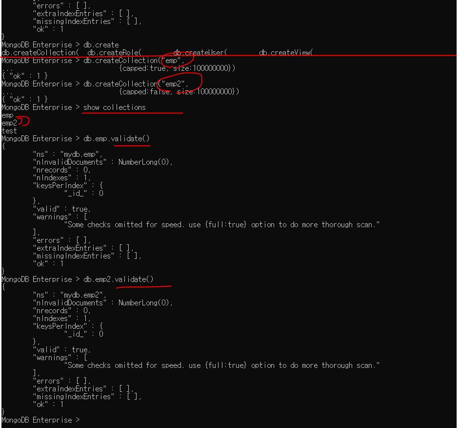


* `isCapped()` 명령어로 capped 컬렉션인지 아닌지 확인 가능 (Capped는 사이즈가 정해진 컬렉션이다.)

  * `true`: capped 컬렉션이다.
  * `false` : capped 컬렉션아니다.

  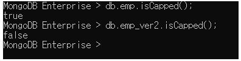


### collection 삭제

* `drop()`

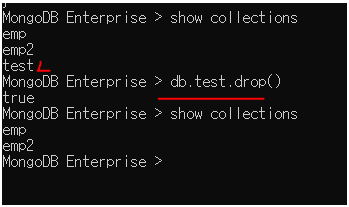


### collection명 변경

* `db.기존컬렉션명.renameCollection("새로운컬렉션명")`

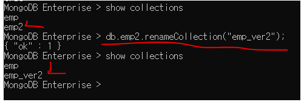


[ 실습 ]

1. mini라는이름의 데이터베이스 생성
2. emp(size:10000, capped컬렉션으로 만들기)
3. shop(일반컬렉션)
4. 데이터베이스 목록, 컬렉션 목록을 캡쳐
5. 컬렉션 validate() 화면 캡쳐

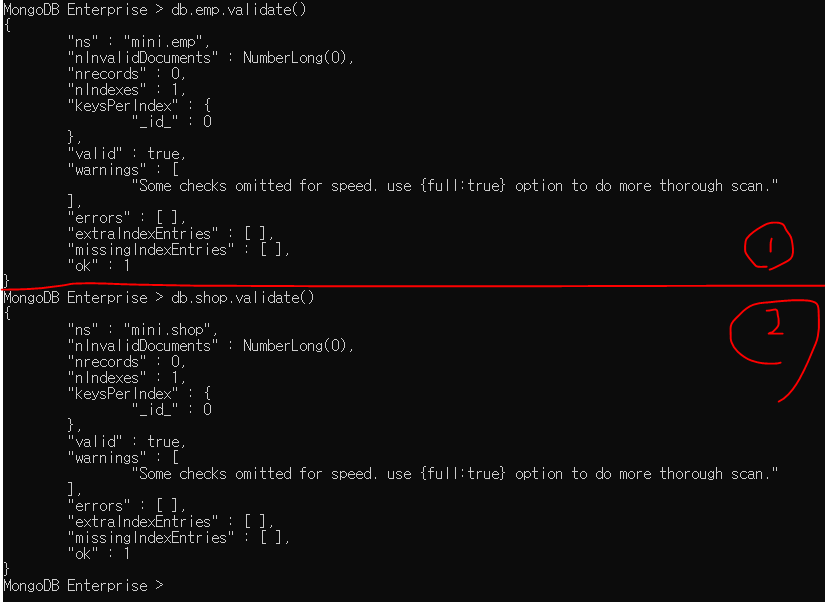


## MongoDB CRUD

### 1. insert

* db.컬렉션명.insert({데이터...})
* db.컬렉션명.insertOne({데이터...}) : 하나 삽입
* db.컬렉션명.insertMany({데이터...}) : 여러 개 삽입

> * document(관계형 db에서 레코드개념)에 대한 정보는 json의 형식(name:value, name:value)
>
> * mongoDB에서 document를 삽입하면 자동으로 `-id` 가 생성됨 : 기본키 역할
>
>   * 확인해 보면 내가 만들지 않은 `-id` 가 생성됨을 확인
>
>   * "_id" : ObjectId("5e6ee73f7cbfd58c3cc1504f")
>     (현재 timestamp + machine ID + mongoDB프로세스id + 순차번호(추가할때마다증가) )
>
> * 스키마가 없음을 확인
>   * insert했을때 처음껀 field가 2개, 지금은 3개
>   * insert성공되고 select하니 컬럼수가 다르지만 괜찮음을 알 수 있다.

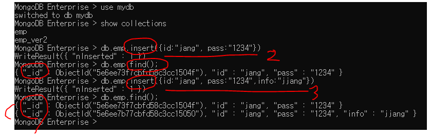


* insert하는 다른 방법, mydata에 변수에 대한 값을 할당한 다음에 save()명령어로 insert

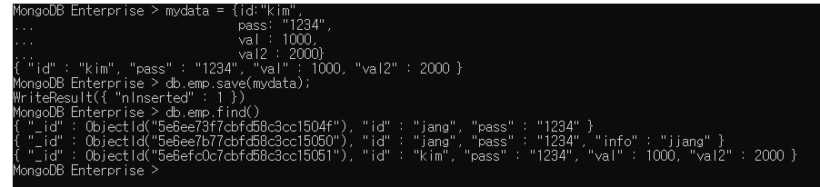


* for문으로 insert하기

  * mongoDB는 자바스크립트라서 for문 사용가능
  * it을 치면 안보였던 데이터들도 다 볼 수 있다.

  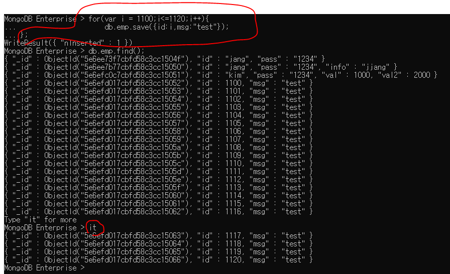


* 배열을 이용해 여러개의 데이터를 insert 가능 (대괄호를 이용한다.)

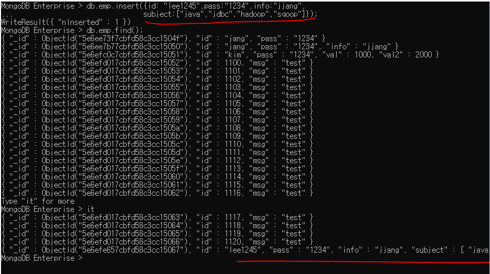


* 이미 있는 id를 insert하려는 경우에는, 에러가 뜬다.

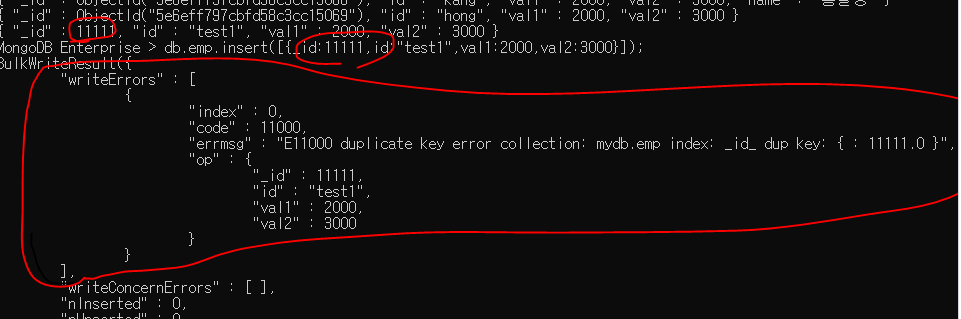


## 3. mongodb에 update

* document수정
* 조건을 적용해서 수정하기 위한 코드도 json으로 구현


#### [update를 위한 명령어]

* `$set` : 해당필드의 값을 변경(업데이트를 하기 위한 명령어)
               none capped collection인 경우, 업데이트할 필드가 없는 경우 추가한다. 


* `$inc` : 해당필드에 저장된 숫자의 값을 증가
* `$unset` : 원하는 필드를 삭제할수 있다.


* 업데이트 옵션 : 

​	multi = > true를 추가하지 않으면 조건에 만족하는 document 중 첫 번째 document만 update

* 필드값 추가 가능 :

  set이나 inc를 통해 새로운 필드 추가가 가능하다. 

  

#### [구문]

* db.컬렉션명.update({조건필드:값}, //sql의 update문 where절
                                      {$set:{수정할필드:수정값}}, //set절
                                       {update와 관련된 옵션:옵션값}) //옵션값이 없으면 작성 안해도 된다.

< set >


< inc >


< unset>

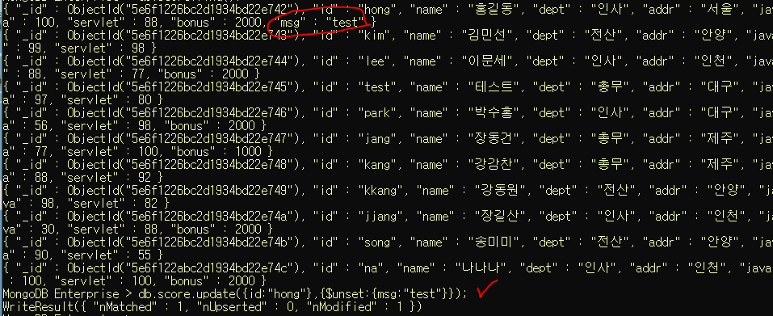

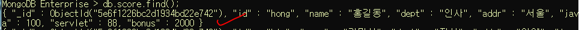


---


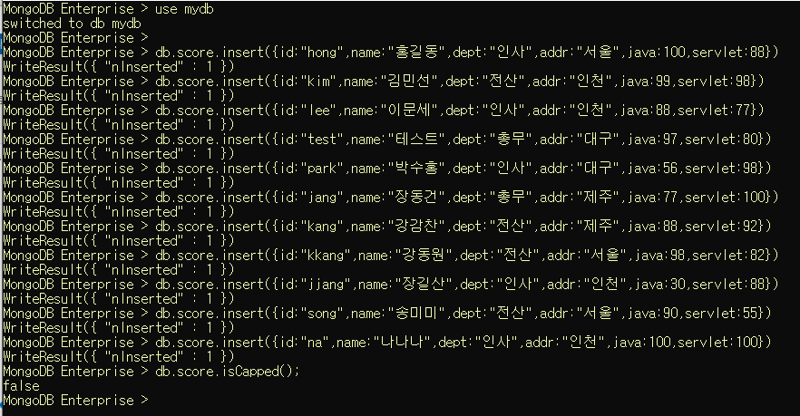

collection(table)을 생성 안하고, 바로 insert하면 해당 이름으로 컬렉션이 만들어진다.

`db.score.isCapped()` 했을 때 `false` 뜨면, 일반 컬렉션으로 만들어 졌다는 뜻.


* 오늘의 날짜를 삽입할 때에는, `new Data()` 로 해준다.

  ```sql
  db.board.update({no:"2"},{$set:{writedate:new Date()}})
  ```

  


## [실습]

1. id가 kang인 사람의 dept를 "총무"로 변경

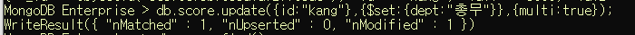

2. dept가 "전산"인 모든 addr을 "안양" 으로 변경


3. id가 jang인 document의 bonus를 1000추가하기

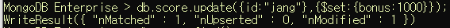

4. dept가 "인사"인 모든document의 bonus에 2000을 추가하기


## 4. mongodb에서 배열 관리

```sql
db.score.update({id:"jang"},
                {$set:
                 {info:
                	{city:["서울","안양"],
                	 movie:["겨울왕국2","포드페라리","알라딘"]} 
                 }
                }
               )
```


#### [배열에서 사용할 수 있는 명령어]

* `$addToSet` : 배열의 요소를 추가. 없는 경우에만 값을 추가(중복을 체크)

```sql
db.score.update({id:"jang"},
                {$addToSet:{"info.city":"인천"}}
				);
```


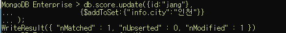


* `$push` : 배열의 요소를 추가. 중복을 허용

```sql
db.score.update({id:"jang"},
                {$push:{"info.city":"천안"}}
				);
```


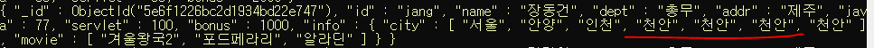


* `$pop` : 지우는 용도.
               1이면 마지막 요소를 제거, -1이면 첫 번째 요소를 제거

```sql
db.score.update({id:"jang"},{$pop:{"info.city":1}})
```

```sql
db.score.update({id:"jang"},{$pop:{"info.city":-1}})
```


* `$each` : addToSet이나 push에서 사용할 수 있다.
                 여러 개를 배열에 추가할 때 사용

``` sql
db.score.update({id:"jang"},
                  {$push:
                       {"info.city":
                           {$each:["천안","가평","군산"]} //3개를 동시에 집어넣는다. 
                        }
                   })
```

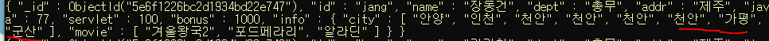


* `$sort` : 정렬(`1`:오름차순, `-1`:내림차순)

```sql
db.score.update({id:"jang"},
                  {$push:
                       {"info.city":
                           {$each:["천안","가평","군산"],
                            $sort:1
                           } 
                        }
                   })
```

<1로 적었을 때: 오름차순>


* `$pull`  :  배열에서 조건에 만족하는 요소를 제거(조건 한 개)

```sql
db.score.update({id:"jang"},
                  {$pull:{"info.city":"천안"}}
                )
```

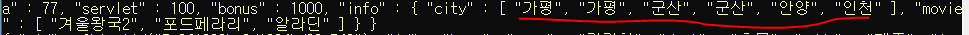

모든 "천안"이 전부 사라졌다.


* `$pullAll` : 배열에서 조건에 만족하는 요소를 제거 (조건을 여러 개)

```sql
db.score.update({id:"jang"},
                  {$pullAll:{"info.city":["가평","군산"]}}
                )
```

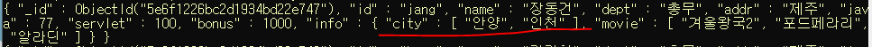

모든 "가평","군산" 이 사라졌다.


---


## 실습

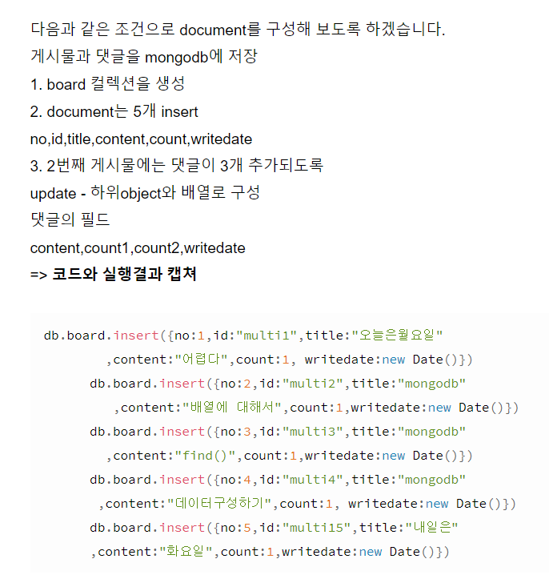

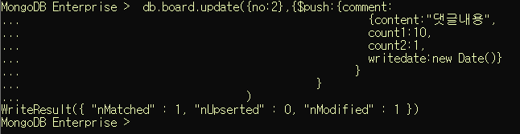

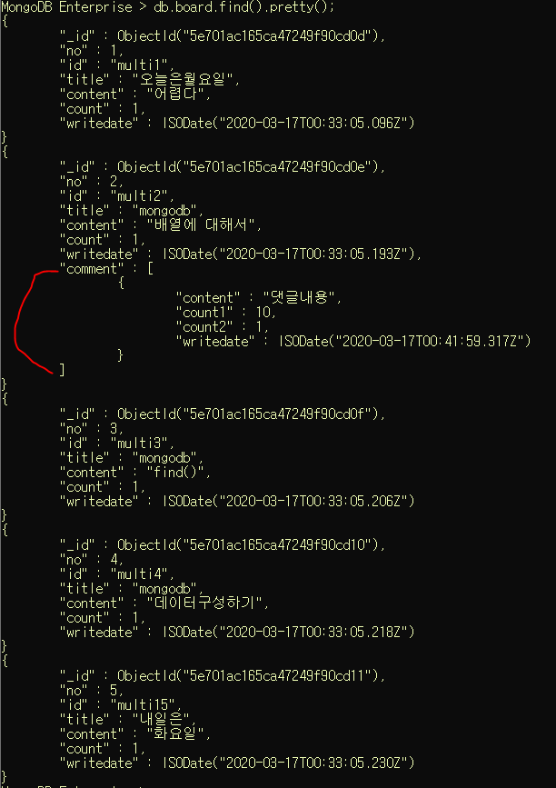


댓글을 삽입할 때마다, 추가된다.

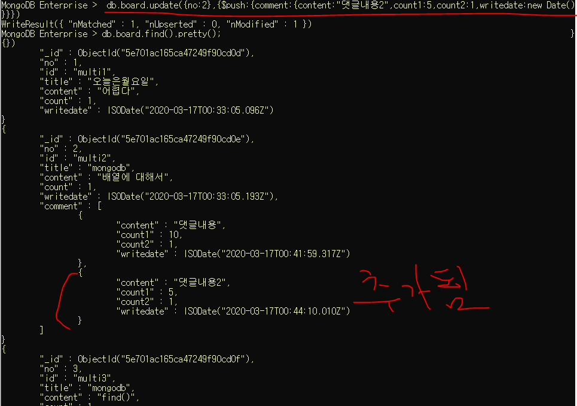


---

### mongoDB에 저장된 데이터 조회하기 - find()

자바스크립트 베이스 언어인 noSQL이기 때문에, 자바스크립트를 자유롭게 사용할 수 있다.

* `pretty()` : db.다큐먼트명.find().pretty() 하면, json형태로 볼 수 있다. 

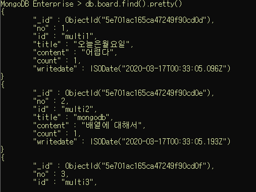


* `findOne()` : 제일 첫 번째 데이터만(1개만) 나온다.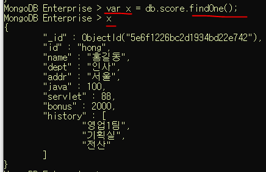

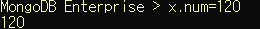

Node.js가 자바스크립트 기반으로 만들어졌기때문에, 자바스크립트 문법을 사용하는 것이 가능하다. 

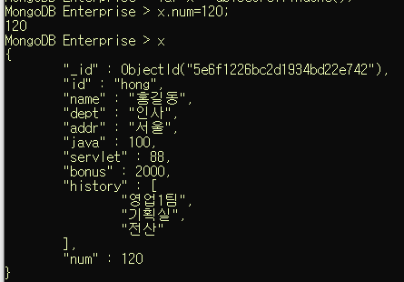

var x = 다큐먼트에서 에서 맨 위값이고, 그 값의 num을 120으로 변수에 넣은 뒤 save를 해주면 해당 필드값이 저장된다. 

* `find().save(값)` : 값을 저장

!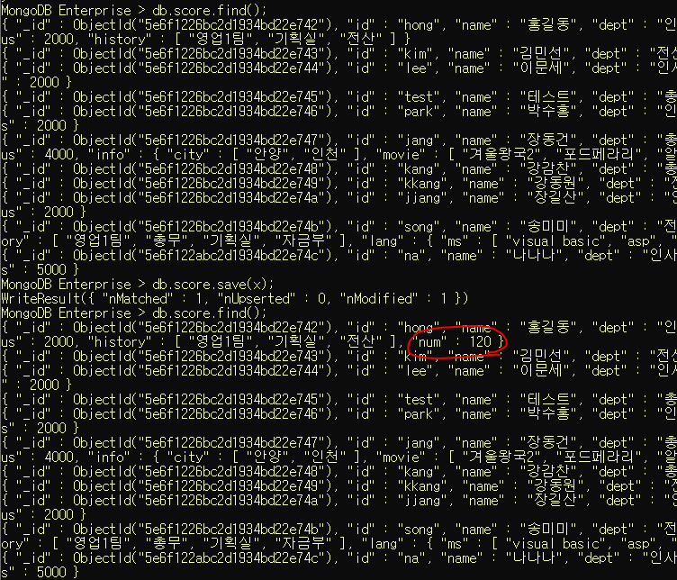


* `find().count()` : 전체 데이터의 다큐먼트 수

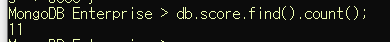


### 실습

[예제]socre의 모든 document에 num필드(1000)가 추가되도록 작업
실행결과 보기

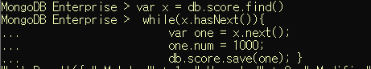


---


1. find

   ```
   db.컬렉션명.find(조건, 조회할 필드에대한 명시)
   ```

   * db.컬렉션명.find({})와 동일 
     : `{ }`안에 아무것도 적지 않으면, 전체 데이터 조회

   * 조건, 조회할 필드에 대한 명시 모두 json

   * 조회할 필드의 정보 명시

     * 형식 

     > `{필드명:1}`: 화면에 표시하고 싶은 필드
     > `{필드명:0}` : 명시한 필드가 조회되지 않도록 처리

   

   `$exists:null` : 조회 시 exists:null 인 값을 제외하고 출력해준다. 

   

   ```sql
db.score.find().({servlet: {$not: {$exists:null} }  }).sort({servlet:1}).limit(1)
   ```

   

   

   

   #### [ 비교조건 ]
   
   `$lt`: <

   `$gt`: >

   `$lte`: <= 이하

   `$gte`: >= 이상
   
#### [ 논리조건 ]
   
   `$or` : 여러 필드를 이용해서 같이 비교 가능.
   여러 필드가 들어가야하기 때문에, 배열로 들어간다. 
   만약 하나의 필드에서의 여러 값이면, 
   
   `$and` :
   
   `$in` : <u>**하나의 필드**</u>에서만 비교
   
   `$nin`: not in.
               $in으로 정의한 조건을 제외한 document를 조회
   
   


- **[화면에 표시,미표시]**addr이 인천인 데이터 : id, name, dept, addr

  ```sql
  db.score.find({addr:"인천"},{id:1,name:1,dept:1,addr:1})
  ```

  이렇게 하면 addr이 인천인 도큐먼트에서 필드값을 1로 설정해 놓은 id, name, dept, addr 을 볼 수 있다. 

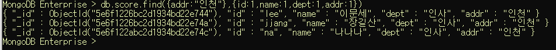


```sql
db.score.find({addr:"인천"},{id:1,name:1,dept:1,addr:1,_id:0})
```

원하지 않는 기본키 데이터가 나오는 경우, _id를 0으로 하여 기본키를 안보이게 할 수 있다.

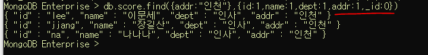


* score컬렉션에서 java가 90점 이상인 document 조회 : id, name, dept, java만 출력

  ```sql
  db.score.find({java:{$gte:90}},{id:1,name:1,dept:1,java:1,_id:0})
  ```

  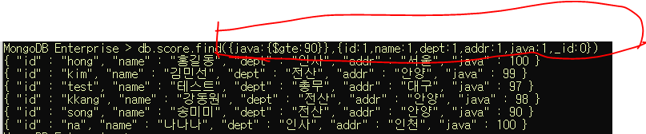


* dept가 인사이거나 addr이 인천인 데이터 조회

```sql
db.score.find({$or:[{dept:"인사"},
                    {addr:"인천"}]})
```

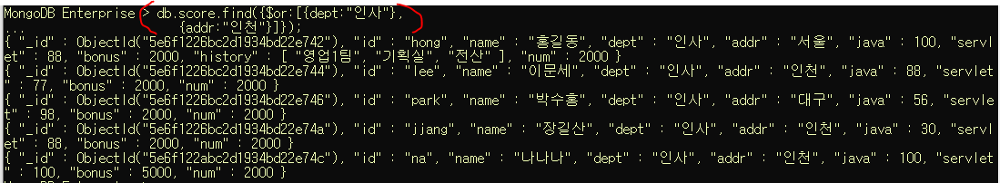


* id가 song, kang, hong인 데이터 조회

```sql
db.score.find({$or:[{id:"song"},
                    {id:"hong"},
                    {id:"kang"}]})
```

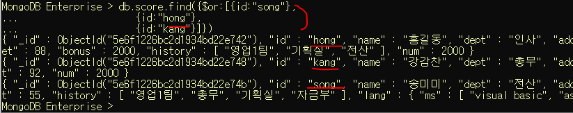


`$in` 으로도 표현할 수 있다.

```sql
db.score.find({id:{$in:["song","hong","kang"]}},{_id:}0)
```

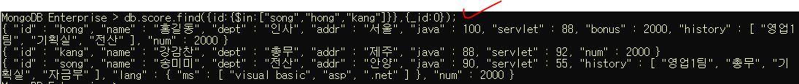


* id가 song, kang, hong이 아닌 데이터 조회

```sql
db.score.find({id:{$nin:["hong","kang","song"]}});
```

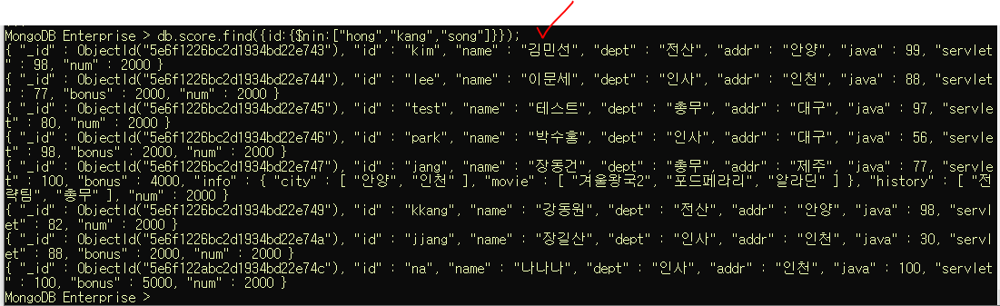


* 특정 필드 값이 null인 데이터 조회

```sql
db.score.find({num:null});
```

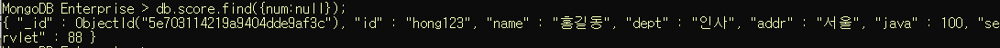


2. 조회메소드

   * `findOne()` : 첫 번째 document만 리턴

   * `find()` : 모든 document리턴

   * `count()`: 행의 갯수를 리턴

   * `sort({필드명:sort옵션})` : 정렬

     [옵션값]

     >  1 : 오름차순
     >
     > -1 : 내림차순

     

     ```
     db.score.find().sort({java:1});
     ```

     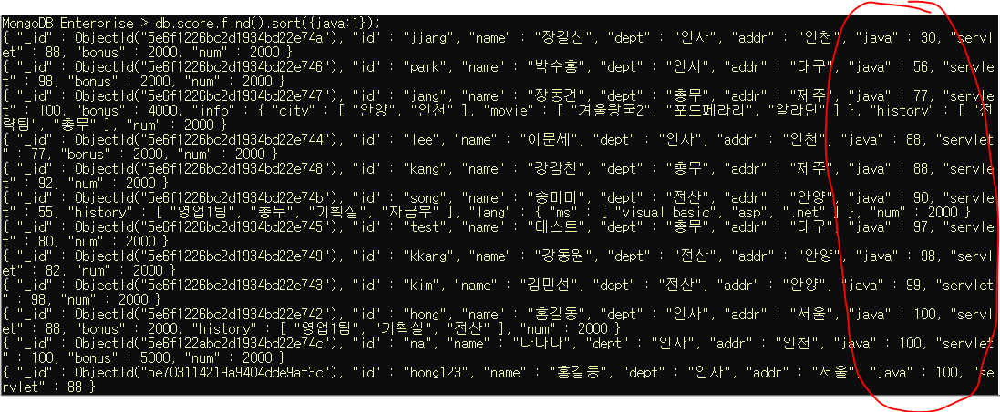

     

   * `limit(숫자)` : 숫자만큼의 document만 조회

     ```sql
     db.score.find().limit(5)
     ```

     

     

   * `skip(숫자)` : 숫자만큼의 document를 skip하고 조회

     ```sql
     db.score.find().skip(5)
     ```

     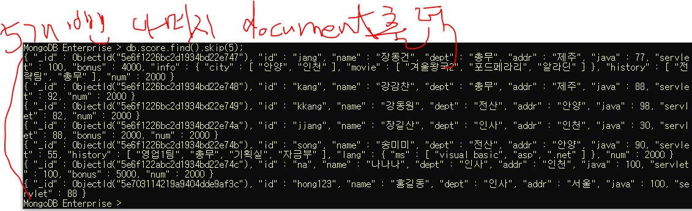


3. 정규표현식을 적용

   ```sql
   db.컬렉션명.find({조건필드명:/정규표현식/옵션})
   ```

   * 기호

     * `|` : or

       > - id가 kim과 park인 document 조회
       >
       > ```sql
       > db.score.find({id:/kim|park/});
       > ```
       >
       > 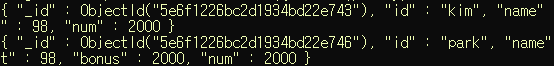

     

     * `^` : ^뒤의 문자로 시작

       > - id가 k로 시작하는 document 조회
       >
       > ```sql
       > db.score.find({id:/^k/});
       > ```
       >
       > 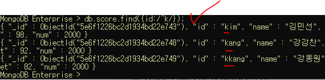

       

     * `[ ]` :영문자 하나는 한 글자를의미하고, [ ]로 묶으면 여러 글자를 표현
       ex. [a-i] : a부터 i 까지

       > * [a-i] 까지의 영문이 있는 id를 조회 : a,b,c,d,e,f,g,h,i
       >
       >   ```sql
       >   db.score.find({id:/[a-i]/})
       >   ```
       >
       >   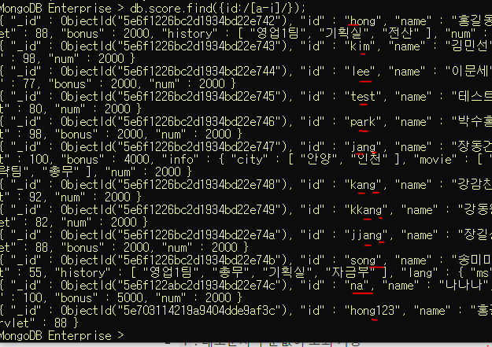
       >
       > * id가 k-p로 시작하는  document 조회 : k,l,m,n,o,p
       >
       >   ```sql
       >   db.score.find({id:/^[k-p]/})
       >   ```
       >
       >   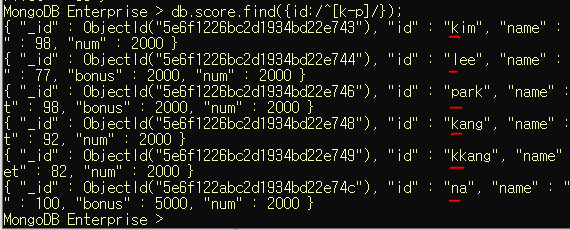
       >
       > 

       

   * 옵션

     * `i` : 대소문자 구분없이 조회 가능

       > * id가 kim과 park인 document 조회 (대소문자 구문없이)
       >
       > ```sql
       > db.score.find({id:/kim|park/i});
       > ```
       >
       > 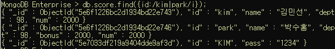
       >
       > 
       >
       > * id가 k나 p가 들어간 것
       >
       >   ```sql
       >   db.score.find({id:/[kp]/})
       >   ```
       >
       >   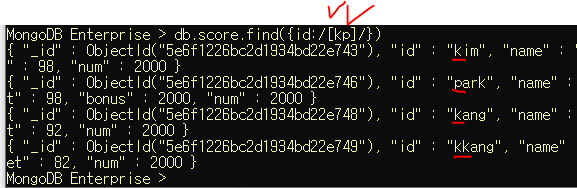
       >
       >   
       >
       > * id가 k나 s로만 시작하는 것
       >
       > ```sql
       > db.score.find({id:/^[ks]/})
       > ```
       >
       > 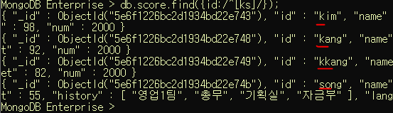
       >
       > 
       >
       > 


---


### mongodb에 저장된 데이터 삭제하기 : remove()

* 조건을 정의하는 방법은 `find()`나 `update()`와 동일

  ```sql
  db.score.remove({servlet:{$lt:70}});
  ```

  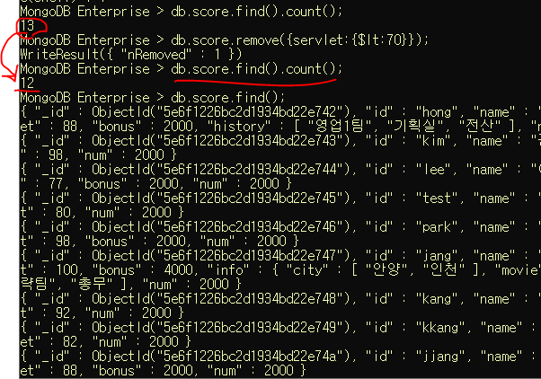


```
db.콜렉션명.remove({조건필드:조건값},true or false)
```

* true를 하면, 해당하는 값 중 첫째 값만 삭제가된다.
* false는 해당하는 모든 값이 삭제된다. default는 false기 때문에, 적지 않으면 false로 적용되어 모두 삭제된다.


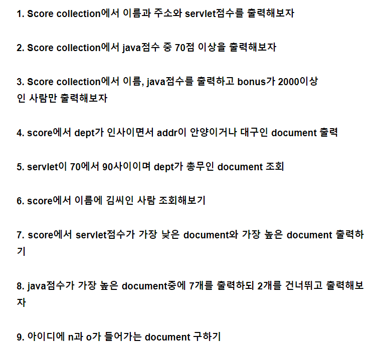

1. db.score.find({name:1,addr:1,servelet:1,_id:0});

2. db.score.find({java:{$gte:70}});

3. db.score.find({bonus:$gte:2000}},{name:1,java:1,_id:0});

4. db.score.find({$and:[{ dept:"인사" },{addr: {$in: ["안양","대구"] } } ] } )

5. db.score.find( {$and: [ {dept:"총무"},  {servlet:  {$gte:70 ,$lte:90}} ] }   );

6. db.score.find(   {name:/^강/} ); 

7. db.score.find().sort({servlet:1}).limit(1);
   db.score.find().sort({servlet:-1}).limit(1);

```sql
db.score.find().({servlet: {$not: {$exists:null} }  }).sort({servlet:1}).limit(1) //이렇게 하면 null값을 제외하고 출력할 수 있다.
```

8. 8.db.score.find().sort({java:-1}).skip(2).limit(7);

9. db.score.find( {id:/[no]/   }  )


