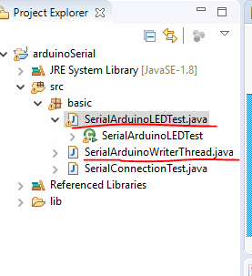

[시리얼통신]

1. CommPortIdentifier를 포트의 유효성과 통신가능 상태인지 점검

2. commPortIdentifier의 open메소드를 이용해서 시리얼통신을 할 수 있는 준비상태로 셋팅

   ​	=> 시리얼통신을 하기 위해 필요한 포트객체가 리턴
   ​																------------ > CommPort

3. CommPort는 종류가 2가지

   - Serial
   - Paralel

   : CAN통신은 Serial통신, 아두이노와 라떼판다도 Serial통신 

   => 각 상황에 맞는 CommPort객체를 얻어야 작업할 수 있다. 

4. CommPort를 SerialPort로 캐스팅

5. serialPort객체의 setSerialPortParamas메소드를 이용해서 Serial통신을 위한 기본내용을 설정

   ```java
   serialPort.setSerialPortParams(9600, ==> Serial port의 통신속도
   			SerialPort.DATABITS_8,==>  전송하는 데이터의 길이 
   			SerialPort.STOPBITS_1, ==> stop bit에 설정
   			SerialPort.PARITY_NONE); ==> Parity비트를 사용하지 않겠다고 설정
                                            --------- >오류 검출 비트 
   ```

   ==> Serial포트를 open하고 설정을 잡아놓은 상태

   ==> 전달되는 데이터(data frame)를 받을 수 있는 상태

6. 데이터를 주고 받을 수 있도록 SerialPort객체에서 Input/Output스트림을 얻는다. 

   ==> 바이트 단위(io클래스관점)로 데이터가 송수신되므로 Reader,Writer 계열의 스트림을 사용할 수 없고 InputStream, OutputStream객체를 사용해야 한다.

   시리얼포트객체.getInputStream()

   시리얼포트객체.getOutputStream()
   

7. 데이터 수신과 송신에 대한 처리

   1) 쓰레드로 처리하는 방법

   2) 이벤트에 반응하도록 처리하는 방법


------




* SerialArduinoWriteThread.java

  ```java
  package basic;
  //키보드로 입력하는 값을 아두이노로 내보내기 위한 쓰레드 -Serial
  
  import java.io.IOException;
  import java.io.OutputStream;
  
  public class SerialArduinoWriterThread extends Thread {
  	
  	OutputStream out;
  	
  	
  	
  	public SerialArduinoWriterThread(OutputStream out) {
  		super();
  		this.out = out;
  	}
  
  	public void run() {
  		int ledstate = 0;
  		try {
  			while((ledstate=System.in.read()) > -1) {
  				//값이 없으면 -1을 리턴하므로, 그 이상으로 해준다 
  				out.write(ledstate);
  			}
  		} catch (IOException e) {
  			e.printStackTrace();
  		}
  		
  	}
  
  }
  
  ```


* SerialArduinoLEDText.java

  ```java
  package basic;
  
  import java.io.IOException;
  import java.io.InputStream;
  import java.io.OutputStream;
  
  import gnu.io.CommPort;
  import gnu.io.CommPortIdentifier;
  import gnu.io.NoSuchPortException;
  import gnu.io.PortInUseException;
  import gnu.io.SerialPort;
  import gnu.io.UnsupportedCommOperationException;
  
  public class SerialArduinoLEDTest {
  	public SerialArduinoLEDTest() {
  		
  	}
  	public void connect(String portName) {
  		try {
  			//COM포트가 실제 존재하고 사용가능한 상태인지 확인
  			CommPortIdentifier commPortIdentifier = 
  					CommPortIdentifier.getPortIdentifier(portName);
  			//포트가 사용중인지 체크
  			if(commPortIdentifier.isCurrentlyOwned()) {
  				System.out.println("포트사용할 수 없습니다.");
  				
  			}else {
  				System.out.println("포트 사용 가능");
  				//port가 사용가능하면 포트를 열고 포트객체를 얻어오기 
  				//매개변수1 : 포트를 열고 사용하는 프로그램의 이름(문자열)
  				//매개변수2 : 포트를 열고 통신하기 위해서 기다리는 시간(밀리세컨드)
  			}
  			CommPort commport = 
  					commPortIdentifier.open("basic_serial", 5000);
  			if(commport instanceof SerialPort) {
  				System.out.println("SerialPort");
  				SerialPort serialPort = (SerialPort)commport;
  				
  				serialPort.setSerialPortParams(9600,
  						SerialPort.DATABITS_8, 
  						SerialPort.STOPBITS_1, 
  						SerialPort.PARITY_NONE);
  				InputStream in = serialPort.getInputStream();
  				OutputStream out = serialPort.getOutputStream();
  				
  				//데이터를 주고 받는 작업을 여기에
  				//안드로이드에서 입력받은 값을 아두이노로 전송하는 쓰레드
  				new SerialArduinoWriterThread(out).start();
  			} else {
  				System.out.println("SerialPort만 작업할 수 있습니다.");
  			}
  		} catch (NoSuchPortException e) {
  			// TODO Auto-generated catch block
  			e.printStackTrace();
  		}catch (PortInUseException e) {
  			e.printStackTrace();
  		} catch (UnsupportedCommOperationException e) {
  			// TODO Auto-generated catch block
  			e.printStackTrace();
  		} catch (IOException e) {
  			// TODO Auto-generated catch block
  			e.printStackTrace();
  		}
  	}
  
  	public static void main(String[] args) {
  		new SerialArduinoLEDTest().connect("COM3");
  	}
  }
  
  ```

  


아두이노 컴파일 한 상태에서, 이클립스에서 실행해본다.

