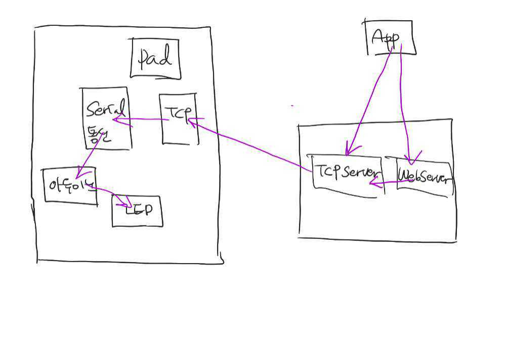

[Android]


[ Eclipse ]


* AndroidLEDControlServer.java

  ```java
  package android.control;
  
  
  
  import java.io.IOException;
  import java.net.ServerSocket;
  import java.net.Socket;
  //안드로이드(클라이언트)의 요청을 받으면 차 안에서 장치와 통신하는
  //시리얼통신객체 쪽으로 요청을 전달하는 서버 
  public class AndroidLEDControlServer {
  	private ServerSocket server;
  	
  	
  	public void connect() {
  		try {
  			server = new ServerSocket(12345);
  			
  			
  		} catch (IOException e1) {
  			// TODO Auto-generated catch block
  			e1.printStackTrace();
  		}
  		Thread th = new Thread(new Runnable(){
  			@Override
  			public void run() {
  				while(true){
  					try {
  						Socket client = server.accept();
  						String ip = client.getInetAddress().getHostAddress();
  						System.out.println(ip+"사용자접속!!\n");
  						//클라이언트의 보내는 메시지를 읽고 있는 쓰레드 (사용자가 버튼누르는 것을 지속적으로 듣고 있을 수 있게)
  						new ReceiverThread(client).start();
  					} catch (IOException e) {
  						e.printStackTrace();
  					}
  				}
  			}
  		});
  		th.start();
  	}
  	public static void main(String[] args) {
  		new AndroidLEDControlServer().connect();
  	}
  
  }
  
  ```

* ReceiverThread.java

  ```java
  package android.control;
  
  import java.io.BufferedReader;
  import java.io.IOException;
  import java.io.InputStreamReader;
  import java.io.OutputStream;
  import java.io.PrintWriter;
  import java.net.Socket;
  
  import basic.SerialArduinoLEDTest;
  
  //TCP서버쪽에 클라이언트의 요청을  계속 읽는 쓰레드
  public class ReceiverThread extends Thread{
  	Socket client;
  	BufferedReader br;//클라이언트의 메시지를 읽는 스트림
  	PrintWriter pw; //클라이언트에게 메시지를 전달하는 스트림
  	SerialArduinoLEDControl serialObj; //시리얼 통신을 위한 객체 
  	OutputStream os; //시리얼통신에서 아두이노로 데이터를 내보내기 위한 스트림
  	
  	public ReceiverThread(Socket client) {
  		try {
  			//클라이언트가 보내오는 메시지를 읽기 위한 스트림 생성
  			br = new BufferedReader(new InputStreamReader(client.getInputStream()));
  			//클라이언트에게 메시지를 전송하기 위한 스트림 생성
  			pw = new PrintWriter(client.getOutputStream(),true);
  
  			//아두이노와 시리얼통신을 위해서 아두이노로 데이터를 내보내기 위한 스트림얻기
  			serialObj = new SerialArduinoLEDControl();
  			serialObj.connect("COM3");
  			os = serialObj.getOutput();
  		} catch (IOException e) {
  			// TODO Auto-generated catch block
  			e.printStackTrace();
  		}
  	}
  	public void run() {
  		//클라이언트의 메시지를 받아서 아두이노로 데이터를 전송
  		while(true) {
  			try {
  				String msg = br.readLine();
  				System.out.println("클라이언트가 보낸 메시지:"+msg);
  				if(msg.equals("led_on")) {
  					os.write('1');
  				}else {
  					os.write('0');
  				}
  				
  			} catch (IOException e) {
  				e.printStackTrace();
  			}
  			
  		}
  	}
  }
  
  ```

* SerialArduinoLEDControl.java

  ```java
  package android.control;
  
  import java.io.IOException;
  import java.io.InputStream;
  import java.io.OutputStream;
  
  import gnu.io.CommPort;
  import gnu.io.CommPortIdentifier;
  import gnu.io.NoSuchPortException;
  import gnu.io.PortInUseException;
  import gnu.io.SerialPort;
  import gnu.io.UnsupportedCommOperationException;
  
  public class SerialArduinoLEDControl {
  	OutputStream out;
  	InputStream in;
  	public SerialArduinoLEDControl() {
  		
  	}
  	public void connect(String portName) {
  		try {
  			//COM포트가 실제 존재하고 사용가능한 상태인지 확인
  			CommPortIdentifier commPortIdentifier = 
  					CommPortIdentifier.getPortIdentifier(portName);
  			//포트가 사용중인지 체크
  			if(commPortIdentifier.isCurrentlyOwned()) {
  				System.out.println("포트사용할 수 없습니다.");
  				
  			}else {
  				System.out.println("포트 사용 가능");
  				//port가 사용가능하면 포트를 열고 포트객체를 얻어오기 
  				//매개변수1 : 포트를 열고 사용하는 프로그램의 이름(문자열)
  				//매개변수2 : 포트를 열고 통신하기 위해서 기다리는 시간(밀리세컨드)
  			}
  			CommPort commport = 
  					commPortIdentifier.open("basic_serial", 5000);
  			if(commport instanceof SerialPort) {
  				System.out.println("SerialPort");
  				SerialPort serialPort = (SerialPort)commport;
  				
  				serialPort.setSerialPortParams(9600,
  						SerialPort.DATABITS_8, 
  						SerialPort.STOPBITS_1, 
  						SerialPort.PARITY_NONE);
  				in = serialPort.getInputStream();
  				out = serialPort.getOutputStream();
  				
  				//데이터를 주고 받는 작업을 여기에
  				//안드로이드에서 입력받은 값을 아두이노로 전송하는 쓰레드
  				//new SerialArduinoWriterThread(out).start();
  			} else {
  				System.out.println("SerialPort만 작업할 수 있습니다.");
  			}
  		} catch (NoSuchPortException e) {
  			// TODO Auto-generated catch block
  			e.printStackTrace();
  		}catch (PortInUseException e) {
  			e.printStackTrace();
  		} catch (UnsupportedCommOperationException e) {
  			// TODO Auto-generated catch block
  			e.printStackTrace();
  		} catch (IOException e) {
  			// TODO Auto-generated catch block
  			e.printStackTrace();
  		}
  	}
  	
  	public OutputStream getOutput() {
  		return out;
  	}
  
  	public static void main(String[] args) {
  		new SerialArduinoLEDControl().connect("COM3");
  	}
  }
  
  ```

  


