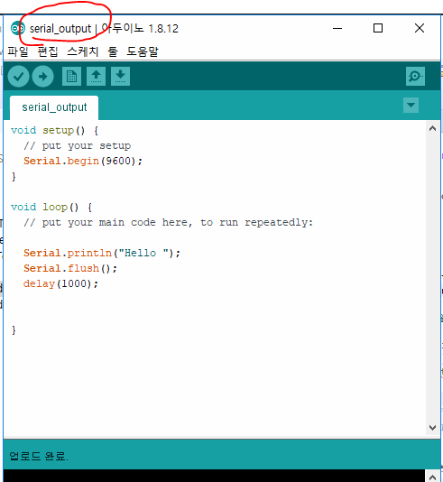
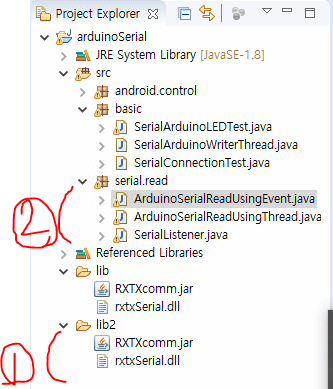
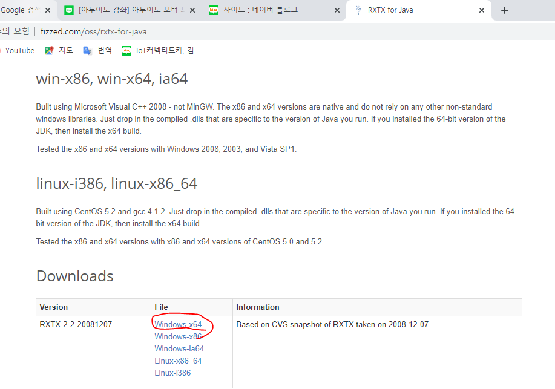
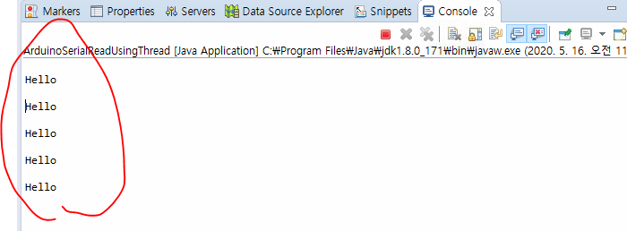

지난 시간에는 외부에서 아두이노로 Write를 해주었지만

이번 시간에는 아두이노로부터 값을 Read 하는 방법을 알아본다.


먼저 아두이노 코드를 작성해준다.






1. 라이브러리 다시 추가한다.

* lib2 폴더를 만든다.
  http://fizzed.com/oss/rxtx-for-java
  

링크로 가서 다운받고, lib2에 추가해준다.

buildpath 해서 다시 설정해준다.


### Eclipse

1. Thread를 돌려서 하는 방법

   * ArduinoSerialUsingThread.java

   ```java
   package serial.read;
   
   import java.io.IOException;
   import java.io.InputStream;
   import java.io.OutputStream;
   
   import gnu.io.CommPort;
   import gnu.io.CommPortIdentifier;
   import gnu.io.NoSuchPortException;
   import gnu.io.PortInUseException;
   import gnu.io.SerialPort;
   import gnu.io.UnsupportedCommOperationException;
   
   public class ArduinoSerialReadUsingThread {
   	public static void main(String[] args) {
   		
   	
   	try {
   		//COM포트가 실제 존재하고 사용가능한 상태인지 확인
   		CommPortIdentifier commPortIdentifier = 
   				CommPortIdentifier.getPortIdentifier("COM3");
   		//포트가 사용중인지 체크
   		if(commPortIdentifier.isCurrentlyOwned()) {
   			System.out.println("포트사용할 수 없습니다.");
   			
   		}else {
   			System.out.println("포트 사용 가능");
   			//port가 사용가능하면 포트를 열고 포트객체를 얻어오기 
   			//매개변수1 : 포트를 열고 사용하는 프로그램의 이름(문자열)
   			//매개변수2 : 포트를 열고 통신하기 위해서 기다리는 시간(밀리세컨드)
   		}
   		CommPort commport = 
   				commPortIdentifier.open("basic_serial", 5000);
   		if(commport instanceof SerialPort) {
   			System.out.println("SerialPort");
   			SerialPort serialPort = (SerialPort)commport;
   			
   			serialPort.setSerialPortParams(9600,
   					SerialPort.DATABITS_8, 
   					SerialPort.STOPBITS_1, 
   					SerialPort.PARITY_NONE);
   			InputStream in = serialPort.getInputStream();
   			OutputStream out = serialPort.getOutputStream();
   			
   			//Arduino를 통해서 반복해서 들어오는 데이터를 읽을 수 있도록 코드 작성
   			//코드 작성 - 쓰레드로 처리
   			Thread readThread = new Thread(new Runnable() {			
   				@Override
   				public void run() {
   					// TODO Auto-generated method stub
   					byte[] buffer = new byte[1024];
   					int len = -1;
   					try {
   						while((len = in.read(buffer)) != -1) {
   							System.out.println(new String(buffer, 0, len));
   							Thread.sleep(1000);
   						}
   					} catch (IOException e) {
   						// TODO: handle exception
   					} catch (InterruptedException e) {
   						// TODO Auto-generated catch block
   						e.printStackTrace();
   					}
   				}
   			});
   			readThread.start();
   			
   		} else {
   			System.out.println("SerialPort만 작업할 수 있습니다.");
   		}
   	} catch (NoSuchPortException e) {
   		// TODO Auto-generated catch block
   		e.printStackTrace();
   	}catch (PortInUseException e) {
   		e.printStackTrace();
   	} catch (UnsupportedCommOperationException e) {
   		// TODO Auto-generated catch block
   		e.printStackTrace();
   	} catch (IOException e) {
   		// TODO Auto-generated catch block
   		e.printStackTrace();
   	}
   
   	}
   }
   
   ```

   

2. 이벤트로 연결해서 하는 방법

   => 리스너를 만들어서 연결해준다.

   * SerialListener.java 

   ```java
   package serial.read;
   
   import java.io.InputStream;
   import java.io.SerializablePermission;
   
   import gnu.io.SerialPortEvent;
   import gnu.io.SerialPortEventListener;
   
   //이벤트에 대해서 처리하는 리스너클래스
   //시리얼으로 데이터가 전송될때마다 이벤트가 발생하고 이벤트가 발생될 때 데이터를 읽기 
   public class SerialListener implements SerialPortEventListener{
   	private InputStream in;
   	
   	
   	public SerialListener(InputStream in) {
   		super();
   		this.in = in;
   	}
   
   
   	//이벤트가 발생할 때 마다 호출되는 메소드
   	public void serialEvent(SerialPortEvent event) {
   		//전송된 데이터가 있는 경우 데이터를 읽어서 콘솔에 출력
   		if(event.getEventType()==SerialPortEvent.DATA_AVAILABLE){
   			try {
   				//전송되는 데이터의 크기를 추출
   				int check_size = in.available();
   				byte[] data = new byte[check_size];
   				in.read(data,0,check_size);
   				System.out.println("받은 데이터:"+new String(data));
   				//data는 byte 배열 
   				
   			} catch (Exception e) {
   				// TODO: handle exception
   			}
   			
   		}
   	}
   
   }
   
   ```

   * ArduinoSerialReadUsingEvent.java

   ```java
   package serial.read;
   
   import java.io.IOException;
   import java.io.InputStream;
   import java.io.OutputStream;
   
   import gnu.io.CommPort;
   import gnu.io.CommPortIdentifier;
   import gnu.io.NoSuchPortException;
   import gnu.io.PortInUseException;
   import gnu.io.SerialPort;
   import gnu.io.UnsupportedCommOperationException;
   
   public class ArduinoSerialReadUsingEvent {
   	public static void main(String[] args) {
   		
   	
   	try {
   		//COM포트가 실제 존재하고 사용가능한 상태인지 확인
   		CommPortIdentifier commPortIdentifier = 
   				CommPortIdentifier.getPortIdentifier("COM3");
   		//포트가 사용중인지 체크
   		if(commPortIdentifier.isCurrentlyOwned()) {
   			System.out.println("포트사용할 수 없습니다.");
   			
   		}else {
   			System.out.println("포트 사용 가능");
   			//port가 사용가능하면 포트를 열고 포트객체를 얻어오기 
   			//매개변수1 : 포트를 열고 사용하는 프로그램의 이름(문자열)
   			//매개변수2 : 포트를 열고 통신하기 위해서 기다리는 시간(밀리세컨드)
   		}
   		CommPort commport = 
   				commPortIdentifier.open("basic_serial", 5000);
   		if(commport instanceof SerialPort) {
   			System.out.println("SerialPort");
   			SerialPort serialPort = (SerialPort)commport;
   			
   			serialPort.setSerialPortParams(9600,
   					SerialPort.DATABITS_8, 
   					SerialPort.STOPBITS_1, 
   					SerialPort.PARITY_NONE);
   			InputStream in = serialPort.getInputStream();
   			OutputStream out = serialPort.getOutputStream();
   			
   			//Arduino를 통해서 반복해서 들어오는 데이터를 읽을 수 있도록 이벤트 연결
   			//이벤트에 반응하도록 연결 
   			SerialListener listener = new SerialListener(in);
   			serialPort.notifyOnDataAvailable(true);
   			//시리얼포트로 전송되어 들어오는 데이터가 있다면 noti하여 이벤트 리스터가 실행되게 처리
   			
   		} else {
   			System.out.println("SerialPort만 작업할 수 있습니다.");
   		}
   	} catch (NoSuchPortException e) {
   		// TODO Auto-generated catch block
   		e.printStackTrace();
   	}catch (PortInUseException e) {
   		e.printStackTrace();
   	} catch (UnsupportedCommOperationException e) {
   		// TODO Auto-generated catch block
   		e.printStackTrace();
   	} catch (IOException e) {
   		// TODO Auto-generated catch block
   		e.printStackTrace();
   	}
   
   	}
   }
   
   ```


* 실행결과

  

  아두이노로부터 계속 Hello를 읽어오는 것을 알 수 있다. 