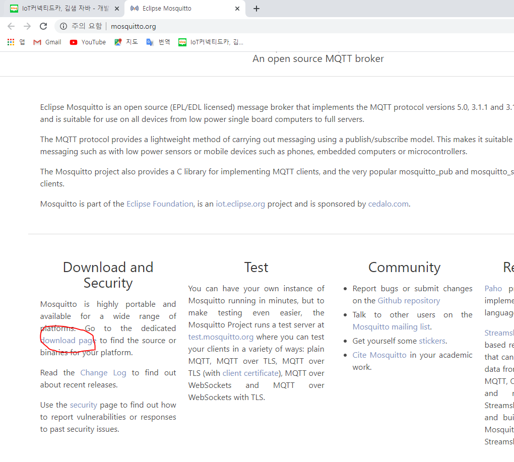
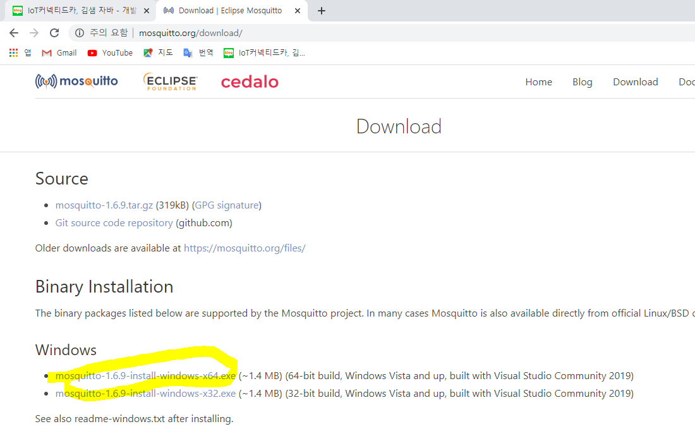
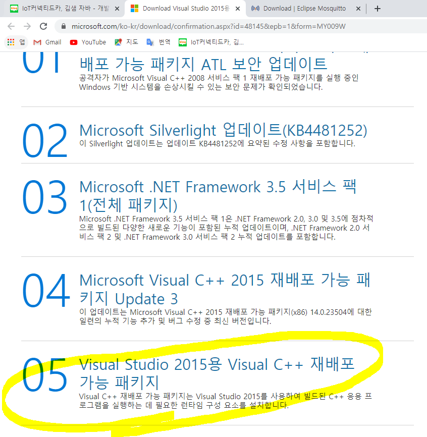
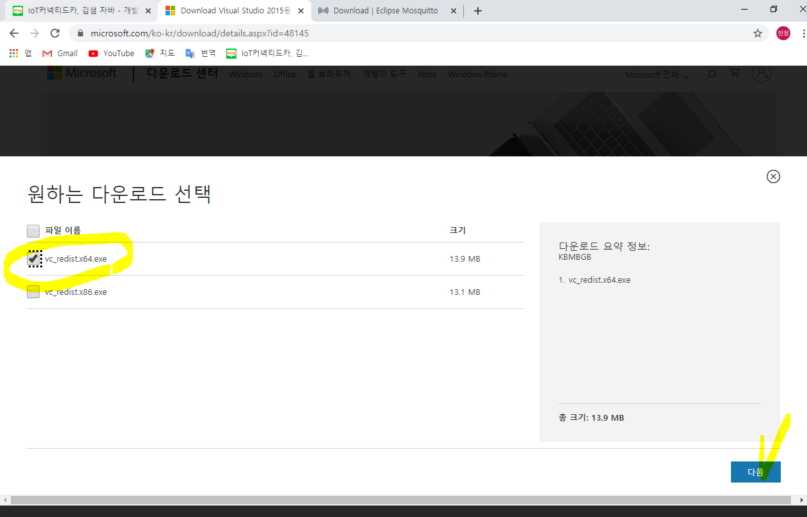
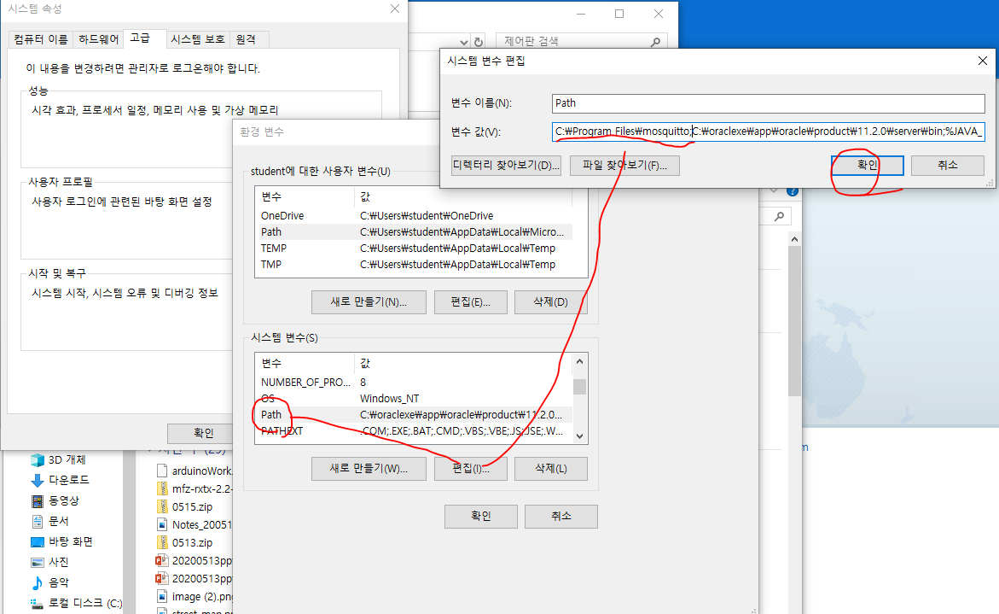
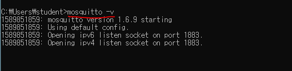
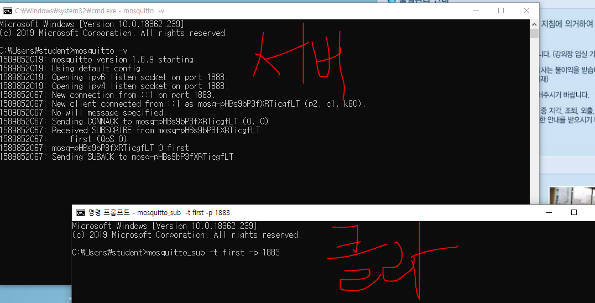
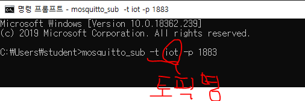
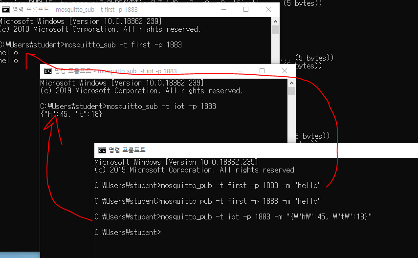
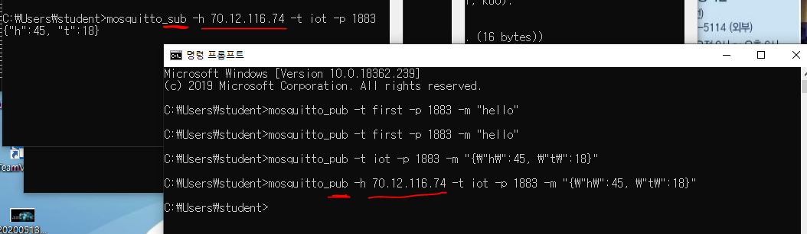

http://mosquitto.org/ 접속

IoT장비를 취급할 때, MQTT를 꼭 사용해야 한다. 

다운로드 받는다. 

mosquitto는 visual c++ 2015버전으로 컴파일 된 것이라서, 관련모듈이 필요하다.

https://www.microsoft.com/ko-kr/download/confirmation.aspx?id=48145&epb=1&form=MY009W

방금 다운받은 mqtt파일이랑 visual 2015 c++ 파일을 라떼판다로 복사한다.

그리고 데스크탑에서 mosquitto를 설치하고, `환경변수 > 시스템변수` 에 모스키토 설치한 경로를 넣어준다. 

제대로 설치되었다면, 

cmd창에서 `mosquitto -v` 명령어를 통해 확인한다.

* subscribe만들기

subscribe를 여러 대 띄워서 클라이언트처럼 한다.

* publish 만들기

pub에서 sub로 보낸다.

ctrl+c 하면 빠져나올 수 있다. 

ip 주소로 보낼 수 있다. 

