`Alt+shift+enter` : import 단축키

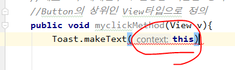

this를 치면 앞에 context : 가 붙ㄴ즌데, 

context자리에 this가 전달되었다는 뜻이다.

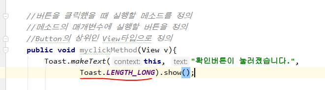

버튼 클릭 시 Toast효과 길게 보여준다.

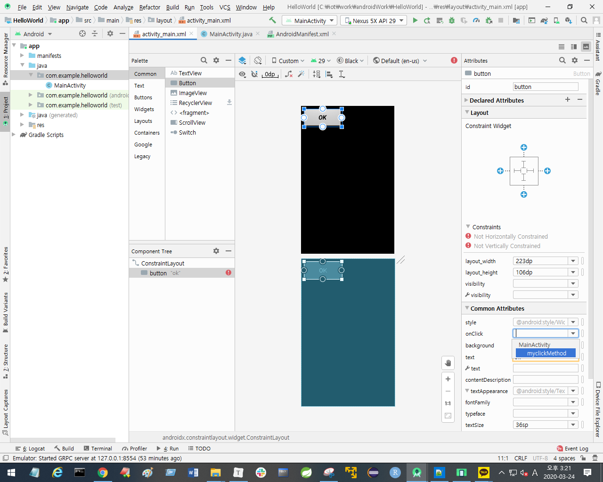

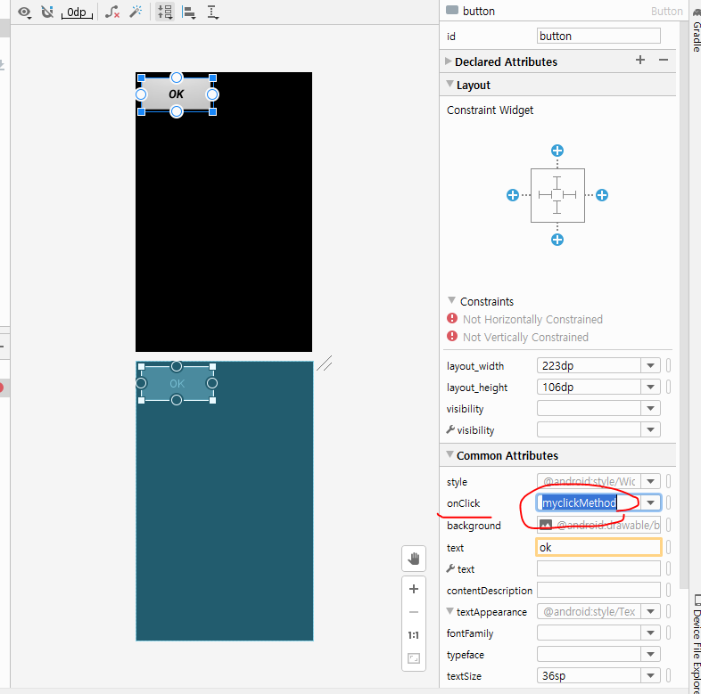

onclick을 클릭해 목록을 보면, 내가 작성한 myclickmethod가 있음을 확인할 수 있다. 내가만든 메소드를 선택하고, 저장한 뒤 실행해보자.

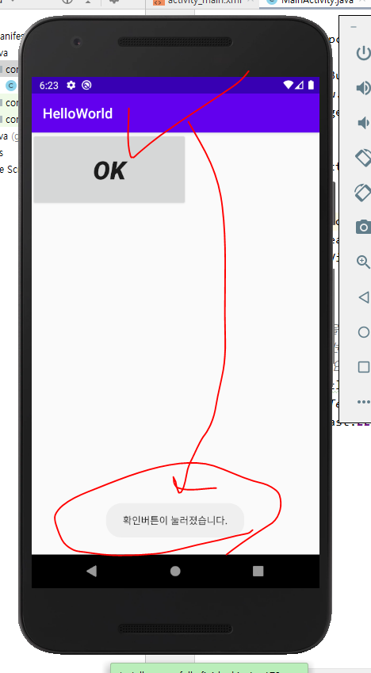

OK 버튼을 누르니 내가 작성한 메소드의 동작이 수행된다.

## Log.d 활용

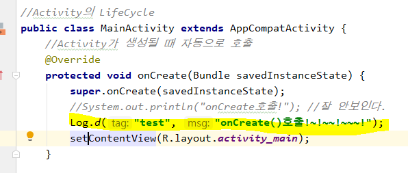

sysout은 잘 안보인다. 따라서 `Log.d` 함수를활용한다.

저렇게 작성 후 실행하고, logcat 화면을 본다.

logcat 화면에 내가 설정해 준 tag 이름을 치면, 메세지를 확인할 수 있다.

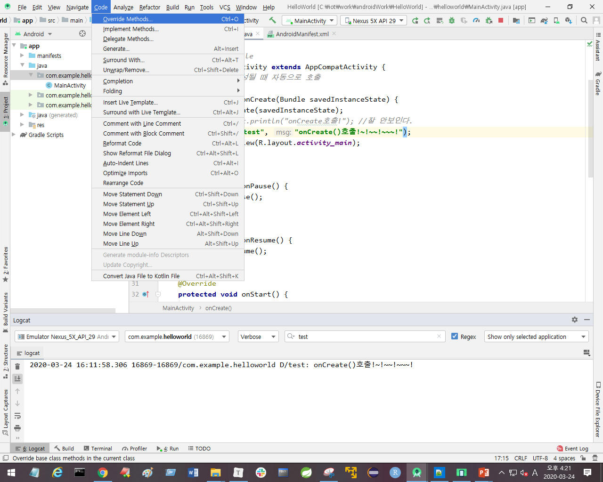

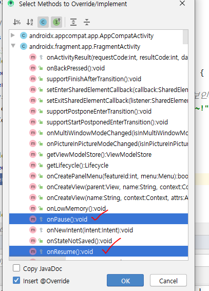

이렇게 총 5개의 메소드를 오버라이드 한다ㅏ.

메소드를 오버라이드 한 뒤, 각 메소드에 Log.d 코드를작성해준다. 

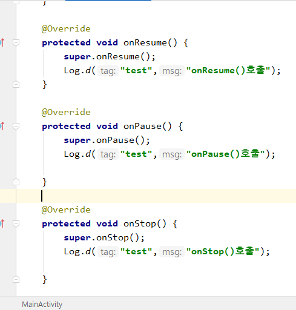

실행하면

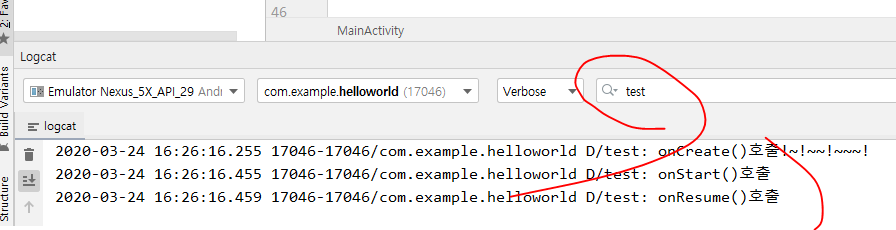

log를 보면 onCreate -> onStart -> onResume 메소드가 호출되었다.

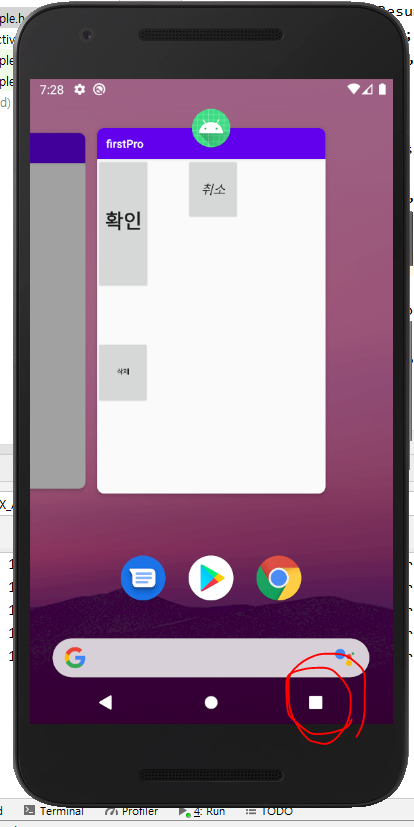

얘를 누르면, 

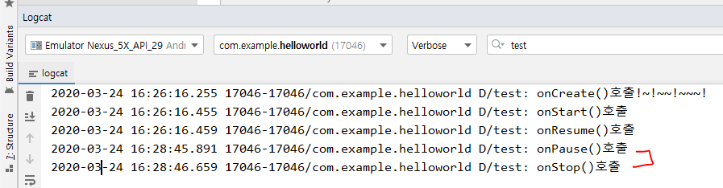

onPause -> onStop이 실행되었다.

화면 중지하고다시 들어오면 , onStop -> onResume()

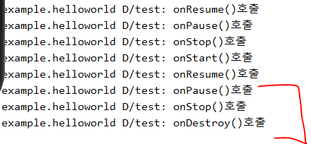

종료 시 onPause->onStop->onDestroy