# ImageView

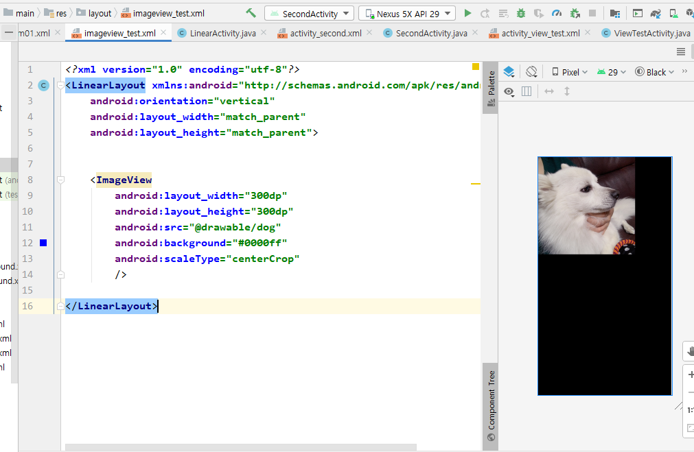

---

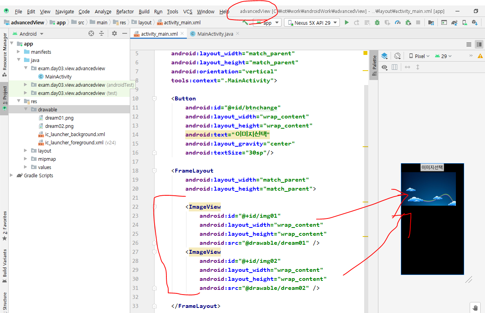

이미지 두 개가 겹쳐져있는 상황

*  `visibility `속성 (이미지 뿐만 아니라, 여러 태그에서 사용 가능)
  * gone : 아예 메모리에서 없애는거

  * invisible : 이미지 안보이게 하는것

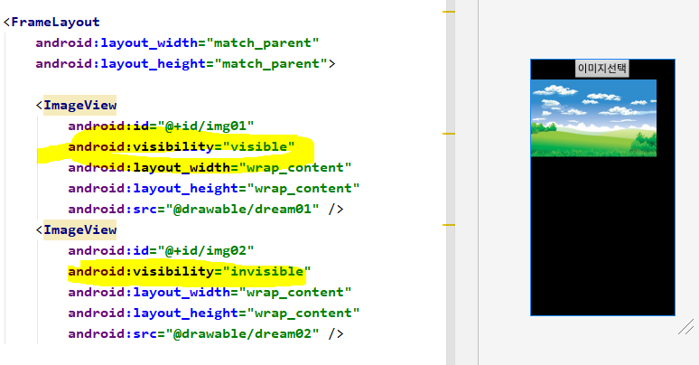

버튼을 누를 때, 제어되도록 java파일에서 소스코드를 작성한다.

메소드를 만들고, onclick 시 해당 메소드가 호출될 수 있도록 한다.

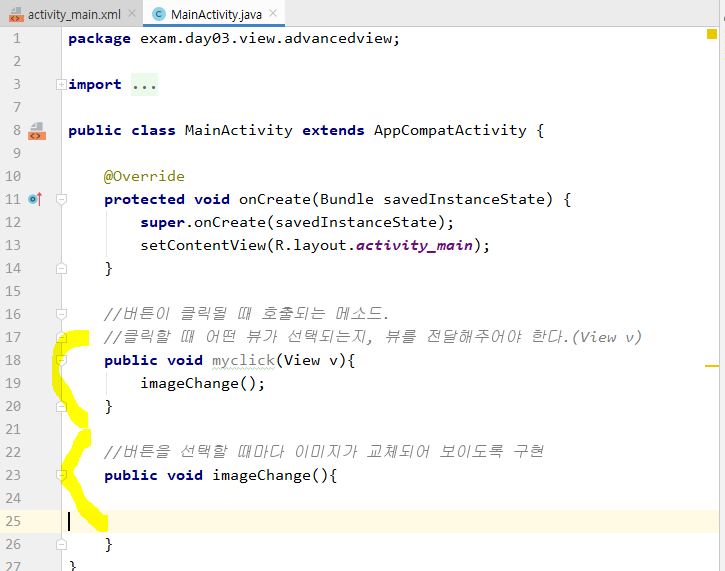

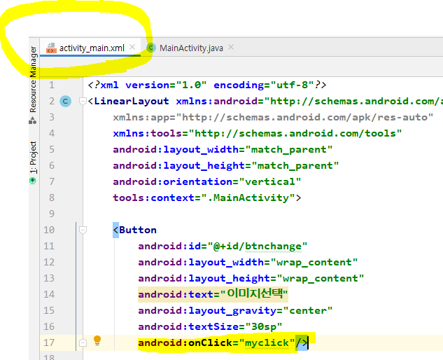

이미지를 갖고와야 이미지의 속성을 보니까 먼저 `findViewById`해준다.

그리고 다른 메소드에서도 사용해야 하니까, 지역변수가 아닌 전역변수로 선언해준다.

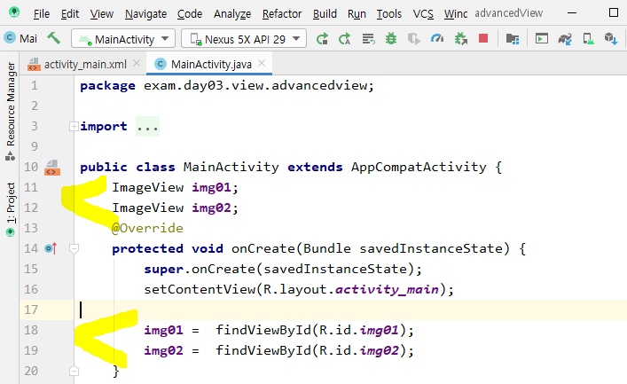

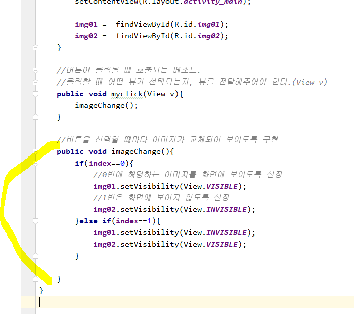

index를 바꿔주는 코드를 추가한다. 

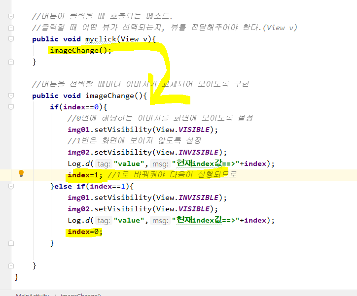

## ScrollView

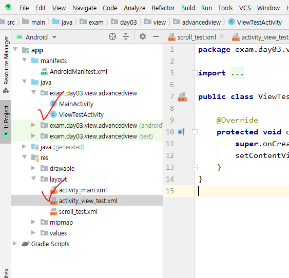

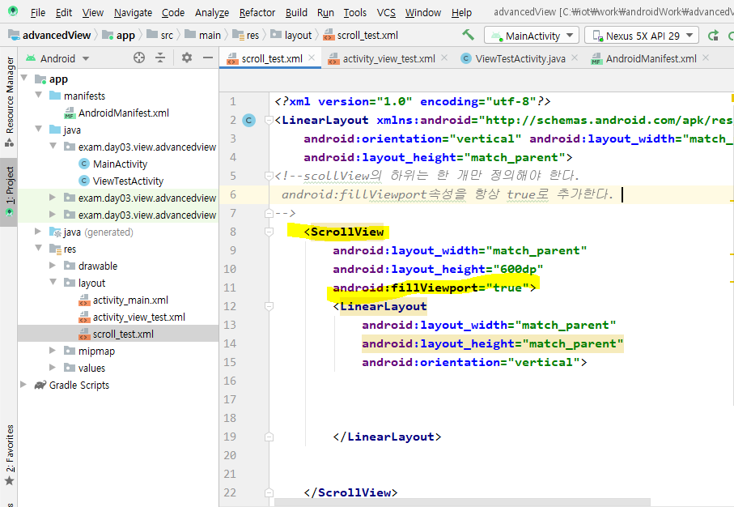

메소드에 놓고 ctrl+q 하면 정보가 뜬다.

---

## setOnClickListener() 메소드를 이용해 리스너 설정 => 구방식

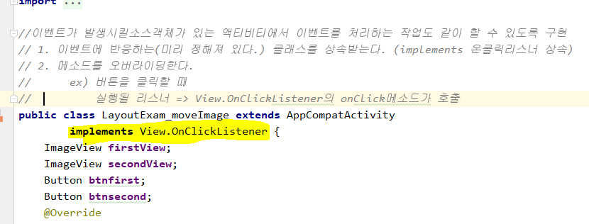

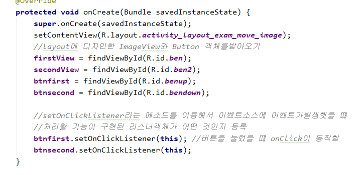

2. 메소드를 오버라이딩 했다.

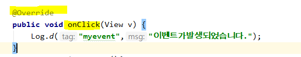

이미지 리소스를 추가해준다. 그리고 바로 갱신이 될 수 있도록 invalidate()함수를 적어준다.

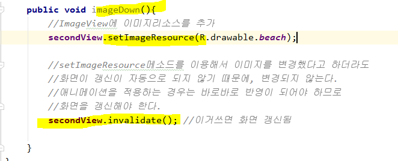