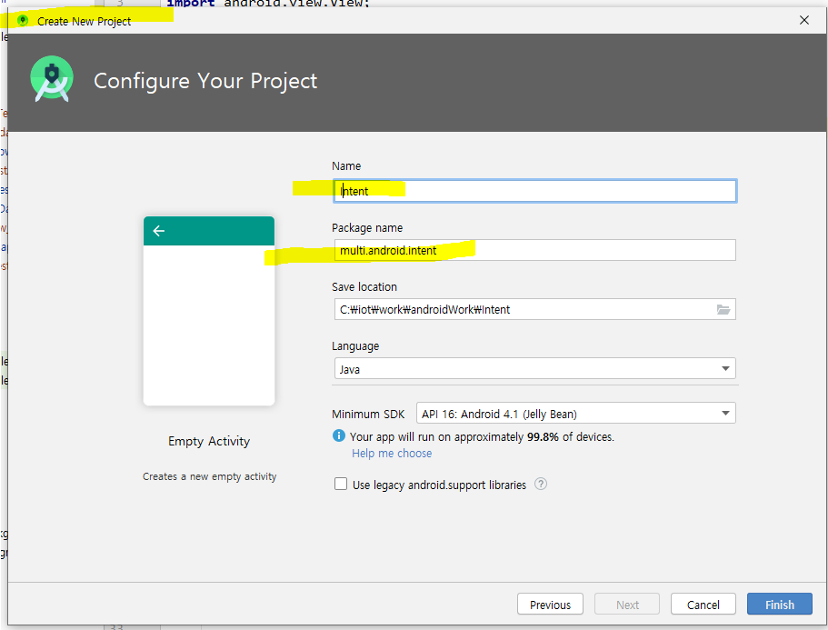

# 인텐트 Intent : 다른 Activity로 전환

p.246

여러 화면 만들고 화면 간 전환하기

[안드로이드 앱의 구성요소]

1. 액티비티

2. 서비스

3. 브로드캐스트 수신자 : 메세지를 전달했을 때 반응하게 하는 것 

   ex. 특정 앱 사용 시 배터리 15퍼센트 이상이어야 함 => 계속 배터리 체크를 해야하는데, 어렵다.
   일정하지 않은 단말기의 상황을 잡을 때 사용하는 것 : 브로드캐스트 리시버

4. 내용제공자

   ex. 촬영기능 선택 시 필터를 통해 사용 가능한 앱 리스트를 보여주고, 선택하게끔 한다. 그 앱들은 데이터를 공유하게 된다.  

