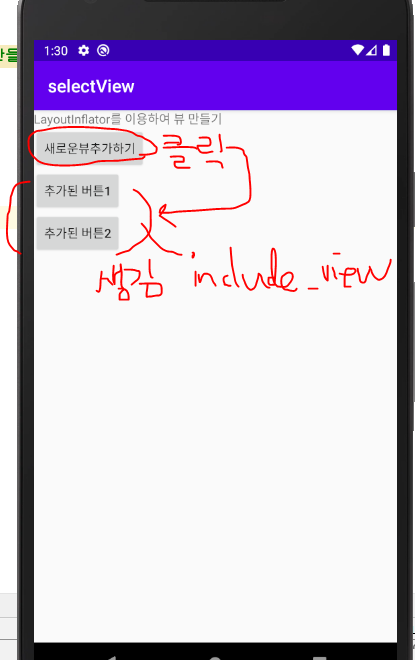
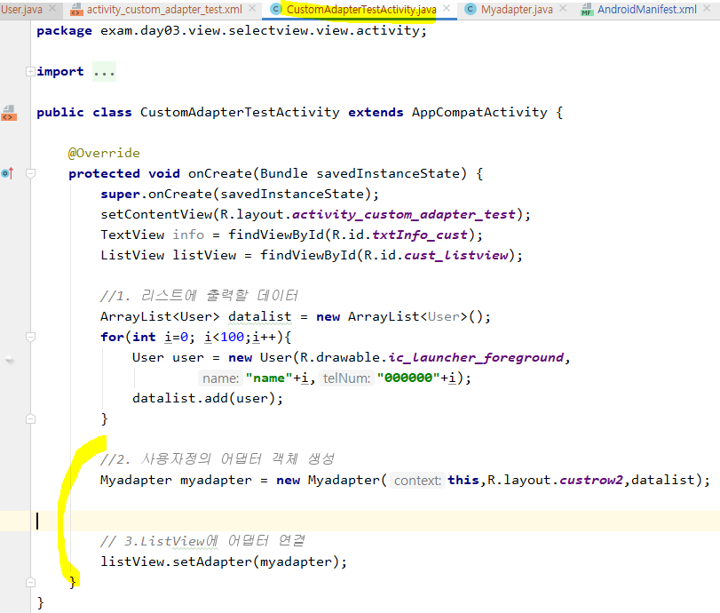
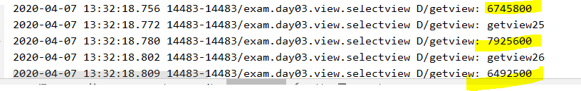
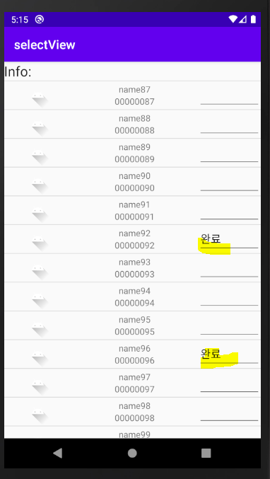

# 인플레이션

* xml 레이아웃 내용이 메모리에 객체화되는 것

* 원래 화면 설정할 때 액티비티의 화면 전체를 설정하는 `setContentView()`메서드를 사용했었다. 하지만, XML레이아웃이 아니라 별도의 XML레이아웃 파일로 만든 **부분 화면** 레이아웃을 소스파일에 로딩하여 보여주려면?
  부분화면을 메모리에 객체화하기 위해 인플레이터를 사용하려면 `LayoutInflater` 클래스의 `getSystemService()` 메서드를 이용하면 된다.


* selectview 에서 오른쪽 버튼을 눌러 새로운 패키지를 만든다. 


* 새로운 패키지를 몇 개 추가한다.


* 옮기고자 하는 파일을 선택한 후, Refactor를 통해 파일을 옮길 수 있다.


* 파일이 너무 많아서 CheckActivity랑 RadioActivity는 다시 밖으로 빼줌


* 패키지 몇 개 추가해서 최종적으로 이런 구조가 되게 만들었다. 


---

* 새로운 액티비티 추가 : ` AddViewTestActivity`


* 새로운 레이아웃을 적용할 것이기 때문에, `setContentView` 부분은 지워준다.

  


* LinearLayout 객체를 생성한다.
* LinearLayout의 :LayoutParams 클래스를 이용한다. 


* Layout에 추가할 view를 생성한다. 생성한 뒤, set해준다.

* 안드로이드에서는 String을 `charSequence`로 다루고 있다.

  


* btn을 `addView` 메소드를 사용해 레이아웃에 붙인다.
* 그리고 만든 레이아웃을 `setContentView`를 통해 Activity에 붙인다.


setContentView에 레이아웃 객체를 적용해도 된다.


* setOnClickListener 로 이너클래스 사용하여 이벤트 붙이기.

* LinearLayout layout 선언 위치를 수정해준다. 지역변수로 선언되면 저 안에서 쓸 수 없다. 

  


* 실행 결과 : '코드로만들어진버튼' 을 누르면 이벤트로 만들어진 객체 버튼이 생성된다. 

  


* `ctrl+o` 하면 내가 현재 상속하고 있는 리스트를 볼 수 있다. 


## InflatorTestActivity


xml 은 선생님 블로그에서 다운로드 받음 : activity_inflator_test.xml





---


### (미리보기) 사용자 정의 Adapter 만들기

* 내가 만든 템플릿 상에서 버튼에 이벤트 추가가 되는지 확인한다.


* 실행하면  Null오류가 난다.

  

* findViewById 로 못받아오기 때문이다. ArrayAdapter에서 처리하기 때문에, id를 받아올 수 없다. 따라서 사용자정의뷰를 연결해서 보려면, Adapter를 customizing해야한다.


# 사용자 정의 Adapter 만들기


* 안드로이드에서 앱을 구성할 때 목록형식을 가장 많이 사용
* 사용자정의로 디자인한 뷰를 목록으로 사용하고 싶은 경우
* 안드로이드 내부에서 제공하는 Adapter로 표현하고 싶은 내용을 모두 표현할 수 없다.
  * 이벤트연결, 각 목록의 구성을 다르게 생성


### [구성 요소]

* **데이터 객체** : Adapter를 이용해서 출력할 데이터를 저장하는 객체 (=DTO)

* **Adapter** : 사용자정의 Adapter

  1) 안드로이드에서 제공하는 Adapter클래스를 상속 (ArrayAdapter)

  * 리스트뷰를 만들 때 필요한 정보를 저장할 수 있도록 멤버변수 정의
    (Context, row디자인리소스, 데이터)

  2) 생성자 정의

  * 상속받고 있는 ArrayAdapter의 생성자 호출

  3) `ArrayAdapter`에 정의되어 있는 메소드를 오버라이딩

  * `getView` : 리스트뷰의 한 항목이 만들어질때마다 호출
    * 전달된 리소스를 이용해서 뷰를 생성(LayoutInflator)
    * 한 row를 구성하는 뷰를 찾아서 데이터와 연결

  4) `getView`메소드에서 성능개선을 위한 코드를 작성

  * 한 번 생성한 view를 재사용
  * findViewById는 한 번만 찾아오기

  5) `ViewHolder`객체를 생성

  * row를 구성하는 뷰를 `findVidwById` 하는 작업을 한 번만
  * row에 대한 구성 View를 멤버변수로 선언
  * 생성자에서 `findVidwById`처리를 구현
  * 최초로 뷰를 만들때(row에 대한 뷰) 이 객체를 생성해서 활용

  6) row를 구성하는 뷰에 상태값을 저장하기

  * 각 뷰의 이벤트를 통해 저장
  * 각 뷰의 상태값을 저장할 수 있도록 객체 생성
    * 상태값을 저장한 객체를 자료 구조에 저장 
      focus를 잃어버릴때 상태를 저장


* **액티비티** : Adapter를 통해 만들어진 리스트뷰를 보여줄 액티비티(main layout 필요)

  

---


##  Adapter클래스를 상속 (ArrayAdapter)


## 2. 생성자 정의


* 


* TextView, ListView 객체를 만든다.
* 리스트에 출력할 데이터를 만들어준다.
* `@Nullable`은 일단 다 지워준다.


* adapter 만든다. : adapter > java file 생성


## 3. `ArrayAdapter`에 정의되어 있는 메소드를 오버라이딩오버라이딩


* `ArrayAdapter` 상속하면, 내가 만든 클래스는 Adapter가 된다.
* 필요한 멤버변수를 선언해준다. ( Context,  row디자인리소스, 데이터 )


* 생성자를 추가한다. 


* 그리고 내 변수에 맞게 수정해준다.

  


* `ctrl+o` 눌러서 필요한 메소드를 오버라이딩 한다. 
  * `getCount()`, `getItem()`, `getView()`





* getView 수정
* 반환을 convertView로 해준다.
* inflator 의 getSystemService를 사용해야 하므로 context 객체를 통해 사용한다.


* 출력 결과 : 첫 값이므로 아무런 정보가 출력되지 않는다. 

  

  


* 이제 데이터와 연결시켜주는 작업을 한다. 


---

* view를 로드하는데 걸리는 시간을 측정해보자
* Myadapter.java




시간이 오래걸려서 다른 방법으로 코드를 짜 볼 예정이다. (성능개선)


---

## 4. `getView`메소드에서 성능개선을 위한 코드를 작성Myadapter2.java 

* Myadapter1 를 Refactor 에서 copy하여 Myadapter2로 만든다.

* 첫 번째만 뷰를 만들어주고(저장된 값이 null일때로 조건 적용), 그 이후에는 재사용 하는 방식으로 코드를 작성

  


* Activity에도 Myadapter2 로 걸어주고 실행

  


* 시간 출력 결과 : 시간이 많이 줄었음을 알 수 있다.


## 5. ViewHolder 객체를 생성 : UserViewHolder.java


전달되어서 오는 컨버터뷰의내용을 뷰홀더로 저장


* UserViewHolder를 활용하기 위한 객체를 만든다.
* 그리고 첫화면일때, 아닐 때 나눠서 코드를 작성한다. 


* Myadapter2 전체코드

  ```java
  package exam.day03.view.selectview.view.adapter;
  
  import android.content.Context;
  import android.util.Log;
  import android.view.LayoutInflater;
  import android.view.View;
  import android.view.ViewGroup;
  import android.widget.ArrayAdapter;
  import android.widget.ImageView;
  import android.widget.TextView;
  
  import java.util.ArrayList;
  
  import exam.day03.view.selectview.R;
  //성능개선을 위한 작업을 추가
  // 1. 한 번 만든 뷰는 재사용
  // 2. findViewById 한 번 작업한 뷰에 대한 정보는 저장해 놓고 다시 사용
  
  public class Myadapter2 extends ArrayAdapter<User> {
      private Context context;
      private int resId;
      private ArrayList<User> datalist;
      //생성자
      public Myadapter2(Context context, int resId, ArrayList<User> datalist) {
          super(context, resId, datalist);
          this.context = context;
          this.resId = resId;
          this.datalist = datalist;
      }
      //리스트 갯수를 반환
      @Override
      public int getCount() {
          return super.getCount();
      }
      //매개변수로 전달받은 순서에 있는 리스트 항목을 반환
      @Override
      public User getItem(int position) {
          return super.getItem(position);
      }
      //리스트의 한 항목을 만들때 호출되는 메소드 - 리스트항목이 100개면 100번호출
      //position => 리스트 순서
      //convertView => 한 항목에 대한 뷰
      @Override
      public View getView(int position,  View convertView,  ViewGroup parent) {
          //컨버트뷰 : 리스트에서 보여지는 로우에 대한 뷰를 리턴해준다.
          // 처음만드는상태면 뷰가 없으므로 null이 나오고, 두번째 부터는 무언가가 있다.
  
          Log.d("getview","getview"+position);
          long start = System.nanoTime(); //시간측정용
  
          //뷰를 생성 - 매개변수로 전달되는 convertView를 재사용
          UserViewHolder holder;
          if(convertView==null){ //null일 때만 새로 만들어서 작업
              LayoutInflater inflater = (LayoutInflater)context.getSystemService(Context.LAYOUT_INFLATER_SERVICE);
              convertView = inflater.inflate(resId, null);
  
              //최초작업이므로 뷰를 찾아서 가져오기
               holder = new UserViewHolder(convertView);
              //홀더를 저장
              convertView.setTag(holder);
          }else {
              //==================뷰를 만드는 최초 작업이 아님 ==================
               holder = (UserViewHolder) convertView.getTag();
          }
  
          //ArrayList에서 리턴된 리스트 항목의 번호와 동일한 데이터를 구하기
          User user = datalist.get(position); //get position 하면 정보가 찾아진다.
          if(user!=null){
              //위에서 생성한 뷰의 각 요소에 데이터를 연결
              ImageView imageView = holder.myImg;
              TextView nameView = holder.nameView;
              TextView telNumView = holder.telNumView;
              imageView.setImageResource(user.myImg);
              nameView.setText(user.name);
              telNumView.setText(user.telNum);
          }
          long end = System.nanoTime();
          Log.d("getview",(end-start)+"");
  
          return convertView;
      }
  }
  
  ```

* 실행 한 뒤 text를 적었는데, 이상한 곳 여기저기에 저장되어 나타난다.

* 상태값에 대한 처리를 해줘야 한다. 




## 6. row를 구성하는 뷰에 상태값을 저장하기 : SaveUserState.java


* row마다 사용자가 설정한 값을 position(=row의 번호)과 함께 저장
* 해당 position에 대한 설정값을 같이 출력
* 저장하는시점은 사용자가 설정을 끝낸 시점 - focus를 잃어버리는 시점
* position(int)를 같이 저장해야하므로 Hashmap 활용


* Myadapter2.java 전체 코드

```java
package exam.day03.view.selectview.view.adapter;

import android.content.Context;
import android.util.Log;
import android.view.LayoutInflater;
import android.view.View;
import android.view.ViewGroup;
import android.widget.ArrayAdapter;
import android.widget.EditText;
import android.widget.ImageView;
import android.widget.TextView;

import java.util.ArrayList;
import java.util.HashMap;

import exam.day03.view.selectview.R;
//성능개선을 위한 작업을 추가
// 1. 한 번 만든 뷰는 재사용
// 2. findViewById 한 번 작업한 뷰에 대한 정보는 저장해 놓고 다시 사용

public class Myadapter2 extends ArrayAdapter<User> {
    private Context context;
    private int resId;
    private ArrayList<User> datalist;
    //row마다 사용자가 설정한 값을 position과 함께 저장
    //해당 position에 대한 설정값을 같이 출력
    //저장하는시점은 사용자가 설정을 끝낸 시점 - focus를 잃어버리는 시점
    //position(int)를 같이 저장해야하므로 Hashmap 활용, 상태값저장
    HashMap<Integer,SaveUserState> saveData = new HashMap<Integer, SaveUserState>();

    public Myadapter2(Context context, int resId, ArrayList<User> datalist) {
        super(context, resId, datalist);
        this.context = context;
        this.resId = resId;
        this.datalist = datalist;
    }
    //리스트 갯수를 반환
    @Override
    public int getCount() {
        return super.getCount();
    }
    //매개변수로 전달받은 순서에 있는 리스트 항목을 반환
    @Override
    public User getItem(int position) {
        return super.getItem(position);
    }
    //리스트의 한 항목을 만들때 호출되는 메소드 - 리스트항목이 100개면 100번호출
    //position => 리스트 순서
    //convertView => 한 항목에 대한 뷰
    @Override
    public View getView(final int position, View convertView, ViewGroup parent) {
        //컨버트뷰 : 리스트에서 보여지는 로우에 대한 뷰를 리턴해준다.
        // 처음만드는상태면 뷰가 없으므로 null이 나오고, 두번째 부터는 무언가가 있다.

        Log.d("getview","getview"+position);
        long start = System.nanoTime(); //시간측정용

        //뷰를 생성 - 매개변수로 전달되는 convertView를 재사용
        UserViewHolder holder;
        if(convertView==null){ //null일 때만 새로 만들어서 작업
            LayoutInflater inflater = (LayoutInflater)context.getSystemService(Context.LAYOUT_INFLATER_SERVICE);
            convertView = inflater.inflate(resId, null);

            //최초작업이므로 뷰를 찾아서 가져오기
             holder = new UserViewHolder(convertView);
            //홀더를 저장
            convertView.setTag(holder);
        }else {
            //==================뷰를 만드는 최초 작업이 아님 ==================
             holder = (UserViewHolder) convertView.getTag();
        }

        //ArrayList에서 리턴된 리스트 항목의 번호와 동일한 데이터를 구하기
        User user = datalist.get(position); //get position 하면 정보가 찾아진다.
        if(user!=null){
            //위에서 생성한 뷰의 각 요소에 데이터를 연결
            ImageView imageView = holder.myImg;
            TextView nameView = holder.nameView;
            TextView telNumView = holder.telNumView;
            final EditText editView = holder.editView;

            imageView.setImageResource(user.myImg);
            nameView.setText(user.name);
            telNumView.setText(user.telNum);

            //뷰를 만들때 저장된 내용이 있는지 체크해서 값을 출력하기
            SaveUserState state = saveData.get(position);
            if(state==null){//저장된 객체가 없으면
                editView.setText("");
            }else{ //저장된 객체가 있으면 객체에서 data를 추출해서 출력
                editView.setText(state.data);
            }
            
            //EditText가 focus를 잃어버리는 시점에 입력한 데이터를 저장
            editView.setOnFocusChangeListener(new View.OnFocusChangeListener() {
                @Override
                public void onFocusChange(View v, boolean hasFocus) {
                    if(!hasFocus){
                        String data = editView.getText().toString();
                        SaveUserState objstate = new SaveUserState();
                        objstate.data = data;
                        saveData.put(position,objstate);
                    }
                }
            });
        }
        long end = System.nanoTime();
        Log.d("getview",(end-start)+"");

        return convertView;
    }
}

```


* 실행결과 : 값이 상태에 저장되어 스크롤을 왔다갔다 해도 값이 해당위치에 제대로 출력된다. 

  