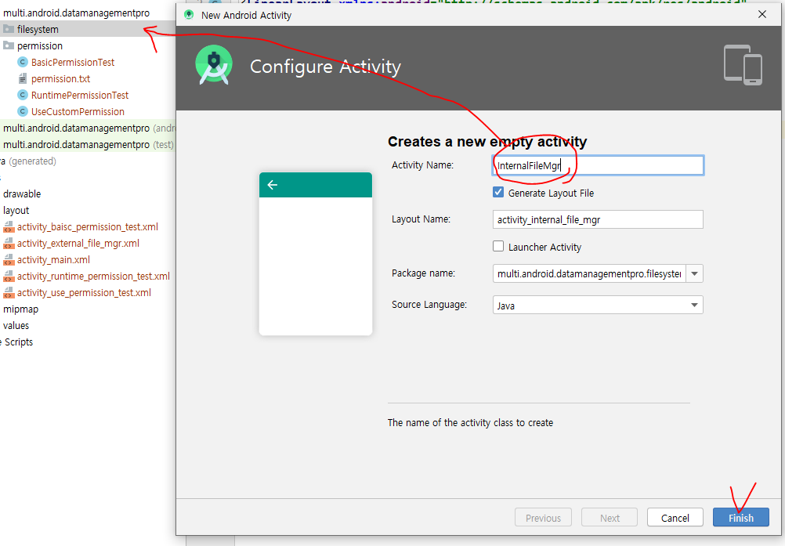


* 내부저장소에 저장

  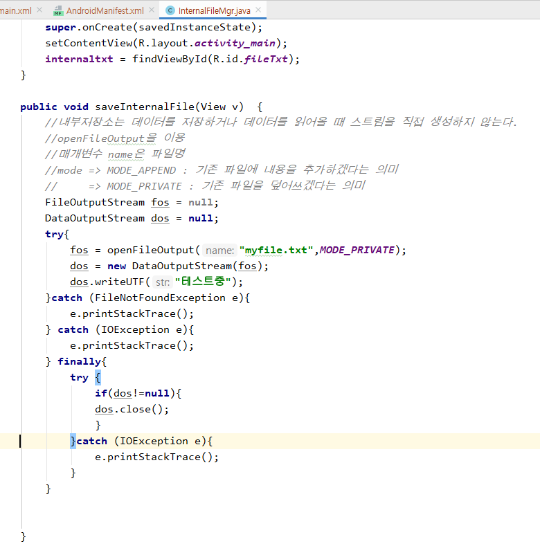

  

* 저장된 것을 읽어오기

  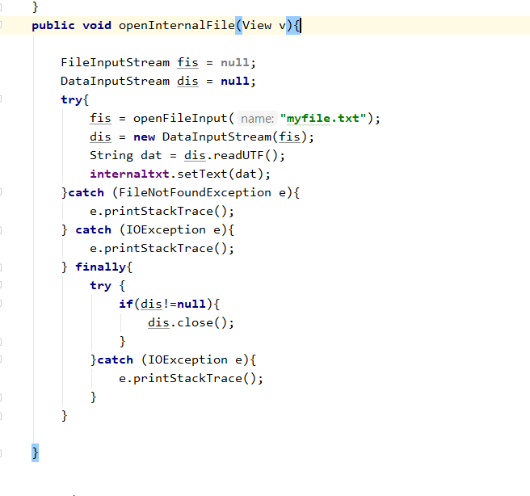


## 외부저장소 접근 권한

* 외부저장소 (sdcard에 저장 등등)

external 은 권한에 대한 설정을 해줘야 한다. 

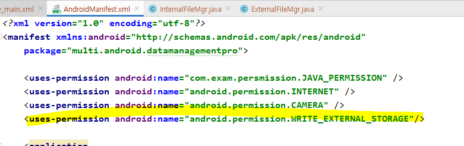

버전이 올라가면서 설정이 바뀌었기때문에, 이전 버전 것을 사용하는 코드를 추가한다.

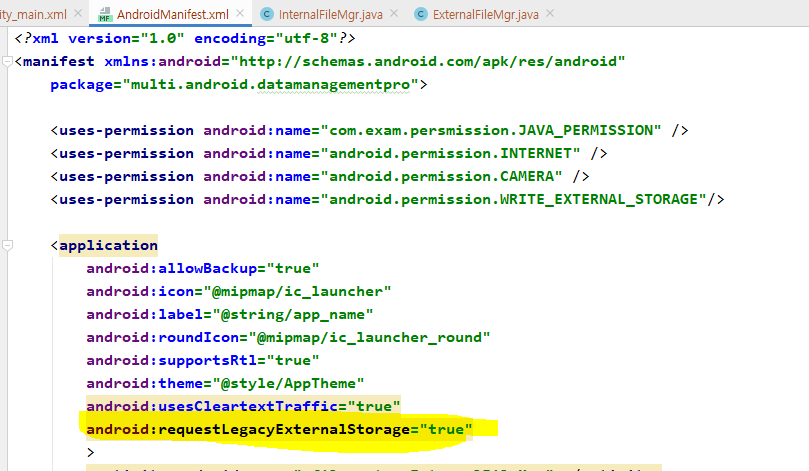


* externalFileMgr.java

  일단 간단하게 권한 설정 창과 선택에 대한 문구,
  저장하기 버튼을 눌렀을 때의 피드백 코드

  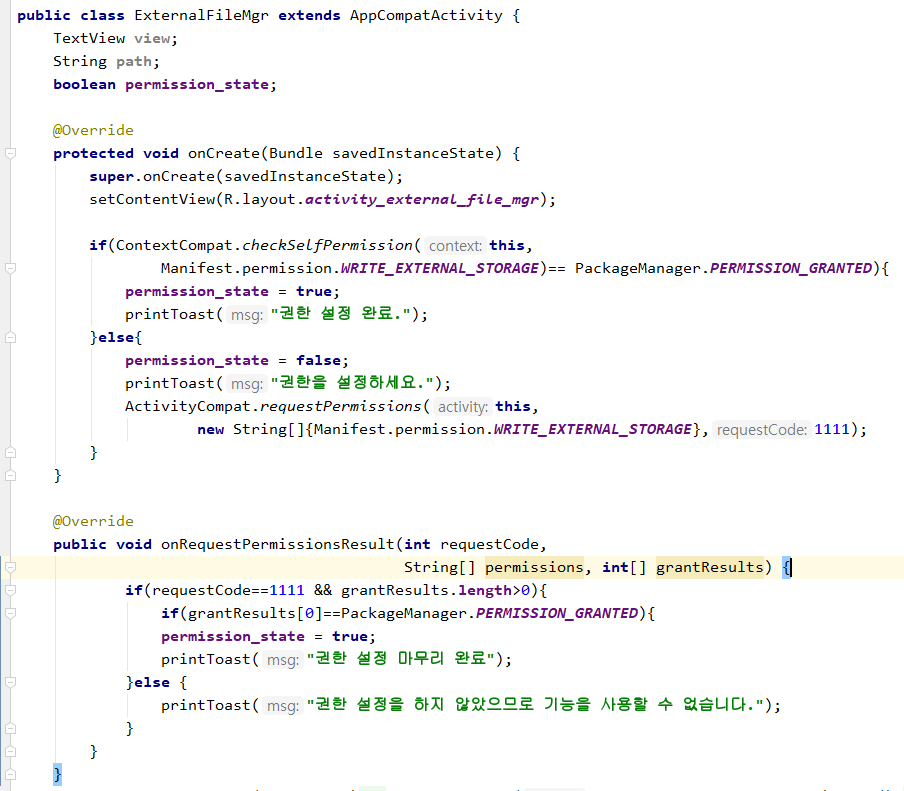

  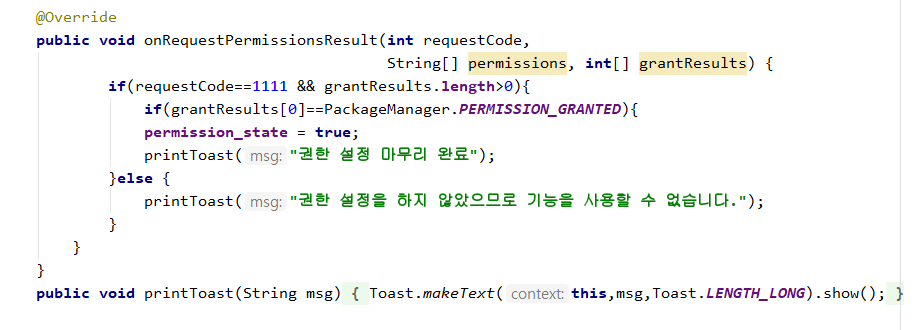

  ```java
  package multi.android.datamanagementpro.filesystem;
  
  import androidx.annotation.NonNull;
  import androidx.appcompat.app.AppCompatActivity;
  import androidx.core.app.ActivityCompat;
  import androidx.core.content.ContextCompat;
  
  import android.Manifest;
  import android.content.Intent;
  import android.content.pm.PackageManager;
  import android.os.Bundle;
  import android.provider.MediaStore;
  import android.view.View;
  import android.widget.TextView;
  import android.widget.Toast;
  
  import java.io.DataOutputStream;
  import java.io.FileNotFoundException;
  import java.io.FileOutputStream;
  import java.io.IOException;
  
  import multi.android.datamanagementpro.R;
  
  public class ExternalFileMgr extends AppCompatActivity {
      TextView view;
      String path;
      boolean permission_state;
  
      @Override
      protected void onCreate(Bundle savedInstanceState) {
          super.onCreate(savedInstanceState);
          setContentView(R.layout.activity_external_file_mgr);
  
          if(ContextCompat.checkSelfPermission(this,
                  Manifest.permission.WRITE_EXTERNAL_STORAGE)== PackageManager.PERMISSION_GRANTED){
              permission_state = true;
              printToast("권한 설정 완료.");
          }else{
              permission_state = false;
              printToast("권한을 설정하세요.");
              ActivityCompat.requestPermissions(this,
                      new String[]{Manifest.permission.WRITE_EXTERNAL_STORAGE},1111);
          }
      }
      
  
      @Override
      public void onRequestPermissionsResult(int requestCode,
                                             String[] permissions, int[] grantResults) {
  
              if(requestCode==1111 && grantResults.length>0){
                  if(grantResults[0]==PackageManager.PERMISSION_GRANTED){
                  permission_state = true;
                  printToast("권한 설정 마무리 완료");
              }else {
                  printToast("권한 설정을 하지 않았으므로 기능을 사용할 수 없습니다.");
              }
          }
  
      }
      public void printToast(String msg){
          Toast.makeText(this,msg,Toast.LENGTH_LONG).show();
      }
  
      public void saveExternalFileSystem(View v){
          if(permission_state){ //permission_state가 true일 때만 실행
              printToast("권한설정완료");
            
          }else{
              printToast("권한을 설정해야 이 기능을 사용할 수 있습니다.");
              //권한을 설정할 수 있는 Activity로 자동 이동되도록 구현
          }
  
      }
  }
  
  ```


* 그 다음에는 [저장하기] 버튼을 눌렀을 때 외부저장소 경로에 파일이 추가되도록 코드를 작성한다.

  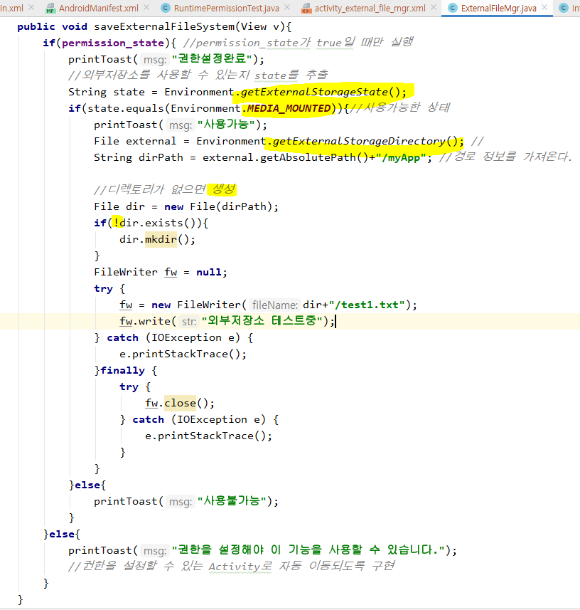


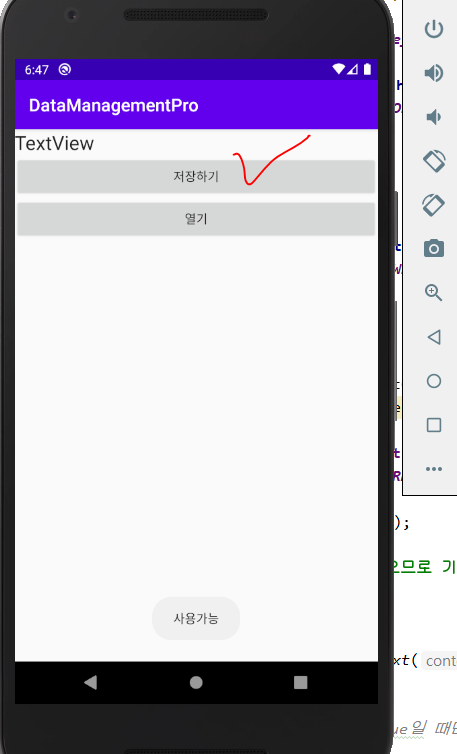


* 실행 결과 : 저장하기 버튼을 누르니 sdcard에 myapp / test1.txt 파일이 생성되었다.

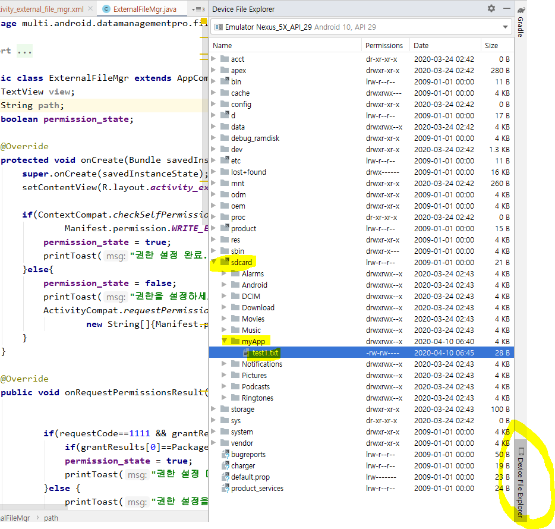


* ExternalFileMgr.java 전체코드

```java
package multi.android.datamanagementpro.filesystem;

import androidx.annotation.NonNull;
import androidx.appcompat.app.AppCompatActivity;
import androidx.core.app.ActivityCompat;
import androidx.core.content.ContextCompat;

import android.Manifest;
import android.content.Intent;
import android.content.pm.PackageManager;
import android.media.audiofx.EnvironmentalReverb;
import android.os.Bundle;
import android.os.Environment;
import android.provider.MediaStore;
import android.view.View;
import android.widget.TextView;
import android.widget.Toast;

import java.io.DataOutputStream;
import java.io.File;
import java.io.FileNotFoundException;
import java.io.FileOutputStream;
import java.io.FileWriter;
import java.io.IOException;

import multi.android.datamanagementpro.R;

public class ExternalFileMgr extends AppCompatActivity {
    TextView view;
    String path;
    boolean permission_state;

    @Override
    protected void onCreate(Bundle savedInstanceState) {
        super.onCreate(savedInstanceState);
        setContentView(R.layout.activity_external_file_mgr);

        if(ContextCompat.checkSelfPermission(this,
                Manifest.permission.WRITE_EXTERNAL_STORAGE)== PackageManager.PERMISSION_GRANTED){
            permission_state = true;
            printToast("권한 설정 완료.");
        }else{
            permission_state = false;
            printToast("권한을 설정하세요.");
            ActivityCompat.requestPermissions(this,
                    new String[]{Manifest.permission.WRITE_EXTERNAL_STORAGE},1111);
        }
    }

    @Override
    public void onRequestPermissionsResult(int requestCode,
                                           String[] permissions, int[] grantResults) {
            if(requestCode==1111 && grantResults.length>0){
                if(grantResults[0]==PackageManager.PERMISSION_GRANTED){
                permission_state = true;
                printToast("권한 설정 마무리 완료");
            }else {
                printToast("권한 설정을 하지 않았으므로 기능을 사용할 수 없습니다.");
            }
        }
    }
    public void printToast(String msg){
        Toast.makeText(this,msg,Toast.LENGTH_LONG).show();
    }

    public void saveExternalFileSystem(View v){
        if(permission_state){ //permission_state가 true일 때만 실행
            printToast("권한설정완료");
            //외부저장소를 사용할 수 있는지 state를 추출
            String state = Environment.getExternalStorageState();
            if(state.equals(Environment.MEDIA_MOUNTED)){//사용가능한 상태
                printToast("사용가능");
                File external = Environment.getExternalStorageDirectory(); //
                String dirPath = external.getAbsolutePath()+"/myApp"; //경로 정보를 가져온다.

                //디렉토리가 없으면 생성
                File dir = new File(dirPath);
                if(!dir.exists()){
                    dir.mkdir();
                }
                FileWriter fw = null;
                try {
                    fw = new FileWriter(dir+"/test1.txt");
                    fw.write("외부저장소 테스트중");
                } catch (IOException e) {
                    e.printStackTrace();
                }finally {
                    try {
                        fw.close();
                    } catch (IOException e) {
                        e.printStackTrace();
                    }
                }
            }else{
                printToast("사용불가능");
            }
        }else{
            printToast("권한을 설정해야 이 기능을 사용할 수 있습니다.");
            //권한을 설정할 수 있는 Activity로 자동 이동되도록 구현
        }
    }
}

```


* 이번엔 경로를 패키지명으로 저장되게끔 수정한다.

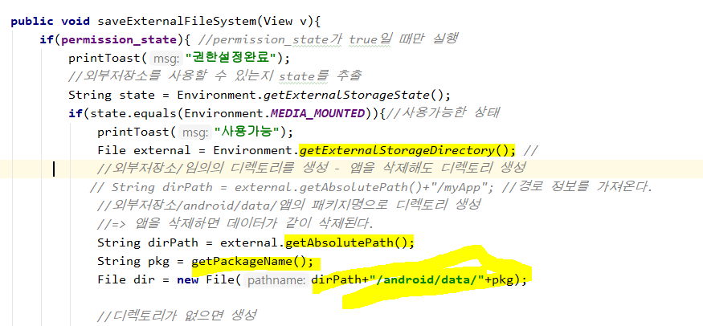


* 패키지명으로 디렉토리가 생겼음을 알 수 있다.

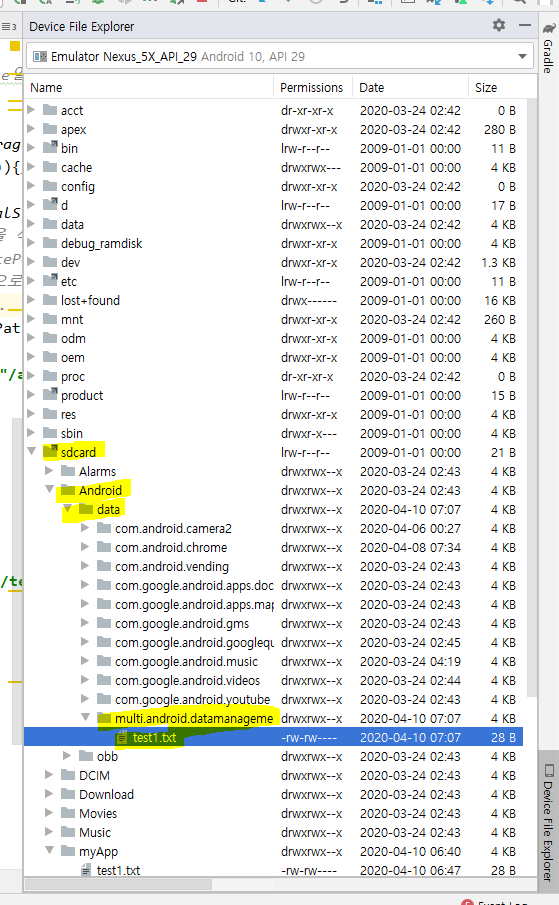


* 이번엔 앱을 삭제하고 디렉토리를 확인해본다.

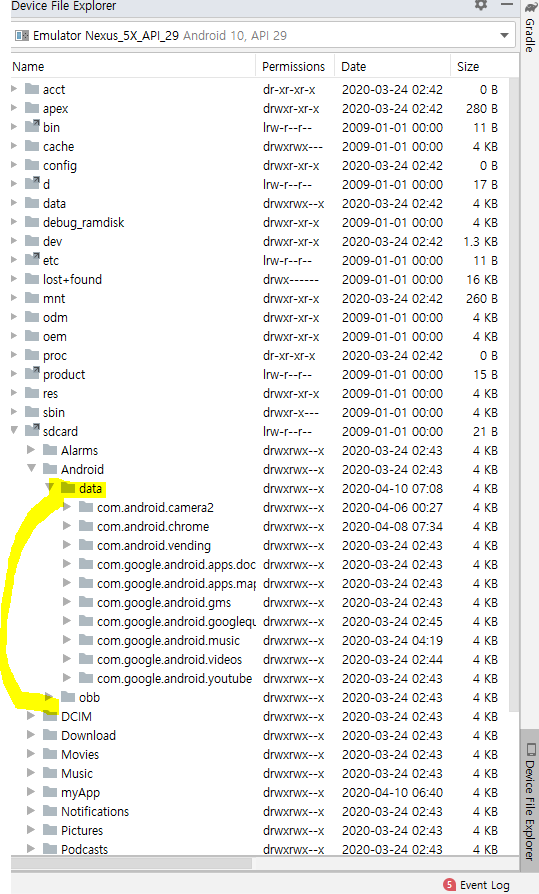

앱을 삭제하니 관련 데이터가 사라졌음을 알 수 있다.