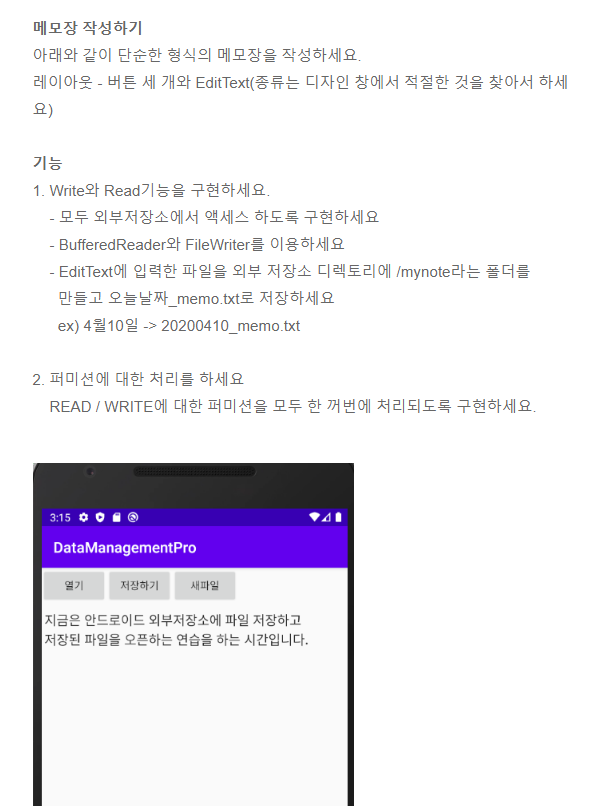

# 메모장 작성 예제 : 파일 입출력



* SimpleNote.java

```java
package multi.android.datamanagementpro.filesystem;

import androidx.annotation.NonNull;
import androidx.annotation.RequiresApi;
import androidx.appcompat.app.AppCompatActivity;
import androidx.core.app.ActivityCompat;
import androidx.core.content.ContextCompat;

import android.Manifest;
import android.content.pm.PackageManager;
import android.icu.text.SimpleDateFormat;
import android.os.Build;
import android.os.Bundle;
import android.os.Environment;
import android.view.View;
import android.widget.EditText;
import android.widget.TextView;
import android.widget.Toast;

import java.io.BufferedReader;
import java.io.DataInputStream;
import java.io.File;
import java.io.FileInputStream;
import java.io.FileNotFoundException;
import java.io.FileReader;
import java.io.FileWriter;
import java.io.IOException;
import java.io.InputStream;
import java.io.InputStreamReader;
import java.util.Calendar;
import java.util.Date;
import java.util.Locale;

import multi.android.datamanagementpro.R;

@RequiresApi(api = Build.VERSION_CODES.N)
public class SimpleNote extends AppCompatActivity {
    EditText memo;
    boolean permission_state;


    @Override
    protected void onCreate(Bundle savedInstanceState) {
        super.onCreate(savedInstanceState);
        setContentView(R.layout.simplenote);
        memo = findViewById(R.id.memotxt);

        if (ContextCompat.checkSelfPermission(this,
                Manifest.permission.WRITE_EXTERNAL_STORAGE) == PackageManager.PERMISSION_GRANTED) {
            permission_state = true;
            printToast("권한 설정 완료.");
        } else {
            permission_state = false;
            printToast("권한을 설정하세요.");
            ActivityCompat.requestPermissions(this,
                    new String[]{Manifest.permission.WRITE_EXTERNAL_STORAGE}, 1111);
        }
    }

    public void printToast(String msg) {
        Toast.makeText(this, msg, Toast.LENGTH_SHORT).show();
    }

    @Override
    public void onRequestPermissionsResult(int requestCode, @NonNull String[] permissions, @NonNull int[] grantResults) {
        if (grantResults[0] == PackageManager.PERMISSION_GRANTED) {
            if (requestCode == 1111 && grantResults.length > 0) {
                permission_state = true;
                printToast("권한 설정 마무리 완료");
            } else {
            printToast("권한 설정을 하지 않았으므로 기능을 사용할 수 없습니다.");
        }
    }
    }

    //퍼미션을 한꺼번에 처리하는 메소드
    public boolean permissionit(){
        boolean checki = false;
        if(permission_state){
            printToast("권한설정완료");
            //외부저장소를 사용할 수 있는지 state를 추출
            String state = Environment.getExternalStorageState();
            if(state.equals(Environment.MEDIA_MOUNTED)){//사용가능한 상태
                checki = true;
            }else{
                printToast("사용불가능");
            }

        }else{
            printToast("권한을 설정해야 이 기능을 사용할 수 있습니다.");
            checki = false;
        }
        return checki;
    }

    //메모를 불러오는 메소드
    public void openmemo(View v){

            DataInputStream dis = null;
            if(permissionit()){

                 SimpleDateFormat formatter = new SimpleDateFormat("yyyyMMdd", Locale.KOREA);
                 Date date = new Date();
                String currentDate = formatter.format(date);

                printToast("메모를 읽어옵니다.");
                File external = Environment.getExternalStorageDirectory(); //
                String dirPath = external.getAbsolutePath() + "/mynote";
                File dir = new File(dirPath);

                String path  = dir+"/"+currentDate+"_memo.txt";
                if(!dir.exists()){
                    printToast("저장된 메모가 없습니다.");
                }
                try {
                    StringBuffer strBuffer = new StringBuffer();
                    InputStream is = new FileInputStream(path);
                    BufferedReader br = new BufferedReader(new InputStreamReader(is));
                    String line="";

                    while((line=br.readLine())!=null){
                        strBuffer.append(line+"\n");
                    }

                    memo.setText(strBuffer);
                    br.close();
                    is.close();

                } catch (FileNotFoundException e) {
                    e.printStackTrace();
                } catch (IOException e) {
                    e.printStackTrace();
                } finally {
                    try {
                        if (dis != null) {
                            dis.close();
                        }
                    } catch (IOException e) {
                        e.printStackTrace();
                    }
                }
            }
    }


    //메모를 저장하는 메소드
    public void savememo(View v){
        if(permissionit()) {
            SimpleDateFormat formatter = new SimpleDateFormat("yyyyMMdd", Locale.KOREA);
            Date date = new Date();
            String currentDate = formatter.format(date);

            printToast("메모를 저장했습니다.");
            File external = Environment.getExternalStorageDirectory(); //
            String dirPath = external.getAbsolutePath() + "/mynote"; //경로 정보를 가져온다.

            //디렉토리가 없으면 생성
            File dir = new File(dirPath);
            if (!dir.exists()) {
                dir.mkdir();
            }
            FileWriter fw = null;
            try {
                fw = new FileWriter(dir + "/" + currentDate + "_memo.txt");
                fw.write(memo.getText() + "");
            } catch (IOException e) {
                e.printStackTrace();
            } finally {
                try {
                    fw.close();
                } catch (IOException e) {
                    e.printStackTrace();
                }

            }

        }
    }

    //새 파일을 불러오는 메소드
    public void newmemo(View v){

       if(permissionit()){
           memo.setText("");
       }
    }


}
```


* simplenote.xml

```
<?xml version="1.0" encoding="utf-8"?>
<LinearLayout xmlns:android="http://schemas.android.com/apk/res/android"
    xmlns:app="http://schemas.android.com/apk/res-auto"
    xmlns:tools="http://schemas.android.com/tools"
    android:layout_width="match_parent"
    android:layout_height="match_parent"
    tools:context=".filesystem.SimpleNote"
    android:orientation="vertical">

    <LinearLayout
        android:layout_width="match_parent"
        android:layout_height="wrap_content"
        android:orientation="horizontal">

        <Button
            android:id="@+id/openbtn"
            android:layout_width="wrap_content"
            android:layout_height="wrap_content"
            android:text="열기"
            android:onClick="openmemo"/>

        <Button
            android:id="@+id/savebtn"
            android:layout_width="wrap_content"
            android:layout_height="wrap_content"
            android:text="저장하기"
            android:onClick="savememo"/>

        <Button
            android:id="@+id/newbtn"
            android:layout_width="wrap_content"
            android:layout_height="wrap_content"
            android:text="새 파일"
            android:layout_gravity="right"
            android:onClick="newmemo"/>


    </LinearLayout>

    <EditText
        android:id="@+id/memotxt"
        android:layout_width="match_parent"
        android:layout_height="wrap_content"
        />


</LinearLayout>
```