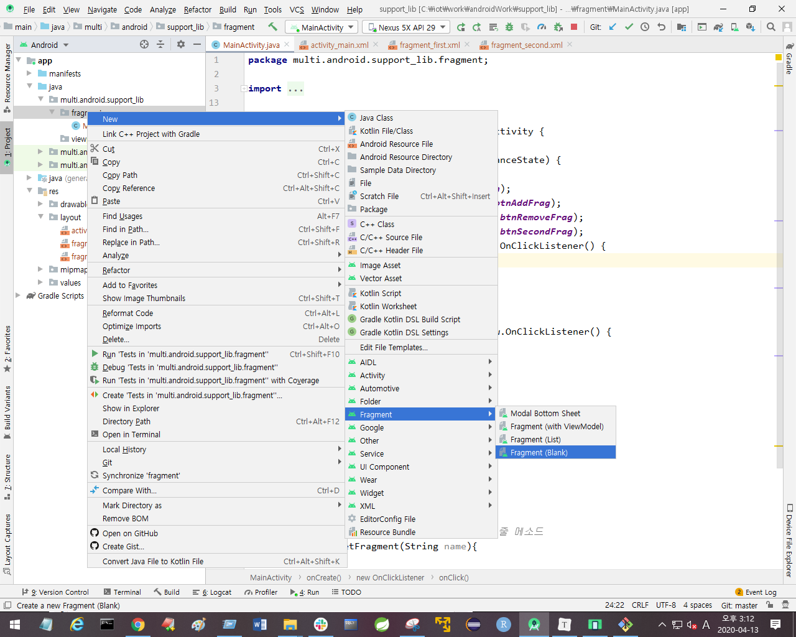
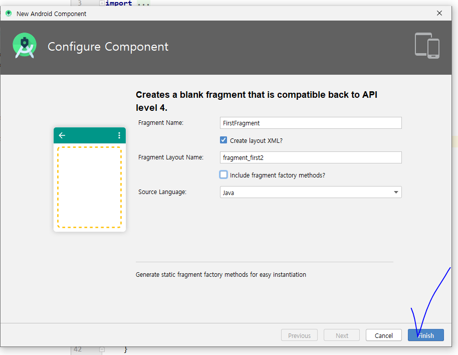
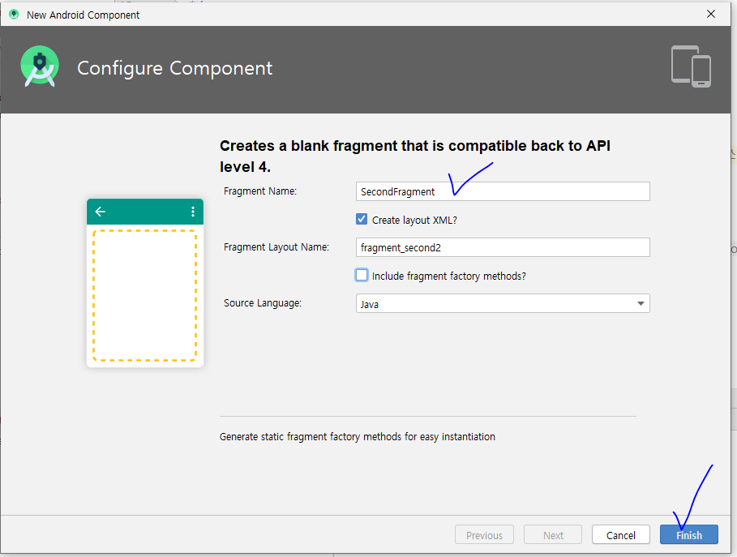
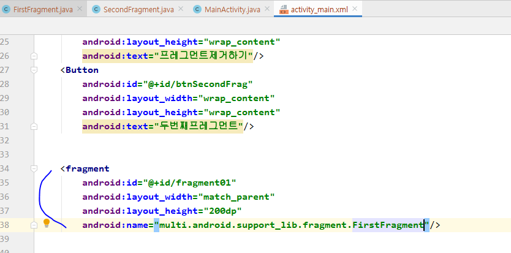
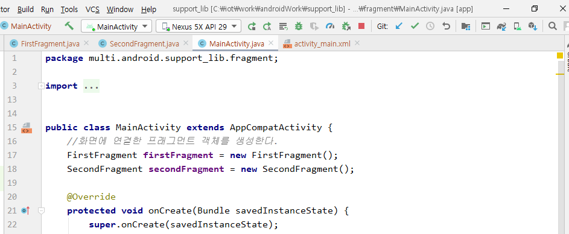
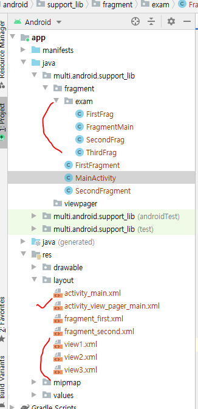
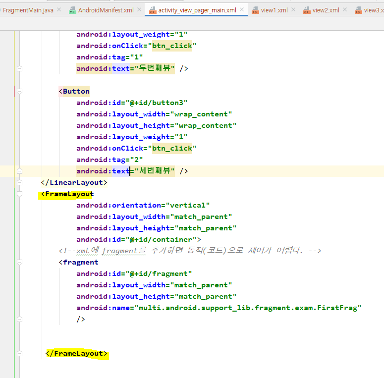

페이스북 같이 화면의 영역을 나누고, 화면 바뀌는 것

Spring의 Tiles






`onCreateView()`: fragment뷰가 만들어질 때 호출되는 메소드









메인이라는 액티비티에 종속적이다. => LifeCycle이 다나눠져있다.


## 실습

https://blog.naver.com/PostList.nhn?blogId=heaves1&from=postList&categoryNo=189&parentCategoryNo=189



```xml
<?xml version="1.0" encoding="utf-8"?>
<LinearLayout xmlns:android="http://schemas.android.com/apk/res/android"
    xmlns:app="http://schemas.android.com/apk/res-auto"
    xmlns:tools="http://schemas.android.com/tools"
    android:layout_width="match_parent"
    android:layout_height="match_parent"
    android:orientation="vertical">

    <LinearLayout
        android:layout_width="match_parent"
        android:layout_height="wrap_content"
        android:orientation="horizontal">

        <Button
            android:id="@+id/button"
            android:layout_width="wrap_content"
            android:layout_height="wrap_content"
            android:layout_weight="1"
            android:onClick="btn_click"
            android:tag="0"
            android:text="첫번째뷰" />

        <Button
            android:id="@+id/button2"
            android:layout_width="wrap_content"
            android:layout_height="wrap_content"
            android:layout_weight="1"
            android:onClick="btn_click"
            android:tag="1"
            android:text="두번째뷰" />

        <Button
            android:id="@+id/button3"
            android:layout_width="wrap_content"
            android:layout_height="wrap_content"
            android:layout_weight="1"
            android:onClick="btn_click"
            android:tag="2"
            android:text="세번째뷰" />
    </LinearLayout>
    <LinearLayout
            android:orientation="vertical"
            android:layout_width="match_parent"
            android:layout_height="match_parent"
            android:id="@+id/container">

        <fragment
            android:id="@+id/fragment"
            android:layout_width="match_parent"
            android:layout_height="wrap_content"
            android:name="multi.android.support_lib.fragment.exam.FirstFrag"
            android:layout_weight="1"/>


     </LinearLayout>
   


</LinearLayout>
```

```java
package multi.android.support_lib.fragment.exam;

import androidx.appcompat.app.AppCompatActivity;
import androidx.fragment.app.FragmentManager;
import androidx.fragment.app.FragmentTransaction;

import android.os.Bundle;
import android.view.View;
import android.widget.Button;

import multi.android.support_lib.R;
import multi.android.support_lib.fragment.FirstFragment;
import multi.android.support_lib.fragment.SecondFragment;

public class FragmentMain extends AppCompatActivity {

    FirstFrag firstFrag = new FirstFrag();
    SecondFrag secondFrag = new SecondFrag();
    ThirdFrag thirdFrag = new ThirdFrag();

    @Override
    protected void onCreate(Bundle savedInstanceState) {
        super.onCreate(savedInstanceState);
        setContentView(R.layout.activity_view_pager_main);
        Button btnFirst = findViewById(R.id.button);
        Button btnSecond = findViewById(R.id.button2);
        Button btnThird = findViewById(R.id.button3);
        btnFirst.setOnClickListener(new View.OnClickListener() {
            @Override
            public void onClick(View v) {
                setFragment("first");
            }
        });
        btnSecond.setOnClickListener(new View.OnClickListener() {
            @Override
            public void onClick(View v) {
                setFragment("second");
            }
        });
        btnThird.setOnClickListener(new View.OnClickListener() {
            @Override
            public void onClick(View v) {
                setFragment("third");
            }
        });

    }
    public void setFragment(String name){

        FragmentManager fragmentManager = getSupportFragmentManager();
        
        FragmentTransaction transaction = fragmentManager.beginTransaction();

        switch (name){
            case  "first":
                transaction.replace(R.id.container,firstFrag); //(교체할부분, 뭐로교체할지)
                break;
            case "second" :
                transaction.remove(firstFrag);
                transaction.replace(R.id.container,secondFrag);

                break;
            case "third":
                transaction.remove(firstFrag);
                transaction.replace(R.id.container,thirdFrag);
        }

        transaction.commit();

    }

}
```


* LinearLayout대신에 FrameLayout으로 바꾸고, weight 속성을 지워주면 같은 결과로 출력할 수 있다.

  (weight = 1 속성은 LinearLayout속성 때문에 준 것 )

