# ReCyclerView

* 리사이클러뷰는 데이터만 뿌리는게 아니라 레이아웃을 세팅할 수 있다. 

* 기존 리스트뷰가 개선되어 나온 확장판이다.
* 무조건 커스터마이징이필요하다. 
* 어댑터가 있어야한다. -> 어댑터에 뷰홀더가 포함되어있다.


어댑터는 데이터를 전달받아서, 전달받은데이터로 

getview : 로우 하나를만들어내는 메소드


(맨 밑에 전체코드 있음)


## 실습 준비물 : 메인 파일들 

### simple_item.xml : 로우 하나에 대한 디자인 

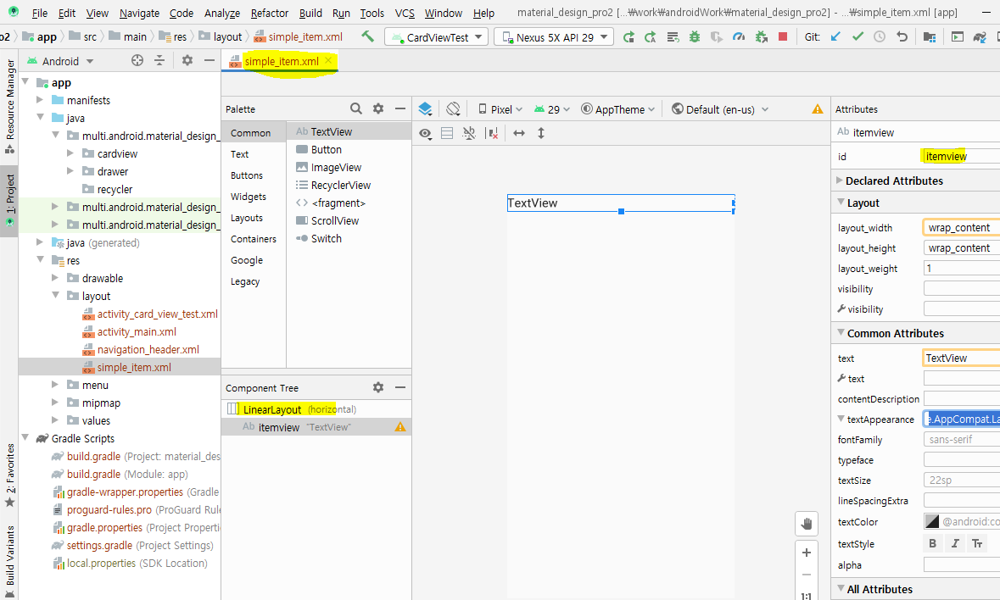


### activity_simple_recycler_test.xml : 리사이클러 뷰

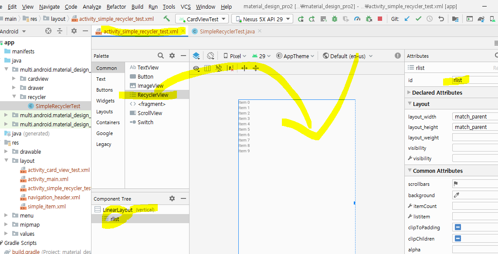


### SimpleItem.java: DTO 생성 

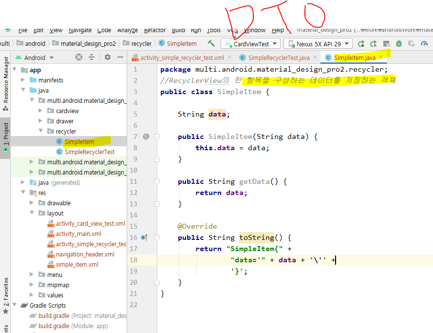


## 코드 작성

1. Recycler에 출력할 데이터 준비
2. Adapter생성
3. Recycler에 레이아웃을 설정
   * LinearLayout, GridLayout
4. Recycler와 adapter를 연결
5. 추가적인 요소들을 적용할 수 있다. - 꾸미기, 애니메이션


### 1. Recycler에 출력할 데이터 준비

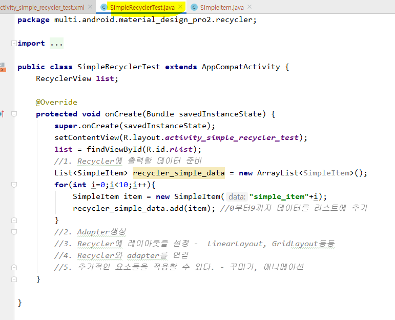


### 2. Adapter생성 : SimpleItemAdapter.java 파일 생성


xml로 부터 뷰(한 row에 대한 뷰)를 만들어서 ViewHolder 넘기는 작업
ViewHolder는 View를 구성하는 구성요소의 리소스를 가져오는 작업을 하는 객체

1) onCreateViewHolder에서 row에 대한 뷰를 inflate해서 생성

2) ViewHolder객체를 만들어서 1번에서 생성한 뷰를 넘긴다.

3) ViewHolder객체 안에서 onCreateViewHolder메소드에서리턴받은 객체에서 데이터를 연결할 뷰를 찾아온다.

4) onBindViewHolder메소드에서 ViewHolder가 갖고 있는 구성요소에 데이터를 연결하기


* 어댑터 : SimpleTestAdapter.java

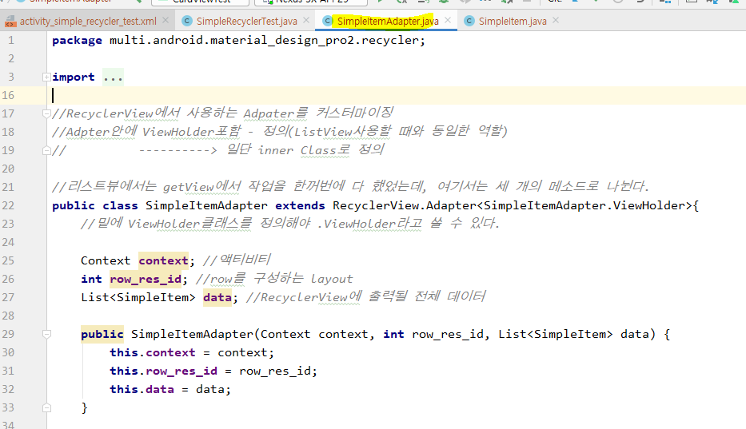

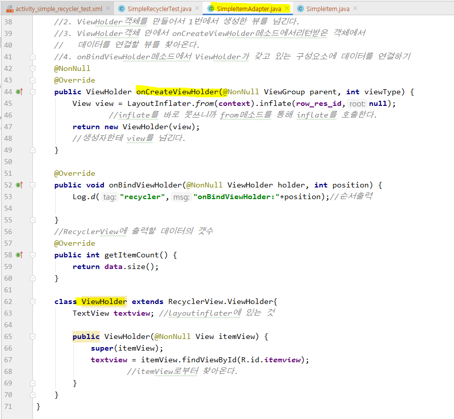

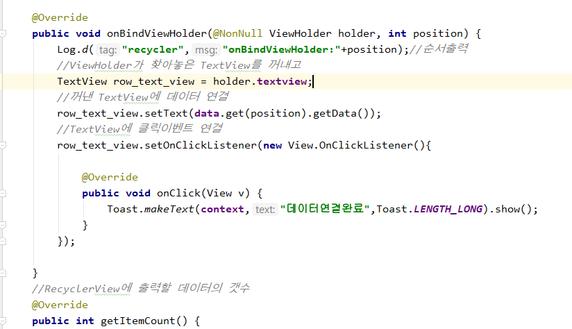


* 메인 : SimpleRecyclerTest.java

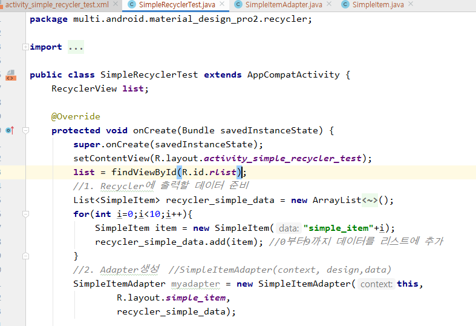


### 3. Recycler에 레이아웃을 설정

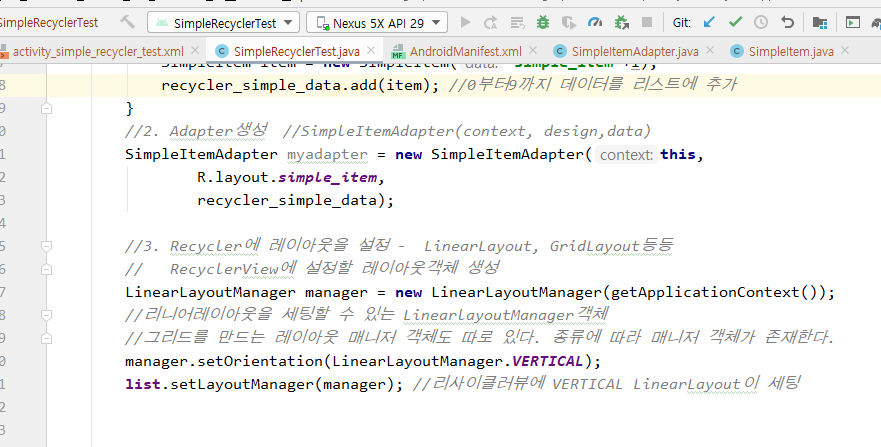


### 4. Recycler와 adapter를 연결

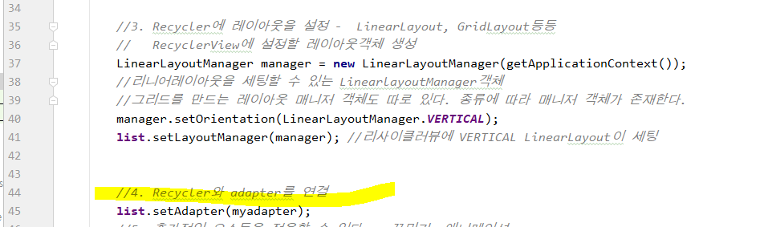


* 여기까지 실행 화면

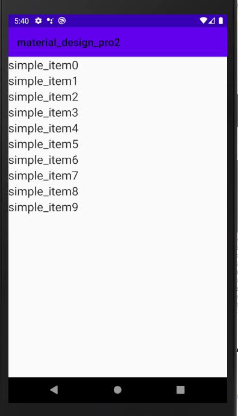

### 5. 추가적인 요소들을 적용할 수 있다. - 꾸미기, 애니메이션

* horizontal로 바꿨을 때

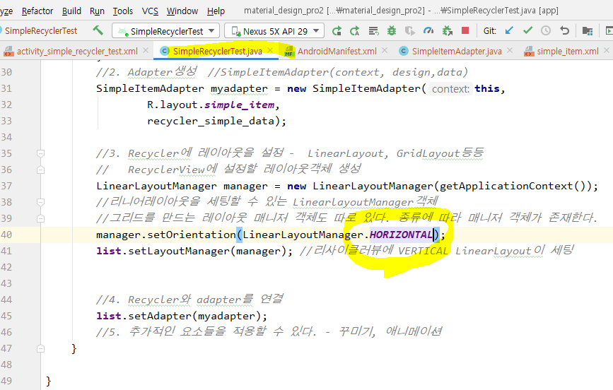

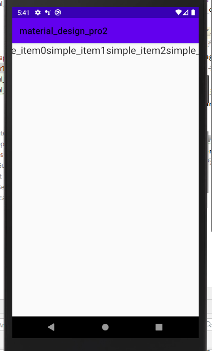

탭으로 활용 가능


* GridLayout로 바꿨을 때

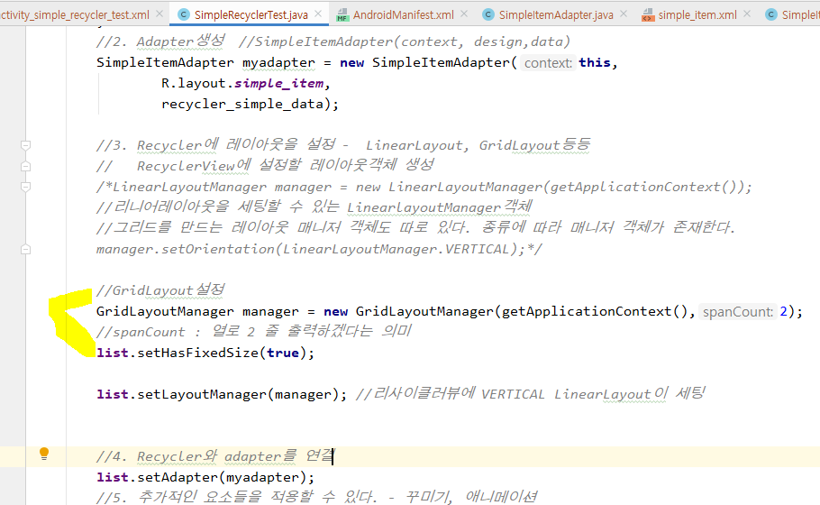

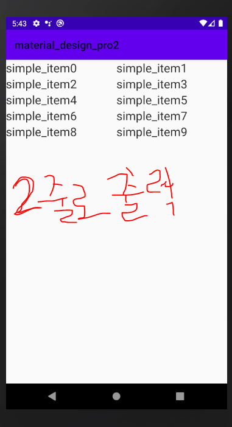


* Simple_item.xml : 로우 하나에 대한 디자인을 변경했을 때

  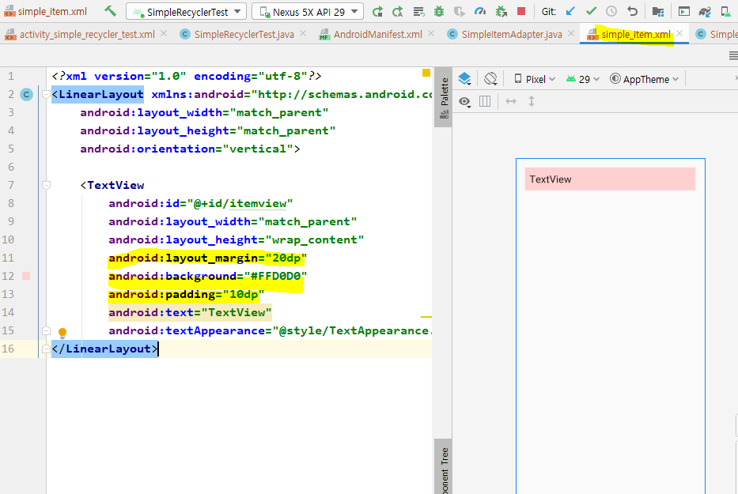

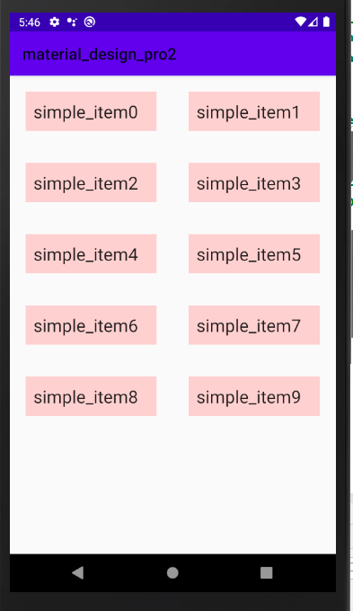


----

## 전체코드


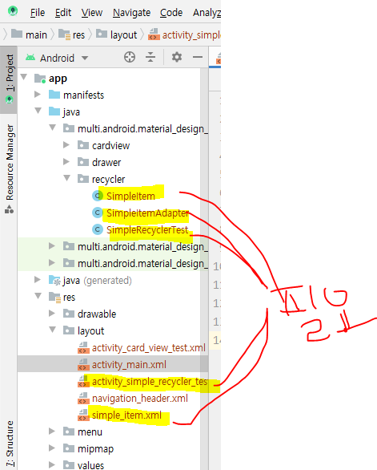

* SimpleRecyclerTest.java (액티비티)

  ```java
  package multi.android.material_design_pro2.recycler;
  
  import androidx.appcompat.app.AppCompatActivity;
  import androidx.recyclerview.widget.GridLayoutManager;
  import androidx.recyclerview.widget.LinearLayoutManager;
  import androidx.recyclerview.widget.RecyclerView;
  
  import android.os.Bundle;
  import android.widget.LinearLayout;
  
  import java.lang.reflect.Array;
  import java.util.ArrayList;
  import java.util.List;
  
  import multi.android.material_design_pro2.R;
  
  public class SimpleRecyclerTest extends AppCompatActivity {
      RecyclerView list;
  
      @Override
      protected void onCreate(Bundle savedInstanceState) {
          super.onCreate(savedInstanceState);
          setContentView(R.layout.activity_simple_recycler_test);
          list = findViewById(R.id.rlist);
          //1. Recycler에 출력할 데이터 준비
          List<SimpleItem> recycler_simple_data = new ArrayList<SimpleItem>();
          for(int i=0;i<10;i++){
              SimpleItem item = new SimpleItem("simple_item"+i);
              recycler_simple_data.add(item); //0부터9까지 데이터를 리스트에 추가
          }
          //2. Adapter생성  //SimpleItemAdapter(context, design,data)
          SimpleItemAdapter myadapter = new SimpleItemAdapter(this,
                  R.layout.simple_item,
                  recycler_simple_data);
  
          //3. Recycler에 레이아웃을 설정 -  LinearLayout, GridLayout등등
          //   RecyclerView에 설정할 레이아웃객체 생성
          LinearLayoutManager manager = new LinearLayoutManager(getApplicationContext());
          //리니어레이아웃을 세팅할 수 있는 LinearlayoutManager객체
          //그리드를 만드는 레이아웃 매니저 객체도 따로 있다. 종류에 따라 매니저 객체가 존재한다.
          manager.setOrientation(LinearLayoutManager.VERTICAL);
  
         /* //GridLayout설정
          GridLayoutManager manager = new GridLayoutManager(getApplicationContext(),2);
          //spanCount : 열로 2 줄 출력하겠다는 의미*/
          list.setHasFixedSize(true);
  
          list.setLayoutManager(manager); //리사이클러뷰에 VERTICAL LinearLayout이 세팅
  
          //4. Recycler와 adapter를 연결
          list.setAdapter(myadapter);
          //5. 추가적인 요소들을 적용할 수 있다. - 꾸미기, 애니메이션
      }
  
  }
  
  
  ```

  

* 어댑터 : SimpleItemAdapter.java

  ```java
  package multi.android.material_design_pro2.recycler;
  
  import android.content.Context;
  import android.util.Log;
  import android.view.LayoutInflater;
  import android.view.View;
  import android.view.ViewGroup;
  import android.widget.TextView;
  import android.widget.Toast;
  
  import androidx.annotation.NonNull;
  import androidx.recyclerview.widget.RecyclerView;
  
  import java.util.List;
  
  import multi.android.material_design_pro2.R;
  
  //RecyclerView에서 사용하는 Adpater를 커스터마이징
  //Adpter안에 ViewHolder포함 - 정의(ListView사용할 때와 동일한 역할)
  //          ----------> 일단 inner Class로 정의
  
  //리스트뷰에서는 getView에서 작업을 한꺼번에 다 했었는데, 여기서는 세 개의 메소드로 나뉜다.
  public class SimpleItemAdapter extends RecyclerView.Adapter<SimpleItemAdapter.ViewHolder>{
      //밑에 ViewHolder클래스를 정의해야 .ViewHolder라고 쓸 수 있다.
  
      Context context; //액티비티
      int row_res_id; //row를 구성하는 layout
      List<SimpleItem> data; //RecyclerView에 출력될 전체 데이터
  
      public SimpleItemAdapter(Context context, int row_res_id, List<SimpleItem> data) {
          this.context = context;
          this.row_res_id = row_res_id;
          this.data = data;
      }
  
      //xml로 부터 뷰(한 row에 대한 뷰)를 만들어서 ViewHolder 넘기는 작업
      //ViewHolder는 View를 구성하는 구성요소의 리소스를 가져오는 작업을 하는 객체
      //1. onCreateViewHolder에서 row에 대한 뷰를 inflate해서 생성
      //2. ViewHolder객체를 만들어서 1번에서 생성한 뷰를 넘긴다.
      //3. ViewHolder객체 안에서 onCreateViewHolder메소드에서리턴받은 객체에서
      //   데이터를 연결할 뷰를 찾아온다.
      //4. onBindViewHolder메소드에서 ViewHolder가 갖고 있는 구성요소에 데이터를 연결하기
      @NonNull
      @Override
      public ViewHolder onCreateViewHolder(@NonNull ViewGroup parent, int viewType) {
          View view = LayoutInflater.from(context).inflate(row_res_id,null);
                  //inflate를 바로 못쓰니까 from메소드를 통해 inflate를 호출한다.
          return new ViewHolder(view);
          //생성자한테 view를 넘긴다.
      }
  
      @Override
      public void onBindViewHolder(@NonNull ViewHolder holder, int position) {
          Log.d("recycler","onBindViewHolder:"+position);//순서출력
          //ViewHolder가 찾아놓은 TextView를 꺼내고
          TextView row_text_view = holder.textview;
          //꺼낸 TextView에 데이터 연결
          row_text_view.setText(data.get(position).getData());
          //TextView에 클릭이벤트 연결
          row_text_view.setOnClickListener(new View.OnClickListener(){
  
              @Override
              public void onClick(View v) {
                  Toast.makeText(context,"데이터연결완료",Toast.LENGTH_LONG).show();
              }
          });
  
      }
      //RecyclerView에 출력할 데이터의 갯수
      @Override
      public int getItemCount() {
          return data.size();
      }
  
      class ViewHolder extends RecyclerView.ViewHolder{
          TextView textview; //layoutinflater에 있는 것
  
          public ViewHolder(@NonNull View itemView) {
              super(itemView);
              textview = itemView.findViewById(R.id.itemview);
                      //itemView로부터 찾아온다.
          }
      }
  }
  ```

  

* DTO : SimpleItem.java

```java
package multi.android.material_design_pro2.recycler;
//RecyclerView의 한 항목을 구성하는 데이터를 저장하는 객체
public class SimpleItem {

    String data;

    public SimpleItem(String data) {
        this.data = data;
    }

    public String getData() {
        return data;
    }

    @Override
    public String toString() {
        return "SimpleItem{" +
                "data='" + data + '\'' +
                '}';
    }
}
```


* row 하나에 대한 디자인 : simple_item.xml

```xml
<?xml version="1.0" encoding="utf-8"?>
<LinearLayout xmlns:android="http://schemas.android.com/apk/res/android"
    android:layout_width="match_parent"
    android:layout_height="match_parent"
    android:orientation="vertical">

    <TextView
        android:id="@+id/itemview"
        android:layout_width="match_parent"
        android:layout_height="wrap_content"
        android:layout_margin="20dp"
        android:background="#FFD0D0"
        android:padding="10dp"
        android:text="TextView"
        android:textAppearance="@style/TextAppearance.AppCompat.Large" />
</LinearLayout>
```


* 리사이클러뷰 메인 xml : activity_simple_recycler_test.xml

  ```xml
  <?xml version="1.0" encoding="utf-8"?>
  <LinearLayout xmlns:android="http://schemas.android.com/apk/res/android"
      xmlns:app="http://schemas.android.com/apk/res-auto"
      xmlns:tools="http://schemas.android.com/tools"
      android:layout_width="match_parent"
      android:layout_height="match_parent"
      tools:context=".recycler.SimpleRecyclerTest"
      android:orientation="vertical">
  
      <androidx.recyclerview.widget.RecyclerView
          android:id="@+id/rlist"
          android:layout_width="match_parent"
          android:layout_height="match_parent" />
  </LinearLayout>
  ```


---


# 실습1 : RecyclerImageCircle

* CircleImageRecyclerTest.Activity

  ```java
  package multi.android.material_design_pro2.recycler;
  
  import androidx.appcompat.app.AppCompatActivity;
  import androidx.recyclerview.widget.GridLayoutManager;
  import androidx.recyclerview.widget.LinearLayoutManager;
  import androidx.recyclerview.widget.RecyclerView;
  
  import android.os.Bundle;
  
  import java.util.ArrayList;
  import java.util.List;
  
  import multi.android.material_design_pro2.R;
  
  public class CircleImageRecyclerTest extends AppCompatActivity {
  
      RecyclerView list;
  
      @Override
      protected void onCreate(Bundle savedInstanceState) {
          super.onCreate(savedInstanceState);
          setContentView(R.layout.activity_circle_image_recycler_test);
          list = findViewById(R.id.rlist);
          CircleItem item;
          List<CircleItem> recycler_simple_data = new ArrayList<CircleItem>();
  
          item = new CircleItem(R.drawable.gong);
          recycler_simple_data.add(item);
          item = new CircleItem(R.drawable.jang);
          recycler_simple_data.add(item);
          item = new CircleItem(R.drawable.jung);
          recycler_simple_data.add(item);
          item = new CircleItem(R.drawable.lee);
          recycler_simple_data.add(item);
          item = new CircleItem(R.drawable.so);
          recycler_simple_data.add(item);
  
          RecyclerCircleAdapter myadapter = new RecyclerCircleAdapter(this,
                  R.layout.circle_item,
                  recycler_simple_data);
  
          GridLayoutManager manager = new GridLayoutManager(getApplicationContext(),2);
          list.setHasFixedSize(true);
  
          list.setLayoutManager(manager);
  
          list.setAdapter(myadapter);
      }
  }
  
  ```


* CircleItme.java

  ```java
  package multi.android.material_design_pro2.recycler;
  
  public class CircleItem {
  
      int circleimg;
  
      public CircleItem(int img) {
          this.circleimg = img;
      }
  
      public int getCircleimg() {
          return circleimg;
      }
  
  }
  
  ```

  


* RecyclerCircleAdapter

  ```java
  package multi.android.material_design_pro2.recycler;
  
  import android.content.Context;
  import android.util.Log;
  import android.view.LayoutInflater;
  import android.view.View;
  import android.view.ViewGroup;
  import android.widget.ImageView;
  
  import androidx.annotation.NonNull;
  import androidx.recyclerview.widget.RecyclerView;
  
  import java.util.List;
  
  import de.hdodenhof.circleimageview.CircleImageView;
  import multi.android.material_design_pro2.R;
  
  public class RecyclerCircleAdapter extends RecyclerView.Adapter<RecyclerCircleAdapter.ViewHolder> {
  
      Context context;
      int row_res_id;
      List<CircleItem> data;
  
      public RecyclerCircleAdapter(Context context, int row_res_id, List<CircleItem> data) {
          this.context = context;
          this.row_res_id = row_res_id;
          this.data = data;
          Log.d("recycler",data.size()+"");
      }
  
      @NonNull
      @Override
      public ViewHolder onCreateViewHolder(@NonNull ViewGroup parent, int viewType) {
          View view = LayoutInflater.from(context).inflate(row_res_id,null);
          return new ViewHolder(view);
      }
  
      @Override
      public void onBindViewHolder(@NonNull ViewHolder holder, int position) {
          Log.d("recycler",data.get(position)+"....."+data.get(position).getCircleimg());
          CircleImageView row_image_view = holder.imgview;
          row_image_view.setImageResource(data.get(position).getCircleimg());
      }
  
      @Override
      public int getItemCount() {
          return data.size();
      }
  
      class ViewHolder extends RecyclerView.ViewHolder{
          CircleImageView imgview; //layoutinflater에 있는 것
  
          public ViewHolder(@NonNull View itemView) {
              super(itemView);
              imgview = itemView.findViewById(R.id.itemview);
              //itemView로부터 찾아온다.
          }
      }
  
  }
  
  ```


* activity_circle_image_recycler_test.xml

```xml
<?xml version="1.0" encoding="utf-8"?>
<LinearLayout xmlns:android="http://schemas.android.com/apk/res/android"
    xmlns:app="http://schemas.android.com/apk/res-auto"
    xmlns:tools="http://schemas.android.com/tools"
    android:layout_width="match_parent"
    android:layout_height="match_parent"
    android:orientation="vertical"
    >

    <androidx.recyclerview.widget.RecyclerView
        android:id="@+id/rlist"
        android:layout_width="match_parent"
        android:layout_height="match_parent"
        android:layout_gravity="center"
        />
</LinearLayout>
```


* circle_item.xml

```xml
<?xml version="1.0" encoding="utf-8"?>
<LinearLayout xmlns:android="http://schemas.android.com/apk/res/android"
    android:layout_width="match_parent"
    android:layout_height="match_parent"
    android:orientation="vertical">

    <de.hdodenhof.circleimageview.CircleImageView
        android:id="@+id/itemview"
        android:layout_width="150dp"
        android:layout_height="150dp"
        />

</LinearLayout>

```


## 실습2 - Recycle Card View

* CardRecTest.java

  ```java
  package multi.android.material_design_pro2.recycler;
  
  import androidx.appcompat.app.AppCompatActivity;
  import androidx.recyclerview.widget.LinearLayoutManager;
  import androidx.recyclerview.widget.RecyclerView;
  
  import android.os.Bundle;
  
  import java.util.ArrayList;
  import java.util.List;
  
  import multi.android.material_design_pro2.R;
  
  public class CardRecTest extends AppCompatActivity {
  
      RecyclerView list;
  
      @Override
      protected void onCreate(Bundle savedInstanceState) {
          super.onCreate(savedInstanceState);
          setContentView(R.layout.activity_card_rec_test);
          list = findViewById(R.id.rlist);
          CardItem item;
          List<CardItem> recycler_simple_data = new ArrayList<CardItem>();
  
          item = new CardItem(R.drawable.lee,"이민호의 신의");
          recycler_simple_data.add(item);
          item = new CardItem(R.drawable.gong,"도깨비의 공유");
          recycler_simple_data.add(item);
          item = new CardItem(R.drawable.so,"미안하다의 소지섭");
          recycler_simple_data.add(item);
  
          RecyclerCardAdapter myadapter = new RecyclerCardAdapter(this,
                  R.layout.card_item,recycler_simple_data);
  
          LinearLayoutManager manager = new LinearLayoutManager(getApplicationContext());
  
          manager.setOrientation(LinearLayoutManager.VERTICAL);
  
          list.setLayoutManager(manager);
          list.setAdapter(myadapter);
      }
  }
  
  ```

  


* CardItem.java

  ```java
  package multi.android.material_design_pro2.recycler;
  
  public class CardItem {
  
      int cardimg;
      String str;
  
      public CardItem(int cardimg, String str) {
          this.cardimg = cardimg;
          this.str = str;
      }
  
      public int getCardimg() {
          return cardimg;
      }
  
      public String getStr() {
          return str;
      }
  }
  
  
  ```


* RecyclerCardAdapter

```java
package multi.android.material_design_pro2.recycler;

import android.content.Context;
import android.view.LayoutInflater;
import android.view.View;
import android.view.ViewGroup;
import android.widget.ImageView;
import android.widget.TextView;

import androidx.annotation.NonNull;
import androidx.recyclerview.widget.RecyclerView;

import java.util.List;

import multi.android.material_design_pro2.R;

public class RecyclerCardAdapter extends RecyclerView.Adapter<RecyclerCardAdapter.ViewHolder> {

    Context context;
    int row_res_id;

    List<CardItem> data;

    public RecyclerCardAdapter(Context context, int row_res_id, List<CardItem> data) {
        this.context = context;
        this.row_res_id = row_res_id;
        this.data = data;
    }

    @NonNull
    @Override
    public ViewHolder onCreateViewHolder(@NonNull ViewGroup parent, int viewType) {
        View view = LayoutInflater.from(context).inflate(row_res_id,null);
        return new ViewHolder(view);
    }

    @Override
    public void onBindViewHolder(@NonNull ViewHolder holder, int position) {
        ImageView row_image_view = holder.imgview;
        TextView row_text_view = holder.txtview;
        row_image_view.setImageResource(data.get(position).getCardimg());
        row_text_view.setText(data.get(position).getStr());
    }

    @Override
    public int getItemCount() {
        return data.size();
    }

    class ViewHolder extends RecyclerView.ViewHolder{
        ImageView imgview; //layoutinflater에 있는 것
        TextView txtview;

        public ViewHolder(@NonNull View itemView) {
            super(itemView);
            imgview = itemView.findViewById(R.id.imageView);
            txtview = itemView.findViewById(R.id.textView);
            //itemView로부터 찾아온다.
        }
    }


}

```


* card_item.xml

  ```xml
  <?xml version="1.0" encoding="utf-8"?>
  <LinearLayout xmlns:android="http://schemas.android.com/apk/res/android"
      xmlns:tools="http://schemas.android.com/tools"
      xmlns:card_view="http://schemas.android.com/apk/res-auto"
      android:layout_width="match_parent"
      android:layout_height="match_parent"
      android:orientation="vertical"
      >
  
      <androidx.cardview.widget.CardView
          android:id="@+id/cardview"
          android:layout_width="match_parent"
          android:layout_height="wrap_content"
          android:layout_margin="20dp"
          card_view:cardCornerRadius="20dp"
          card_view:cardElevation="10dp"
          android:layout_gravity="center">
  
          <LinearLayout
              android:layout_width="match_parent"
              android:layout_height="match_parent"
              android:gravity="center"
              android:orientation="vertical">
  
              <ImageView
                  android:id="@+id/imageView"
                  android:layout_width="wrap_content"
                  android:layout_height="250dp"
                  android:layout_margin="20dp"/>
  
              <TextView
                  android:id="@+id/textView"
                  android:layout_width="match_parent"
                  android:layout_height="wrap_content"
                  android:padding="20dp"
                  android:textAppearance="@style/TextAppearance.AppCompat.Large" />
  
  
  
          </LinearLayout>
  
      </androidx.cardview.widget.CardView>
  
  </LinearLayout>
  ```

  


* activity_card_rec_test.xml

  ```xml
  <?xml version="1.0" encoding="utf-8"?>
  <LinearLayout xmlns:android="http://schemas.android.com/apk/res/android"
      xmlns:app="http://schemas.android.com/apk/res-auto"
      xmlns:tools="http://schemas.android.com/tools"
      android:layout_width="match_parent"
      android:layout_height="match_parent"
      android:orientation="vertical"
      >
  
      <androidx.recyclerview.widget.RecyclerView
          android:id="@+id/rlist"
          android:layout_width="match_parent"
          android:layout_height="match_parent" />
  </LinearLayout>
  ```

  