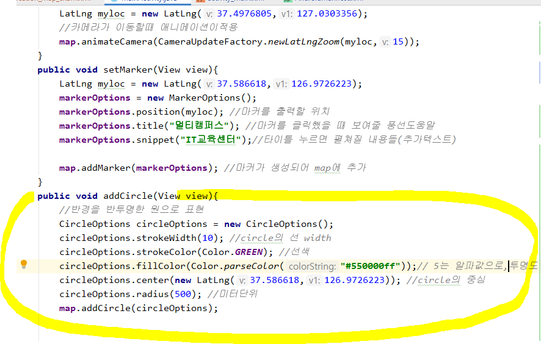

* 지도 사용할 때 이 문서에 적힌 방식대로 활용한다.


_구글맵은 카메라로 지도를 비추고 있는 형태가 모델링되어있기 때문에 이 위치를 찾는데 시간이 걸린다._

_따라서 내부에서 자동으로 전달될 수 있도록 작업 - v2로 바뀌면서 적용된 내용_


```
SupportMapFragment로부터 지도객체를 추출해야 지도에 여러 가지 작업을 처리할 수 있다.
```


1. ```
   OnMapReadyCallback을 구현하고 onMapReady메소드를 오버라이딩
   ```


2. ```
   SupportMapFragment객체에 getMapAsync메소드를 이용해서
     1번에서 구현한 OnMapReadyCallback 객체를 연결
   ```


3. ```
   맵이 준비되었을 때 자동으로 onMapReady메소드가 호출되면서 매개변수로 구글맵이 전달된다.
   ```


4. 위도 경도를 셋팅하고, CameraUpdate객체의 메소드를 사용해본다.


실행결과


너무 멀어서 잘 보이지 않는다.

이번에는 `newLatLngZoom` 메소드를 사용해본다.


이번엔 다른 기능인 카메라위치 객체를 활용해 같은 동작을 수행해 본다.

카메라에 대한 정보를 담고있는 빌더 객체를 활용


결과는 같다.


하지만 코드는 앞에서 한 것이 더 간단하다.


---


* 마커 


* 반경 추가

  

  


### 마커 찍을 때, 예를 들면 여러 식당의 위치를 찍고 싶다면 리스트를 for문으로 돌려서 찍으면 된다. 


---

```
지도화면이 출력된 후에 이벤트를 연결할 수 있어야 한다.
지도를 클릭하거나, 지도를 드래그, 지도 줌레벨버튼을 이용해 줌레벨을 변경
```

### MapEventTest


* OnMapClickListener : 지도를 클릭할 때 발생하는 이벤트 처리


* ```
  OnMapLongClickListener
  ```

맵을 길게 눌렀을 때 발생하는 이벤트에 대한 처리


* ```
  지도의 위치가 바뀌거나 줌레벨이 변경되면 발생하는 이벤트에 대한 처리
  ```


