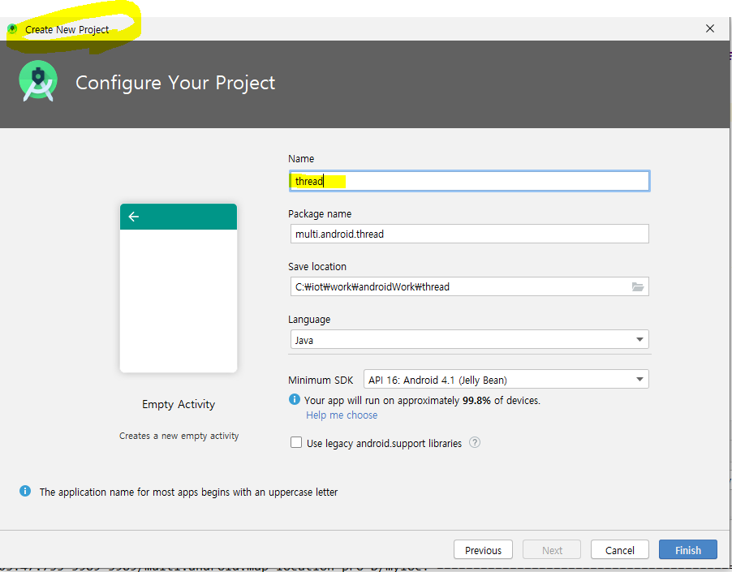
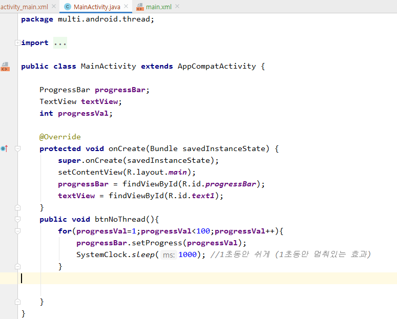
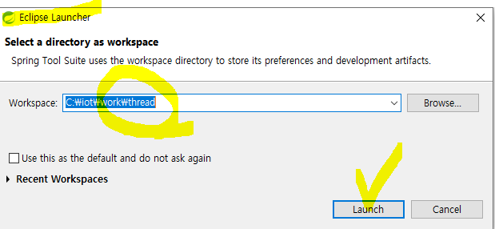
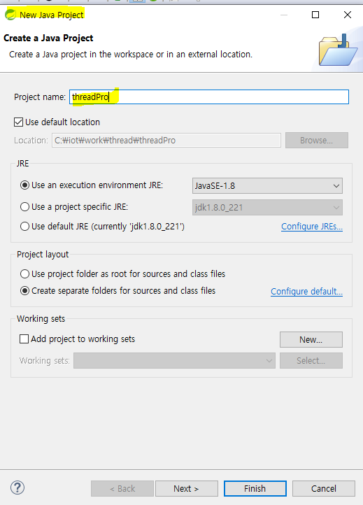
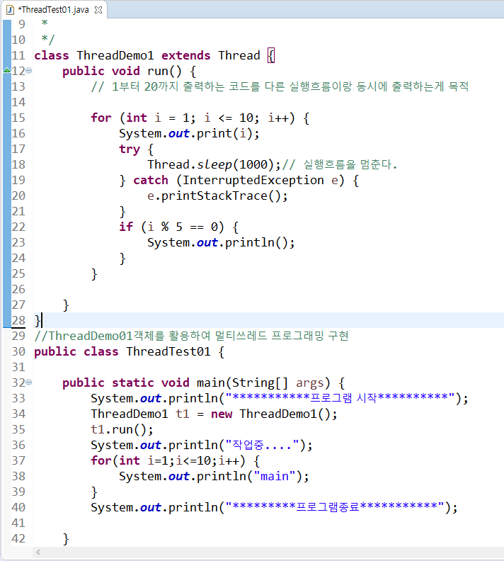
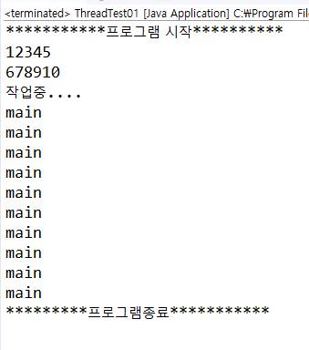
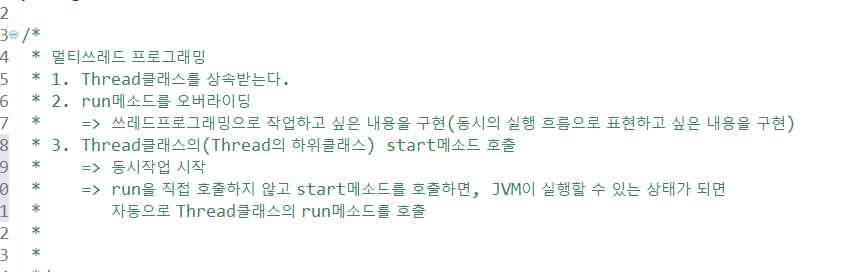
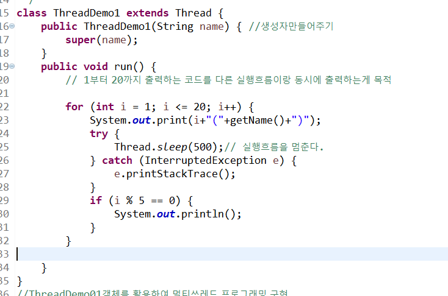
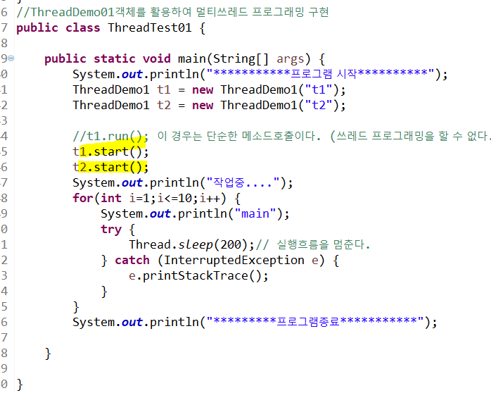

# 쓰레드 (thread)

* 버튼을 누르면 for문을 100번 돌리면서 1초를 쉰다. 그리고 프로그레스바가 채워진다. 그런데 버튼에 대한 이벤트를 동작시키고 for문만 돌리고 있고 이벤트에대한 리스닝을 하지 못하고있다.

* 모바일 게임에서 사냥을 하고, 채팅을 하고.

  하나의 프로세스 안에서 여러 개의 실행흐름이 실행될 수 있게 설계해야 한다.

* 실행중인 것 -> 프로세스
* 프로세스 끼리는 서로 관여할 수 없다.
* 각 프로세스에는 여러 개의 실행 흐름이 있다.
* 프로세스 안에서 실행들이 공유데이터에 붙어서 사용할 수 있다. 하지만 공유데이터에 대한 스케쥴링 작업을 해줘야 한다. 
* 여러 실행 흐름을 동시에 실행하면서 하는 것 -> 멀티쓰레드프로그래밍
* multi thread : 하나의 프로그램을 띄워놓고 그 프로그램안에서 동시에 여러 개의 실행흐름을 갖고 작업
* 눈에만 보이는 실행흐름만 있는 것이 아니라, 서버 입장에서는 채팅을 받기위해 대기 중 등등 

---

## 자바의 정석 p.722~

메모리를 할당받아 프로그램을 실행 -> 프로세스

### 자바에서 쓰레드의 실행 방법

1. Thread 클래스를 상속
2. Runnable 인터페이스를 구현

### STS실행

이 경우는 단순한 메소드호출이다. (쓰레드 프로그래밍을 할 수 없다.)

`start()` 메소드를 활용해 보자!

main, t1과 t2가 동시에 실행된다.

main은 몇 개 없어서 빨리 끝났지만, t1과 t2는 아직 안끝나서 번갈아가면서 돌고 있는 것을 확인할 수 있다. 

---

## 실습

1. 쓰레드프로그래밍을 구현하세요.
   - 1부터 100까지 출력하는 DigitThread
   - A부터 Z까지 출력하는 AlphaThread
   - ThreadExam01의 main메소드에서
     DigitThread와 AlphaThread를 동시에 실행해보자.