아래 코드는 무한루프 쓰레드 코드이다.

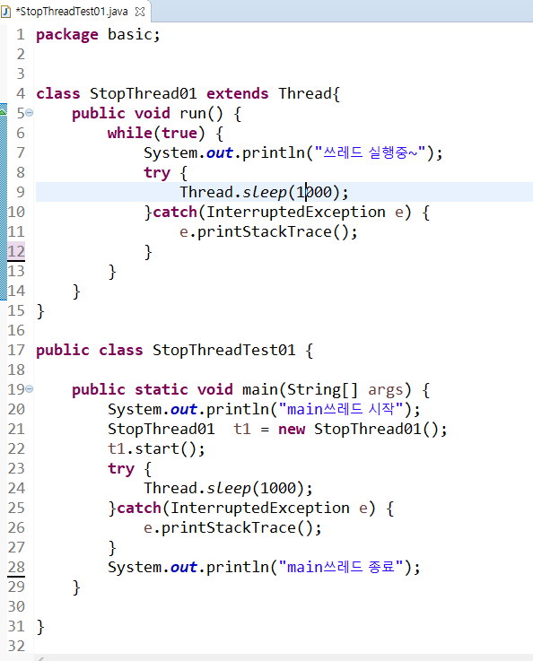

쓰레드를 무한으로 처리하다가, 액티비티를 종료하고 다른 액티비티로 빠져나가면 본래 쓰레드는 중지시켜야 한다.

## 쓰레드 종료

#### 1. 임의의 변수를 선언해서 종료하는 방법

   * 임의의 변수 : flag변수

     변수에 저장된 값에 따라서 처리할 수 있도록 구현(실행 or 종료 - boolean)

     변수값을 체크(오래걸리는 작업이 있는 경우, 중간에 이 값을 체크해서 쓰레드를 종료할 수 있다.)
     
* 쓰레드는 한번 종료되면 못살린다. 다시 만들어줘야 한다. 

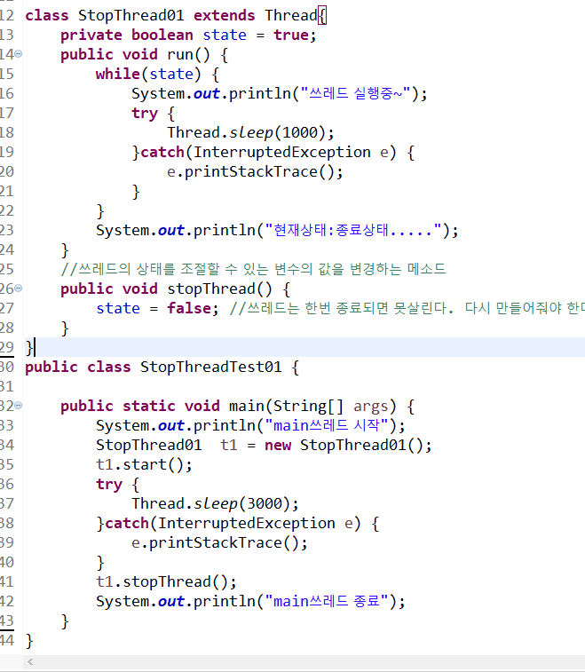

#### 2. 인터럽트를 발생시키고 현재 상태를 확인하고 작업하는 방법

* isInterrupted()메소드를 이용해서 현재 쓰레드의 상태가 인터럽트 상태인지 파악
   * 		 인터럽트상태이면 true를 리턴

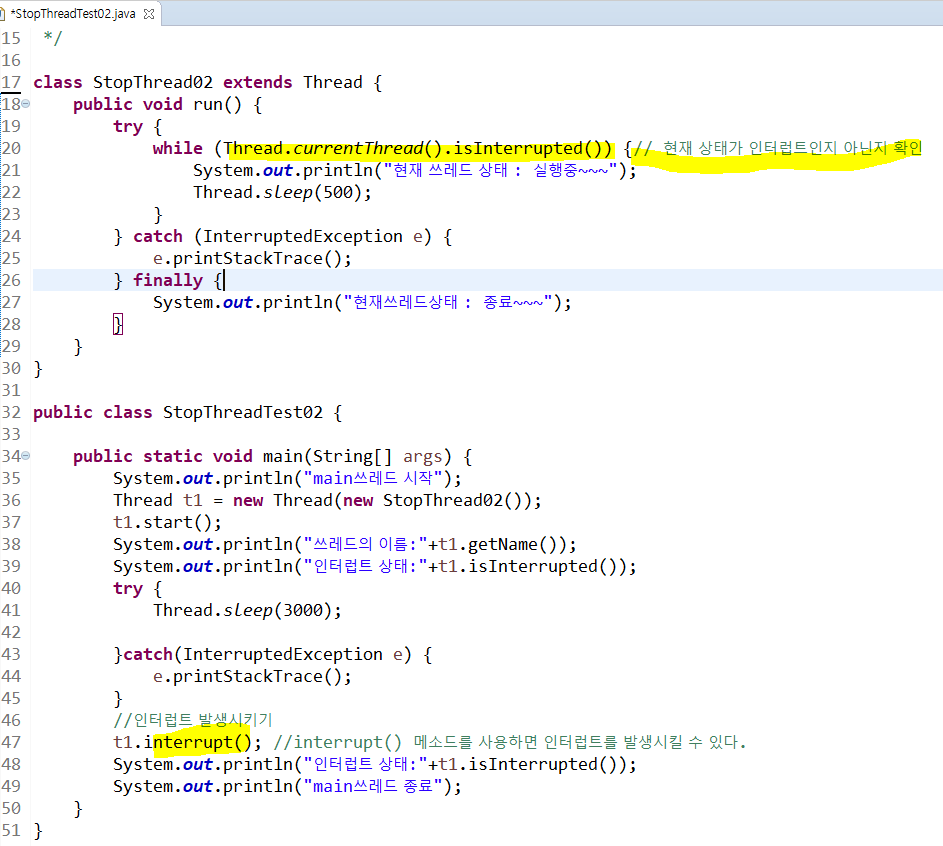

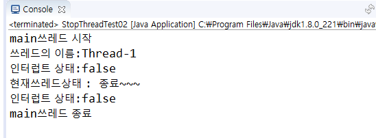

---

## Lock

쓰레드가 공유 객체에 들어와서 작업을 할 때, 다른객체가 작업할 수 없게 Lock을 건다.

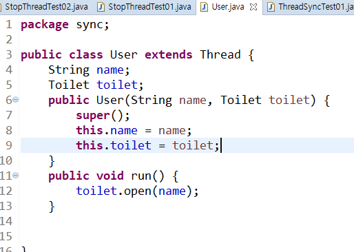

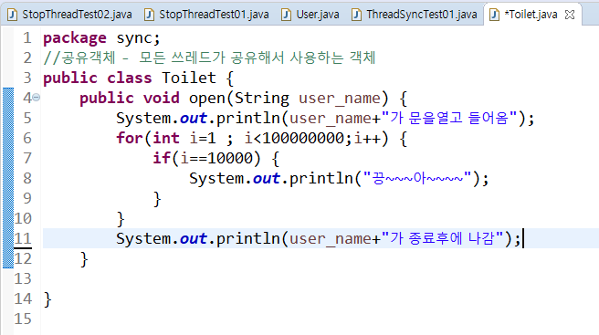

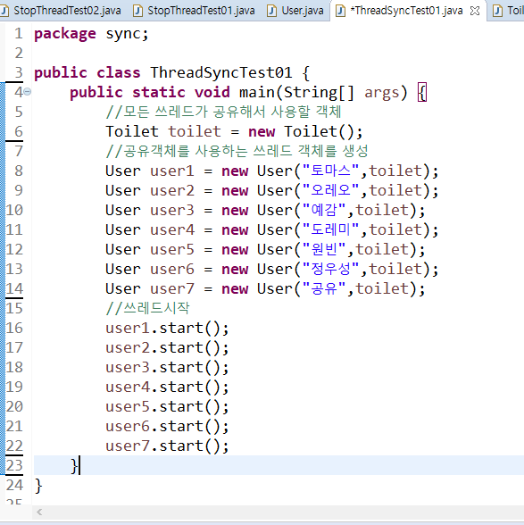

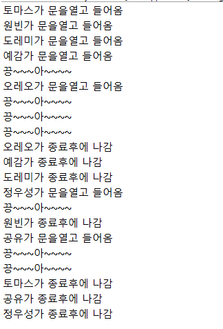

lock을 걸지 않아서, 화장실을 동시에 여러 유저가 사용하는 상황이 되어 버린다. (공유객체에서 혼란이 오는 상황이 생긴다.)

* 따라서 `syncronized` 를 활용해 부분코드에 lock을 적용한다.

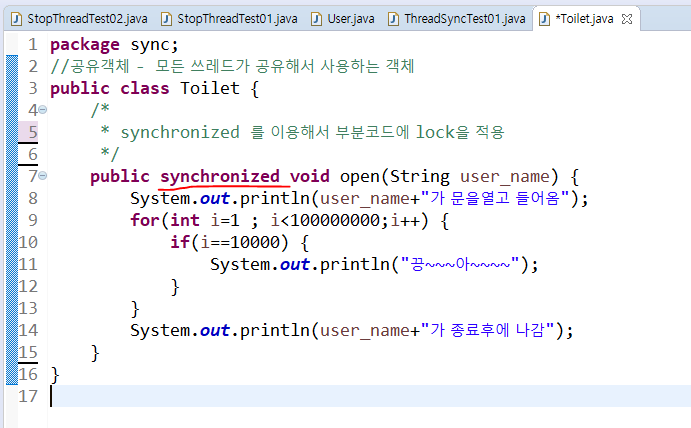

동시에 객체가 공유되지 않는다. 

---

하나의 쓰레드는 하나의 일만 한다.

Thread는 무조건 start() 해줘야 실행된다.

## 실습

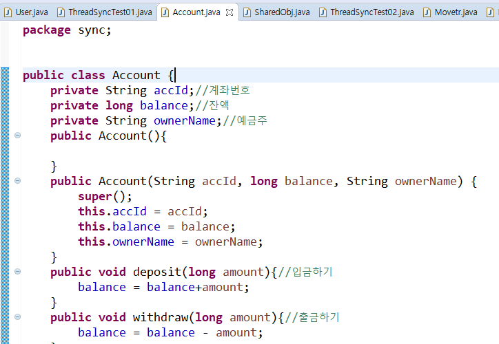

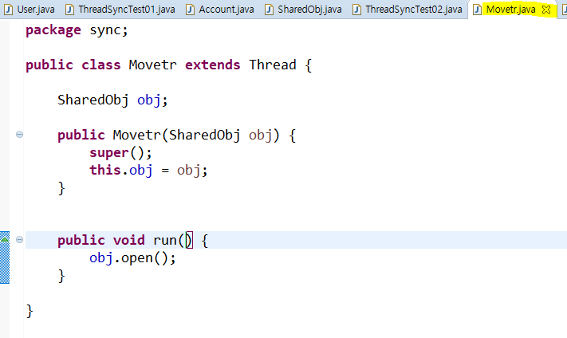

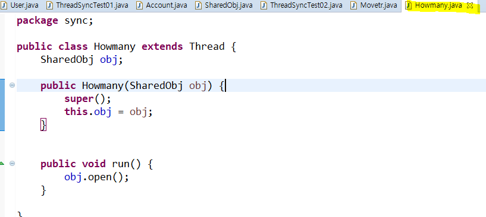

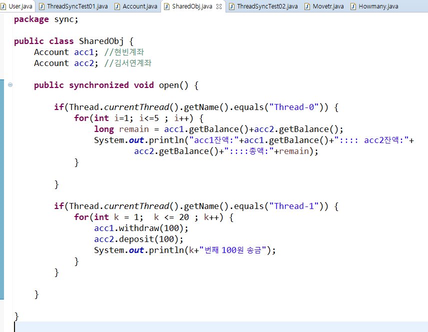

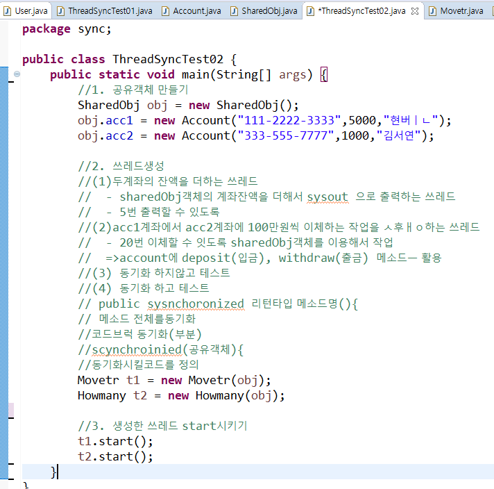

---

### 쌤이 풀어준 방법

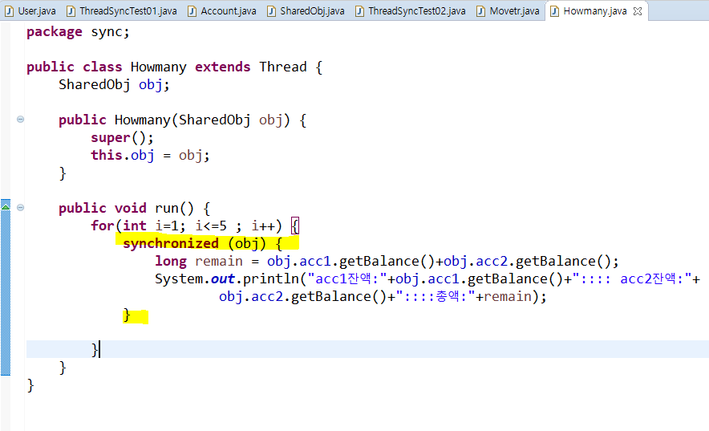

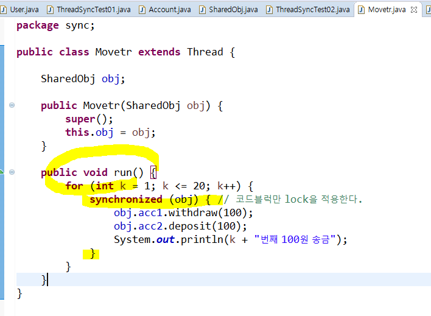