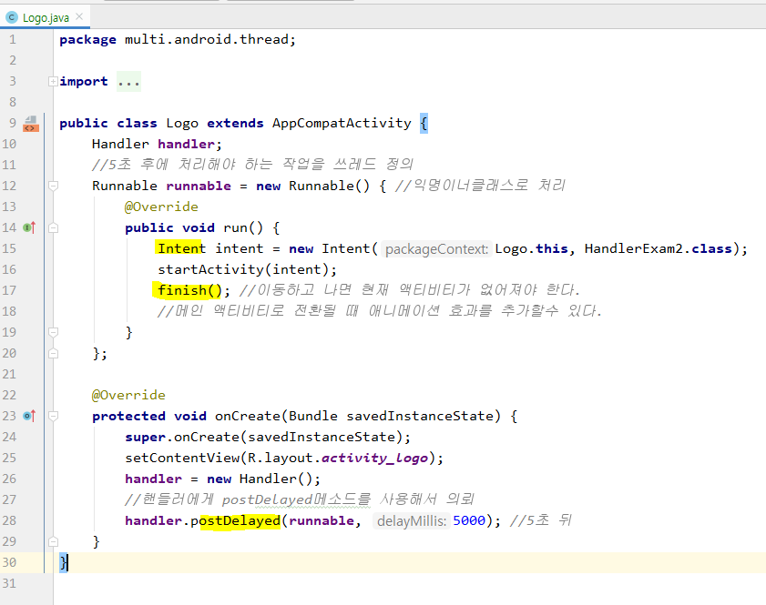
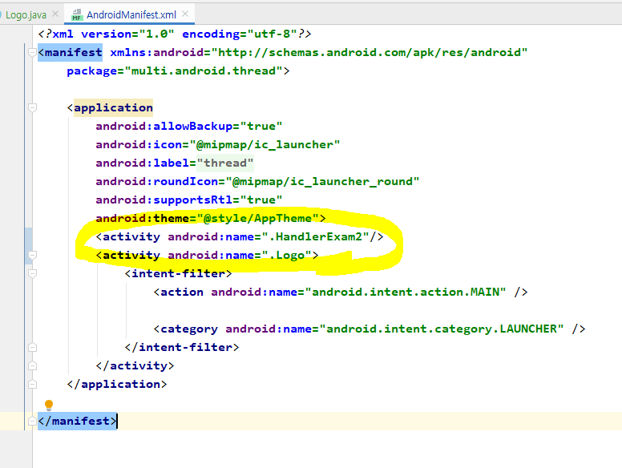
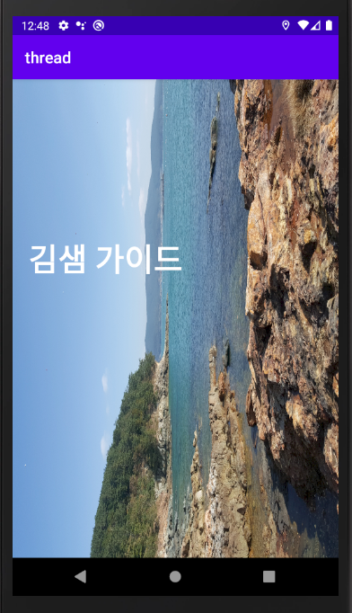
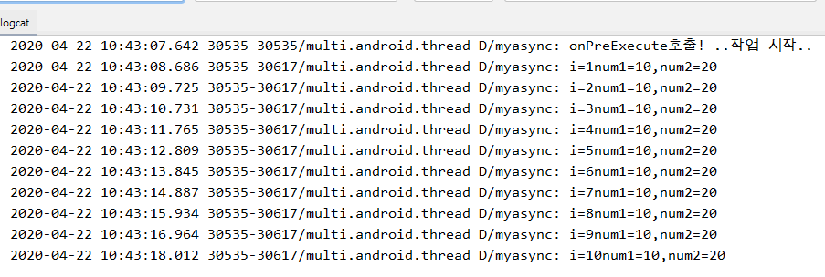
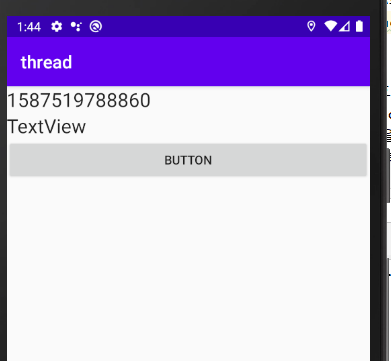
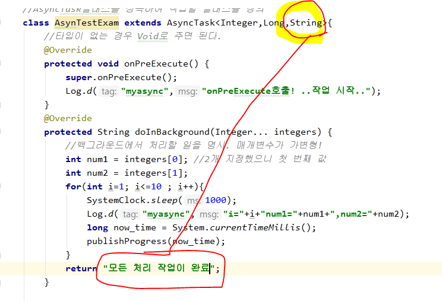
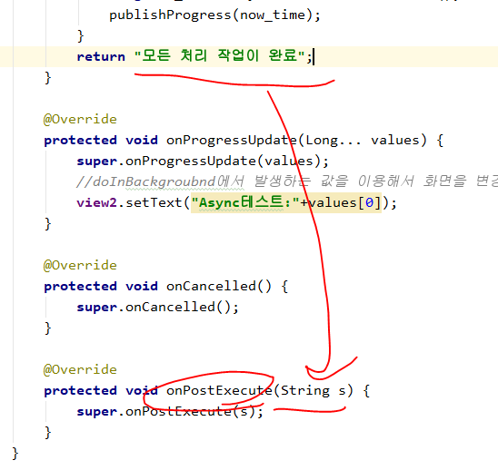
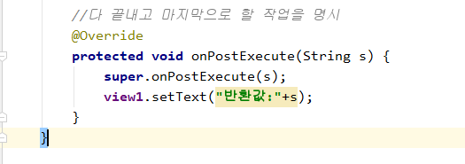
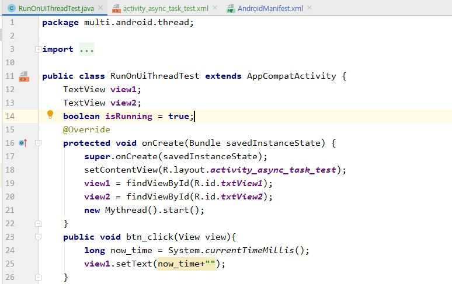
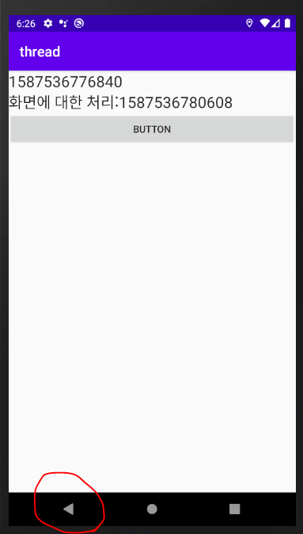

# 쓰레드 처리


## 1. Handler를 이용하는 방법

1. Handler를 이용
    1) 동시 실행흐름을 처리할 내용을 쓰레드 객체로 구현
    2) UI쓰레드에서 Handler객체를 생성
            onCreate메소드 내부에서 Handler객체를 생성
    3) worker thread에서 Handler객체에게 작업을 의뢰
    4) Handler객체에서worker thread로부터 의뢰받은 내용을 view에 적용
        - handleMessage메소드를 이용해서 처리(오버라이딩해서 구현)
            - work thread한테 전달받은 값으로 view를 변경
            - 쓰레드로부터 요청이 올때마다 handleMessage메소드가 호출된다.









## 2. AsyncTask를 이용하는 방법

p.489~


```xml
시간이 오래 걸리는 작업도 가능, UI를 변경하는 작업도 가능
1) AsyncTask를 상속받는 클래스를정의
    => AsyncTask의 제네릭을 적용해서 변수 세 개의 타입을 정의(사용자가 임의로)
		- 첫 번째 제네릭 : execute를 호출해서 AsyncTask를 실행할 때 필요한 매개변수의 타입
                         이 매개변수가 doInBackground를 호출할 때 전달
        - 두 번째 제네릭 : publishProgress의 매개변수 타입
                        publishProgress가 호출할 onProgressUpdate의 매개변수
                         즉, doInBackground메소드 내부에서 발생되는 값들로
                         화면에 출력되기 위해 필요한 값
		-세 번째 제네릭 : doInBackground가 종료되고 리턴되는 값의 타입
                              doInBackround가 종료되먼 자동으로 onPostExecute4가 
                              호출되며 매개견수로 전달된다.

2) 메소드를 오버라이딩

-  onPreExecute : doInBackground메소드가 호출되기 전에 실행되는 메소드
                       일반쓰레드로 처리할 일들(doInBackground에서 처리되는 작업)
                       이 실행되기 전에 사전작업을 해야 하는 경우 구현
                       메인쓰레드(UI쓰레드)에서 호출되는 메소드이므로, 화면처리가 가능하다.
                       UI쓰레드에서 호출하기 때문에 시간이 오래 걸리는 작업을 하면 안된다.
                       (시간 오래걸리는건 doInBackground에서)
                       (UI쓰레드에서 호출하기 때문에 뷰를 변경할 수 있다.)

- doInBackground : Background에서 실행될 작업을 정의
      일반 쓰레드에서 run메소드에 정의했던 코드를 구현
      네트워크처리, 시간이 오래 걸리는 작업을 여기서 처리
      그런데 화면 관련 처리는 할 수 없다. (백그라운드만 가능)
   => 매개변수가 가변형이고 배열로 처리

- onProgressUpdate : doInBackground가 실행되는 중에 UI를 변경해야 할 일이
      있는 경우에 호출되는 메소드
      doInBackground 내부에서 화면을 변경해야 할 일이 생기면
      publishProgress메소드를 호출하면 자동으로 onProgressUpdate가 호출된다.
      UI쓰레드에서 호출하기 때문에 시간이 오래 걸리는 작업을 하면 안된다.
      (시간 오래걸리는건 doInBackground에서)
      (UI쓰레드에서 호출하기 때문에 뷰를 변경할 수 있다.)

- onCancelled : 작업이 취소되는 경우 호출되는 메소드
- onPostExecute : doInBackground메소드의 처리가 끝나면 호출되는 메소드
      UI쓰레드에서 호출하기 때문에 시간이 오래 걸리는 작업을 하면 안된다.
      (시간 오래걸리는건 doInBackground에서)
      (UI쓰레드에서 호출하기 때문에 뷰를 변경할 수 있다.)

3) AsyncTask의 하위객체를 생성
4) 생성된 AsyncTask를 실행
	- AsyncTask의 execute메소드를 호출
```


### 첫 번째 제네릭


### onPreExecute

doInBackground메소드가 호출되기 전에 실행되는 메소드
일반쓰레드로 처리할 일들(doInBackground에서 처리되는 작업)
이 실행되기 전에 사전작업을 해야 하는 경우 구현
메인쓰레드(UI쓰레드)에서 호출되는 메소드이므로, 화면처리가 가능하다.
UI쓰레드에서 호출하기 때문에 시간이 오래 걸리는 작업을 하면 안된다.
(시간 오래걸리는건 doInBackground에서)
(UI쓰레드에서 호출하기 때문에 뷰를 변경할 수 있다.)




실행하니 먼저 onPreExecute가 호출됨을 알 수 있다.





### 두 번째 제네릭


### onProgressUpdate


### 세 번째 제네릭






### onPostExecute




* 실행
* 


----







뒤로가기 버튼을 누르면, Destroy 되어서 로그가 더 이상 찍히지 않는다.

