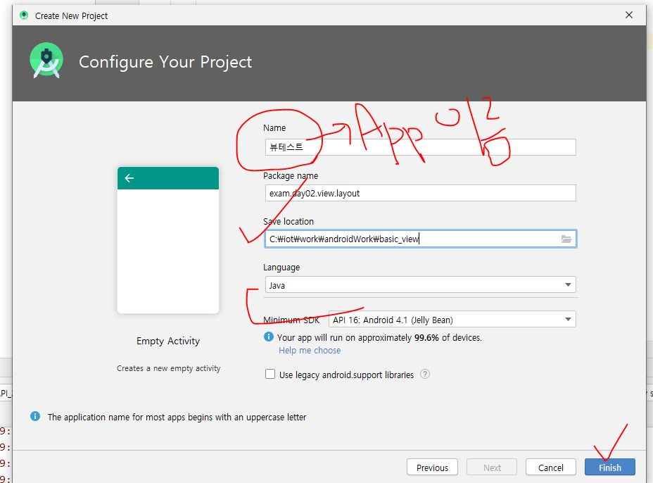
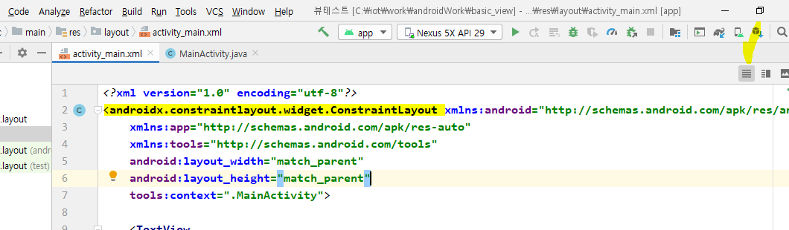
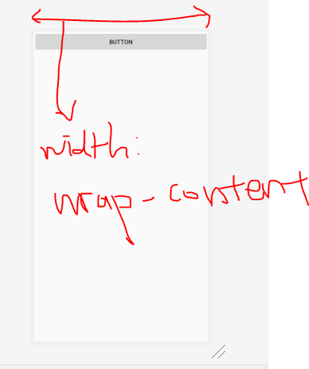
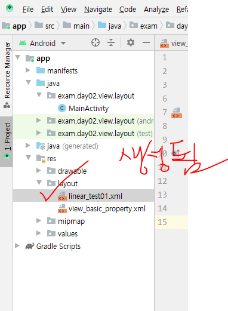

## View

개요

* `layout_width` : view의 너비
* `layout_height` : view의 높이
* `orientation` : 배치 방향
* `id` : 각 요소를 식별할 수 있는 이름
* `margin` : 주위 여백
* `padding` : 내부 컨텐츠와 border사이의 간격
* `layout_weight` : 여백을 해당 view의 사이즈로 포함
* `layout_gravity `: parent내부에서 view의 정렬
* 그냥`gravity` : view 내부에서의 정렬

해당 아이콘을 통해 화면목록을 설정할 수 있다. 파란색 화면은, 여러가지 요소들이 겹쳤을 때 인지하기 쉽도록 나타내주는  화면이다.

View는  View Group, widget이 있다.

View : 화면 디자인 구성 요소

* ViewGroup : layout
* Widget : Textview, button

---

이렇게 되어있는데, ConstraintLayout 대신 Linear로 설정해준다. 

Tools : 디바이스에 전달 안되는속성

android : 속성을 설정할 때 주는 접두사

### 기본 속성

* match_parent : 폰 사이즈에 꽉 차게 보이게 함

* wrap_content : 원래 자기의 본래 사이즈 

!

둘 다 wrap-content. 버튼을 추가할때 3개가 저렇게 형성되는 이유는, 디폴트 값이 horizontal이기때문에 match-partent에 맞춰서 생성된다.

만약 orientation속성이 vertical이라면 다음과 같이 버튼이 생성된다.

이렇게 버튼이 orientatin 속성에 따라 배치됨을 확인할 수 있다.

* layout_width : view의 너비
* layout_height : view의 높이
* orientation : 배치 방향

여기서도 설정할 수 있다.

모든 리소스는 res폴더에서 관리한다.

* 파일,폴더명 변경 :  변경할 파일 > 오른쪽버튼 > Refactor > Rename > 이름 변경

맨 밑에 [Do Refactor] 버튼을 눌러야 변경이 완료된다.

* 각 요소의 이름 설정하기

* id는 식별성을 주기 위한 이름이다.

  

  

단위가 안붙어서 에러가 난다. 따라서 단위를 꼭 써준다.

`dp` 를 붙여써 써준다. 

>  n `dpi` : 1인치를 n개의 픽셀로나누겠다는 뜻

* 다른 android 기기 화면 미리보기

다른 디바이스 화면으로 해보면, 내가 기획한 의도와는 다르게 적용될 때가 있다. 따라서 특별한 경우가 아니면, wrap_content나 match_parent를 활용한다. 

### margin

### padding

### layout_weight

버튼1, 2가 버튼3말고 나머지 여백을 1:1로 나눠 가진다. 

버튼 1,2,3이 여백이 있을 경우 1:1:1로 나눠가짐

버튼1,2,3은 weight 가 1,1,2이므로 1:1:2의 비율로 나눠가짐

----

xml이기 때문에 닫는 태그가 반드시 있어야 한다. 

### layout_gravity

### 그냥 gravity

요소 내 글자 위치가 움직인다. 

----

## 새로운 레이아웃 xml 추가

layout 폴더 오른쪽버튼 > New > Layout Resource File 선택

이름 작성 후 OK

LinearLayout으로 변경

linear_test01 로 변경해준다. 

TextView를 3개 추가해준다.

색상코드를 입력하면, 왼쪽 숫자바 옆에서 색상을 미리보기 할 수 있다.

Text를 써야 화면에 출력되는데, Text를 안쓰고 `layout_weight` 를 통해 강제적으로 범위비율을 작성해서 화면에 출력시킨다.

----

## 하나의 화면 안에 다양한 Linear 활용

### 컨테이너기반이라, 레이아웃 안에 레이아웃을 넣을 수 있다.

------

# Constraint Layout

요소 간 constraint 하는데, 만약 이어질 요소가 없으면 부모 화면에 constraint해준다. 

선을 선택한 상태에서 delete버튼을 누르면, 연결된 선은 사라진다. 

* AddGuildLine 하면 기준선을 잡을 수 있다.

요소들을 기준선에 걸면, 기준선을 움직일 때 엮인 요소들이 다 이동된다.

Activity 가여러 개 있을 경우, intent가 있으면 액티비티 중 제일 먼저 실행된다.

intent가 그 역할을 수행하기 때문이다.

따라서 제일먼저 실행되는 액티비티를 설정할 수 있다.

LinearActivity자바파일을실행하면 오류가 난다.

이렇게 매니패스트 파일에 첫 실행 화면을 LinearActivity로 바꿔주면, 오류가 해결된다. 

Activity 만들 때 이렇게 만들어야 한다. 

주의 

파일 명 만들 때 대문자 쓰면 안된다.

---

file > setting > 

두 개 항목 체크하고 OK

==> 이제 자동으로 import 가 된다!!!

했는데오류

왜냐하면, 먼저 View를 set해줘야하기때문이다. 그 다음에 findViewById 하고나서 setText해야 나오는 것

