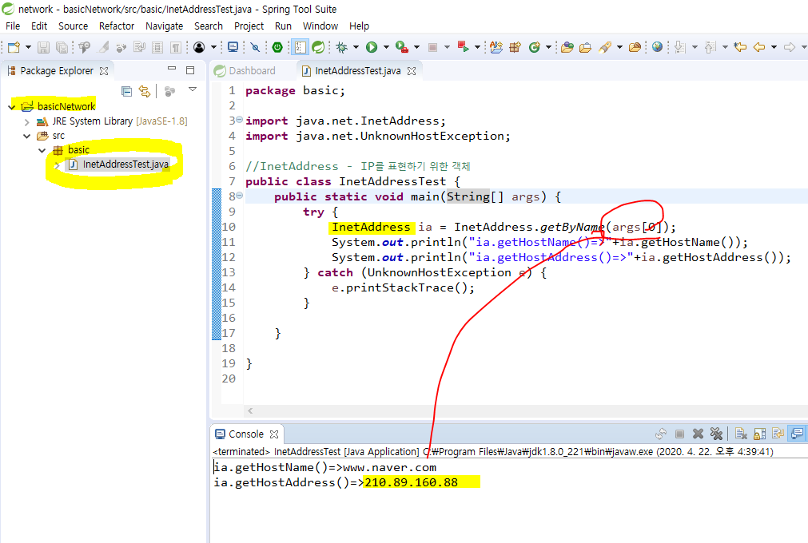
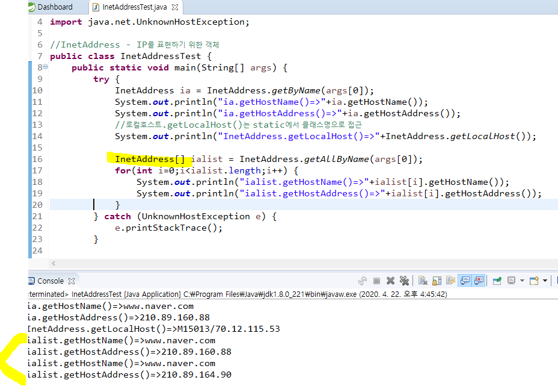
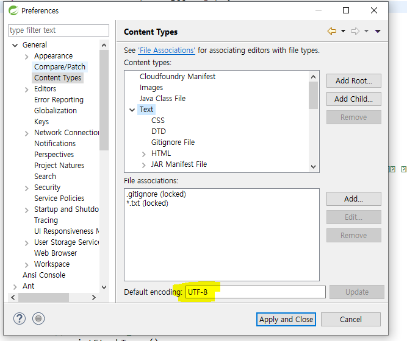
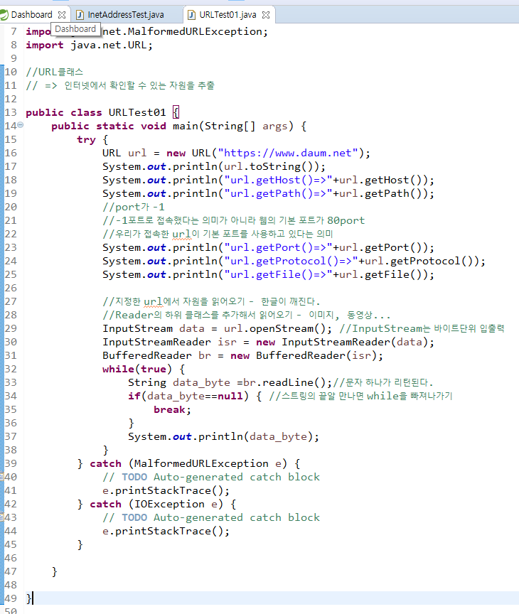
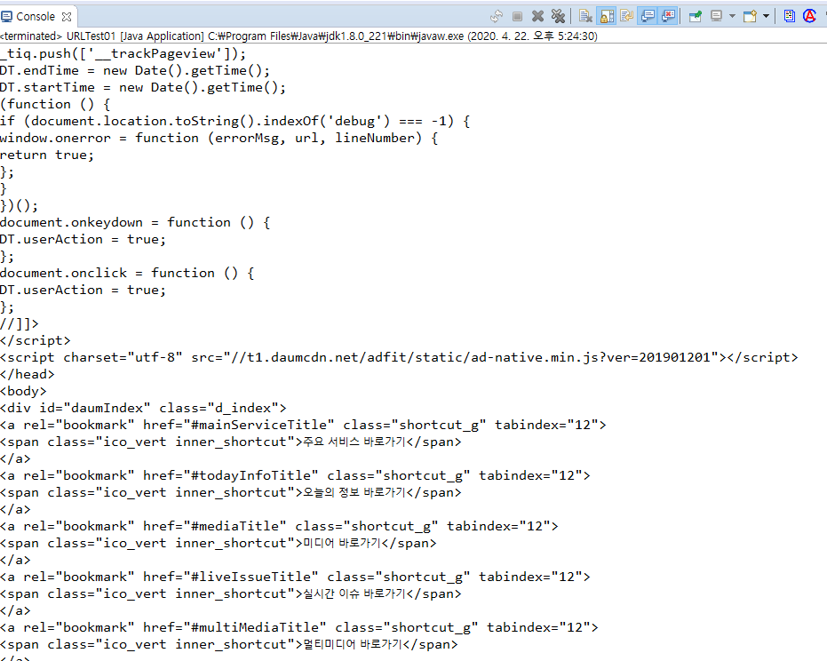
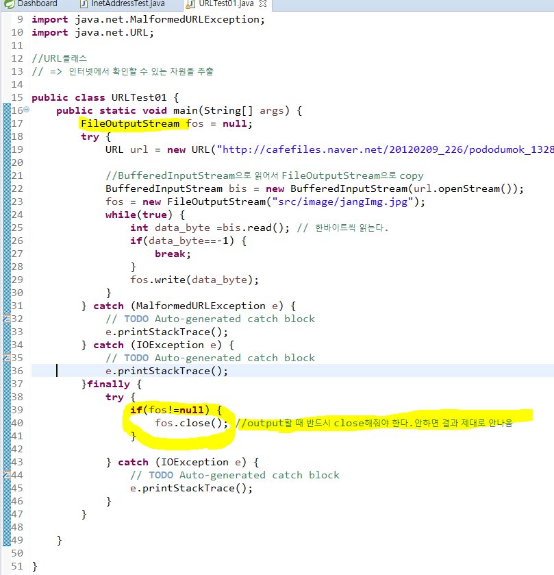

# 네트워크 통신

## TCP

서버 : 서비스를 어떻게 해줄지 명시해 놓은 PC, 요청을 받음

클라이언트 : 요청을 함

자바 알아야할 3대장 : 자바 쓰레드 아이오

----

## InetAddress 클래스

\- 자바에서 IP 주소를 표현할때 사용하는 클래스이다. 

\- InetAddress의 주요 메서드

* `getAddress()` - InetAddress 객체의 IP주소를 반환

* `getHostAddress()` - IP주소를 반환

* `getHostName()` - 호스트 이름을 문자열로 반환

---

### URLTEST01

일단 한글 설정

## url 이미지를 내 컴퓨터에 저장하기

http://cafefiles.naver.net/20120209_226/pododumok_13287752996753FNE4_jpg/%C0%E5%B5%BF%B0%C7_5_pododumok.jpg

인터넷으로 들어가는건 무조건 IO가 들어간다. 