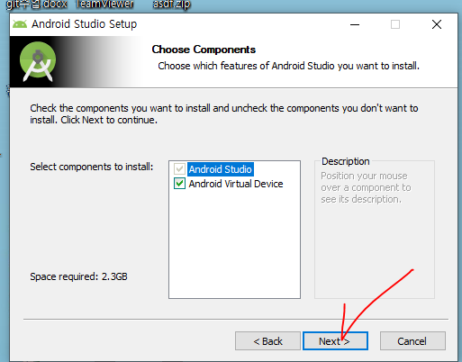

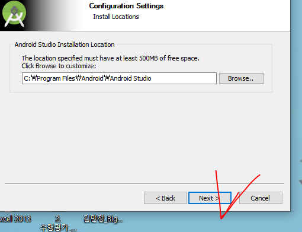

쭉 디폴트로 하고 Finish 하고 설치를끝낸다.

안드로이드 실행

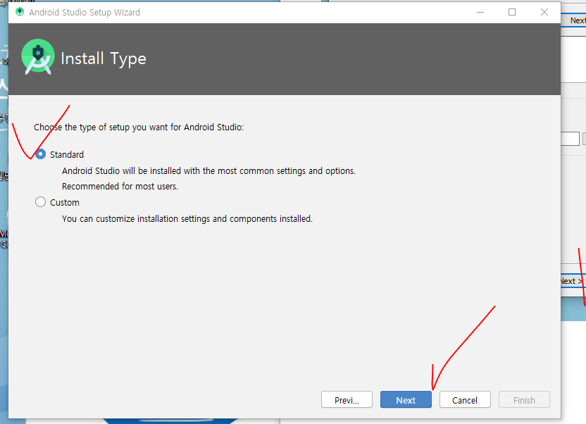

안드로이드 설치 종료 후 new project 

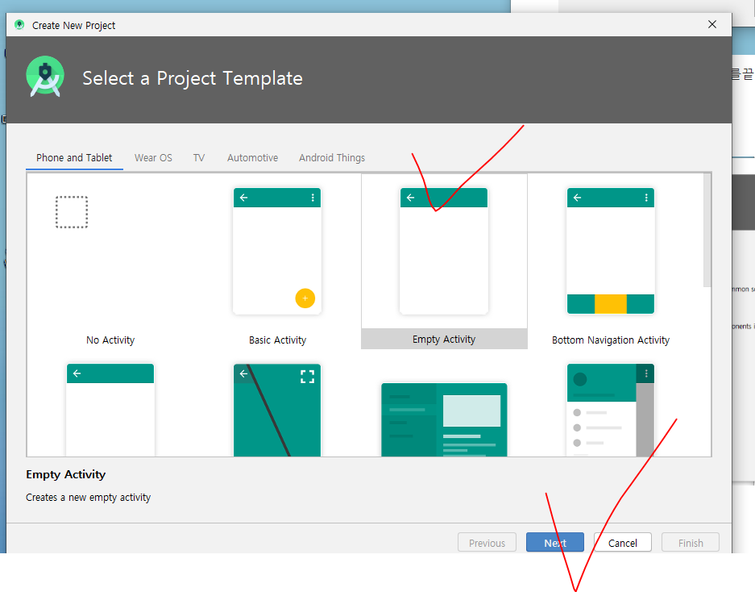

유일하게 만들수 있도록 회사명.프로젝트명 등 패키지명을 식별성있게 만든다. 

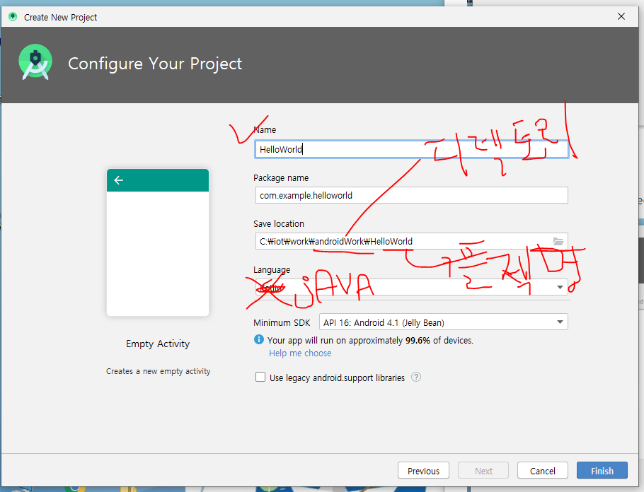

OS가 4.1인 기기에서도 동작 가능하게 하겠다는 뜻 

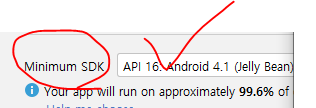

안드로이드의 빌드툴 : Gradle 

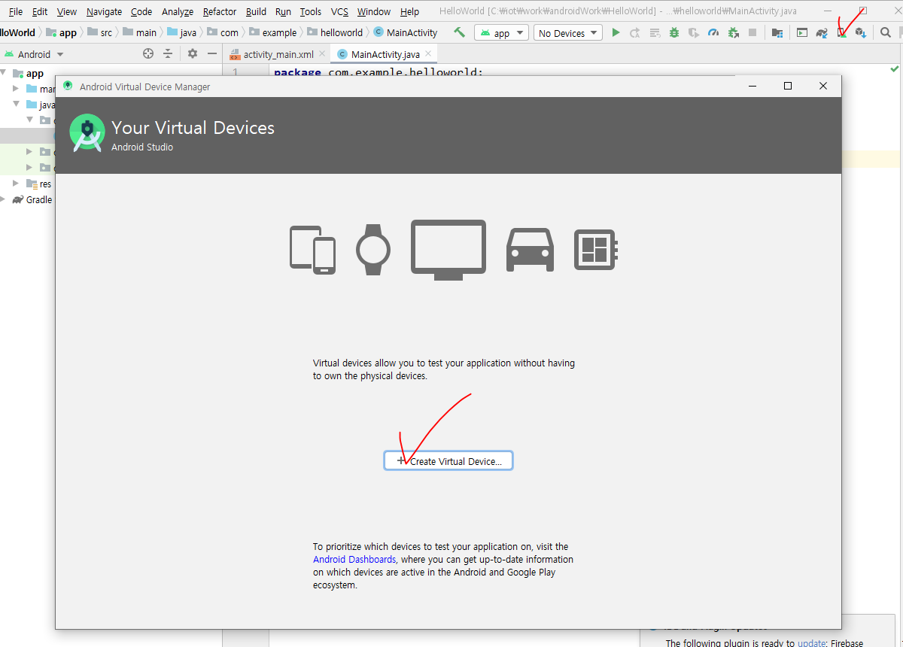

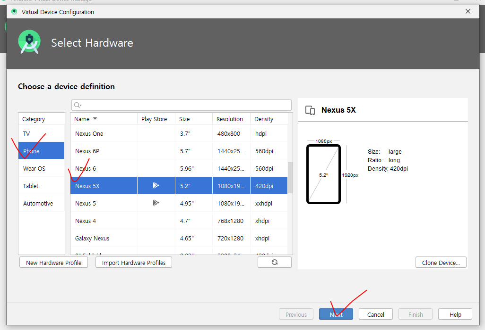

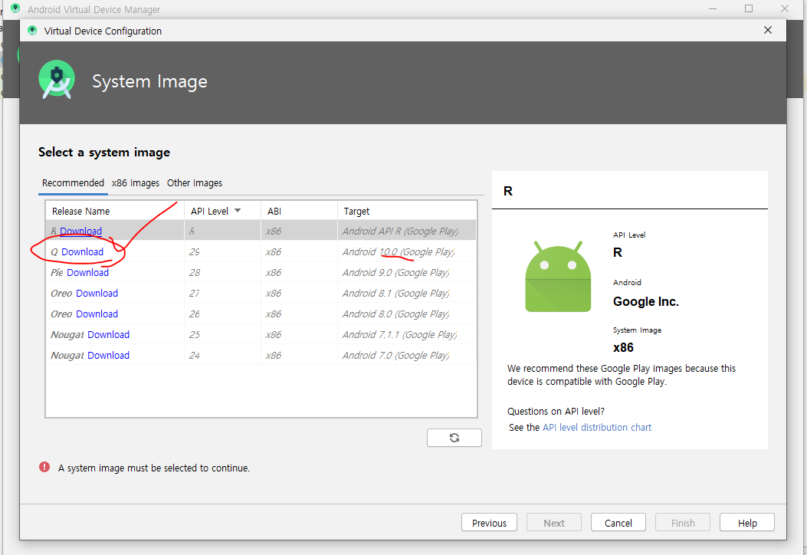

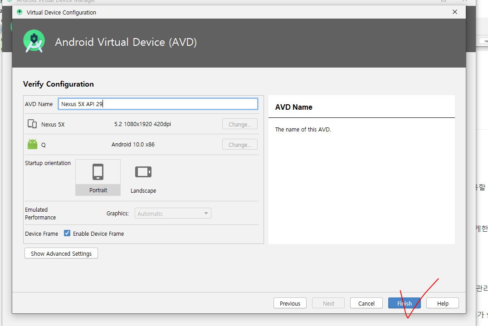

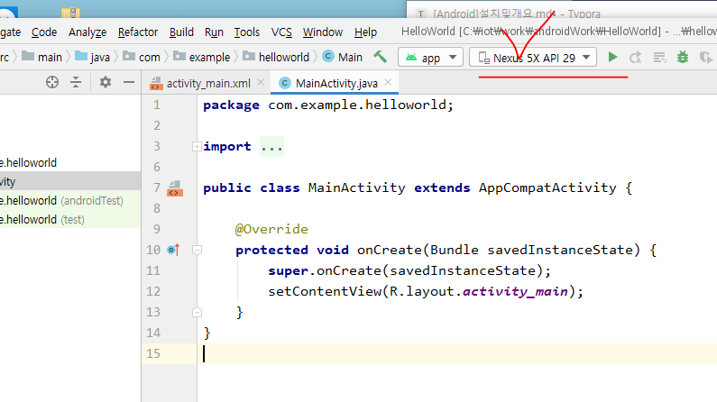

## 안드로이드의 특징

* 컴포넌트 기반 : 안드로이드에서의 대표적 컴포넌트 4개
  * Activity : 화면
  * Service 화면은 없는데 back end에서 실행
  * ContentProvider : A에서 사용하는 데이터를B라는 앱에서 사용할 수 있게 한다.
  * BroadCastReciever : 내부에서 폰의 상태를 알 수 있게 한다.
  * Intent : 하나의 컴포넌트에서 다른 컴포넌트들을 실행할 수 있게한다.
  * 
* 리소스의 외부화
  * 외부파일
  * R.java 에 모든 리소스에 대한 정보를 기록해 놓는다. 리소스만 관리하는 객체
  * 리소스를 외부화해서 빼놓기 때문에, 유지보수측면에서는 관리가 쉽다.

life cycle을 관리하는 객체가 있따.

`Oncreate()` 반드시 호출된다. 

### View

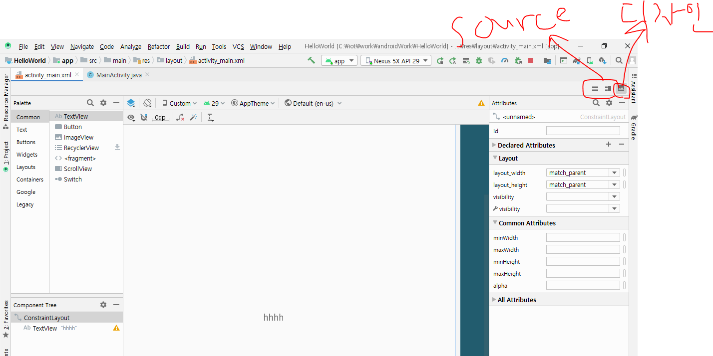

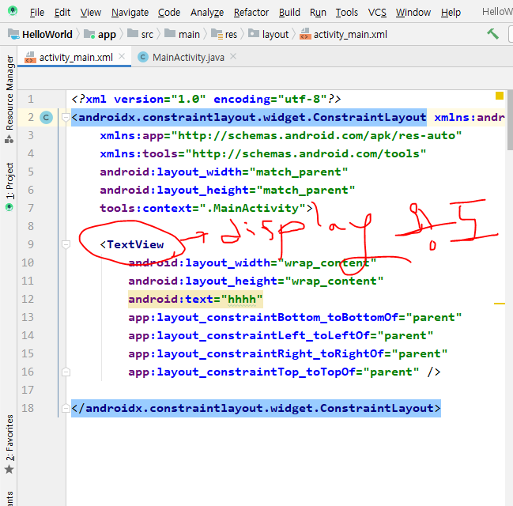

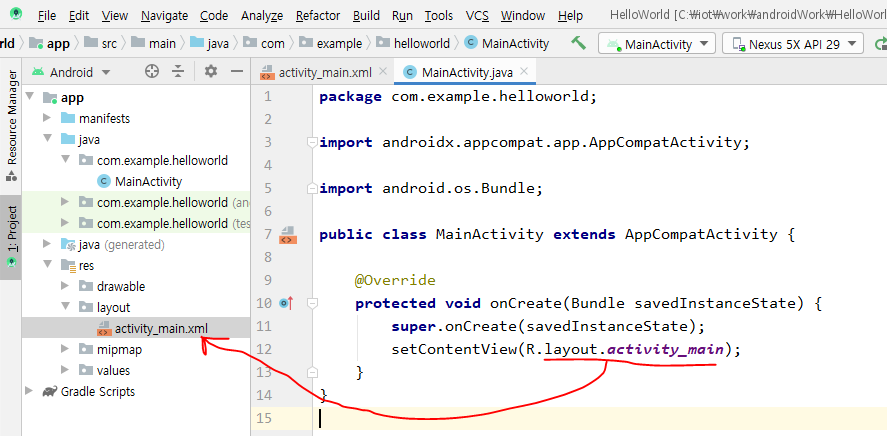

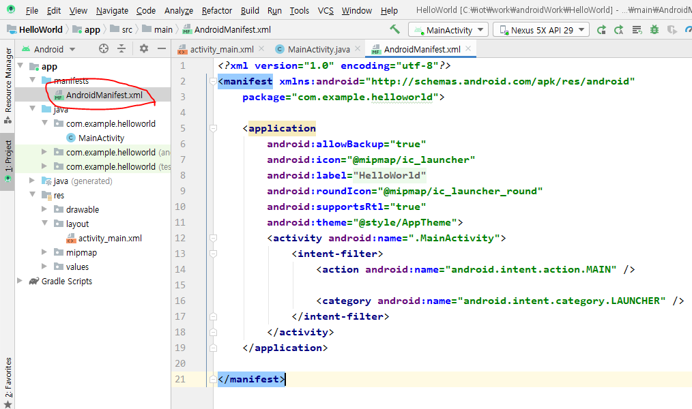

AndroidManifest.xml : 앱에 대한 설명서
실행할 액티비티,랑 앱 설치할 때 권한 설정같은 것도 여기에 정의한다.

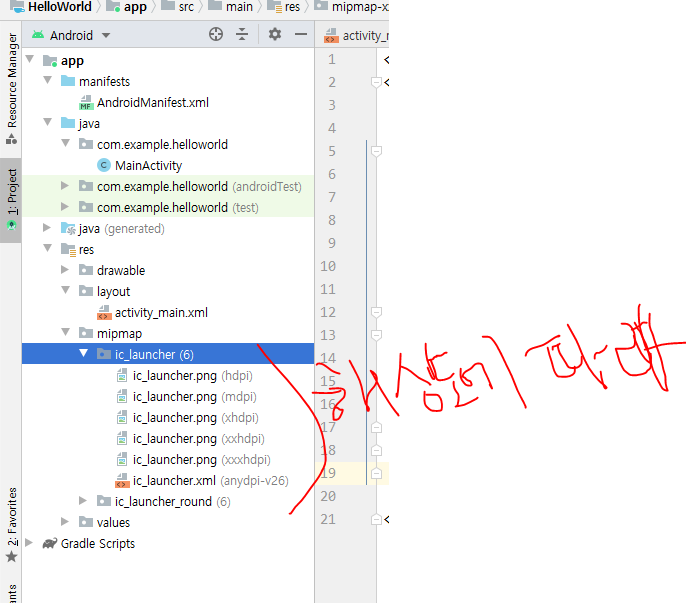

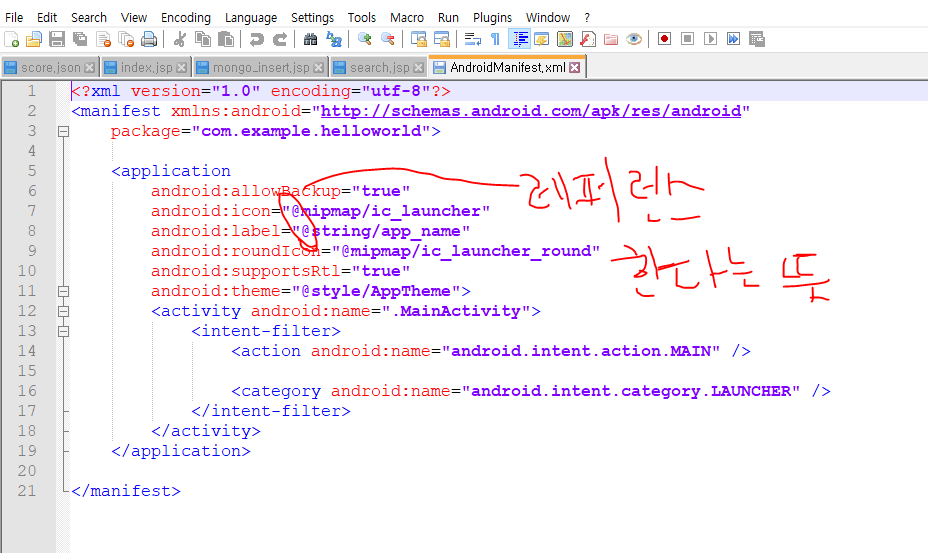

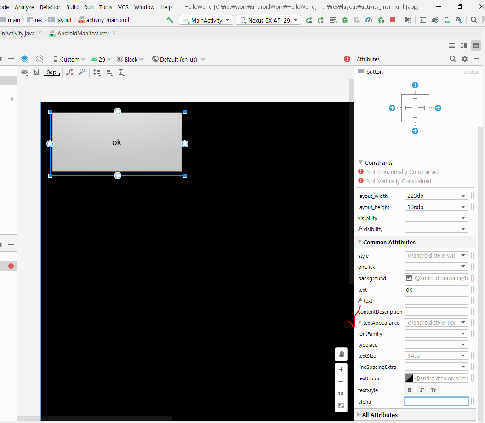