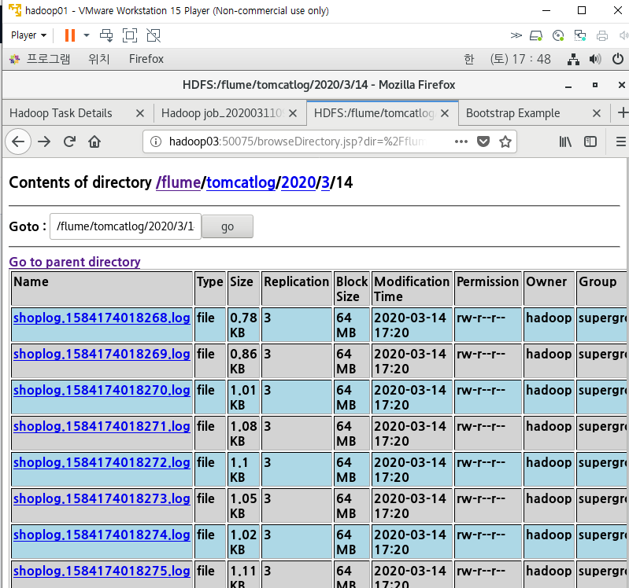

1. 3번머신에 WAS 구축, bigData폴더 배치하기
2. 3번머신에 Flume 설치 후 설정파일 작성
3. 3번머신 서버로 돌아가는 Web 페이지 log파일을 1번머신으로 보내기
   * avro 사용

3번머신에서 sink되어 1번머신의 source로 들어간다.

* 3번 머신의 properties 파일 생성

bind : 3번머신 속성의 ip는 받을 곳인 1번머신의 ip

* 1번머신의 properties 파일 수정

bind는 3번머신 속성과 동일하게 1번머신 ip로 작성한다. 

port는 둘 다 같아야 한다. 

[테스트]

1. 하둡머신의 flume 먼저 실행

2. WAS머신의 flume 실행

3. flume_input폴더의 log파일 copy

4. 결과 확인

