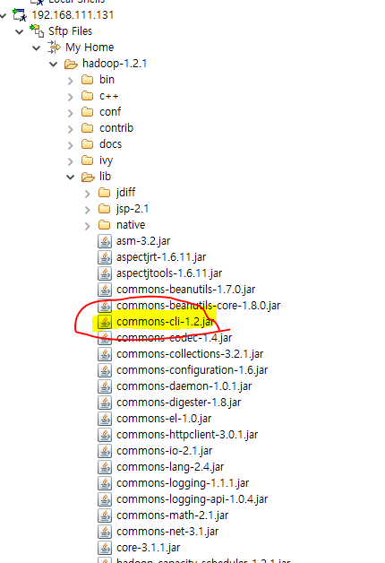
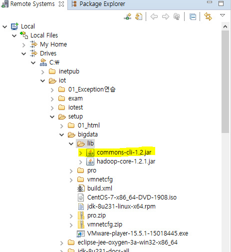
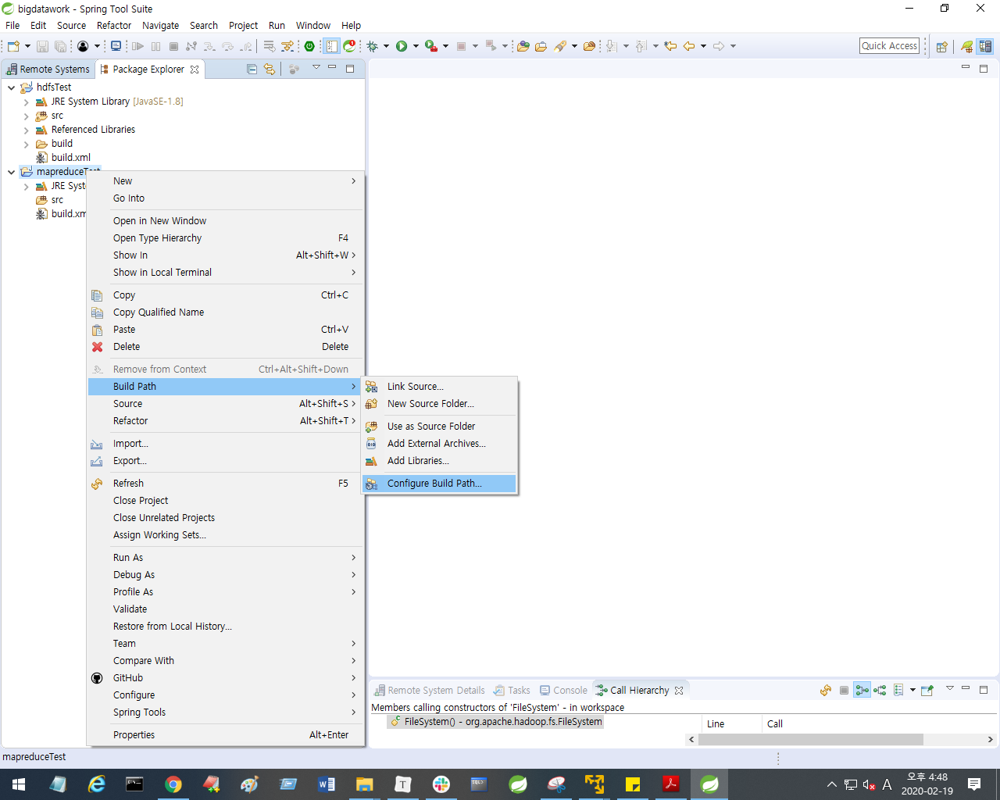
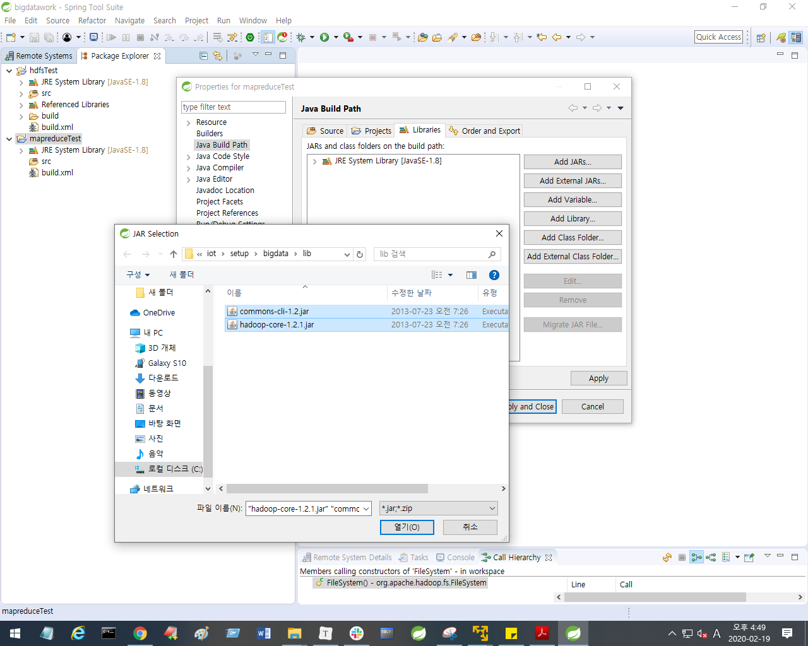
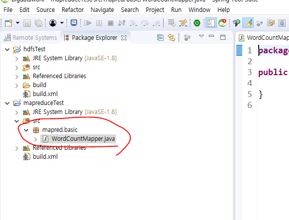
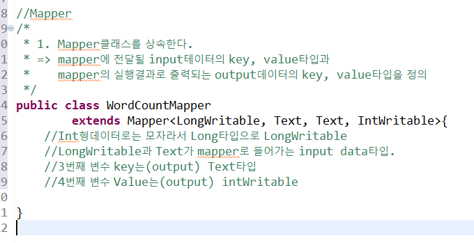
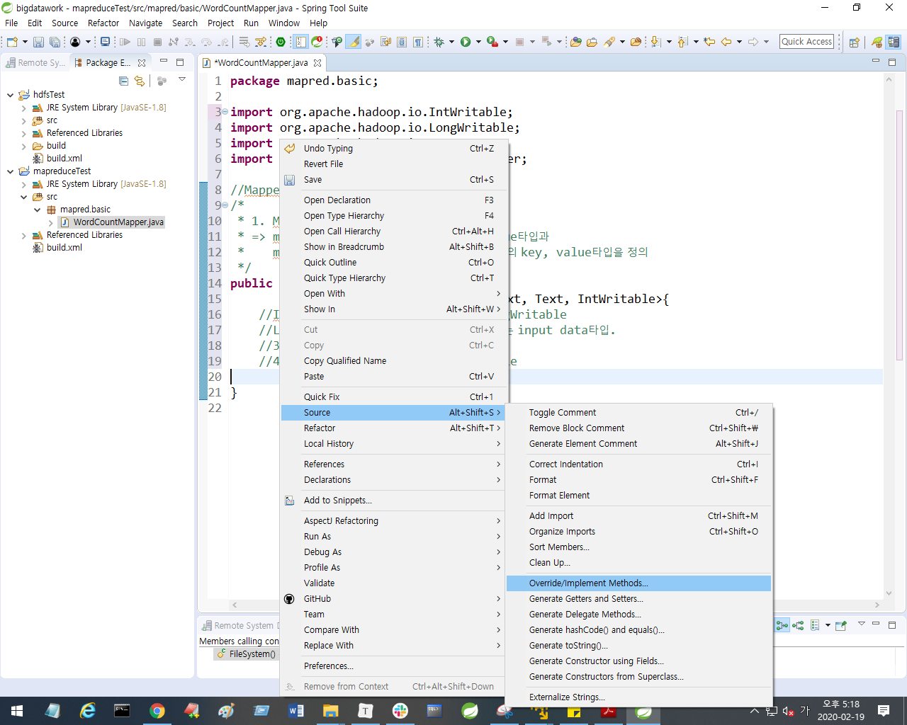
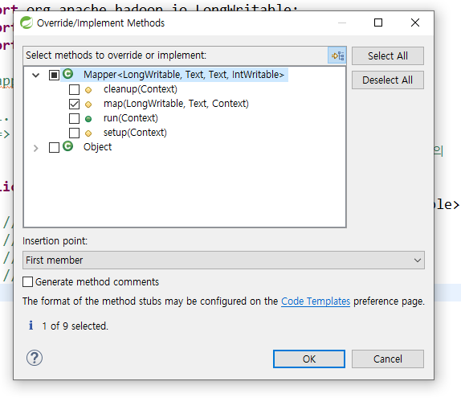
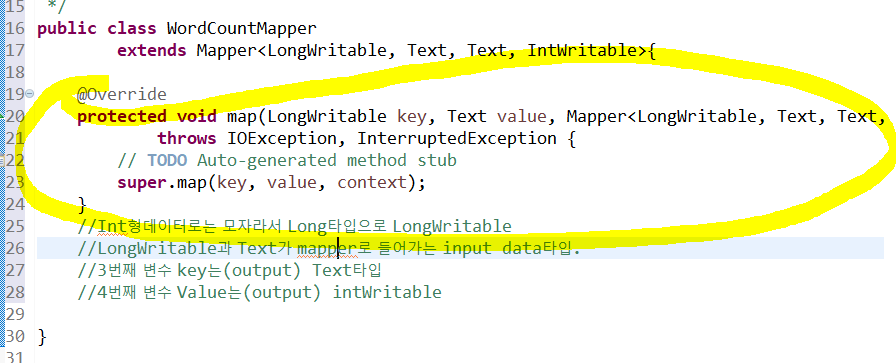

## 맵 리듀스 (p108~)

맵리듀스는 하둡에서 데이터 처리를 담당한다.

분류 -> 같은것끼리 취합 -> 집계

## 맵퍼 만들기 (p.111)

STS

얘를 복사해서 Local의 하둡 라이브러리 넣었던 곳에 넣기

1. mapper클래스를 만들기 위해서 Mapper를 상속한다.

2. 그리고 map메소드를 오버라이딩 해서 map작업을 수행하면서 처리할 내용을 구현

