<<< 정규표현식 >>>
텍스트 안에서 특정 형식의 문자열을 추출하거나 검색할 때 사용하는 특수문자로 만들어진 패턴

## 1. 자바API
1) String클래스의 matches메소드 : 매개변수로 전달한 정규표현식에 일치하는 문자열이 있는지 boolean으로 리턴

2) java.util.regex패키지의 클래스들을 활용

	- Pattern클래스 : 패턴을 정의할 때 사용
			CASE_INSENSITIVE : 대소문자 적용하지 않는다는 의미
	
	- Matcher클래스 : 패턴과 일치하는 문자열을 관리하는 클래스
			
	* `find()` : 패턴에 만족하는 문자열이 있는지 찾기 ( True|false 리턴 )
	
	* `start()` : 매칭되는 패턴과 일치하는 문자열의 start index
	
	* `end()` : 패턴과 일치하는 문자열의 end index+1
	
	* `group()` : 패턴과 일치하는 문자열을 리턴 (일치하는 문자 추출)

​	  

## 2 .Pattern 기호

### 1) 기본기호
* `^`:
* `$`
* `.`
* `|`
* `[ ]`	
  	

### 2) 수량관련기호

* `*` : *앞의 패턴문자가 없거나, 하나 있거나  여러 개 있거나

* `+` : +앞의 패턴문자가 하나 있거나 여러 개 있거나 

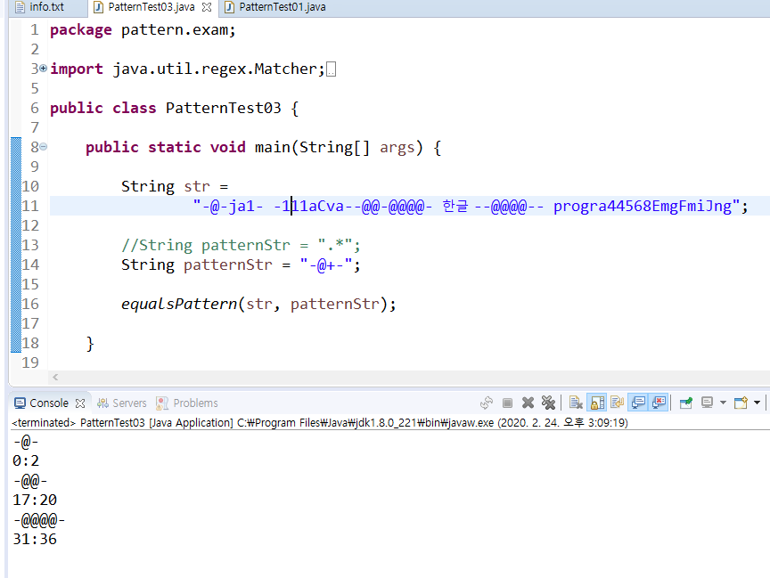

​	

* `?` : ?앞의 패턴문자가 없거나 하나있거나

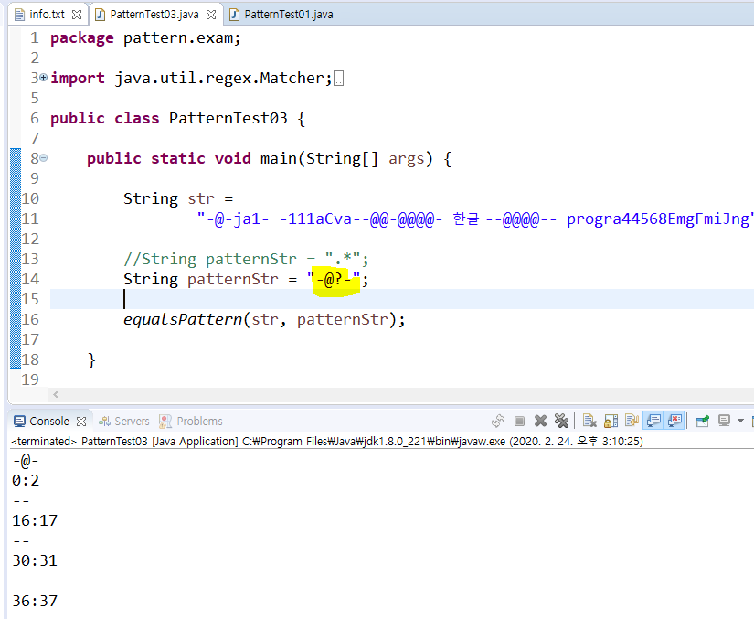	
	
	
	

---

* `[^ ]` : 공백이 아닌 것들을 골라낸다.

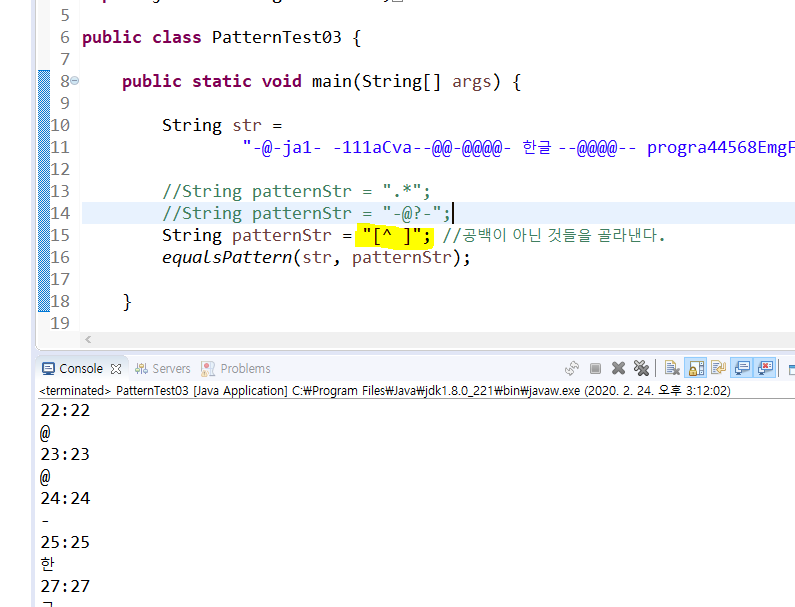

* `.{n}` : .은 임의의 한 문자를 의미. n은 글자수를 의미. 어떤 문자이거나 n개의 문자
  ex)`.{5}` : 5글자씩 끊어서 나온다. 

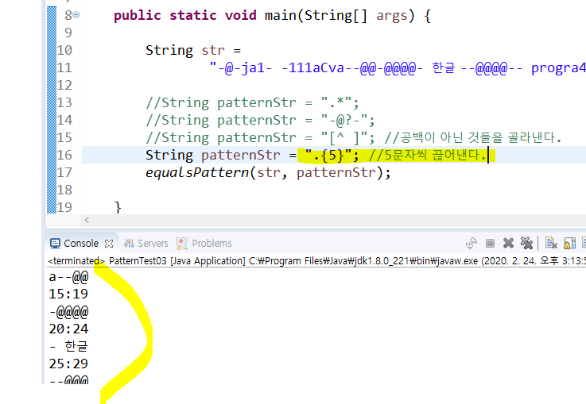

* `xxxx{1,3}`: 1이상 3이하

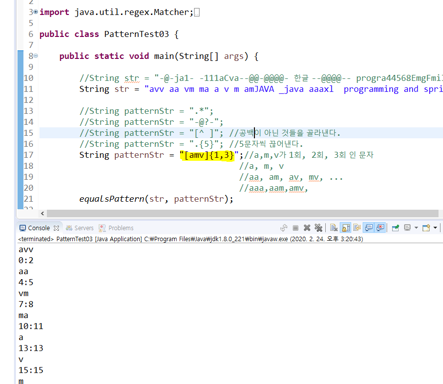

* `xxxx{3,}` : 3이상

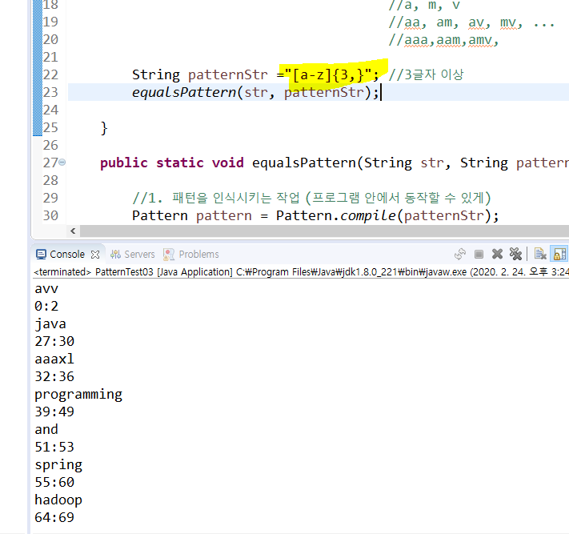

* `\\W` : 대문자, 소문자, 숫자를 뺀 모두

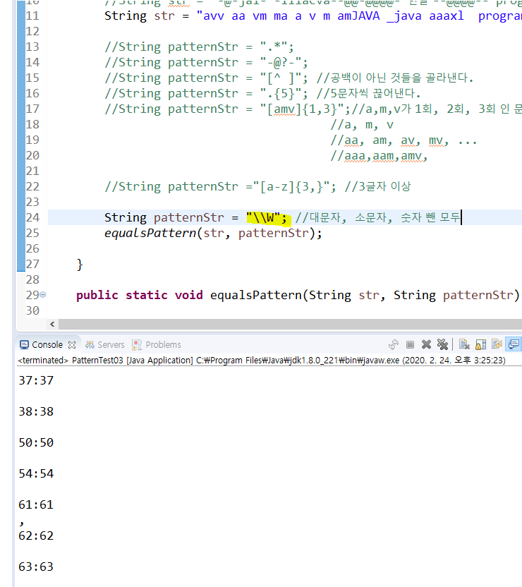

* ` \\w` : 대문자, 소문자, 숫자 모두

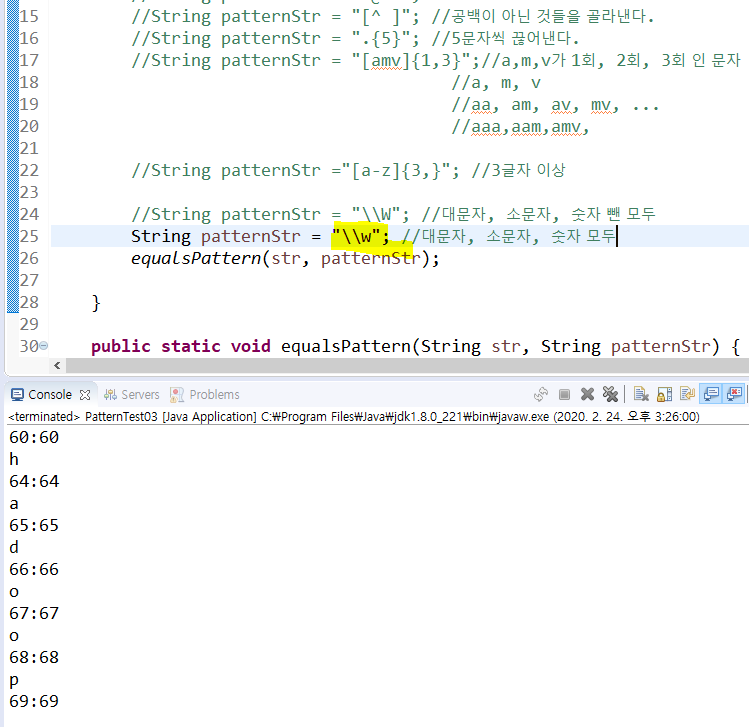

* `\\D` : 숫자를 뺀 나머지 

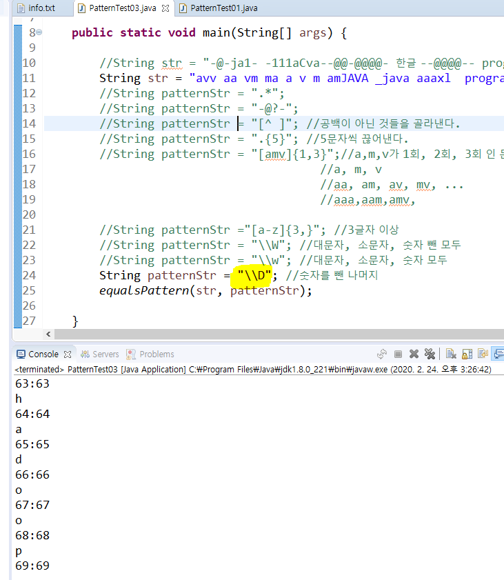

----

## 예제

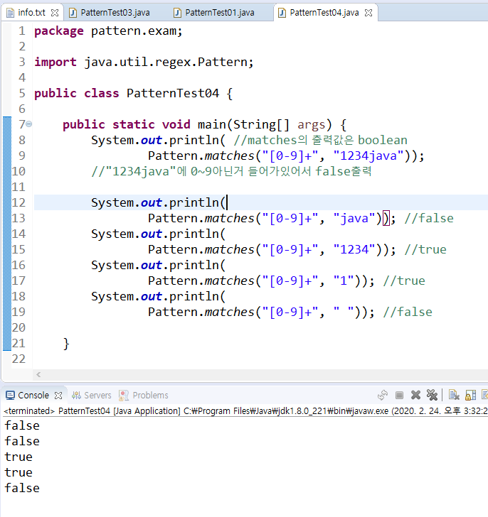

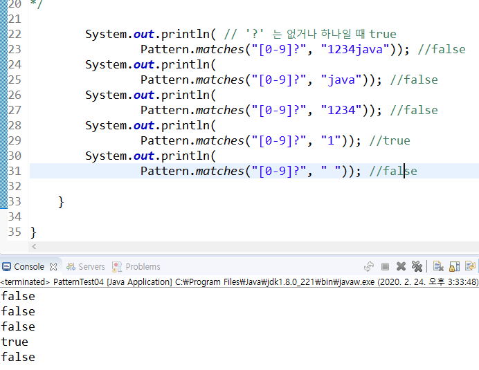

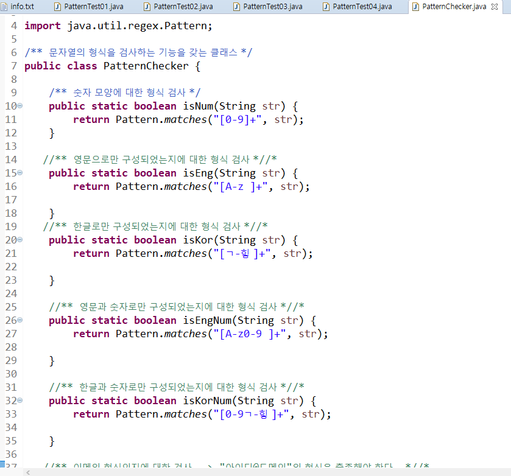

---

괄호는 하나를 그룹으로 묶을 때 사용한다. 순서를 고려할 때 사용한다. 

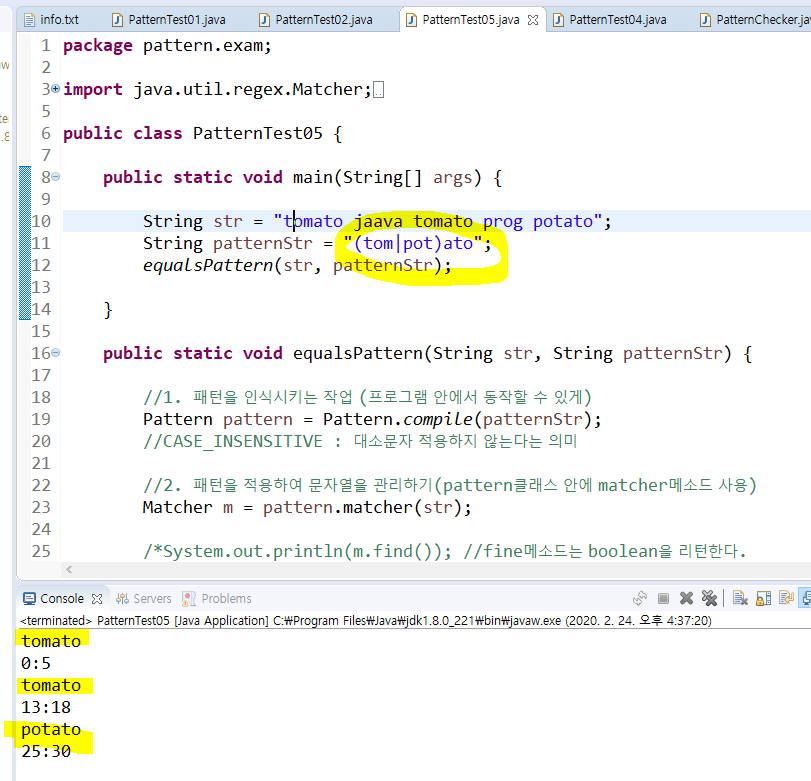

a가 3번반복되거나, i가세번반복되거나

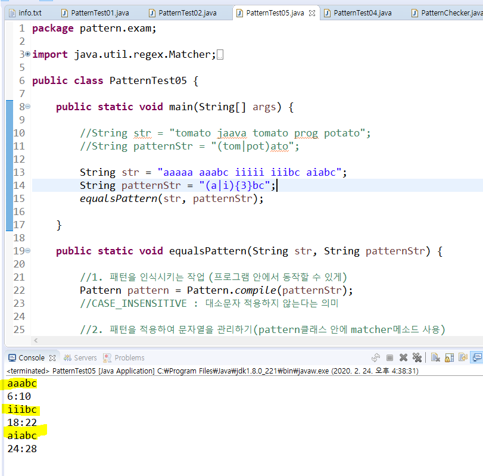

그룹으로 묶였으므로 영문자가 먼저 나오고, 숫자가 그 다음에 나와야한다. (순서 고려)

숫자+영문 순서는 나오지 않는다. 

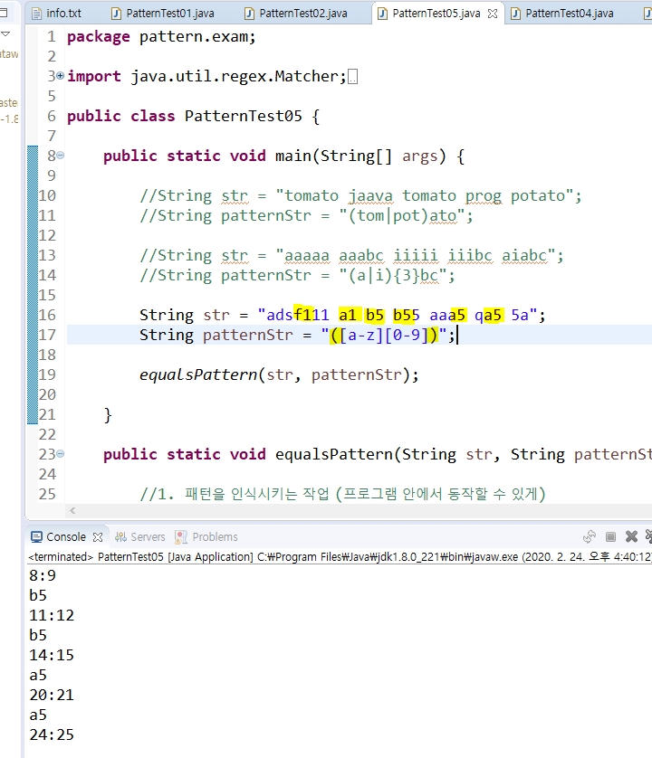

---

## EmailChecker : 이메일 형식 체크하기 

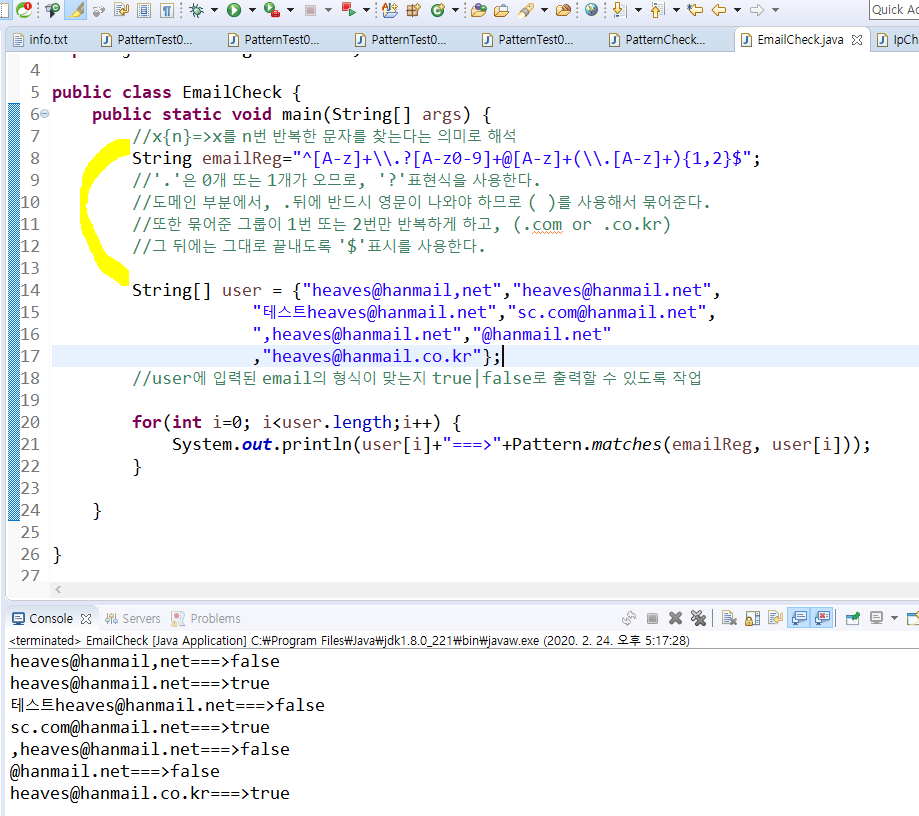