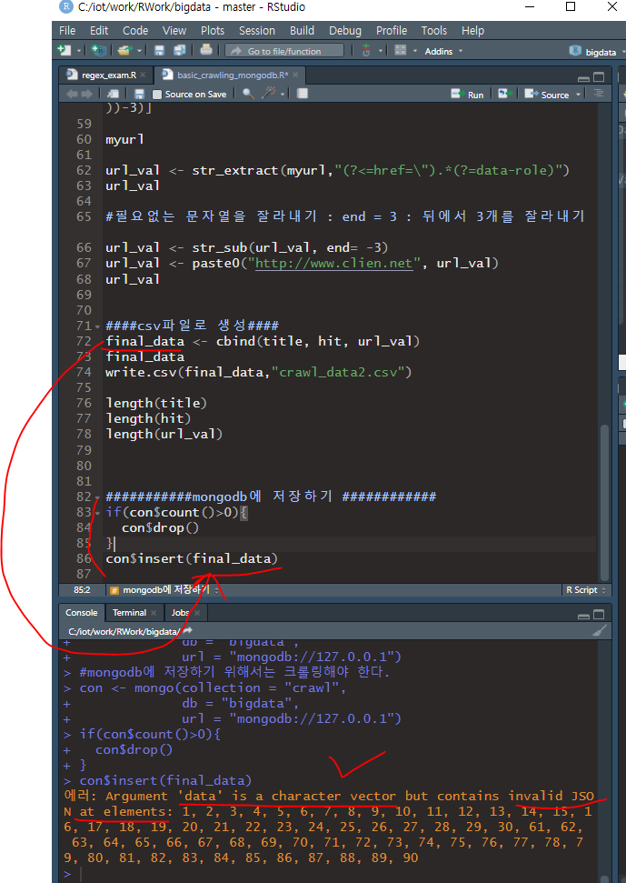
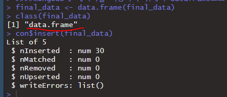
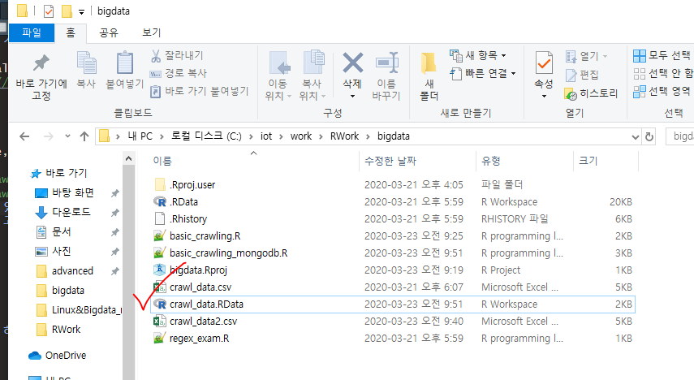
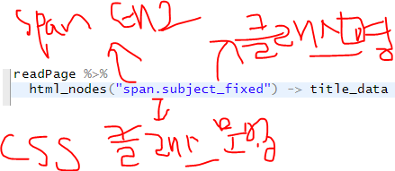
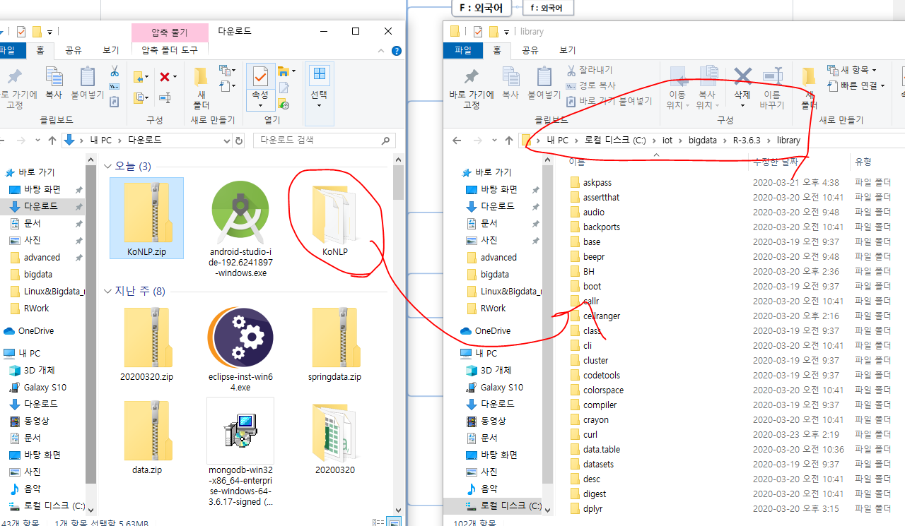
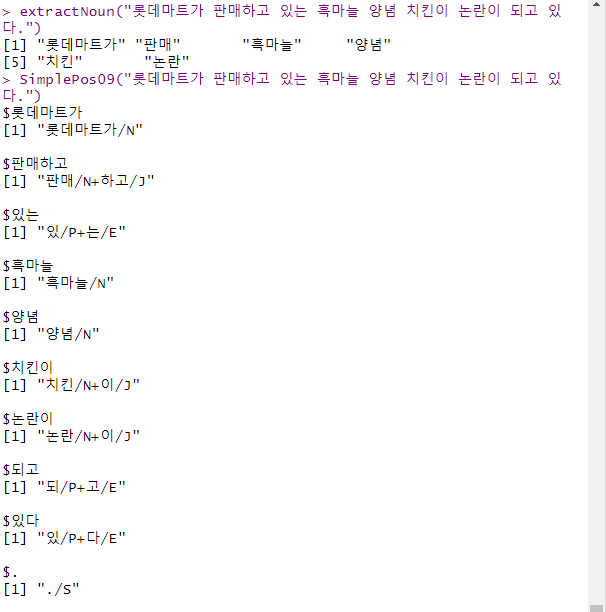
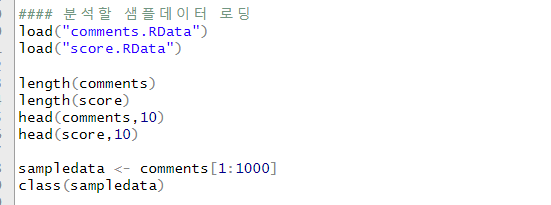
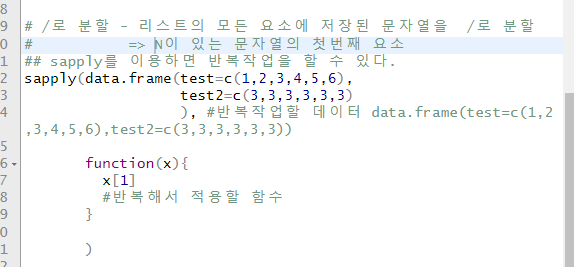
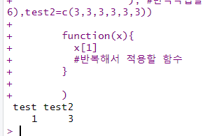
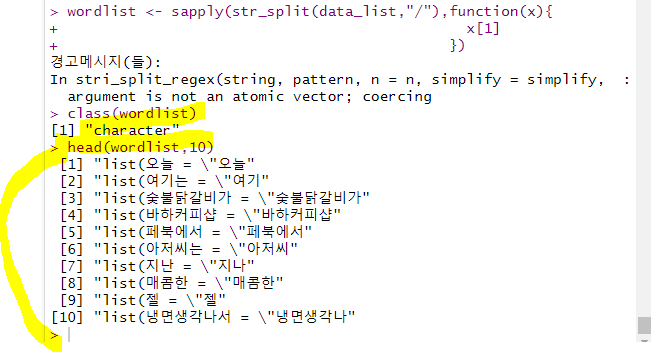

ctrl+shift +1, ctrl+shift+2 

## mongodb 연동

mongodb에 저장하기 위해서는 크롤링해야 한다.

이전시간에 진행했던 클리앙 사이트에서 크롤링 했던 R파일에 코드를 추가로 작성한다. 

먼저 con에 정보를 담아준다. 

mongodb에 저장하는 코드를 실행했으나, 에러가 뜬다. 

final_data가 matrix 타입이기 때문이다.

따라서 data frame형식으로 바꿔줘야 한다.

dataframe 으로 변환 후 다시 insert를 진행한다. 

csv파일보다 `RData` 파일로 저장하면, 빠르게 작업할 수 있다.

---

## 실습

crawl_content

final_data의 1번 글의 내용을 출력

#### `ctrl + shitf + c ` 선택영역 주석

---

## n2h4 : 네이버 댓글 추출

뉴스기사 댓글 추출

`getAllComment(url)`활용

## rvest

html_node는 태그하나, html_nodes는태그 여러개뽑아온다.

* html_nodes(선택자) : 일치하는모든 태그를 추출
* html_node(선택자) : 일치하는 태그 한 개
* html_text() : 텍스트를 추출
* html_children() : 하위 노드 추출
* html_attr() : attribute 추출 

## KoNLP : 형태소 분석 라이브러리

라이브러리 자동 설치가 안되기 때문에, 직접 다운받아서 lib폴더에 넣어야 한다.

https://github.com/haven-jeon/KoNLP/blob/master/etcs/KoNLP-API.md

이렇게 뜰 때마다 `install.packages("Sejong")` 이런식으로 패키지 설치해 주면 된다.

KNU(케이앤유) 한국어 감성사전

https://github.com/park1200656/KnuSentiLex

### 함수 테스트

sampledata는 5만건이 있어서, 1000건만 샘플링

잠깐, sapply 예제

다시 돌아와서 sapply를 적용한다.

