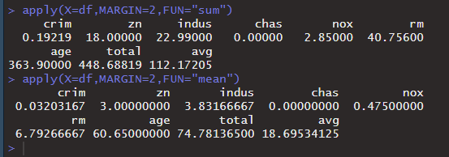
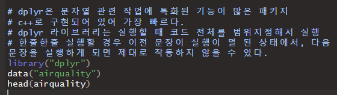
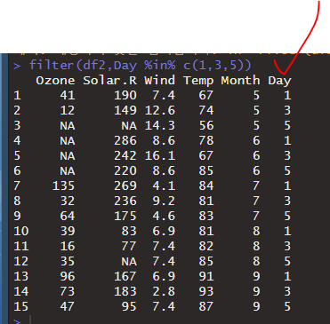
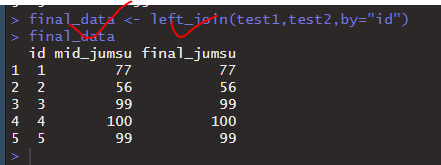
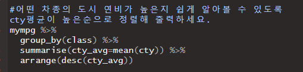

## Apply_Test : Apply는 반복작업을 할 수 있다.

data(package="MASS") 하면 R내부의 샘플데이터셋을 볼 수 있다.


Boston이라는 샘플데이터를 확인해보았다.


이렇게 데이터를 추출해서 변수에 저장할 수 있다.


* 반복작업을 할 때 사용할 수 있도록 함수를 지원

* 속성에서 MARGIN:1 =>행방향, 2:열방향

  df[,"total"] <- apply(x=내가만들어놓은데이터셋.데이터프래임 )])

행방향으로 total, vg이라는 컬럼에 합계와 평균이가 생김을 확인할 수 있다.


이번엔 열방향으로 구한다.





*  round : 소수점 이하 5번째자리에서 반올림


* sapply : apply의 margin속성을 2로 정의


## Filter : 데이터 정제, 이상데이터 잘라내기


dplyr 패키지는 문자열이나 데이터를 정제하는 데 필요한 기능이 많이 들어있다.




* 조건을 만족하는 데이터 출력

  


위와 같이 다양한 조건연산을 수행할 수 있다.


R에서 지원되는 연산자 중에서, `%` 를 붙여야 하는 연산자들이 있다.

* `%in` 


이렇게 해도 결과가 같다. 열의 개수가 나온다. 





* `ctrl + shift + m` : 자동으로 `%>%` 나온다.

```R
조건 %>% 조건 %>% 조건 %>% 조건 %>% 조건 %>%
```


* select 


* arrange 


* mutate

****


* group by, summarise (그룹과 요약)

****


* 데이터 병합 : left_join, right_join





* 데이터셋을 만들 때, Factor로 만들지 않기 위해 속성을 추가할 수 있다.

```R
stringAsFactors = F
```


Factor가 아닌 chr로 저장됨을 확인할 수 있다. 


* `bind_rows`


* ### `str_sub(수정할변수명, end= 잘라낼글자수)` 

```R
#필요없는 문자열을 잘라내기 : end = 3 : 뒤에서 3개를 잘라내기 
url_val <- str_sub(url_val, end= -3)
```


---

### p.150 실습





## Crawl : 웹페이지에서 데이터를 추출(csv저장)


### 정규표현식


* ### 전방탐색 `(?=)` 


($는 의미를 갖고있기때문에, 문자열로 인식시키려면 \\를 두번 앞에 적어준다.)


* ### 후방탐색 `(?<=)`


---

### `paste`

* `paste()` : 벡터를 연결ㄹ해서 하나의 문자열로 생성

```R
str <- c("java","hadoop","R","mongodb")
paste(str,collapse=" ")
#collapse 뒤에 뭘 기준으로 연결할 것인지 적어준다.
```


* `paste0( , )` : 여러 개를 연결하는 것.

```R
paste0(mytext,mytext2)
```


* `gsub("이전문자열","변경될문자열",대상문자열이담긴변수)` : 문자열 변경

```R
data <- gsub("u","U",mytext)

```


mytext의 소문자 "u"가 모두 "U"로 변경되었다.


* `str_trim(문자열이나 변수)` : 공백 제거

```R
str_trim(data)
```


---


mongolite 패키지 설치


url 하나 변수에 저장하고, `readLines`로 읽어내기


url <- "https://www.clien.net/service/group/community?$od=T31&po=0"

여러 가지 정보 확인테스트


여기 추출할 예정 (class가 "subject_fixed" 인 것에 포함된 글들 )


### 조건에 맞는 데이터를 필터링 ex. 공백부분은 제거

* #조건에 만족하는 데이터를 필터링
  #문자열에 패턴을 적용해서 일치여부를 T/F로 리턴


### 데이터 필터링 : title 뽑기

* str_detect(url_data,"subject_fixed")


* `str_detect()` : 

```R
url_data[str_detect(url_data,"subject_fixed")]
```


---

### 데이터 필터링 : 조회 수 뽑기


---

### 데이터 필터링 : url 뽑기


아까 뽑아놓은 subject_fixed 자료의 윗 윗 윗 줄이므로, subject_fixed 로 구한 값을활용해본다.  (윗윗줄 같지만, 사실은 공백때문에 3줄 위다. 이것은 따로 알아낼 방법은 없고 테스트해봐야 한다. )


* `which` : true 인 위치 값만 뽑아낸다. 


여기에다가 `-3` 를 해주면, 각 윗윗줄 값에 해당하는 값이 나올 것이다.


이 값대로 나오도록 변수에 저장해보자


myurl 을 보니, url부분이 나옴을 확인할 수 있다.


여기서 정규표현식을 통해 url만 추출한다.


그 다음은,뒤에 쓸데없는 문자를 지워주고 url 앞에 www같은 것을 붙여서 도메인처럼 보이게 해야한다.


* `str_sub(수정할변수명, end= 잘라낼글자수)` 

```R
#필요없는 문자열을 잘라내기 : end = 3 : 뒤에서 3개를 잘라내기 
url_val <- str_sub(url_val, end= -3)
```


제대로 출력됨을 확인할 수 있다.


지금까지 구한 정보들을 col들로 취합해 csv파일로 생성한다.

#### 컬럼들 합치기 : `변수명 <- cbind(컬럼1,컬럼2,컬럼3)`


그런데..


길이를 확인해보니, hit가 공지사항의 조회수 1건까지 합쳐져서 31개가 나와버렸다.

이런 점들을 주의해서 작업하도록 한다. 


#### 데이터 뽑을 때 키워드 추출하는 방법


Copy Selector :     #div_content > div.list_content > div:nth-child(4) > div.list_hit


Copy XPath :    //*[@id="div_content"]/div[6]/div[4]/div[4]

