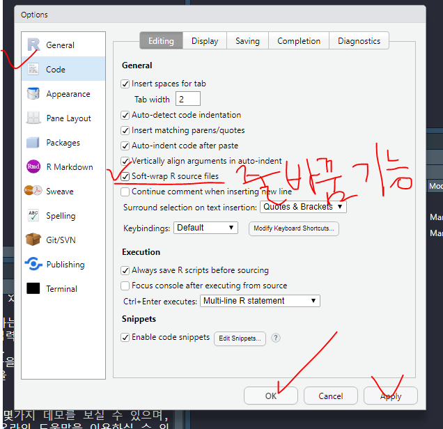

https://rstudio.com/products/rstudio/download/

R을 편리하게 쓸 수 있도록, Rstudio라는 프로그램을 사용한다. 

설치할 때 한글이나 어느 특수문자나 공백이 들어가서는 안된다.(경로 포함)


program files 하면 공백이 있으므로, 내가 별도로 지정한 폴더에 설치를 한다. 


R 스튜디오 설치


R이 설치된 곳과 동일한 경로를 설정해준다. 


RStudio를 실행할 때에는 항상 관리자권한으로 실행될 수 있도록 설정한다.


RStudio 아이콘 >속성 > 


---

R 스튜디오 실행


상단 Tools > Global Options > Appearnace 에서 폰트나 테마를 변경할 수 있다.


실행을 한줄한줄 하는것이 불편해서, 키보드 단축키를 이용해서 실행한다.

ctrl + 엔터 하면 실행시킬 수 있다.

* `ctrl + enter `: 실행

* `ctrl +L ` : 콘솔 로그 삭제


* `?` 를 치고 print를 적은 뒤 실행시키면, help 탭에 정보가 나온다.
* `ctrl + 숫자1,2` : 현재 활성화된 창이 바뀐다. 


File > new Project > New directory > new project > 





전체선택(`shift+home키` ) 후 `shift+"` 하면


* `alt+ -` : 변수대입 (<-) 단축키


* class


----


## Vector


`c()` : combine. 여러 개의 변수를 넣는다.


오류가 난 상황. '+' 기호가 나오고 빠져나가는방법은, 오류를 수정해주거나 또는 콘솔창 아무데나 클릭하고 esc 누르기


---


## matrix


컬럼, 로우에 이름 표시


* 행, 열 바꾸기
* `저장할matrix변수 <- t(기존Matrix명)` 


## dataframe


### 1. Matrix를 dataframe으로 변환


```R
만들 변수명 <- data.frame(행렬명)
```


* 타입 변경


* 열 추가


* matrix로 변환


### 2. 벡터를 여러 개 만들어서 dataframe을 작성 


### 3. dataframe을 직접 정의


* 행, 열 바꾸기


## 제어구문

###  if

* 자바와 사용법 같다.


### for


## 파일 입출력

* 읽기

  ```
  변수명 <-read.csv("csv파일명")
  ```


* 쓰기

  ```
  write.csv(데이터변수명,file="생성할파일명")
  ```


---

## 실습

csv_exam.csv를 읽어서 데이터를 수정한 후 csv_exam_result.csv로 저장하기

- science가 80이상인 데이터를 추출
- 추출된 데이터에 mytotal과 myavg컬럼을 추가
- mytotal: 모든 과목의 총점
- myavg: 모든 과목의 평균


선생님 답안

`as.numeric(매개변수)` : 숫자데이터가 아닐 경우, 괄호 안 매개변수를 숫자형으로 바꿈


----

## 


## 