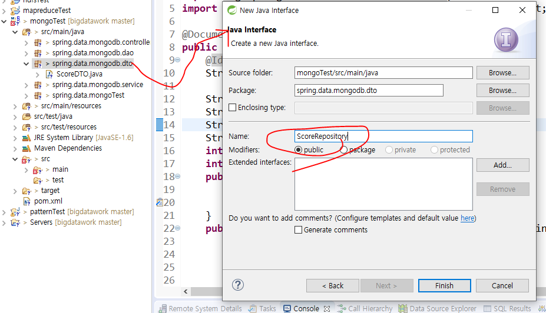
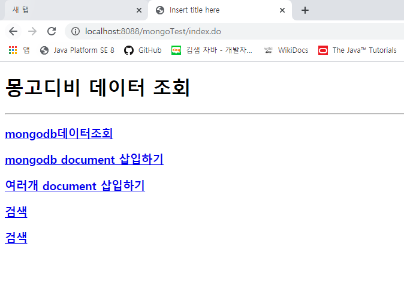
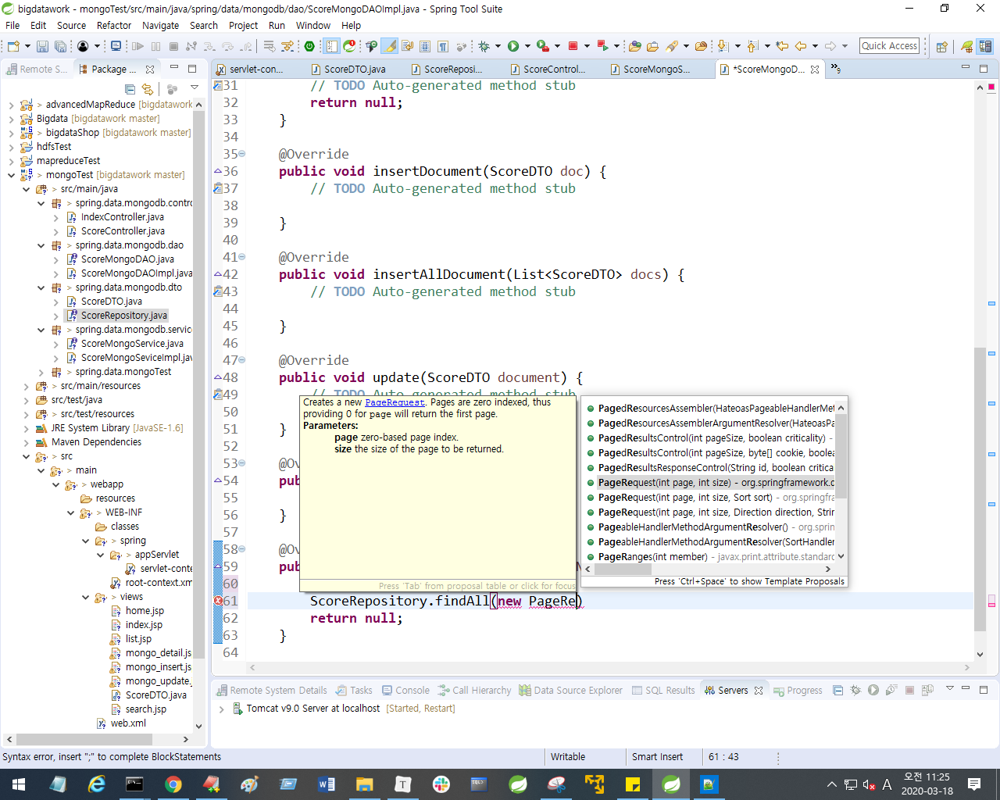

maven 프로젝트 하나 만든다. 이름은 mongoTest

패키지명 spring.data.mongoTest

pom.xml 에서 버전 4.2.2수정해준다. 

https://mvnrepository.com/artifact/org.springframework.data/spring-data-mongodb/1.6.0.RELEASE

맨 밑에 dependecny 추가


저장 누르면 Maven Dependencies 에 라이브러리가 추가됨을 확인할 수 있다.


https://blog.naver.com/PostList.nhn?blogId=heaves1&from=postList&categoryNo=189&parentCategoryNo=189

선생님 블로그에서 springdata 파일 다운 받고, 압축 푼다.

spring폴더 전체는 src/main/java에 넣고, view 파일은 Web-INF >views에 다 넣는다. 


appSevlet > servlet-context.xml에서 namespaces만열어준다.


클라이언트 프로그램인 sts가 mongod로 올려놓은 서버에 액세스하기 위해서, 
mongodb의 데이터를 원하는 데이터를 집계해서 화면에 찍는 작업

mongodb의data를 활용해서 input 데이터로 활용하는 등 작업을 할 수 있다.

spring으로 mongodb를 접근 : 관계형데이터베이스가 아니라 새롭게 생긴 db로 접근해야 한다. 
따라서 라이브러리 등록 해야한다. (pom.xml에다가 mvnproject 에서 가져온 소스 넣기),
그리고 등록한 라이브러리를 설정해줘야 한다. (servlet-context.xml namespaces에서 설정)


mongo 항목에 체크해준다.


source화면을 보면, mongo가 추가됨을 확인할 수 있다.


몽고템플릿 클래스를 추가해서, 몽고와 관련된 모든 기능을 사용할 수 있도록 한다.
(전에 웹 sql 에서 mybatis추가해서 mybatis 해당 기능 사용했던 것처럼)


mongod의 listening 부분의 port가 sts에서 설정파일의 port가 된다. 

mongo로 가서 bigdata라는 user를 만든다.


ip, port를 입력해주고, 클래스를 등록해준다.


---

csv파일 저장


### Export

```xml
mongoexport -d mydb -c score -o score.json
```


mydb라는 데이터베이스에 있는 score 컬렉션 export

* `-d` + 데이터베이스명
* -`c`  + 컬렉션명
* `-o` + 만들어질 파일명. 경로를 써주어도 된다. 


json형태로 저장되었다. 


### import

```
mongoimport /d bigdata /c test /type csv /file  test.csv /headerline
```


* `/d` + import 데이터타입
* `/c` + 컬렉션명
* `/type` + import할타입. default는 json이므로 그 외 경우만 적어준다.
* `/file` + import할파일. 경로를 적어주어도 된다.
* `/headerline` : 헤더라인이 있다는 뜻. 맨 윗줄 지우고 import하게 된다.


mongo에서 확인해보니 데이터가 들어와있음을 확인할 수 있다.


STS > mongoTest > spring.data.mongodb.dto > ScoreDTO클래스 생성

이게 하나의 도큐먼트임을 명시하는 `@Documnet`를 해준다. 어노테이션 안에 반드시 컬렉션을 명시해줘야 한다.


필드에 해당하는 변수 다 선언해주고, 셋겟, 생성자, tostring 다 만들어준다.

그리고 `String _id` 를 선언해주는데, 기본키임을 알리는 `@Id` 어노테이션을 추가해준다.




Interface를생성한다.


mongodb로 가서 선생님이 주신 data.txt 복사해서 붙여넣어서 데이터 넣기


indexContoller실행



ScoreMongoDAOImpl, ScoreMongoDAOServiceImpl 을 만들어준다.


### FindAll()

* ScoreMongoServiceImpl


* socreMongoDAOImpl





페이지번호가 있으나, 페이징처리가 된 것은 아니다. 


----


### insert

mongoTemplate은 편리하게 함수를 제공한다. 


jsp 화면


### < multiInsert 결과 >


페이징에서 한 페이지수를 10으로 설정했다.

DAO에서 한 페이지에 해당하는 다큐먼트 수를 설정할 수 있다.


### 

## Read

findById (key,value) 


DAOImpl 에서 Criteria 를 사용한다.

Criteria 클래스는 조건을 걸 때 사용한다. 다양한 메소드를 사용할 수 있다. 


### < 실행결과 >


---

## Find


