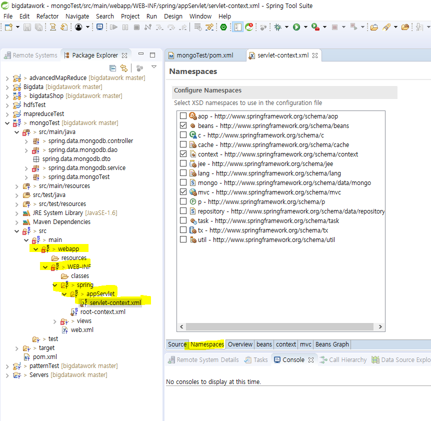

## sts에서 mongodb 활용하기

maven 프로젝트 하나 만든다. 이름은 mongoTest

패키지명 spring.data.mongoTest

pom.xml 에서 버전 4.2.2수정해준다. 

https://mvnrepository.com/artifact/org.springframework.data/spring-data-mongodb/1.6.0.RELEASE

맨 밑에 dependecny 추가

저장 누르면 Maven Dependencies 에 라이브러리가 추가됨을 확인할 수 있다.

https://blog.naver.com/PostList.nhn?blogId=heaves1&from=postList&categoryNo=189&parentCategoryNo=189

선생님 블로그에서 springdata 파일 다운 받고, 압축 푼다.

spring폴더 전체는 src/main/java에 넣고, view 파일은 Web-INF >views에 다 넣는다. 

appSevlet > servlet-context.xml에서 namespaces만열어준다.

클라이언트 프로그램인 sts가 mongod로 올려놓은 서버에 액세스하기 위해서, 
mongodb의 데이터를 원하는 데이터를 집계해서 화면에 찍는 작업

mongodb의data를 활용해서 input 데이터로 활용하는 등 작업을 할 수 있다.

spring으로 mongodb를 접근 : 관계형데이터베이스가 아니라 새롭게 생긴 db로 접근해야 한다. 
따라서 라이브러리 등록 해야한다. (pom.xml에다가 mvnproject 에서 가져온 소스 넣기),
그리고 등록한 라이브러리를 설정해줘야 한다. (servlet-context.xml namespaces에서 설정)

mongo 항목에 체크해준다.

source화면을 보면, mongo가 추가됨을 확인할 수 있다.

몽고템플릿 클래스를 추가해서, 몽고와 관련된 모든 기능을 사용할 수 있도록 한다.
(전에 웹 sql 에서 mybatis추가해서 mybatis 해당 기능 사용했던 것처럼)

mongod의 listening 부분의 port가 sts에서 설정파일의 port가 된다. 

mongo로 가서 bigdata라는 user를 만든다.

ip, port를 입력해주고, 클래스를 등록해준다.