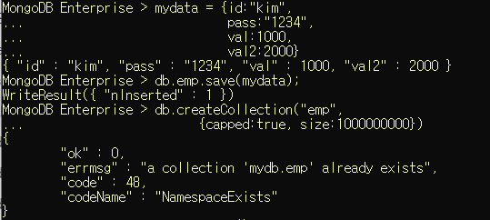

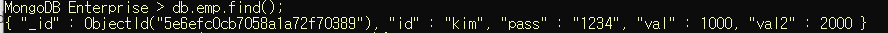

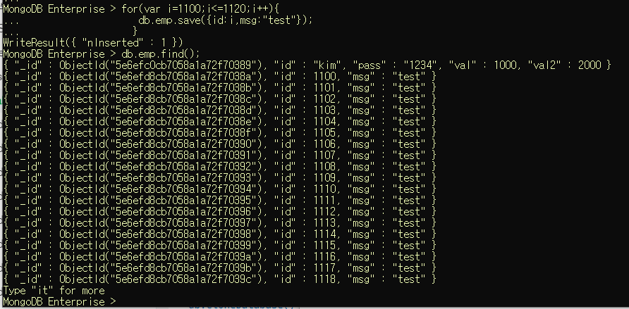


여러개를 한꺼번에 배열로 insert 할 수 있다.

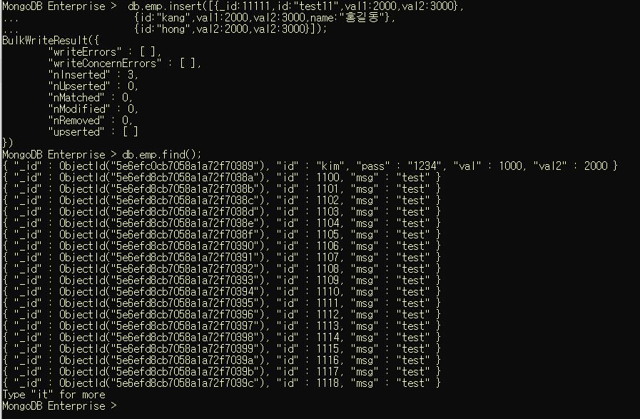


_id는 primary key역할을 한다. 


한글이 포함되면 깨지고 잘 안들어가는 경우가 있다.


## 3. mongodb에 update

* document수정
* 조건을 적용해서 수정하기 위한 코드도 json으로 구현


#### [update를 위한 명령어]

* `$set` : 해당필드의 값을 변경(업데이트를 하기 위한 명령어)
               none capped collection인 경우, 업데이트할 필드가 없는 경우 추가한다. 


* `$inc` : 해당필드에 저장된 숫자의 값을 증가
* `$unset` : 원하는 필드를 삭제할수 있다.


* 업데이트 옵션 : 

​	multi = > true를 추가하지 않으면 조건에 만족하는 document 중 첫 번째 document만 update

* 필드값 추가 가능 :

  set이나 inc를 통해 새로운 필드 추가가 가능하다. 

  

#### [구문]

* db.컬렉션명.update({조건필드:값}, //sql의 update문 where절
                                      {$set:{수정할필드:수정값}}, //set절
                                       {update와 관련된 옵션:옵션값}) //옵션값이 없으면 작성 안해도 된다.

< set >

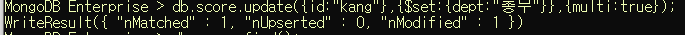

< inc >

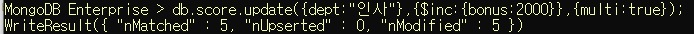

< unset>

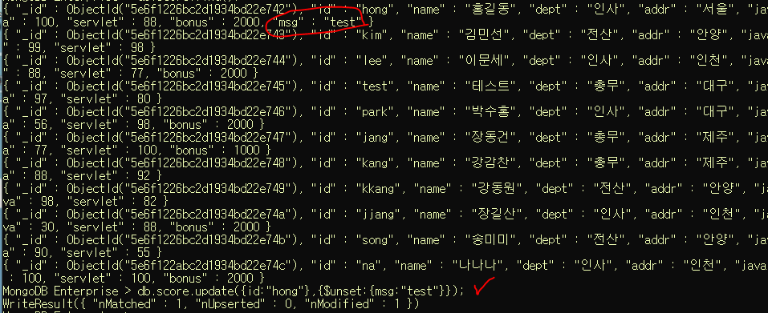

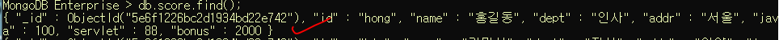


---


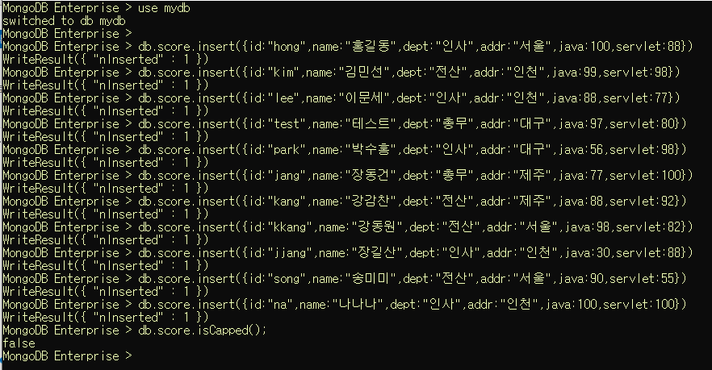

collection(table)을 생성 안하고, 바로 insert하면 해당 이름으로 컬렉션이 만들어진다.

`db.score.isCapped()` 했을 때 `false` 뜨면, 일반 컬렉션으로 만들어 졌다는 뜻.


## [실습]

1. id가 kang인 사람의 dept를 "총무"로 변경

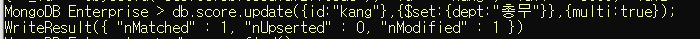

2. dept가 "전산"인 모든 addr을 "안양" 으로 변경

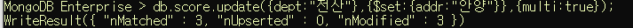


3. id가 jang인 document의 bonus를 1000추가하기

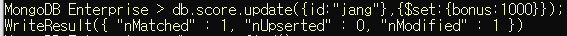

4. dept가 "인사"인 모든document의 bonus에 2000을 추가하기


## 4. mongodb에서 배열 관리

```sql
db.score.update({id:"jang"},
                {$set:
                 {info:
                	{city:["서울","안양"],
                	 movie:["겨울왕국2","포드페라리","알라딘"]} 
                 }
                }
               )
```


#### [배열에서 사용할 수 있는 명령어]

* `$addToSet` : 배열의 요소를 추가. 없는 경우에만 값을 추가(중복을 체크)

```sql
db.score.update({id:"jang"},
                {$addToSet:{"info.city":"인천"}}
				);
```


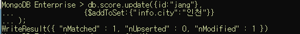

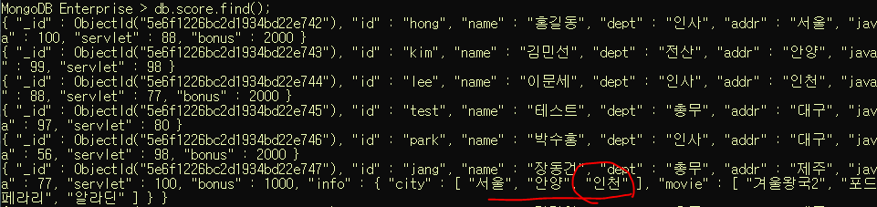


* `$push` : 배열의 요소를 추가. 중복을 허용

```sql
db.score.update({id:"jang"},
                {$push:{"info.city":"천안"}}
				);
```

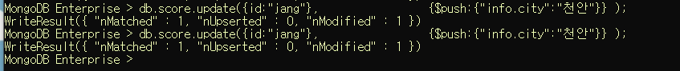

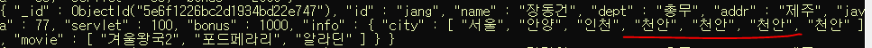


* `$pop` : 지우는 용도.
               1이면 마지막 요소를 제거, -1이면 첫 번째 요소를 제거

```sql
db.score.update({id:"jang"},{$pop:{"info.city":1}})
```

```sql
db.score.update({id:"jang"},{$pop:{"info.city":-1}})
```


* `$each` : addToSet이나 push에서 사용할 수 있다.
                 여러 개를 배열에 추가할 때 사용

``` sql
db.score.update({id:"jang"},
                  {$push:
                       {"info.city":
                           {$each:["천안","가평","군산"]} //3개를 동시에 집어넣는다. 
                        }
                   })
```

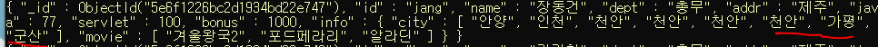


* `$sort` : 정렬(`1`:오름차순, `-1`:내림차순)

```sql
db.score.update({id:"jang"},
                  {$push:
                       {"info.city":
                           {$each:["천안","가평","군산"],
                            $sort:1
                           } 
                        }
                   })
```

<1로 적었을 때: 오름차순>

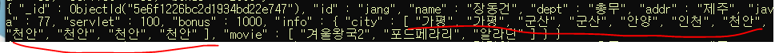


* `$pull`  :  배열에서 조건에 만족하는 요소를 제거(조건 한 개)

```sql
db.score.update({id:"jang"},
                  {$pull:{"info.city":"천안"}}
                )
```

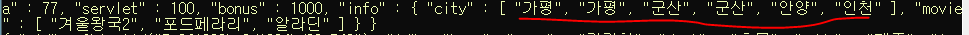

모든 "천안"이 전부 사라졌다.


* `$pullAll` : 배열에서 조건에 만족하는 요소를 제거 (조건을 여러 개)

```sql
db.score.update({id:"jang"},
                  {$pullAll:{"info.city":["가평","군산"]}}
                )
```

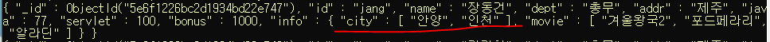

모든 "가평","군산" 이 사라졌다.